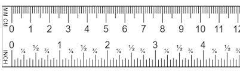

# Parameters for functions {#params-intro}

```{r include=FALSE}
library(lubridate)
```

The pattern-book functions provide the modeler with a collection of shapes. They are not yet fully suited to represent real-world phenomena. To illustrate, consider Figure \@ref(fig:covid-exp) which shows the number of officially confirmed COVID-19 cases in the US in March 2020. `r mark(800)`

The COVID pandemic was widely and appropriately described as "exponential," so alongside the data Figure \@ref(fig:covid-exp) shows the function $e^x$.

```{r covid-exp, echo=FALSE, fig.cap="Cumulative officially confirmed COVID-19 cases during the month of March, 2020. The red curve is $e^x$", warning=FALSE}
March <- Covid_US %>% filter(lubridate::month(date)==3, 
                             lubridate::year(date)==2020) %>%
  mutate(day = lubridate::mday(date))
gf_point(confirmed ~ day, 
         data = March) %>%
  gf_labs(y = "Cumulative confirmed cases", x = "Day in March, 2020") %>%
  gf_lims(y=c(0,200000)) %>%
  slice_plot(exp(x) ~ x, domain(x=c(0,15)), color="orange3", label_text = "exp(x)", size=4) %>%
  slice_plot(exp(x) ~ x, domain(x=c(0,15)), color="red", size=2)
```

There's an obvious mismatch between the data and the function $e^x$. Does this mean the COVID pattern is not exponential?

A hint comes from the formula $e^x$. What is $x$? Plotted as it is in the graph, $x$ is the calender day in March. But why shouldn't $x$ be the given in hours or minutes or weeks? 

If we want the input to $\exp()$ to be in "hours" instead of "days," we can multiply $x$ by 24. If the input is to be in weeks, the multiplier should be $\frac{1}{7} = 0.1429$. In both cases, the function will be $e^{kx}$, where $k$ would be 24 for hours or 0.1429 for weeks. Exploring a bit, we found that $0.3 \leq k < 0.5$ will produce functions graphs that match the data much better than pattern-book $e^x$.  `r mark(810)`

```{r covid-exp2, echo=FALSE, fig.cap="COVID-19 data compared to the exponential functions $e^{kt}$. A variety of possible numerical values for $k$ is shown.", warning=FALSE}
gf_point(confirmed ~ day, data = March) %>%
  gf_labs(y = "Cumulative confirmed cases", x = "Day in March, 2020") %>%
  gf_lims(y=c(0,200000)) %>%
  slice_plot(exp(x/2) ~ x, domain(x=c(0,30)), color="darkgreen", label_text = "exp(0.5*x)", label_x=.75) %>%
  slice_plot(exp(0.4*x) ~ x, domain(x=c(0,30)), color="dodgerblue", label_text = "exp(0.4*x)", label_x=0.9) %>%
  slice_plot(exp(0.45*x) ~ x, domain(x=c(0,30)), color="orange", label_text = "exp(0.45*x)", label_x=0.9) %>%
    slice_plot(exp(0.30*x) ~ x, domain(x=c(0,35)), color="tomato", label_text = "exp(0.30*x)", label_x=0.95) %>%
  slice_plot(exp(0.20*x) ~ x, domain(x=c(0,35)), color="black", label_text = "exp(0.20*x)", label_x=0.95)
```

The multiplier $k$ in $e^{kx}$ is called a ***parameter*** of the function: a number that we can use to set the ***scale*** of the input. To use the exponential function to model COVID, we've had to stretch out the red curve in Figure \@ref(fig:covid-exp) by tailoring pattern-book $x$ as $k x$. Perhaps it's a matter of personal choice which size of $k$ will be best suited to model the data.

My personal choice is $k=0.30$. My reasoning? The $k=0.30$ curve roughly parallels the COVID data. The flaw with  $k=0.30$ is that the curve lags the data by several days. But we can fix this by pulling the $k=0.30$ curve to the left. Mathematically this can be accomplished by subtracting a few days from $x$ before multiplying by $k$, that is, using the function $$f(x) \equiv e^{k(x-x_0)}$$ where $x_0$ stands for the shift. (A positive value for $x_0$ is a shift to the right, a negative value is a shift to the left.)

```{r echo=FALSE}
mod1 <- fitModel(confirmed ~ exp(0.3*(day-s)),
                 data = March,
         start = list(s=-32))
f1 <- makeFun(mod1)
mod2 <- fitModel(confirmed ~ exp(k*(day-s)),
         data = March,
         start = list(k=0.3, s=-32) )
f2 <- makeFun(mod2)
```

Figure \@ref(fig:covid-exp3) shows (in red) the $k=0.30$ curve after pulling it 10 days to the left. It's now a pretty good match to the data. 


```{r covid-exp3, echo=FALSE, fig.cap="COVID-19 data compared to the exponential functions $e^{k(t-x_0)}$. Here, $x_0$ is negative because the shift is to the left.", warning=FALSE}
gf_point(confirmed ~ day, data = March) %>%
  gf_labs(y = "Cumulative confirmed cases", x = "Day in March, 2020") %>%
  gf_lims(y=c(0,200000)) %>%
  slice_plot(f2(x) ~ x, domain(x=c(0,31)), color="darkgreen", label_text = "exp(0.19*(x - -32))", label_x=.6) %>%
  slice_plot(f1(x) ~ x, domain(x=c(0,30)), color="tomato", label_text = "exp(0.30*(x - -10)", label_x=0.9) 
```

Note that once we've aligned the red curve horizontally, it seems to curve too much. The green curve does much better. It has a much gentler curve, $k=0.19$ and is pulled about a little more than a month to the left.   `r mark(820)`

By parameterizing the exponential function as $e^{k(x-x_0)}$ and finding suitable values for $k$ and $x_0$, we get a good match to the March data. But models can sometimes tell us more. For the green curve in Figure \@ref(fig:covid-exp3) the value of $x_0$ is -32 days. 32 days before March 1 is late January. We know from other sources of information, the outbreak began in late January. It's remarkable that even though the curve was constructed without any data from January or even February, the data from March, translated through the curve-fitting process, pointed to the start of the outbreak.

## Parallel scales

The graphical format we have been using to display functions of one variable places the input on the horizontal axis and the output on the vertical axis. This is not the only way to draw a function. Consider these everyday objects: a thermometer and a ruler.

     

Each object presents a read-out of what's being measured---temperature or length---on two different scales. At the same time, the objects provide a way to convert one scale to another.

A function gives the output for any given input. We represent the input value as a position on a number line---which we call an "axis"---and the output as a position on another output line, almost always drawn perpendicular to one another. But the two number lines can just as well be parallel to one another. To evaluate the function, find the input value on the input scale and read off the corresponding output. The ***inverse function*** can be evaluated just as easily: switch the roles of the input and output scales.  `r mark(830)`

Taking the traditional ("imperial"^[Called "imperial" because it was codified in an 1825 Act of the British parliament. Inches are imperial, but temperature isn't part of the Act.]) unit scale as the input and the metric scale as the output, the two functions implemented on the objects are:
$$\underbrace{C(F) = \frac{5}{9}(F-32)}_\text{Fahrenheit to Celcius}\ \ \ \text{and}\ \ \ \ \underbrace{\text{cm(inches)} = 2.54 \times (\text{inches}-0}_\text{inches to cm})$$
These are very simple, straight-line functions, but they play an important role in modeling. 

Each conversion function can be written in the form $\line(x) \equiv m (x - x_0)$. Of course, if you multiply the $m$ through both terms in parentheses, you get $\line(x) = m x - m x_0$ which can be written even more simply as $mx + b$ by setting $b\equiv m x_0$. so the conversion function does conform to the straight-line formula we're used to. 

$m$ and $x_0$ are the ***parameters*** of the straight-line function. In terms of the graph of a straight-line function, $m$ is the slope and $x_0$ is the **x**-intercept respectively. 

Often, functions can be parameterized in other ways. For instance, you likely learned the parameterization $m x + b$, in which $m$ is (still) the slope of the graph but $b$ is the **y**-intercept. (Expanding out $m(x-x_0)$ and comparing to $m x + b$, you can see that $b = m x_0$.)

::: {.takenote  data-latex=""}
We can call $m(x - x_0)$ the "x-intercept parameterization" and $m x + b$ the "y-intercept parameterization. They are equivalent and equally good ways of parameterizing the straight line. There are still other ways of parameterizing, each style reflecting its own format for specifying the two points that make up a line. 
:::

## Scaling the input {#scaling-the-input}

To turn a pattern-book function into a ***basic modeling function*** all we do is use $\line()$ to convert the input *before* applying the pattern-book function.  `r mark(840)`

To illustrate the link between basic modeling functions and their pattern-book prototypes, Figure \@ref(fig:covid-scale) shows the model we fit to the COVID-19 data for the cumulative number of confirmed cases for each day in March: $\text{cases(day)} = e^{0.19(\text{day}- -32)}$

```{r covid-scale, echo=FALSE, fig.cap="A graph of the pattern-book exponential with an additional scale displayed (blue) to match it to the COVID-19 data"}
plot_scaled_input(exp(day) ~ day, domain(day=c(-1,11)), 1/0.19, 0.19*32) 
```

The function being drawn is simply $e^x$: a function from the pattern book. The black horizontal scale shows $x$, the input to the pattern-book function. Where does that value of $x$ come from? It's $0.19(\text{day} - -32)$, where day is the number of the day in March. For instance, on March 20, day$=10$ and $0.19*(\text{day}- -32) = 9.88$. You can see that 20 on the blue scale matches 10 on the black scale. The model says that on day 20 (blue scale) the input to the pattern-book function will be 9.88 (black scale). Plugging the input 9.88 into the pattern-book exponential gives $e^{9.88} = 19536 \approx 20,000$ cases. 

The pattern-book function does not give a good model of the COVID case numbers. But if we scale the input before applying the pattern-book function, we are effectively laying a new axis, the blue one in Figure \@ref(fig:covid-scale), that is stretched and shifted from the pattern-book input (blackscale). Using the blue axis lets us read off the number of cases as a function of the day in March. 

Input scaling empowers the pattern-book functions to model a huge variety of phenomena. There's just one exponential function and it always looks exactly the same. But there is a huge variety of ways to draw a blue axis, that is, to scale the input. With input scaling, the pattern-book function is tailored to become one of our basic modeling functions.
$$\underbrace{e^x}_\text{pattern-book function}\  \text{versus}\  \underbrace{e^{k(x-x_0)}}_\text{basic modeling function}$$
The straight-line function $\line()$ is being written here as $k(x-x_0)$ rather than $m(x-x_0)$. It's traditional when writing exponential functions to use the letter $k$ as the multiplier, but you can use whatever name you wish for a parameter. Knowing and using the idiom of mathematical notation will help you read and write mathematics more fluently.  `r mark(850)`

The table shows a of the mathematical idioms used in parameterizing the pattern-book functions. 

Function    | Written form | Parameter 1 | Parameter 2
------------|--------------|-------------|-------------
Exponential | $e^{kt}$     | $k$ "exponential constant"^[] | Not used
Exponential | $e^{t/\tau}$     | $\tau$ "time constant"^[] | Not used
Exponential | $2^{t/\tau_2}$     | $\tau_2$ "doubling time"^[$-\tau_2$ is sometimes called the "half life."] | Not used    
Power-law   | $[x - x_0]^p$    | $x_0$ x-intercept | exponent
Sinusoid    | $\sin\left(\frac{2 \pi}{P} (t-t_0)\right)$ | $P$ "period" | $t_0$ "time shift" 
Sinusoid | $\sin(\omega t + \phi)$ | $\omega$ "angular frequency" | $\phi$ "phase shift"
Sinusoid | $\sin(2 \pi \omega t + \phi)$ | $\omega$ "frequency" | $\phi$ "phase shift"
Gaussian     | dnorm(x, mean, sd) | "mean" (center)| sd "standard deviation"
Sigmoid  | pnorm(x, mean, sd) | "mean" (center) | sd "standard deviation"
Straight-line | $mx + b$ | $m$ "slope" | $b$ "y-intercept"
Straight-line | $m (x-x_0)$ | $m$ "slope" | $x_0$ "center"


## Scale the output

Just as the natural input usually needs to be scaled before it reaches the pattern-book function, so the output from the pattern-book function may need to be scaled before it presents a result suited for interpreting in the real world. 

```{r scaling-nature, echo=FALSE, out.width="100%", fig.cap="Natural **quantities** must be scaled to pure numbers before being suited to the pattern-book functions. The output from the function is a pure number which is scaled to the natural **quantity** of interest."}
knitr::include_graphics("www/scaling-nature.png")
```

The overall result of input and output scaling is to tailor the pattern-book function so that it is ready to be used in the real world.  `r mark(860)`


Name        |  Pattern-book form | Modeling form
------------|-------------|------------------
exponential |  $e^x$      | $A e^{kx} + C$
sinusoid    | $\sin(x)$   | $A \sin\left(\frac{2 \pi}{P} (x-x_0)\right) + C$
proportional | $x$        | $a x + b$

::: {.takenote  data-latex=""}
The parameter $C$ is often called the ***baseline*** or the ***offset***. Statisticians call it the "intercept," because it plays the same role as $b$ in the straight-line function.

When working with sinusoids, parameter $A$ is called the ***amplitude***.

Of course, you're already familiar with $a$ and $b$: the slope and y-intercept of a straight line.

```{r show-sin-params, echo=FALSE, warning=FALSE, fig.cap="Baseline (blue), amplitude (red), and period (green) for the sinusoid."}
# making waveforms for the figure
slice_plot(sin(x) ~ x, domain(x=c(-1, 12))) %>%
  gf_hline(yintercept=0, color="dodgerblue") %>%
  gf_refine(theme_void()) %>%
  gf_errorbar(0 + 1 ~ pi/2, color="orange3") %>%
  gf_errorbar(-1 + 0 ~ 3*pi/2, color="orange3") +
  geom_errorbarh(aes(y=1/2, xmin=0, xmax=2*pi), color="green", size=.5)
```

```{r show-exp-baseline, echo=FALSE, warning=FALSE, fig.cap="The baseline for the exponential is the horizontal asymptote. There is no vertical asymptote."}
slice_plot(exp(x) ~ x, domain(x=c(-2, 2))) %>%
  gf_hline(yintercept=0, color = "dodgerblue") %>%
  gf_segment(0 + 0 ~ 0 + (-2), color="orange", arrow=arrow(ends="last", type="closed")) %>%

  gf_refine(theme_void())
```
:::

::: {.why  data-latex=""}
Our prefered form for the input scaling in the basic modeling functions is $m(x - x_0)$. Sometimes it can be a little hard to see this form given the conventions for parameterization. For instance, in the basic modeling sinusoid $$\sin\left(\underbrace{\frac{2 \pi}{P}}_m\ \ (x-x_0)\right)$$ the multiplier is written $\frac{2\pi}{P}$ rather than $m$. `r mark(863)`

In the basic modeling exponential and straight line functions $$A e^{kx} + C \ \ \ \text{and}\ \ \ a x + b$$
The $x_0$ does not appear. Why not?

Suppose we did write the exponential as $$A_2 e^{k(x-x_0)} + B$$ This could be simplified algebraically to $$A_2 e^{kx_0} e^{kx} + B$$ Although this looks a bit different, note that $e^{k x_0}$ is simply a number, not a function of $x$. We can therefore combine it with $A_2$, giving $A = A_2 e^{k x_0}$. The $A$ coefficient in the exponential makes any use of $x_0$ redundant and unnecessary. 

A similar algebra logic applies to the straight-line function $ax + b$. We don't need an $x_0$ there, either.
:::


## Linear combinations

We've discussed ***shifting the baseline*** of the exponential and sinusoid functions by adding a constant to the basic modeling function, like this:`r mark(864)`

$$f(t) \equiv A e^{kt} + C\\
\ \\
g(t) \equiv A \sin\left(\frac{2\pi}{P} t\right) + C$$

We've called this output scaling. It's an example of a much more general and powerful way of contructing modeling functions called ***linear combinations***.

In a linear combination, you start with one or more basic functions. For discussion, let's call these $f_1(t)$, $f_2(t)$, $f_3(t)$ and so on. In making a linear combination, multiply each of the basic functions by some quantity and add the results together:

$$\text{linear combination of}\ f_1(t)\ \text{and}\ f_2(t): \ \ A_1 f_1(t) + A_2 f_2(t)$$
The quantities $A_1$ and $A_2$ are called ***scalars*** because they **scale** the functions. (In Chapter \@ref(vectors) you will see that we make a distinction between a **scalar**, which is a single quantity, and a **vector**, which is a set of scalars.)

It's common to take linear combinations of functions with different inputs, for example
$$h(x, y, t) \equiv 4 e^{-kt} + 7 y + 2\,\pnorm(x-3) - 19$$

In fields like statistics and economics and other social sciences, as well as clinical medical research, a great number of modeling techniques involve such combinations of functions of various inputs. `r mark(866)`

In engineering and physics, an important class of functions involves a linear combination of many sinusoids of different periods, e.g. 

$$\text{signal}(t) \equiv A_1 \sin\left(\frac{2 \pi}{P_1}t\right) + 
A_2 \sin\left(\frac{2 \pi}{P_2}t\right) + 
A_3 \sin\left(\frac{2 \pi}{P_3}t\right) + \cdots$$

Linear combination of functions provides a powerful and flexible general-purpose modeling technique in part because many physical systems seem to work this way and in part because the methods for finding the scalars---$A_1$, $A_2$, and so on---have an extremely strong theory and fast computer implementations that automatically solve the problem once the modeler has selected the functions she wants to combine. In Block 4, we use the name ***target problem*** to refer the problem of finding scalars to match as well as possible a linear combination to data.

An expression like $A e^{kx} + C$ combines the exponential (obviously!) and a second function that isn't immediately obvious: the constant function $\text{constant}(x) \equiv 1$. It might be overkill to re-write the expression as $A e^{kx} + C\, \text{constant}(x)$ but get in the habit of seeing the constant function as a constant presence in linear combinations!

Polynomials are an important example of linear combinations. Something like $p(x) \equiv a + b t + c t^2$ is a linear combination of the constant function, the proportional function, and the square function. 

## Exercises

`r insert_calcZ_exercise(7.1, "MWLCS", "Exercises/fiducial-point.Rmd")`

`r insert_calcZ_exercise(7.2, "uKCIE", "Exercises/scale-input-1.Rmd")`

`r insert_calcZ_exercise(7.3, "BLECL", "Exercises/scale-input-2.Rmd")`

`r insert_calcZ_exercise(7.4, "ILESX", "Exercises/cat-lend-futon.Rmd")`

`r insert_calcZ_exercise(7.5, "FKLEU", "Exercises/two-sines.Rmd")`

