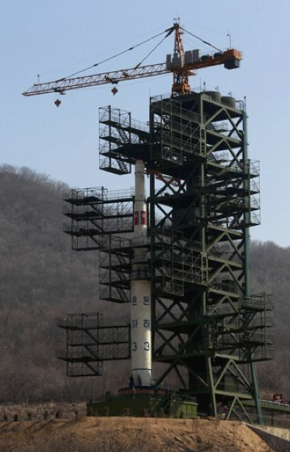
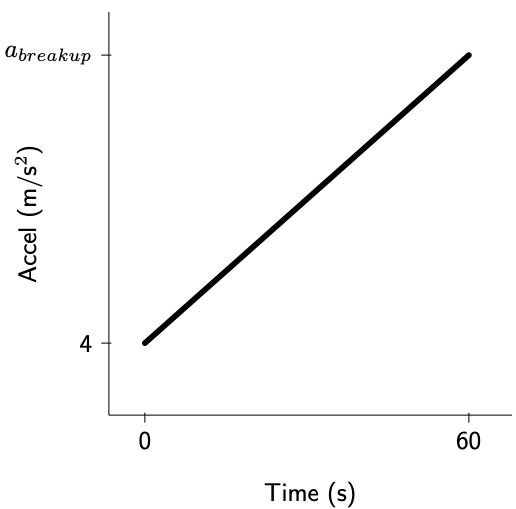

# Block 3 Projects and review

## Missile intelligence

On April 12, 2012, North Korea tested its first candidate for an intercontinental missile, the three-stage Unha-3 rocket (pictured on the launch pad). Since then, there have been several successful tests.  But according to news reports, the 2012 rocket broke up at an altitude of 100 miles after about 1 minute of flight. The burn time for the first stage of the rocket is approximately 120 seconds, so the break-up occurred during the first-stage burn. Let's see what we can figure out about the rocket from this test result.

```{r echo=FALSE, out.width="30%", fig.align="center"}

```

As you'll see further on in this project, rockets have to be highly optimized in order to fly successfully. Most of the mass of a rocket will be fuel. From the photograph, it's possible to estimate the geometrical dimensions of the rocket, and since it's mostly fuel, the mass can be estimated. The estimate for the Unha-3 was 85,000 kg.

Rocket engines can be more or less efficient. The efficiency is quantified by the ***specific impulse***, $I_s$ a quantity with dimension L/T, that is, velocity. You can conceptualize a rocket engine as a machine for accelerating fuel from velocity zero to a final velocity; the engine hurtles fuel backwards (and in the process burns the fuel to create the pressure that leads to the acceleration).

Suppose an engine is burning $b$ kilograms of fuel per second. Multiplying $b$ by the specific impulse $I_s$ gives the ***thrust of the engine.*** (demonstrate that this has the dimension of force.)

To help you understand the problem, here is some background.

The thrust (force) of the first stage engine was estimated to be 1,200,000 Newtons (m kg / s${^2}$), while the mass of the entire rocket was 85,000 kg. On its own, the upward 1,200,000 N force on 85,000 kg mass would give an acceleration of $1,200,000/85,000 = 14.1$ m/s$^2$. But there is also the downward force of gravity, corresponding to an acceleration of 9.8 m/s$^2$. Taken together, the initial acceleration of the rocket, at the moment of launch, is 14.1 − 9.8 m/s$^2$, or roughly 4 m/s$^2$ upward.

That may not seem very much, but as the fuel burns, the rocket mass is reduced while the engine thrust remains constant, so acceleration increases in a steady fashion. 

The goal of this problem is to find the acceleration at the time of the rocket’s break-up at t = 60s.

The acceleration versus time of the rocket can be approximated by a linear function, since fuel is being consumed at a steady rate, meaning mass is being burned off at a steady rate.

```{r echo=FALSE}
accel <- makeFun(b*SI/(m - b*t) - g ~ t, g=9.8, SI=3200, m=9e4, b=800)
slice_plot(accel(t) ~ t, domain(t=0:100))
velocity <- antiD(accel(t) ~ t, C=0)
position <- antiD(velocity(t) ~ t, C=0)
slice_plot(position(t)/160900 ~ t, domain(t=0:100))
```


```{r echo=FALSE, fig.align="center", out.width="40%"}

```

We don't know the peak acceleration $a_{\text{breakup}}$. But we can figure it out from what we do know: the position, $p(t)$ was 100 mi at t = 60s.

Better to do the calculations using position in meters rather than miles. There are 1609 meters in a mile.

Here is a chain of functions of time and their derivatives with respect to time. Note that the coefficients like 23 carry units, so that each quantity is dimensionally consistent. When $t$ is in seconds, the units of position will be m, velocity m/s, and so on.

$$\newcommand{\dd}{\underset{\scriptsize \text{anti-diff}}{{\stackrel{\text{diff}}{\ \ \ \ {\Huge\rightleftharpoons}\ \ \ }}}}

\frac{8}{3} t^3  + \frac{1}{24} b\, t^4 \dd 8 t^2 + \frac{1}{6} b\, t^3 \dd 4 t + \frac{1}{2} b\, t^2 \dd 4 + b t \dd b \dd 0$$

a. Circle the function that corresponds to the model of the Unha-3 rocket acceleration. Label it clearly “accel.”
b. Circle the function that corresponds to the position of the Unha-3 rocket. Label it clearly “pos.”
c. Using the fact that the position was 100 miles at the breakup time t = 60s, find a numerical value for the parameter $b$. Make sure to state clearly what are the units of $b$. Write down the numerical value in a form such that “meters” and not “miles” are involved.
d. Using the numerical value for $b$, find the acceleration of the rocket at the time of break-up.
e. A standard way to measure acceleration of planes and rockets is in terms of “g”, the acceleration due to gravity. An acceleration of 30 m/s$^2$ corresponds to 30/9.8 = 3.06 g. Untrained people loose consciousness at around 5 g, while trained pilots can stay conscious at up to 10 g. A sustained acceleration of around 20 g is considered life- threatening. 

> *How many g’s was the acceleration of the Unha-3 missile at the time of break-up?*


## Review


`r insert_calcZ_exercise("XX.XX", "yCkyoU", "Exercises/Accum/pony-freeze-room.Rmd")`

`r insert_calcZ_exercise("XX.XX", "IYwZLx", "Exercises/Accum/dolphin-choose-sofa.Rmd")`

`r insert_calcZ_exercise("XX.XX", "Zb22kJ", "Exercises/Accum/crow-bid-gloves.Rmd")`

`r insert_calcZ_exercise("XX.XX", "IXk4ua", "Exercises/Accum/elm-blow-lamp.Rmd")`


## Algebra-free calculus?

These problems deal with important aspects of calculus, but don't use either algebra or computing. Instead, they are about ideas that can help you understand the concepts of calculus (e.g., "signed area", dimension change) and provide insight into calculus operations in science and engineering.

## Boxing areas

### Problem 1

```{r child="beech-sleep-drawer.Rmd"}
```

### Problem 2

```{r child="beech-sleep-drawer2.Rmd"}
```

## Seeing slope, height, area in the same graph


```{r child="fox-make-stove.Rmd"}
```

## Jumping between dimensions

```{r child="goat-pitch-socks.Rmd"}
```

## Definite and indefinite integrals

[This is a repeat of a problem from DD-08]

```{r child="fundamental-theorem-duplicate.Rmd"}
```


Whenever you undertake to study a field, it's helpful to be able to figure out when you have already learned enough and can apply what you know with confidence to solve the analysis and design tasks you encounter. In academia, we sidestep the heart of this important question and define "enough" in procedural terms: "enough" is when the semester has ended and you have passed the final exam. For academic institutions, especially ones based on the liberal arts, there's little point in trying to be more definitive. After all, the "analysis and design tasks you [will] encounter" are as yet unknown, even though we can make reasonable guesses what many of them will be. `r mark(3900)`

You will never know all there is to know about integration. Thousands of talented and highly trained mathematicians and applied scientists have contributed to the body of knowledge over 300+ years you simply don't have enough time in your life to master all of it. Even if you devoted your life to this task, the field evolves. For instance, in 1953 (that may seem like antiquity) a hugely important integration innovation was presented [in this paper](https://bayes.wustl.edu/Manual/EquationOfState.pdf). This method, which involves using random numbers, was refined, extended, and improved. A breakthrough in 1988 led to an algorithm for solving genuinely important applied problems in statistics that had previously been thought impossible. `r mark(3905)`

Since you'll never know everything about integration, you need to prioritize. But you are not yet in a position to set priorities. You're at the start of a university-level sequence of courses and don't yet know what you will encounter. Of course, your instructors know what's in that sequence of courses and can make sensible choices for you, except ... what's in those courses depends on the traditions and conventions of those fields as interpreted by by the textbook writers in those fields. That's rooted in the textbooks that those instructors used as students. In turn, those textbooks were shaped by the education of earlier textbook authors 50 and 100 years ago. `r mark(3910)`

Another aspect of the prioritization we make for you has to do with the imperatives of our jobs as teachers. Instructors focus on topics that can be *assessed* successfully with the resources at hand. In practice this means topics where answers are either right or wrong and where its possible to generate new assessment questions easily. Sometimes, in some places, the cart gets put before the horse and ease of assessment becomes the highest priority. `r mark(3915)`

CalcZ is motivated by a desire to start over from scratch and reframe priorities according to what skills you are likely to need in the next few years. Yet it would be a disservice to you to sweep the floor completely clean. An important part of your work in the next few years will be engaging with instructors who communicate using their own conceptions of calculus, largely formed when they were educated. `r mark(3920)`

Which brings us to ... today's Daily Digital. We have already introduced you to methods of anti-differentiation based on algebraic notation, specifically anti-derivatives of basic modeling functions with a linear interior function. These are important and relatively easy to teach and learn. `r mark(3925)`

Today we're going to introduce you to two more algebraic methods of anti-differentiation: "u-substitution" and "integration by parts." You may encounter these in some of your future courses. That "may" is likely enough that instructors of those courses rank them as high-priority topics for your introduction to calculus. They want us to teach these topics and the topics are without argument traditional components of introductory statistics courses. `r mark(3930)`

Regrettably, an emphasis on three algebraic methods of integration will give you a picture that integration is about algebra. It is not. Integration is about functions. And there are many important and widely used function types for which there is no algebraic solution to the problem of integration. Yet *every function* can be anti-differentiated. And, a good technique for anti-differentiating any function is readily at hand via numerical techniques similar to the Euler method. These methods are implemented in a pretty simple R function: `antiD()`. Consider `antiD()` and learning to use it a fourth method of integration, and one that is much easier than either u-substitution or integration by parts. Since `antiD()` can handle all comers, while the algebraic methods can handle only a small (and hard to predict) set of functions, in terms of *using* anti-derivatives, `antiD()` would be the highest priority and would, on its own, be adequate for doing integration. The algebraic methods of integrating the basic modeling functions give you the vocabulary you need to communicate with the huge majority of people who learned calculus in the traditional, algebraic way. U-substitution and integration by parts bring you marginally further along, but not nearly so far along as computer algebra systems or even the traditional printed handbook called a "table of integrals." `r mark(3935)`

Finally, as you will learn in statistics, they way you take a sample is of fundamental importance in whether you will get a faithful representation of a process. In calculus textbooks (even our own MMAC text), the sample of integration problems is highly influenced by the relatively ease for instructors to generate new and never-before-seen functions that can be anti-differentiated using u-substitution or integration by parts. It's safe to say that you would never encounter such functions in professional uses of calculus. (Uses other than teaching calculus, that is!) `r mark(3940)`

If you have difficulty using u-substitution or integration by parts, you will be in the same league as the vast majority of calculus students. Think of your fellow students who master the topic in the way you think of ice dancers. It's beautiful to watch, but hardly solves every problem. People who would fall on their face if strapped to a pair of skates have nonetheless made huge contributions in technical fields, even those that involve ice.  (Prof. Kaplan once had a heart-to-heart with a 2009 Nobel-prize winner who confessed to always feeling bad and inadequate as a scientist because he had not done well in introductory calculus. It was only when he was nominated for the Nobel that he felt comfortable admitting to his "failure.") Even if you don't master u-substitution or integration by parts, remember that you can integrate any function using easily accessible resources. `r mark(3945)`


We've devoted about a third of this block on accumulation to algebraic techniques for calculating anti-derivatives. You will see these techniques in use in some of your future classes and work in science and engineering.  `r mark(3950)`

It's the nature of things that some people master the algebraic techniques and many do not. But it's easy to make mistakes. Even more fundamentally, there are many accumulation problems where the functions to be integrated do not have an algebraic form for the anti-derivative. In such cases, professionals use numerical techniques such as the Euler method. `r mark(3955)`

In order to give you a simple way to construct the anti-derivative of (just about) any function, while minimizing the amount of computer programming, we have packaged up anti-differentiation techniques into one, easy to use R function. This is `antiD()`. `r mark(3960)`

The `antiD()` function has the same interface as `D()` or `makeFun()`: the argument is a tilde expression of the sort `sqrt(x*sin(3*x)) ~ x`. The result returned from `antiD()` is a new R function that takes as its argument the "with respect to" variable. The sandbox provides a space to play with `antiD()` so that you feel comfortable using it. `r mark(3965)`

```{r eval=FALSE}
antiD(x^-2 ~ x)

f <- makeFun(sqrt(x*sin(3*x)) ~ x)
antiD(f(x) ~ x)
```

As you can see from the output of the sandbox, `antiD()` returns an R `function()`. The variable on the right of the tilde expression in the argument becomes the first of the arguments to that function. There is also a `C` argument: the constant of integration. `r mark(3970)`

`antiD()` knows a few of the algebraic integration techniques, roughly at the level of the basic modeling functions part of the course. When `antiD()` identifies the tilde expression as something it can handle, it returns a function whose body is the algebraic formula for the anti-derivative (although sometimes written in a cumbersome way).

When `antiD()` does not recognize its argument as a basic modeling function, the result is still an R function with the "with respect to" variable and `C` as arguments. But the body of the function is  unintelligible to a human reader (except perhaps for the `numerical_integration()`). The method of numerical integration is more sophisticated than Euler, and is highly precise and reliable. `r mark(3975)`

We're going to use `antiD()` in this daily digital simply because we want to focus on the process of differential modeling. The integrals you encounter will sometimes be ones you know how to handle algebraically. It's a good idea to do such integrals by hand and then compare to the results of `antiD()` to check your work. `r mark(3980)`

**Example**: Find the numerical value of this definite integral.

$$\int^{7}_{3} e^{x^{2}} dx$$

Example Solution in R
```{r}
F <- antiD(exp(x^2)~x)
F(7) - F(3)
```


