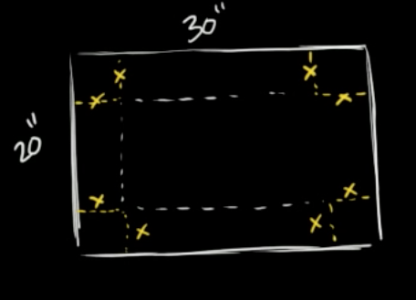

# Constraints

Consider these easy optimization problems:

- Build a road costing $10M per mile. How long should it be to minimize costs.
    * Answer: Zero miles
- Choose the length of the front wall and side walls of a room to maximize the room area.
    * Answer: Make the walls infinitely long.
- Build a spherical tank sliced in a way to have a flat bottom. The goal is to choose how far away from the sphere's center to make the slice in order to maximize the volume.
    * Answer: Don't make any slice; it reduces the volume!
- Provide funding to a portfolio of public health interventions in order to maximize the number of lives saved.
    * Answer: Spend an infinite amount on each intervention.

Each of these problems has an objective function---cost, room area, volume, lives saved. Each also has inputs to that objective function---road length, front and side wall lengths, slice position, funding for the different interventions. `r mark(4800)`

In your career, you may occasionally encounter optimization problems like this, where the answer is obvious. All of them fall into the category of "more is better" (or "less is better").

Nontrivial decisions generally involve resolving trade-offs: more is better **up to a point** and then it's worse. Or, "more $x$ is better" except that bigger $x$ means smaller $y$ and smaller $y$ makes things worse. `r mark(4805)`

An example of a "bigger $x$ means smaller $y$" is the cardboard box problem often found in calculus textbooks. You're given a rectangular piece of cardboard as in the diagram. From the rectangle, you will cut out four squares in the corners (marked in yellow). This creates a central rectangle with four flaps. When we fold these up we get an open-topped box. `r mark(4810)`

```{r echo=FALSE, fig.cap="Creating a box by cutting corners out of a rectangle. (Image from [Khan Academy video](https://www.khanacademy.org/math/ap-calculus-ab/ab-diff-analytical-applications-new/ab-5-11/v/optimizing-box-volume-graphically)) Length units are inches."}

```

The problem is to choose $x$ to maximize the volume of the box.  By making $x$ large, we increase the height of the box. A taller box is a more voluminous box ... at least if all other things are equal. But by making the box taller, we also make the bottom smaller because we still have the same amount of cardboard. `r mark(4815)`

The volume of the box will be height x length x width, or
$$V = x (30-x) (20-x)$$
```{r cf2-1, exercise=TRUE, exercise.cap="Sandbox", exercise.nlines=6, eval=FALSE}


```

```{r cf1-1, echo=FALSE, results="markup"}
askMC(
  "What is the value of $x$ and the corresponding $V(x)$ that produces the maximum volume for the box? You can use the sandbox for your calculations (make sure your parentheses match the provided equation).",
  "$x = 7.8 \\text{in}, V = 2112.55 \\text{in}^3$",
  "+$x = 7.85 \\text{in}, V = 2112.61 \\text{in}^3$+",
  "$x = 7.90 \\text{in}, V = 2112.73 \\text{in}^3$",
  "$x = 7.95 \\text{in}, V = 2112.59 \\text{in}^3$",
  random_answer_order = FALSE
)
```

A somewhat richer problem is to find the edge length $y$ square of cardboard that will produce the maximum volume when square corners of edge length $x$ are cut out. Here, the volume is $V = x(y-2x)(y-2x)$. `r mark(4820)`

As stated, maximum $V$ is infinite. There's no trade-off between $x$, $y$, and $z$. If a problem is to have a finite argmax, we need to introduce a trade-off. Let's suppose the trade-off is that the area of the initial piece of cardboard should be 600 square-inches, as in the previous problem. Now we have an objective function and a constraint $$\text{find argmax}\ \ V(x,y) = (y-2x)^2 x\  \text{subject to the constraint}\  y^2 = 600\ \text{in}^2$$ `r mark(4825)`

One perfectly legitimate way to solve this problem is to use the constraint to find a value for $y$, then substitute this value into the objective function, giving $$V(x) = (\sqrt{600} - 2x)^2 x$$

```{r cf1-2, echo=FALSE, results="markup"}
askMC(
  "Use the sandbox to find the optimal value of $x$ in the square-bottomed box problem. Which of these is it?",
  "+$x=4.083$+",
  "$x=4.186$",
  "$x=4.189$",
  "$x=4.210$",
  random_answer_order = FALSE
)
```

We're now going to see a different way of using the constraint in the optimization problem. The idea is to graph the objective function without any constraint, then graph the constraint on top. The sandbox has the appropriate graphing commands for the  square-bottomed box. `r mark(4830)`

```{r cf2-2, exercise=TRUE, exercise.cap="Contours and constraints", exercise.nlines=10, warning=FALSE, message=FALSE}
V <- makeFun(x*(y - 2*x)^2 ~ x)
constraint <- makeFun(y^2 ~ x + y)
contour_plot(V(x, y) ~ x + y, domain(x=c(0,10), y=c(20,30))) %>%
  gf_labs(title="Volume") %>%
  contour_plot(constraint(x, y) ~ x + y,
               filled=FALSE, contour_color = "orange3",
               contours_at = 600)
```


Here, the constraint is like a straight road going up and over the flank of a hill. To find the argmax "subject to the constraint," imagine you are riding a bike along the red road. If you start on the left side of the graphic frame and go to the right you will be going uphill. As you approach the crest, the road will level out and then you'll be riding downhill. `r mark(4835)`

```{r cf1-3, echo=FALSE, results="markup"}
askMC(
  "What is the relationship between the constraint (road) and the objective function (contours) that indicates you are on the crest?",
  "The road intersects a contour at right angles." = "If so, you would be riding in the steepest direction. Remember, the gradient at each point is perpendicular to the contour at that point.",
  "There's no fixed relationship between the road and the steepness of the objective function." = "Yet, ask any bicyclist and they can easily tell you when they have reached the top point on a road.",
  "At the crest, the road is parallel to the nearest contour." = "Almost, but remember that we draw only some of the contours and not others simply to prevent flooding the graph with ink.",
  "+At the crest, the road is parallel to the contour passing through that point on the road.+",
  random_answer_order = FALSE
)
```

```{r cf1-4, echo=FALSE, results="markup"}
askMC(
  "At the optimal point on the road, what is the value of the objective function $V(x,y)$?",
  1000, "+1100+" = "Right. The point is about half-way between the 1000 and 1200 contours.",
  1200, 1400,
  random_answer_order = FALSE
)
```

Now you have see two completely equivalent approaches to using the constraint

1. Solve the constraint for one variable in terms of the others.
2. Use the constraint to restrict the domain of optimization to those values that satisfy the constraint. (We did this graphically, but it can be done other ways if a graph can't be made, for instance, if there are more than two inputs to the objective function.) `r mark(4840)`

One reason to introduce (2) is to help you develop an intuition about the relationship between a constraint and the objective function. But it turns out that (2) lets us add features to optimization problems that can be important in practice. These are `r mark(4845)`

a. Add additional constraints to the problem.

    For example, in the cardboard box problem we didn't mention two constraints that are so obvious that we left it to common sense: $x > 0$ and $y > 0$. You can't have negative cardboard.

b. Examine what happens if the constraint is changed in some way.

    Suppose you were trying to convince the cardboard providers to allow a bit more cardboard for the box. How would the output of the objective function respond to this change?

    Often, the effect of changing a constraint is described in terms of a ratio: the change in output of the objective function divided by the change in the constraint value. This is sometimes called a **shadow price** of the constraint. The synonym **Lagrange multiplier** is also widely used. `r mark(4850)`

The next two sections will deal with (a) and (b) in turn.


`r insert_calcZ_exercise("XX.XX", "VHn3UG", "Exercises/Diff/snake-walk-knife.Rmd")`


`r insert_calcZ_exercise("XX.XX", "Yb6tVr", "Exercises/Diff/duck-tell-laundry.Rmd")`

## Constraints graphically

::: {.todo}
Turn this into an exercise?  Where should it go?
:::

```{r echo=FALSE, warning=FALSE, message=FALSE}
f <- rfun( ~ x + y, seed=101)
g <- rfun( ~ x + y, seed=201)
h <- rfun( ~ x + y, seed=302)
dom <- domain(x=c(-3, 3), y=c(-3, 3))
contour_plot(f(x,y) ~ x + y, dom, skip=0) %>%
  contour_plot(g(x,y)  ~ x + y, filled=FALSE, 
               contours_at = 3, npts=300,
               contour_color="orange3", size=2, labels=FALSE) %>%
  contour_plot(h(x,y)  ~ x + y, dom, size=15, 
               contour_color="dodgerblue", alpha=0.1,
               contours_at = seq(-20, -11, length=60),
               labels=FALSE) %>%
  contour_plot(h(x,y)  ~ x + y, dom, size=3, 
               contour_color="dodgerblue", alpha=0.75,
               contours_at = -10,
               labels=FALSE) %>% 
  gf_labs(title="(A)")
```


```{r echo=FALSE, warning=FALSE, message=FALSE}
f <- rfun( ~ x + y, seed=221)
g <- rfun( ~ x + y, seed=331)
h <- rfun( ~ x + y, seed=312)
dom <- domain(x=c(-3, 3), y=c(-3, 3))
contour_plot(f(x,y) ~ x + y, dom, skip=0) %>%
  contour_plot(g(x,y)  ~ x + y, filled=FALSE, 
               contours_at = 0, npts=300,
               contour_color="orange3", size=2, labels=FALSE) %>%
  contour_plot(h(x,y)  ~ x + y, dom, size=15, 
               contour_color="dodgerblue", alpha=0.1,
               contours_at = seq(-20, -11, length=60),
               labels=FALSE) %>%
  contour_plot(h(x,y)  ~ x + y, dom, size=3, 
               contour_color="dodgerblue", alpha=0.75,
               contours_at = -10,
               labels=FALSE) %>% 
  gf_labs(title="(B)")
```

```{r echo=FALSE, warning=FALSE, message=FALSE}
f <- rfun( ~ x + y, seed=421)
g <- rfun( ~ x + y, seed=451)
h <- rfun( ~ x + y, seed=463)
dom <- domain(x=c(-3, 3), y=c(-3, 3))
contour_plot(f(x,y) ~ x + y, dom, skip=0) %>%
  contour_plot(g(x,y)  ~ x + y, filled=FALSE, 
               contours_at = 0, npts=300,
               contour_color="orange3", size=2, labels=FALSE) %>%
  contour_plot(h(x,y) +3  ~ x + y, dom, size=6, 
               contour_color="dodgerblue", alpha=0.1,
               contours_at = seq(14, 23, length=40),
               labels=FALSE) %>%
  contour_plot(h(x,y) +3  ~ x + y, dom, size=3, 
               contour_color="dodgerblue", alpha=0.75,
               contours_at = 14,
               labels=FALSE, filled=FALSE)%>% 
  gf_labs(title="(C)")
```


## Multiple constraints

Economists are familiar with the concept of a [production function](https://en.wikipedia.org/wiki/Production_function). This relates the amount of various inputs used in production to the amount of the product. There are all sorts of inputs: materials of different sorts, labor, specialized machinery, and so on. We'll look at just two types of inputs: labor and capital. As an example, consider clothing manufacture. A factory could get by with simple needles and a lot of labor, or (as is more typical) with sewing machines and less labor. Which mix is best depends on the relative costs of labor and equipment. `r mark(4855)`

There's a standard model production function that's based on a simple but meaningful observation: if both labor and capital are, say, doubled, the output should double as well. Just this principle leads to a formulation of the production function $P(L, K)$ as a power-law function: $$P(L, K) \equiv b L^{a} K^{1-a}$$ This is called the [Cobb-Douglas production function](https://en.wikipedia.org/wiki/Cobb%E2%80%93Douglas_production_function) and, whether realistic or not, will illustrate the principles at work. `r mark(4860)`

```{r mc2-1, exercise=TRUE, exercise.cap="Cobb-Douglas Production Function", exercise.nlines=8}
P <- makeFun(b*L^a*K^(1-a) ~ K + L, a = 0.33, b=100)
budget_constraint <- makeFun(K + L ~ K + L)
g_union <- makeFun(L ~ K + L)
g_invest <- makeFun(K/L ~ K + L)
contour_plot(P(K, L) ~ K + L, domain(K=c(0.01,1), L=c(0.01,1))) %>%
  contour_plot(budget_constraint(K, L) ~ K + L,
               filled=FALSE, contour_color = "orange3",
               contours_at = c(1, 1.01)) %>%
  # TAKE OUT THE FOLLOWING LINES BEFORE DEPLOYING
  ## TAKE OUT
  ### TAKE OUT
  contour_plot(g_union(K, L) >= 0.5 ~ K + L, contour_at = 0.5,
              contour_color = "dodgerblue", n_fill=3,
               fill_alpha = 0.25)  %>%
  contour_plot(K/L > 2 ~ K + L, contour_at = 0.5,
               contour_color = "green", n_fill=3,
               fill_alpha = 0.25)
```

In the graph we've scaled L and K to have units of $1M and $1M is "all the money that's available." You can see that production output increases with both L and K, reaching 100 widgets in the upper right corner of the graph. `r mark(4865)`

What's the optimal mix of labor and capital? As stated so far, we're in a "more is better" situation. What creates the possibility for a finite argmax is a constraint: you can only spend the money that's available. For instance, we could spend the budget only on labor or, alternatively, only on capital. The production output will be zero however. Better to spend on a mix of labor and capital. `r mark(4870)`

The constraint here is of a very common sort: a budget constraint. We have one unit of money to spend; we could spend 30% on labor and 70% on capital, or any other mixture. The budget function has a very simple form: $g_{budget}(K, L) \equiv K + L$, the sum of the two expenditures. Our budget of one unit of money implies the constraint $g_{budget}(K, L) = 1$. You can draw this on the graph by adding a contour plot of $g_{budget}$, drawing the contour at level 1 (we'll . `r mark(4875)`

Add the constraint contour to the graph made by the sandbox by uncommenting the appropriate lines in the sandbox.

```{r mc1-1, echo=FALSE, results="markup"}
askMC(
  "Given the budget constraint, what's the largest level of production that's possible? (Choose the closest answer.)",
  "About 48 widgets",
  "+About 53 widgets+",
  "About 61 widgets",
  "About 67 widgets",
  random_answer_order = TRUE
)
```

```{r mc1-2, echo=FALSE, results="markup"}
askMC(
  "Reading from the graph, where's the argmax of the production function subject to the constraint?",
  "+About $K=0.66, L=0.34$+",
  "About $K=0.34, L=0.66$",
  "About $K=0.5, L=0.4$",
  "About $K=0.4, L=0.6$",
  random_answer_order = FALSE
)
```

The problem as stated involves just one constraint: $g_{budget}(K, L) = 1\$$M.

Now we'll imagine a situation where more constraints might come into play.

    * **Scenario 1)** In negotiating with the worker's union, the company has promised to spend at least $500,000 on labor next year.

    The constraint function here is $g_{union}(K, L) = L$ and you need to operate such that $g_{union}(K, L) >= $ $500,000.

    * **Scenario 2)** The US Department of Commerce has an "Re-invest in American Manufacturing" program. This provides an incentive of $50,000 so long as you use capital intensively, say at a level of at least 2 parts capital to one part labor. `r mark(4880)`

    The constraint function here is $g_{invest}(K, L) = K/L$ and, to qualify for the $50,000 incentive, you need to operate such that $g_{invest} \geq 3$.

Both of these are **inequality** constraints.  In contrast, the budget constraint is an **equality** contraint: It's only satisfied when you are in a lower-dimensional part (the red budget line) of the K-L space. Inequality constraints can be satisfied at a continuum of points. `r mark(4885)`

Plotting the inequality constraints uses some special features of `contour_plot()`, so we'll show you how to do it. For $g_{union}()$, use the following in the sandbox

```r
# Pipe the previous graphics into
contour_plot(g_union(K, L) >= 0.5 ~ K + L, contour_at = 0.5,
               contour_color = "dodgerblue", n_fill=3,
               fill_alpha = 0.25)
```

When you plot $g_{union}(K, L) > 0.4$ you will see a blue line at the frontier where the constraint is just barely satisfied. The **dark** region is where the constraint is **not** satisfied.

The **feasible set** is the points in $(K, L)$-space which is simultaneously in a region that satisfies $g_{union}(K, L) > 0.5$ as well as the budget constraint. So, along the red budget constraint but only that part in the **light** region that satisfied $g_{union}(K,L) > 0.5$. `r mark(4890)`

The **constrained argmax** is the point in the feasible set that maximizes the production output. The **constrained max** the the value of the production function at the constrained argmax.

```{r mc1-3, echo=FALSE, results="markup"}
askMC(
  "What is the constrainted max that satisfies the budget constraint as well as $g_{union}(K, L) > 0.5?",
  "46",
  "+50+" = "Right. At the intersection of the red and blue contours.",
  "53",
  "56" = "Constraints *never* point to a higher output than without the constraint.",
  random_answer_order = FALSE
)
```

Notice that the $g_{union}(K, L) > 0.5$ constraint prevents being able to operate at the point we reached with just the budget constraint. The cost of the union constraint to the company is 3 widgets.

Now comment out the union constraint and let's look at the investment incentive constraint. For $g_{invest}()$, use

```r
# Pipe the previous graphics into
contour_plot(K/L > 2 ~ K + L, contour_at = 0.5,
             contour_color = "green", n_fill=3,
             fill_alpha = 0.25)
```

You'll see that the feasible set is below the green contour, in the lower right part of the (K, L)-space. The cost of satisfying the investment constraint is practically zero: If the factory operates at the intersection of the red and green the output will still be 53 widgets.  This is an example of a constraint that doesn't change behavior. So far as this company is concerned, the Treasury Department is just giving away the incentive with no actual benefit. `r mark(4895)`

```{r mc1-4, echo=FALSE, results="markup"}
askMC(
  "Is there any place where all three constraints---budget, union, investment---are all satisfied?",
  "Yes",
  "+No+",
  random_answer_order = FALSE
)
```


`r insert_calcZ_exercise("XX.XX", "LiJkK2", "Exercises/Applications/cat-show-mug.Rmd")`


`r insert_calcZ_exercise("XX.XX", "h05BsT", "Exercises/Applications/crow-trim-laundry.Rmd")`


## Changing constraints

Imagine now that you are the factory manager and are briefing your company's Board of Directors about the planned production for next year. You say, "Production next year will be 53 widgets." A gruff member of the Board insists this isn't adequate, claiming, "We have a market for more widgets than that! And they sell for $10,000 each!" `r mark(4900)`

Spend a minute to think what would have to change in order to increase production beyond 53 widgets. Then think about how you would decide whether $10,000 per widget is a good reason to increase production. `r mark(4905)`

Now let's do it mathematically. A sensible response to the gruff member of the Board is, "We'll need to increase the production budget. Let's see if that's worthwhile."

Here's a sandbox to graph out a constraint along with the Cobb-Douglas production function.

```{r sp2-1, exercise=TRUE, exercise.cap="Cobb-Douglas Production Function", exercise.nlines=8, warning=FALSE, message=FALSE}
P <- makeFun(b*L^a*K^(1-a) ~ K + L, a = 0.33, b=100)
g_budget <- makeFun(K + L ~ K + L)
contour_plot(P(K, L) ~ K + L, domain(K=c(.6,.7), L=c(.3,.4))) %>%
  contour_plot(g_budget(K, L) ~ K + L,
               filled=FALSE, contour_color = "orange3",
## GET RID OF THE 1.01 contour before deploying
               contours_at = c(1, 1.01))
```

This is exactly the same graph as in the previous section but this time zoomed in around the argmax. Notice that the production function contours, which were curved in the previous section, now are practically straight lines. Yet another example of the principle in calculus that if you look closely enough around a point on a curve, the curve will seem like a straight line. `r mark(4910)`

```{r sp1-1, echo=FALSE, results="markup"}
askMC(
  "Maybe we were mistaken in claiming that the graph made by the code in the sandbox zooms in around the argmax. Which of these tests would allow you to determine if indeed the argmax is in the graphics frame?",
  "+The constraint contour is tangent to a production function contour.+",
  "The constraint contour crosses a production function contour." = "If so, then the path of the constraint function is heading either uphill or downhill, not level.",
  "The constraint contour appears in the graphics frame." = "But this doesn't rule out the frame being somewhere other than around the argmax.",
  "The production 53 contour appears in the graphics frame." = "But there are many places away from the argmax where the 53 contour appears."
)
```

Here's a process for determining if increasing the budget is worthwhile. It draws on information about the production function and the value of an additional widget.

1. Add a new constraint contour at a somewhat bigger budget, say $1.01M. You can do this by changing the argument `contours_at = 1` to be `contours_at = c(1, 1.01)`.
2. Calculate the production output at the new budget level.
3. Find out how much the production **output** increased from the original budget level to the new $1.01M budget level.
4. Divide the increase in the budget by the change in production (3). This is the **shadow price**/**Lagrange multiplier**. It has units of dollars/widget.

```{r sp1-2, echo=FALSE, results="markup"}
askMC(
  "What's the optimal production level when the budget is $1.01M?",
  "53.1",
  "+53.5+",
  "54",
  "55.5",
  random_answer_order = FALSE
)
```

```{r sp1-3, echo=FALSE, results="markup"}
askMC(
  "What's the shadow price of producing another widget",
  "$1000 per widget",
  "$5000 per widget",
  "$15,000 per widget",
  "+$20,000 per widget+",
  random_answer_order = FALSE
)
```

```{r sp1-4, echo=FALSE, results="markup"}
askMC(
  "Is it worthwhile to increase the production budget?",
  "Yes" = "So you're willing to spend $20,000 to produce something that sells for $10,000?",
  "+No+" = "Right. Who would spend $20,000 to produce something that sells for $10,000?",
  "Not enough information is available" = "Really? You know the cost and the benefit. That's enough to make a decision.",
  random_answer_order = FALSE
)
```

## Incommensurate objectives

Just as the word "cooperate" means to "work together" ("co" + "operate"), the word "commensurate" means to "measure together" or to measure in the same way. Since you already know about different units and dimensions, an example in that domain can make the meaning concrete. An inch and a mile are commensurate quantities. Obviously, an inch and a mile are not equal, but you can *compare* them in an objective way. (An inch is 0.000015783 miles.) Similarly, a litre and a gallon are commensurate, but having the dimension L^3^, neither is commensurate with a quantity of dimension L. `r mark(4915)`

A large number of decisions involve money in some way. It's routine to decide whether a purchase is "worth the money." But we do this by applying a judgment that is subjective, e.g. is it worthwhile to buy the more expensive chocolate? The decision involves comparing two *incommensurate* things: the money vs the good feelings that come from eating or giving a fine treat. `r mark(4920)`

That things are incommensurate does not at all mean that you can't make decisions that put one against the other, just that there is no ready, objective means to do the comparison.

As an example of how incommensurability can frustrate decision making ... In the 1990s the Federal Aviation Administration (FAA) was considering a policy of requiring safety seats for infants and children on flying. (For infants, the standard was "babe in arms": the infant could be carried on the plane and held by the caretaker, without needing a separate seat for the baby.) As you might expect, the issue was the extra costs for parents versus the increased safety of the child safety seat. The American College of Pediatrics lobbied in favor of the safety seats, travel agents lobbied against the requirement. The FAA could not reach a decision. That's somewhat surprising because the FAA necessarily makes decisions that compare money and safety, for instance in the requirements for a passenger evacuation system or life rafts. I guess nobody is objective about babies! `r mark(4925)`

After a decade or so, the FAA decided *not* to require the safety seats. What broke the log-jam of incommensurability was a study done of how parents would respond to the increase in cost of flying with babies. It was determined that the increased cost would push parents to drive rather than fly for short- or mid-distance trips. Driving is much more dangerous than commercial aviation and so the expected number of injuries or deaths would be larger were the safety-seat requirement instituted than if not. In other words, the comparison of lives to lives (driving risk versus flying risk) was easy, but the comparison of baby lives to money was impossible. `r mark(4930)`

Over the next few classes, you will learn some mathematical techniques for decision-making in the face of incommensurate objectives (e.g. save money versus save lives). It's important to note that there is no mathematical *solution* to the problem. Rather, mathematics can provide tools to clarify the trade-offs and, in much the same way as the resolution of the FAA's policy problem, can sometimes offer a sensible way forward. `r mark(4935)`

It's worth mentioning some of the common, non-mathematical ways that people deal with incommensurates. I'll call these "heuristics." The [Wikipedia definition of "heuristic"](https://en.wikipedia.org/wiki/Heuristic) is pretty good: `r mark(4940)`

> *[A]ny approach to problem solving ... that employs a practical method that is not guaranteed to be optimal, perfect, or rational, but is nevertheless sufficient for reaching an immediate, short-term goal or approximation. Where finding an optimal solution is impossible or impractical, heuristic methods can be used to speed up the process of finding a satisfactory solution. Heuristics can be mental shortcuts that ease the cognitive load of making a decision.* `r mark(4945)`

A very common heuristic is to simply deny that any trade-off exists. This is seen most clearly in the dispute about climate change. The trade-off here is the cost of climate remediation policies (such as a carbon tax) versus the disruption and dislocation caused by the changing climate. One one side of the debate are people who deny that climate change is happening or that it is caused by human activity that can be mitigated. On the other side of the debate are people who insist that the economic changes called for will not only reduce climate-change harm but will positively affect the economy, create jobs, etc. The rest of us are in the middle, recognizing both sides of the problem. `r mark(4950)`

Another heuristic is to play the trump cards of morality and human rights. Once someone claims the the issue is fundamentally one of morality, it's hard to have conversation about the trade-offs involved. (If everyone agreed about morality, it would be easier. But one person's divine truth is another person's opinion.) In the US, the debate about health-care policy is not a measured discussion of how available resources should be distributed to best effect but a competition between perceived moral or ethical stances: "the government has no business making medical decisions for me" versus "affordable health care is a human right." `r mark(4955)`

It is not our place in CalcZ to enter into deep conversation about political or moral philosophy. Rather, by introducing the concepts of incommensurability and heuristic, we intend to guide the mathematical discussion toward a framework for making impossible decisions in a thoughtful and responsible manner. `r mark(4960)`

## Multiple objectives

It often happens that decisions involve multiple simultaneous objectives. In one context or another, each of these considerations can play a role in decision making:

- safety
- cost
- human life
- animal welfare
- collateral damage
- public or political reaction

This is by no means an exclusive list. 

In specialized domains more specific competing objectives are often part of the design goal. For instance, consider aircraft design: 

- range
- payload or cargo capacity
- short take-off and landing
- maneuverability 
- mission suitability
- multi-mission capability
- maintenability
- stealth

Over the next few lessons, we're going to introduce concepts that are important to effective thinking about designing with multiple objectives as well as mathematical tools that help in balancing conflicting objectives. As you will see, there is no single "correct" or "best" solution to such problems. Indeed, there is a mathematical theorem about when there **cannot** be a best solution. However---and this may seem contractictory at first---some solutions are better than others. Mathematics also provides a framework for a systematic and documentable process which provides a role for the inevitable elements of human, subjective values. `r mark(4965)`

First, we'll cover elementary mathematical principles that demonstrate both that there is no single "best" solution while yet allowing some solutions to be better than others. Important vocabulary here includes **"incommensuate"**, **dominating** and **non-dominating** solutions(along with **pareto optimality**), **decision frontier**, and **social utility function**. `r mark(4970)`

Second, we'll briefly discuss some **heuristics** that people and groups often use, without necessarily realizing it, in solving multi-objective optimization problems. Awareness of such heuristics helps in identifying (often unstated) objectives implicit in the decision and enables you, by making them **explicit**, to clarify the problem and potentially open it up to useful discussion and **negotiation**.  `r mark(4975)`

Later, we'll use the mathematics of **constraints** and **constraint functions** to support a process of rational decision making that nonetheless leaves space for subjectivity in valuing outcomes.

::: {.todo}
MAYBE TRANSCLUDE THIS INTO THE TEXT?
:::

`r insert_calcZ_exercise("XX.XX", "iqek0m", "Exercises/Applications/daisy-mean-clock.Rmd")`


## Multi-objective decision making


Recall that we described a strategy for working with **incommensurate** objectives, that is, objectives such as "minimize money spent" and "maximize lives saved" that have no generally agreed common scale on which they can be compared. ("Mensurate" comes from the Latin for "measure." "Commensurate" means measured on the same scale.) We call that strategy **multi-objective** optimization. This is by no means a magical way of pulling ethical values or human preferences out of the universe. It is instead a mathematical framework for setting up the task to quantify correctly the tradeoffs between objectives. What use one makes of this information is entirely a matter for human decision making. `r mark(4980)`

The setting for multi-objective optimization is this:

i. You have a set of *policy alternatives* from amongst which you want to choose the "best." Sometimes these policy alternatives are discrete, e.g. whether to buy something or not. In this calculus course, we emphasize *continuous* policy alternatives, those that are represented by one or more numbers. Examples: How much money to spend on each of several modes of providing health care; How to set the length and diameter of a cylindrical tank.
ii. You have a set of *objective functions*, each corresponding to one of the incommensurate objectives. Each objective function takes any of the policy alternatives as input and produces an output on its own scale. Examples: Lived saved; Money spent; Cardboard box volume; Area of cardboard used to create the box. `r mark(4985)`

The process is this:

i. You, the decision maker, select *one* of the objective functions to be *the* objective function. Mathematically, it doesn't matter which one.
ii. The other objective functions become **constraint functions**. You, the decision maker, select a **level** for each constraint. Examples: The money available for health care (budget constraint); The volume that the cardboard box must contain.
iii. Find the argmax of the objective function in (i) subject to the constraint in (ii). This is an entirely automatic operation; there are no value judgments involved.
iv. Find the shadow price (also called the Lagrange multiplier) for each of the constraints in (ii). This is the change in output of the objective function in (i) when the *level* of the constraint is changed slightly. This also is an entirely automatic operation with no value judgments involved.
v. Now you again step in to make some decisions. Examine each of the shadow prices, one for each constraint. Your job is to decide whether the shadow price is worthwhile, in much the same way that you might decide whether the price of a snack is worthwhile. But, whereas your you make a go/no-go decision with the snack, with the shadow price you make a more graded decision. The possibilities are: 
    a. the price is not worthwhile. Response: *lower* the *level* of the constraint. 
    b. the price is just right. Response: leave the *level* of the constraint along. 
    c. the price is well worthwhile. Response: *raise* the *level* of the constraint.
vi. Repeat the process by going back to step (iii) until either the price is just right or the level of the constraint is zero.

Understanding (vi) is where your newly gained understanding of calculus comes in. Throughout CalcZ, we have encountered situations where we gradually build a solution by taking a series of **Euler steps**. You've seen this, for instance, in constructing the definite integral of a function or in finding a solution to a differential equation or by locating an argmax by taking small steps in the direction of the gradient vector. `r mark(4990)`

Now, let's examine a small but important part of the procedure for multi-objective optimization:

> i. You, the decision maker, select *one* of the objective functions to be *the* objective function. **Mathematically, it doesn't matter which one.**

Although we may think of objective functions and constraint functions as different kinds of things, the way they are used in constrained optimization gives them symmetrical roles. 

In earlier exercises, we've looked at step (iii) in the multi-objective optimization procedure graphically, as in this diagram depicting as an objective function the *volume* of a cardboard box and depicting as a constraint the surface area of cardboard used in the box. `r mark(4995)`

```{r echo=FALSE, warning=FALSE, message=FALSE}
V <- makeFun(x*(y - 2*x)^2 ~ x)
constraint <- makeFun(y^2 ~ x + y)
contour_plot(V(x, y) ~ x + y, domain(x=c(3,7), y=c(22,28))) %>%
  gf_labs(title="Volume") %>%
  contour_plot(constraint(x, y) ~ x + y, 
               filled=FALSE, contour_color = "orange3", 
               contours_at = 600) 
```  

The constraint path is the contour of the constraint function at which the output of the constraint function is the set level; here that's 600 square-inches of cardboard.    
The argmax in this problem is the point at which the constraint path is tangent to a contour of the objective function. Here, we need to **interpolate** visually and imagine the contour where the objective function output is about 1100, which will be tangent to the constraint path at about $x=4.2$.  `r mark(5000)`

Let's take the graphic apart into it's constituent components: the objective function and the constraint function. We'll plot both in the same way: a contour plot with the gradient field superimposed.

```{r echo=FALSE, out.width="50%", fig.show="keep", warning=FALSE, message=FALSE}
dom <- domain(x=c(3,7), y=c(22,28))
contour_plot(V(x, y) ~ x + y, dom ) %>%
gf_labs(title="Box volume") %>%
  gradient_plot(V(x, y) ~ x + y, npts=10) %>%
  gf_refine(coord_fixed())
  
contour_plot(constraint(x, y) ~ x + y, dom, 
               contours_at = c(400, 500, 600, 700, 800), skip=0) %>%
  gf_labs(title="Cardboard area") %>%
  gradient_plot(constraint(x, y)+0.001*x ~ x + y, npts=10) %>%
  gf_refine(coord_fixed())

```  

As always, at any point the gradient vector is perpendicular to the contour through that point. This means that wherever the contour of one function is tangent to the contour of the other function, their respective gradient vectors are exactly aligned.  `r mark(5005)`

The next plot shows the gradient vectors of each function along with the **angle** (in degrees) between the gradient vectors at each point. Along the **green line**, the gradient vectors are exactly aligned. `r mark(5010)`

```{r echo=FALSE, warning=FALSE, message=FALSE}
f <- V
g <- constraint
angle <- function(v1, v2) {
  180*acos(colSums(v1*v2)/sqrt(colSums(v1*v1)*colSums(v2*v2)))/pi
}
dfdx <- D(f(x, y) ~ x)
dfdy <- D(f(x, y) ~ y)
gradf <- Vectorize(function(x, y) {
  c(dfdx(x=x, y=y), dfdy(x=x, y=y))
})
gradg <- Vectorize(function(x, y){
  c(0, 2*y)
})
dom <- domain(x=c(3,5), y=c(23.5, 25))
contour_plot(angle(gradf(x,y), gradg(x,y)) ~ x + y, dom, 
             contours_at = c(10, 20, 30, 40, 50), 
             skip=0, npts=500, filled=FALSE) %>%
  contour_plot(angle(gradf(x,y), gradg(x,y)) ~ x + y, 
             contours_at = c(.3), contour_color="green", npts=200, filled=FALSE, label_color=NA, size=2) %>%
  gf_refine(coord_fixed()) %>%
  gradient_plot(constraint(x, y)+0.001*x ~ x + y, npts=10, color="dodgerblue") %>%
  gradient_plot(V(x, y)+0.001*x ~ x + y, npts=10, color="black") %>%
  gf_labs(title="Angle of alignment of objective and constraint function gradients")
```

Note that nowhere in the construction of the green line have we said anything about which of the two functions is the objective and which is the constraint. The two functions are used in exactly the same way: find the gradient and find the points where the two functions' gradients are aligned. It doesn't matter which function we choose to call the contraint and which the gradient.  `r mark(5015)`

Each point on the green line is an input $(x, y)$ that is optimal at some level of the constraint. Imagine taking points on the green line and, for each point, calculating the box volume and the box surface area. These points are each on the **Pareto frontier** of the multi-objective optimization problem. That is, there are no values of $x$ and $y$ off the green line that dominate a point on the green line in terms of the values of the box volume and the box area.  `r mark(5020)`

```{r echo=FALSE}
green <- makeFun(5.4*x + 2.4 ~ x)
frontier <- tibble::tibble(
  x = seq(3, 5, length=100), 
  vval = V(x, green(x)),
  cval = constraint(x, green(x))
)
gf_line(vval ~ cval, data = frontier, color="green", size=2) %>%
  gf_labs(y="Box volume (cubic inches)", x = "Box surface area (sq.inches)",
          title = "Pareto frontier of cardboard box problem")
```

```{r mg1-1, echo=FALSE, results="markup"}
askMC(
  "The two graphs showing the green line are labeled \"Angle of alignment ...\" and \"Pareto frontier ...\" respectively. The green line in both graphs represents the same set of $x, y$ points. But the graphs are different. Why?",
  "+The domain in \"Angle ...\" is the inputs $(x,y)$ to the objective functions, whereas the domain in \"Pareto ...\" is the outputs from those objective functions.+",
  "The domain in \"Pareto ...\" is the inputs $(x,y)$ to the objective functions, whereas the domain in \"Angle ...\" is the outputs from those objective functions.",
  "The \"Angle ...\" graph shows only the constraint function while the \"Pareto ...\" graph shows only the objective function.",
  "The \"Angle ...\" graph shows only the constraint function while the \"Pareto ...\" graph shows both the constraint and objective functions."
)
```

```{r mg1-2, echo=FALSE, results="markup"}
askMC(
  "Recall that the shadow price (a.k.a. Lagrange multiplier) is a ratio: the extent to which the output of the objective function is increased compared to the extent to which the constraint level is increased. Which of these numerical values is approximately the shadow price of volume with respect to area? (Hint: The above graph gives all the information you need!)",
  "+2.4+",
  "24",
  "240",
  "2400",
  random_answer_order = FALSE
)
```

```{r mg1-3, echo=FALSE, results="markup"}
askMC(
  "What's the shadow price of area with respect to volume? (Before we asked about volume with respect to area.)",
  "0.042",
  "+0.42+",
  "4.2",
  "42",
  random_answer_order = FALSE
  
)
```

```{r mg1-4, echo=FALSE, results="markup"}
askMC(
  "We made a rookie error in posing the two previous questions. The shadow price is a *quantity* and we didn't say what the **units** of that quantity are! So any of the candidate answers to those questions might be right depending on what unit you take the shadow price to be in. (You might have to make up your own unit for this to be exactly right.) We apologize for the mistake and will earnestly try to do better in the future! For now, we'll ask you to figure it out: Given the units shown on the graph, in what units are the shadow price of volume with respect to area?",
  "+inches+",
  "square-inches",
  "cubic-inches",
  "1/inches",
  random_answer_order = FALSE
)
```

**An application to machine learning**: Large chunks of the field of machine learning consist of relating some outcome to be predicted as a function inputs that can be measured. A discrete example: predict what animal is depicted in a photograph as a function of the million-or-so pixel values.  A continuous example: Find the probability of a person getting a disease as a function of measurements of expression level of each of thousands of genes. `r mark(5025)`

In both cases, a starting point is the collection of a large amount of data, e.g. photographs with various animals in them that have been labeled by some expert; or genetic measurements from people who did and did not come down with the disease. In both cases, the outcome of machine learning is a function that gives an output (which animal? came down with disease?) as a function of the inputs. `r mark(5030)`

One objective in finding the function is to make the results as close as possible to the data: the function should give the right answer as often as possible. But there is another objective: keep the model simple. The optimal model choice involves a trade-off between these two objectives. Techniques for model construction in machine learning therefore involve two objective functions: the probability of a correct output and the complexity of the model (as measured, for instance, by the length of the $\mathbf x$ vector found when solving the linear combination target problem). In statistics, this is called the trade-off between **variance** (how close the model is to the data) and **bias** (how far the $\mathbf x$ vector is from the one we would get by ignoring the objective to keep the model as simple as possible).  `r mark(5035)`


