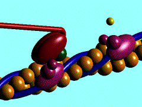
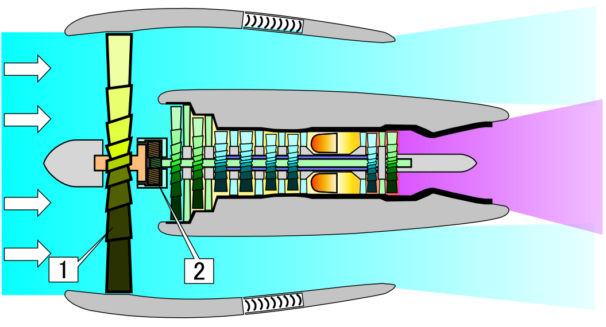
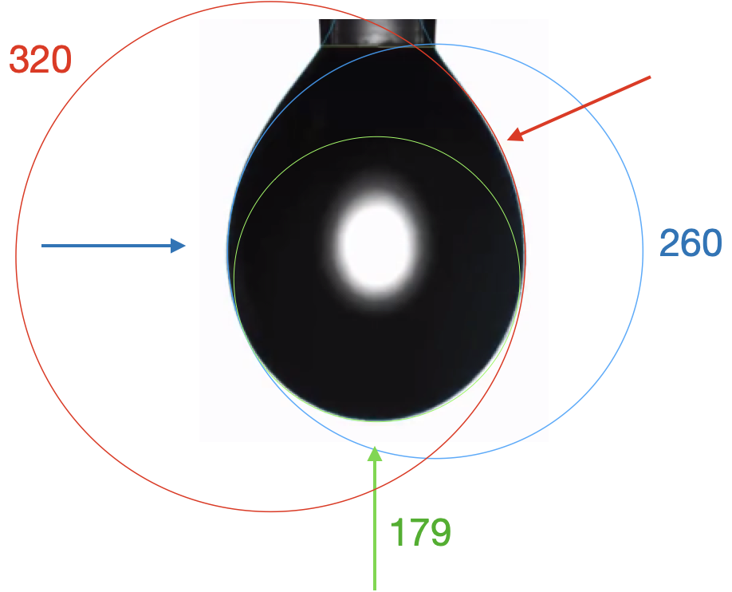

# Mechanics

In Block 2, we introduced the ideas of ***instantaneous rate of change*** and ***infinitesimal*** intervals of time. These are mathematical concepts introduced in the 17th century for describing motion. (In the 16th century, Galileo's measurements of motion involved averages over ***finite*** time intervals.) With this new mathematical tool, Newton was able to propose and confirm ***laws of motion***. Velocity of an object is its instantaneous rate of change of position with respect to time. Acceleration of an object is the instantaneous rate of change of velocity with respect to time. With these abstract concepts, Newton was able to connect motion to the palpable ***forces*** acting on objects. Thus was born the field of ***dynamics***, the study of forces and their effects on motion. A dynamic process is one that is characterized by constant change: motion.

In contrast, ***statics*** is about physical systems that do not change. A non-changing system is said to be in ***equilibrium*** or balance. Static systems are incredibly important in everyday life; a bridge that is not static is one that you do not want to cross! The equilibrium in a bridge is the balance between the downward force of gravity and the compression and tensile forces in the materials that make up the bridge.

***Mechanics*** a catch-all term for the combination of statics and dynamics studied in physics and used in engineering and design. Today it's common to think of a "mechanic" as a person who works with machines; the sense we have in mind here is the ***study of machines***, with the "-ic" signifying "practice of" in the sense of scientific, physics, mathematics, optics, chiropractic, and such.

"Simple machine" is a Renaissance-era term for a device that changes the direction or strength of forces. The classical simple machines are the lever, wheel and axle, pulley, inclined plane, wedge, and screw. "Mechanics" as a field originated in the study of such devices and development of theoretical concepts to describe them. It went on to deal with more complicated machine components such as a gas-filled cylinder and piston, flywheel, valve, turbine, etc. Many concepts from these theory are intuitive to the modern mind: force, pressure, momentum. 

This chapter is about the role of calculus concepts and methods, especially the calculus of accumulation/integration are applied in mechanics. 

## Work

"Work" is a familiar, everyday concept, but a nuanced one; one person's work can be another person's play. In mechanics, ***work*** has a much more specific meaning stemming from the study of simple machines. A lever, for instance, can be used to move an object that is otherwise too heavy to handle. It still takes toil and effort to move the object, but the effort is eased by the mechanics of the lever.

Our intuitive sense of work is perhaps rooted in physiology: effort, fatigue, muscle pain. For instance, it takes work to pick up a heavy object, but it is also work to hold the object up even without moving it. Generations of thinking about machines has brought us to a different notion of work that doesn't involve human subjectivity. In mechanics, holding an object steady, no matter how heavy, does not involve work. Although a human tasked to hold a heavy load will become exhausted, the same duty can be accomplished by placing the load on a table, completely eliminating the effort. In mechanics, work and motion go hand in hand; without motion there is no work.

The table holding the heavy load does no work. Work is done only when the load is moved, and the amount of work depends on how the load is moved. For instance, moving a block along level ground involves a lot of work, but pulling a cart filled with blocks can be almost effortless. In mechanics, work combines both the amount of motion and the force needed to accomplish the motion. 

> Work is force times displacement.

Consider, for instance, the work involved in lifting a mass $m$ to table height $h$. The lifting is accomplished by applying an upward force to counter the force of gravity. The gravitational force on the mass is $m g$, where $g$ is the instantaneous acceleration of an object released to fall freely (about 9.8 m/s^2^ near the Earth's surface). The distance traveled is $h$. So the work performed on the mass is $m g h$.

[Picture of a mass (on wheels) being lifted to a table.]  [Picture of a mass being moved by along a ramp up to the table.] [Picture of a mass being hauled up by a pulley to the table height.]

Notice that the work has nothing to do with the **speed** with which the mass is moved up to the table. Lift it fast or lift it slow, it amounts to the same mechanical work. (Of course, to human perception, lifting an object very slowly up to table height involves more effort than snapping it up quickly. But human effort is only peripherally related to mechanical work.)

Let's introduce a machine to the situation in the form of a ramp or a pulley.  The purpose of the machine is to ease human labor by changing the strength or direction of forces. You can perhaps intuit that rolling the mass up the ramp will be an easier task than lifting it. How so?

The ramp can be seen as a sort of partial table. The ramp does most of what's needed to hold the mass up, the human worker need only supply a modest additional force, parallel to the ramp surface, to keep the mass in place. Calculating that modest additional force can be accomplished by a basic mathematical technique in mechanics: ***decomposing a vector***.

You've already encountered vectors (in Section `r Sections$gradient_vector`) in the context of the ***gradient vector***, the vector that points in the steepest uphill direction of a function $f(x,y)$ at any given input $(x,y)$. Recall that the gradient vector was written as a set of values; the partial derivative of $f()$ with respect to each of its inputs in turn. That is, $$\nabla f(x,y) = \left({\large\strut} \partial_x f(x,y),\ \  \partial_y f(x,y)\right)\ .$$ In this representation, the vector $\nabla f(x, y)$ is decomposed into two components: $\partial_x f(x,y)$ and $\partial_y f(x,y)$.  Similarly, we can decompose the vector of gravitational force into two components, one along the surface of the ramp and the other perpendicular to the ramp.

```{r ramp-decomposition, echo=FALSE, fig.cap="Decomposing the vector of gravitational force into two, perpendicular components."}
# [Picture of ramp with perpendicular graph paper imposed.]
```


We'll return to the idea of vector decomposition in much more detail in Block 5 of this course; it has a major if unexpected role to play in fitting models to data. But for now, we'll simply examine the right triangle in Figure \@ref(fig:ramp-decomposition). In that triangle, the gravitational force vector $m{\mathbf g}$is in the role of the hypothenuse. The component along the ramp is $m \sin(\theta) {\mathbf g}$. The worker pushing the mass up the ramp need provide the fraction  $\sin(\theta)$ as much force as the worker picking up the mass without a ramp. Thus human effort is reduced by the machine.

What about the mechanical work? Is that also reduced? Remember that mechanical work is the product of force times distance. The force has been reduced to $m \sin(\theta) {\mathbf g}$, but the distance $D_{ramp}$ along the ramp is much longer than the distance $h$ from floor to table top. Again, referring to the ramp itself as a right triangle, you can see that $D_{ramp}\sin(\theta) = h$ or, $D_{ramp} = h / \sin(\theta)$.  The total mechanical work, the product of applied force times distance moved is $$m \sin(\theta) g \times D_{ramp} = m \sin(\theta) g \times \frac{h}{\sin(\theta)} = m g h\ .$$ The ramp does nothing to reduce the mechanical work needed to lift the mass!

We usually think of ramps as an inclined plane. But, from Blocks 1 to 3 we have the tools to figure out the work for a (smooth) ramp with any shape at all. We're going to do this not because odd-shaped ramps are encountered frequently, but to provide an example in a relatively familiar setting of some techniques we will use elsewhere in this chapter.

The ramp we have in mind has a surface whose height $f(x)$ is zero at the foot ($x=a$) and reaches $f(x=b) = h$ where it joins the table. The slope of the ramp is, as you know, $\partial_x f(x)$. It's helpful to convert this rise/run formulation of slope into the slope-angle form we used to study the simple ramp. [Zoomed in theta diagram here.] As you can see from the diagram, which zooms in on one place on the ramp, rise over run amounts to $L\sin(\theta) / L\cos(\theta) = \partial_x f(x) = \tan(\theta)$, with the result:
$$\theta = \arctan({\large\strut}\partial_x f(x))\ .$$
Consequently, the force that needs to be applied parallel to the ramp's surface is $m \sin(\arctan(\partial_x f(x))) g = m \sin(theta) g$. To find the work done in pushing the mass an infinitesimal distance along the ramp we need to know the ***instantaneous length*** of the ramp. This is potentially confusing to the new reader since we've already said that the distance is infinitesimal. But as you know, infinitesimal length is different from zero length. We'll write $dx$ as an infinitesimal increment along the floor, but the zoomed-in surface of the ramp is the hypotenuse of a right triangle where one leg has length $dx$ and the other has length slope times distance or $\partial_x f(x) dx$. [Zoomed in length diagram here]
So the hypotenuse has length 
$dL = \sqrt{\strut dx + \partial_x f(x) dx}$, or $dL = \sqrt{\strut 1 + \partial_x f(x)}\ dx$. Things are a bit simpler if we write $dL$ in terms of the slope angle $\theta$. Since $dx = \cos(\theta) dL$, we know $dL = dx/\cos(\theta)$. Consequently the infinitesimal of work is $$dW \ = \ m g \frac{\sin(\theta)}{\cos(\theta)}\ dx\  = \ m g \tan(\theta) dx \ .$$
The total work is the accumulation of $dW$ over the extent of the ramp. In other words, $$\int_a^b m g \tan(\theta)\ dx\ = \ \int_a^b m g \tan(\arctan(\partial_x f(x)))\ dx = \int_a^b m g \partial_x f(x) dx\ ,$$ where we've used the formula $\theta = \arctan(\partial_x f(x))$. From the "fundamental theorem of calculus" we know that 

$$\int_a^b m g\ \partial_x f(x)\ dx \ = \ \left.m g \ f(x){\Large\strut}\right|_a^b = mg \left[\strut f(b) - f(a)\right] = mg h\ .$$

What's remarkable is that pushing the mass up the $f(x)$-shaped ramp involves an amount of work, $m g h$, that *does not depend on $f(x)$*, only on $f(b) - f(a)$, the net height comprised by the ramp.

We haven't yet said what this notion of work is good for and we've given no detailed justification for the definition of mechanical work as force times distance. You could imagine, for instance, someone deciding to measure work as the square-root of force times distance squared. But ... that particular measure is not going to make sense if we think about the dimension of the quantity. Force has dimension [force] = M L T^-2^. Square root of force times length squared would have dimension [sqrt(force) $\times$ length-squared] = M^1/2^ L^5/2^ T^-2^. The non-integer exponents mean that this is not a legitimate physical quantity.

The dimension of force-times-length are straightforward: [force $\times$ length] = M L^2^ T^-2^, that is, ***energy***. The particular definition of work as force times length will make sense in the context of a more comprehensive mechanical theory of energy. The significance of energy itself is that, as a fundamental proposition of physics, the various forms of energy are interchangeable but ***conserved***; energy is neither created nor destroyed, just moved around from one form to another and one place to another.

::: {.example data-latex=""}
Near the surface of the Earth, gravitational acceleration is approximately constant regardless of latitude or longitude. But gravity varies with distance $r$ from the Earth's center. Newton's law of universal gravitation gives the force on an object of mass $m$ due to the Earth's gravity as 
$$F = \frac{m M_e G}{r^2}$$ where $M_e = 5.972 \times 10^{24}$ kg is the mass of the Earth and $G = 6.674 \times 10^{-11}$ N m^2^ / kg^2^ is the universal gravitational constant. The Earth's radius is roughly $6.37 \times 10^6$ m, so the force on a 1 kg object near the surface of the Earth is $F = 1 \text{kg} (5.972 \times 10^{24} \text{kg}) (6.674 \times 10^{-11})/ (6.37 \times 10^6 \text{m})^2$ N m^2^ kg^-2^. Carrying out the arithmetic and consolidating the units gives
$$F = 9.823 N$$ for the 1 kg object.

Suppose we want to lift the 1 kg object from the Earth's surface to 10000 km away, that is, to a distance of $16.37 \times 10^6$ m from the center of the Earth. For the purpose of the example, we'll ignore the gravitational force exerted by the Sun, Moon, planets, and other galaxies, etc. The work performed in the lifting is 

$$\int_{6.47\times 10^6}^{16.47\times 10^6} \frac{1 \text{kg}\ M_e\ G}{r^2}\ dr = -\left.  {\Large\strut}\frac{1 \text{kg}\ M_e\ G}{r}\right|_{6.47\times 10^6}^{16.47\times 10^6} \\\ \\\ \\= 
-\ 3.986 \times 10^{14}\left[\strut \frac{1}{16.47 \times 10^6} - \frac{1}{6.47 \times 10^6}\right] \text{N m} \\\ \\\ \\= 37,405,840\ \text{J}.$$

A Newton-meter (N m) is also known as a Joule (J), a unit of energy. 
::L:


EXERCISE: Find the energy needed to lift the 1kg object to 20,000 km from the Earth's surface. [They will need to do the computing. Hand in the R statement that you used. Recall that you can write scientific notation using the computer `e` syntax, e.g. $6.47\times 10^6 =$ `6.47e6`.]

EXERCISE: Lift an object 10,000 km from the surface of the Moon. [Show a picture of the Saturn 5 and of the LEM. http://heroicrelics.org/info/saturn-v/saturn-v-general.html] The lunar module was a two-stage vehicle designed for space operations near and on the Moon. The spacecraft mass of 15103 kg was the total mass of the LM ascent and descent stages including propellants (fuel and oxidizer). The dry mass of the ascent stage was 2445 kg and it held 2376 kg of propellant. Hydrogen has energy density of about 120 MJ/kg. The hydrogen/oxygen combination is about 13 MJ/kg

## Energy

Mechanical work, as discussed in the previous section, is a form of energy. When we lift a object, we put energy into the object. But we cannot say from examining the object how much work was done to place it on the table. That depends on how the object came to be on the table: lifted from the floor (positive work; force is positive upward, displacement is also positive upward) or perhaps lowered from a helicopter (negative work: force exerted by the cable is positive upward but the displacement is downward, therefore negative). We might call the work energy ***latent***, the word meaning "unobservable," "hidden," "concealed," "dormant." To have an operational meaning, the work-energy that we assign to an object at rest must be with respect to some "ground state." A convenient ground state here is to imagine the object resting on the ground. The assigned energy will then be the work that would have to be performed to raise the object to table height. Once at table height, the energy is again latent. 

How then to *measure* the work energy that's latent in the object resting on the table? The idea is to return the object to its ground state, which we could do by lowering it---a negative displacement---to the ground, measuring the force needed to support the object (upward, so positive) and multiplying this by the displacement. 

Another idea for measuring the latent energy is to let the object fall freely back toward its ground state and see what changes about the object. Perhaps you have already caught on to what will happen: the object's speed increases steadily until the instant before it hits the ground. 

"Latent" is an apt but unusual word to express the energy imbued in the object resting on the table. We might equally say that the energy is "associated with position (at the height the table)," or we could call it "gravitational energy." The term that's generally used is a near synonym of "latent." We call the energy of the stationary object on the table ***potential energy.*** More precisely it can be called ***gravitational potential energy*** to distinguish it from the potential energy created by other forms of work, for instance pulling apart magnets or electric charges or compressing a gas into a cylinder. 

There's also a form of energy associated with motion. We could call this "energy of motion," but the conventional term is ***kinetic energy***. (A dictionary definition of "kinetic" is "relating to or resulting from motion." so we might as well say simply that kinetic energy is "energy relating to motion.)

Velocity is a good way to observe motion. We can use dimensional analysis to anticipate how velocity and (kinetic) energy are related. Recall that energy has dimension M L^2^ T^-2^ and velocity has dimension L/T. Consequently, if an object's kinetic energy at any instant stems from its mass and its velocity, then the energy must be mass times velocity squared, perhaps multiplied by a scalar, that is:
$$E_{kinetic} = a m v^2\ .$$

To find this scalar, we'll use calculus and accumulation. We know that the acceleration of a free-falling object due to gravity is $-g$ (where the negative sign reflects the downward direction). Starting from rest (that is zero velocity so zero kinetic energy) the newly released mass will have a velocity that is the accumulated acceleration over time. In other words:
$$v(t) = \int_0^t - g\ dt = -\left.g \ t{\large\strut}\right|_0^t = -g\ t\ .$$
Correspondingly, the position at time $t$ will be the accumulated velocity:
$$x(t) = x(t=0) + \int_0^t v(t) dt = h  + \int_0^t -g\ t\ dt = h - \frac{1}{2} \left.g\ t^2{\Large\strut}\right|_0^t = h - \frac{1}{2} g\ t^2 \ .$$
The position is relevant only because we want to figure out the velocity at precisely the instant $t_g$ when the object returns to its ground state, $x(t_g)=0$. By plugging in $t=t_g$ to the above, and re-arranging, we find that the object returns to its ground state when $h - \frac{1}{2} g\ t_g^2 = 0\ \ \ \implies \ \ \ t_g = \sqrt{\strut 2 h/g}$.

Now that we know the time when the object reaches its ground state, we can calculate the velocity at that instant:
$$v(t_g) = -g\ t_g = - g\ \sqrt{\strut 2 h / g} = - \sqrt{\strut 2 g h}$$
As the object reaches its ground state, its gravitation potential energy is zero (because it's at the ground state) and, if energy is conserved and assuming that no other forms of energy are relevant but kinetic and gravitational potential energy, the kinetic energy will be the same size as the potential energy at $t=0$ when the object was released from the table, that is
$$E_{kinetic}(t_g) = a\ m\ v(t_g)^2 =
= a\ m \left(\sqrt{\strut 2 g h\ }\ \right)^2 = \\\ \\2\, a\, m\, g\, h\  = m\, g\, h = E_{potential}(t=0)$$

::: {.example data-latex=""}
In the previous section, we calculated the potential energy of a 1 kg object at an altitude of 10,000 km above the Earth's surface: 37,405,840 J. How fast would the 1 kg object need to be moving to have this much kinetic energy?

$$\frac{1}{2} (1 \text{kg}) v^2 = 37,405,840 \text{J} = 37,405,840 \ \text{kg}\ \text{m}^2\ \text{t}^{-2}$$
Solving for $v$ we get $v^2 = 2 \times 37,405,840 \text{kg}\ \text{m}^2\ \text{t}^{-2}\ \text{kg}^{-1}$ or $$v = 8649.4\ \text{m}/\text{s}\ ,$$ about eight-and-a-half kilometers per second.
:::

::: {.intheworld data-latex=""}
The photograph ([source](https://www.coachmag.co.uk/exercises/dumbbell-exercises)) shows a simple exercise: holding a dumbbell out horizontally. 

```{r echo=FALSE, out.width="50%", fig.align="center"}
knitr::include_graphics("www/barbell-exercise.png")
```

As anyone who does this exercise can tell you, even when there is no movement of the dumbbell, there is a strong sense of work being done. Your muscle fatigues and, for most people, the dumbbells can be held in place for only a short time.

We've said that mechanical work always involves motion; no motion, no work. So how come the exercise feels like work even though the hands do not move?

To perform the exercise, you contract the muscles of the shoulder and upper arm. There is no skeletal joint that can be locked in place (unlike, say, the knee). It is only the muscle force that holds the arms in place.

On the size scale that we normally perceive, it can appear that nothing is moving during the exercise. But zoom in to the molecular scale to see the action by which force is generated by muscle. The functional unit of muscle force involves two proteins, actin and myosin, that interact in a complicated way. The animation (from the online textbook by Michael D. Mann, [*The Nervous System in Action*](https://michaeldmann.net/The%20Nervous%20System%20In%20Action.html), [chapter 14](https://michaeldmann.net/mann14.html)) shows the situation. The "head" of a myosin unit (red) acts like an oar. It attaches to a site on the actin molecule (orange) causing the head to contract and pull on the actin. Once contracted, a molecule of ATP (green sphere) binds to the myosin, releasing the head and preparing it for another stroke. ATP is an organic molecule that serves as a primary energy carrier and is found in all known forms of life. Transformation of ATP to ADP releases the energy. The ADP is then cycled, though other metabolic processes, back into ATP. This happens rapidly. Humans recycle approximately their own body weight in ATP each day.

```{r actin-myosin, echo=FALSE, fig.cap="Animation of the generation of force by the interaction of actin and myosin, from *The Nervous System in Action*"}

```
When muscle is under tension, the actin can slip back in between strokes of the myosin head. Thus, a constant-length muscle in tension on a macroscopic scale is steadily consuming energy, in much the same way as an oarsman on an anchored boat can do work via the movement of oars against the water even when the boat itself is not moving.
:::


## Momentum

In the previous sections we looked at force $\times$ distance. Dimensional analysis showed that [force $\times$ distance] = [energy] and, in the setting of lifting an object and letting it fall back toward its ground state, we traced out the conversion of the energy of position ("potential energy") into the energy of velocity ("kinetic energy").

Now consider a somewhat different quantity: force $\times$ time. Dimensional analysis gives
$$\underbrace{M^1 L^1 \ T^{-2}}_\text{[force]}\  \times\ \underbrace{T}_\text{[time]} = \underbrace{M^1}_\text{[mass]} \underbrace{L^1 T^{-1}}_\text{[velocity]} $$
The product of force times time is dimensionally equivalent to the product of mass times velocity. The quantity is called ***momentum***. Newton's second law of motion, often written in terms of acceleration, $F = m a$, is more fundamentally written in terms of momentum: $F = \partial_t\, m\, v$. The ***conservation of momentum*** refers to the situation when outside forces on a system are nil. In such case, momentum of the system doesn't change with time; momentum is constant or "conserved." 

An example of such a system is a deep-space probe, sufficiently far from other matter that gravitational force is negligible. In order to speed up or slow down (or turn), the probe is made to throw out fast moving molecules of burnt fuel. These particles have "new" momentum, but since momentum of the whole system is conserved, the body of the probe gains "new" momentum in the opposite direction. This is the operating principle of the rocket engine.

```{r jet-engines, echo=FALSE, out.width="50%", fig.cap="Left: A turbojet engine uses air for combustion and emits a relatively low amount of mass at high velocity. Right: A turbofan engine uses a fan blade (1) to convert some of the combustion energy into a large mass of relatively slow velocity, unburnt air."}
knitr::include_graphics("www/Jet_engine.svg.png")

```

Aircraft jet engines work in a similar matter, burning fuel to create energy. Whereas the force generated by a rocket engine is entirely produced by the newly created momentum of the burnt fuel, aircraft engines have an additional material to work with: air. The earliest jet engines, ***turbojet engines***, were small in diameter, bringing in air mainly as a fuel for combustion. (Figure \@ref(fig:jet-engines) left^[Source: Jeff Dahl, CC BY-SA 4.0, <https://commons.wikimedia.org/w/index.php?curid=3235265>] Today's more efficient engines are large diameter: ***turbofan engines***. (Figure \@ref(fig:jet-engines) right^[Source: <https://commons.wikimedia.org/wiki/File:Geared_Turbofan_NT.PNG>]) In addition to using air for combustion, they use large fan blades to convert the energy of combustion into a large mass of relatively slowly moving, uncombusted air. This moving air carries momentum; more than that contained in the fast moving particles generated directly through combustion.

## Center of mass

In considering a physical object of extended shape, it can be a great simplification to be able to treat the whole extended object as if it were a simple point object at a single location. For instance, Figure \@ref(fig:galaxy-probe) imagines a space probe coasting through the edge of a galaxy.

```{r galaxy-probe, echo=FALSE, fig.cap="An imagined space probe (orange dot) on the outer edges of a galaxy."}
n <- 100
set.seed(103)
Stars <- tibble(
  x = rnorm(n),
  y = rnorm(n),
  x2 = runif(n,0.8, 0.9)*x - 0.2*y,
  y2 = runif(n, 0.8,0.9)*y + 0.2*x,
  x3 = runif(n,0.9,1)*x - 0.12*y,
  y3 = runif(n,0.9,1)*y + 0.12*x,
  x4 = runif(n, 0, .5)*x - 0.06*y,
  y4 = runif(n, 0, .5)*y + 0.06*x
) %>%
  mutate(x = x+1, y=y-.5, x2 = x2+1, y2=y2-0.5, 
         x3 = x3+1, y3 = y3 - .5, x4=x4+1, y4=y4-0.5)
gf_point(y ~ x, data = Stars, size=runif(n,.1, 2), color="yellow") %>%
  gf_point(y2 ~ x2, size=runif(n,.1, 2), color="yellow") %>%
  gf_point(y3 ~ x3, size=runif(n,.1, 2), color="yellow") %>%
  gf_point(y4 ~ x4, size=runif(n,.1,0.5), color="yellow") %>%
  gf_point(.9 ~ 1.9, size=3, color="orange") %>%
  gf_refine(coord_fixed()) +
  theme(panel.background = element_rect(fill = 'black', colour = 'white'))
```
What is the gravitational attraction of the galaxy on the probe? One way to find this is by adding up the individual gravitational attractions of the individual stars. Another is to find the center of mass of the galaxy and calculate the force *as if* all the mass were at that point. The two calculations give the same answer. 

For the galaxy, the center of mass is located at a point $(\bar{x},\bar{y})$ where $$\bar{x} \equiv \sum_\text{galaxy} m_i x_i\ \ \ \text{and}\ \ \ \ \bar{y} \equiv \sum_\text{galaxy} m_i y_i$$

```{r echo=FALSE}
set.seed(939)
n <- 10
Shape <- tibble(
  theta = seq(0, 2*pi, length=n),
  r = 1 + runif(n),
  x = r*cos(theta),
  y = r*sin(theta)
)
xfun <- spliner(x ~ theta, data = Shape, method="periodic")
yfun <- spliner(y ~ theta, data = Shape, method="periodic")
Boundary <- tibble(
  theta = seq(0, 2*pi, length=20*n),
  x = xfun(theta),
  y = yfun(theta),
  rx = round(x, 1),
  ry = round(y, 1)
)

Dots <- expand.grid(
  tibble(x=0.05+seq(-2, 2, by=.1), y=x)
)

Dots$inside <- sp::point.in.polygon(
  Dots$x, Dots$y, Boundary$x, Boundary$y)

Dots <- filter(Dots, inside==1) %>%
  mutate(xleft = x - 0.05, xright = x + 0.05,
         ybottom = y - 0.05, ytop = y + 0.05)

gf_rect(0 + .1 ~ xleft + xright, data = Dots, alpha - 0.1)

P1 <- gf_polygon(y ~ x, data=Boundary, fill="blue", alpha=0.2) %>%
  gf_refine(coord_fixed(), 
            scale_y_continuous(minor_breaks=seq(-2,2,by=.2)),
            scale_x_continuous(minor_breaks=seq(-2,2,by=.2))) 
P2 <- P1 %>%
  gf_rect((y-.04)+(y+.04) ~ (x-0.04) + (x+0.04), data = Dots, fill=NA, color="black", size=0.1)

P3 <- P1 %>%
  gf_rect(0 + 0.1 ~ (x-0.04) + (x+0.04), data = Dots, fill="black", alpha=0.05)

P4 <- P1 %>%
  gf_rect((y-.04)+(y+.04)  ~ 0 + 0.1, data = Dots, fill="black", alpha=0.05)
```

For a continuous shape, such as in Figure \@ref(fig:shape1-blocks) accumulating over the entire shape can be accomplished, among other ways, by dividing it into a set of discrete, non-overlapping, adjacent rectangles. Then, as with adding up the stars, just add up the mass contained in each rectangular region.

$(\bar{x},\bar{y})$ where $$\bar{x} \equiv \sum_\text{rectangles} m_i x_i\ \ \ \text{and}\ \ \ \ \bar{y} \equiv \sum_\text{rectangles} m_i y_i$$


```{r shape1-blocks, echo=FALSE, fig.cap="A continuous shape can be approximated by a set of rectangles within the borders of the shape. Integrating over the shape is a matter of adding up across all of the rectangles the relevant quantity for each rectangle."}
gridExtra::grid.arrange(P1, P2, nrow=1)
```

For the center of mass calculation, the relevant quantity for $\bar{x}$ for each rectangle is the mass times the $x$-position. Similarly, for $\bar{y}$ the relevant quanty is the mass times the $y$-position.

```{r shape1-cm, echo=FALSE, fig.cap="For the $y$-component of the center of mass (left panel), the $x$-coordinate of each rectangle is irrelevant. It is as if all the rectangles were moved to $x=0$. Similarly for the $x$-component of the center of mass (right panel)."}
gridExtra::grid.arrange(P4, P3, nrow=1)
```


* dumbbell, see-saw motion. Energy accounting. Situation where energy doesn’t change, center of mass. Find center of mass location by energy accounting. 
    - center of mass of symmetrical shapes.  Do integration geometrically. 
    - center of mass integration. Ship displacement center of mass. 


## Angular momentum and torque


* Motion equations from an angular point of view. Theta-dot = torque/moment of inertia. Students should follow derivation to identify calculus tools being used. 
* moment of inertia around center of mass. Compare to moment of inertia around non-central point. 

## Pressure and buoyancy

* pressure times volume has dimension work. Cylinder being compressed. 
* pressure from gravity.  solid column principal: holding up the weight above. Equal pressure at all points at the same level. 
* droplet shape.  Curvature gets smaller as depth increases. 
* In the world: [Grain silo](https://thumbs.dreamstime.com/b/old-silos-old-silos-southern-wisconsin-111890525.jpg) 
```{r grain-silo, echo=FALSE, fig.cap="Compression straps on a grain silo spaced more closely toward the bottom of the silo, where the pressure of the stored grain is higher.", out.width="30%", fig.align="center"}

```

## Bouyancy

* buoyancy integration. Center of buoyancy.
* math in the world: stability of a ship. 

Add inversion via interpolation to splines chapter.  Divide up into 1-1 segments.  Then pick up on this again in probability chapter to generate random numbers with a given distribution.  Wave-packet shaped distribution. 


## TAKEN OUT? Engineering and physics

Generations of engineering and science courses have encountered calculus as part of their studies. There is a very good reason for this, even though it may not be apparent from the many calculus courses that put much too much emphasis on "slopes" and "areas." Slope and area are, obviously two different kinds of quantities with different dimension (area is L$^2$ and slope is dimensionless, rise over run, $L/L$). The development of calculus was an essential step in sorting out the many other kinds of quantities that are needed to describe the physical world and making it clearer how these various quantities are related to one another via differentiation and accumulation, or, to use more everyday words: ***division*** and ***multiplication***.

To illustrate, consider the situation in the 16th century. The science of machines tried to illuminate how arrangements such as a lever or a ramp work. How hard do you have to press on one end of a lever to raise a weight on the other end? How much effort does it take to raise that weight by a given distance? And how is this related to the thump made by the weight when it is pushed off its perch on the raised end of the lever.

A hallmark of the emergence of science in the 17th, 18th, and 19th centuries was the replacement of everyday concepts like "how hard," or "how much effort," or "thump" by specific technical terms and the relationships among them. Nowadays, most of these technical terms sound familiar even to the untrained mind. A challenge for the student setting out in science and engineering is to learn the specific meaning of each term and how it is related to other terms.

A good starting in meeting the challenge can be consider some of the common physical quantities of the worlds of engineering and physics and the words used to name those quantities. Check first if the word is familiar to you, then ask a non-technically oriented friend if he or she knows the word and, if so, can put the word in the context of the other quantity words. Here's a list of a score of such quantities:

flow     velocity     momentum     force     mass     pressure

energy     acceleration     work     stress     displacement     strain

heat     temperature     electrical charge     electrical current

resistance     capacitance     viscoscity     inductance

Often, we have a physical sense of the meaning of a quantity. For instance, honey has higher viscosity than motor oil, which in turn is more viscous than water. But what kind of *quantity* is viscosity?

Dimensional analysis is a fundamental framework for organizing such quantities and putting them in relationship to one another. As you know, the dimension of a physical quantity can be represented by a set of integers: one for time T, one for mass M, one for length L, one for electrical charge, C. So a possible dimension is T$^{-1}$M$^{0}$L^{0}$C^1$ which corresponds to electrical current. Another dimension, which we call "force," is T$^{-2}$M$^{1}$L$^{1}$C$^0$, still another is  T$^{-2}$M$^{1}$L$^{1}$C$^{-1}$ which corresponds to "voltage."


## Droplet shape

Figure \@ref(fig:droplet) shows a photograph of a small droplet. [Source](https://upload.wikimedia.org/wikipedia/commons/f/fd/Surface_tension_Attension_Theta.png). The droplet is **roughly** spherical in shape. Near the top, the shape is governed by the diameter of the cylindrical pipette from which the drop is suspended. Away from that attachment point, the curvature is a balance between the liquid's surface tension---which holds it together---and the pressure of the liquid inside. The pressure increases linearly with distance from the attachment point.

Three tangent circles have been drawn at each of the arrows. The tangent circle highest up is largest in radius. The radius of the tangent circle gets smaller with the vertical position of the point of tangency. 


```{r droplet, echo=FALSE, fig.cap="Analyzing the shape of the surface of a droplet. The radius of curvature of the droplet is smaller where the pressure is higher, near the bottom of the droplet."}

```

## Flow and pressure

Poiseuille Flow: laminar flow in a pipe with velocity u(r) and p(x).

$$\frac{1}{r}\frac{\partial}{\partial r}\left(r \frac{\partial u}{\partial r}\right)= \frac{1}{\mu} \frac{\mathrm{d} p}{\mathrm{d} x}$$
implying that both terms must be the same constant. Evaluating this constant is straightforward. If we take the length of the pipe to be $L$ and denote the pressure difference between the two ends of the pipe by $\Delta p$ (high pressure minus low pressure), then the constant is simply $-\mathrm{d}p/\mathrm{d}x = \Delta p/L= G$ defined such that $G$ is positive. The solution is  $$u = -\frac{Gr^2}{4\mu} + c_1 \ln r + c_2 $$ 

Since $u$ needs to be finite at $r = 0$, $c_1 = 0 $. The no slip [[boundary condition]] at the pipe wall requires that $u = 0$ at $r = R$ (radius of the pipe), which yields $c_2 = GR^2/(4\mu).$ Thus we have finally the following [[Parabola|parabolic]] [[velocity]] profile: 

$$u = \frac{G}{4\mu} (R^2 - r^2).$$

The maximum velocity occurs at the pipe centerline ($r=0$), ${u}_{\rm max}=GR^2/(4\mu)$. The average velocity can be obtained by integrating over the pipe [[Cross section (geometry)|cross section]],
$${u}_\mathrm{avg}=\frac{1}{\pi R^2} \int_0^R 2\pi ru  \mathrm{d}r = \frac{1}{2} {u}_\mathrm{max}.$$

The easily measurable quantity in experiments is the volumetric flow rate $Q=\pi R^2 {u}_\mathrm{avg}$. Rearrangement of this gives the Hagen–Poiseuille equation $$\Delta p  = \frac{8\mu Q L}{\pi R^4}.$$ [the above is a quote from Wikipedia: https://en.wikipedia.org/wiki/Hagen%E2%80%93Poiseuille_equation]

[For ideal, isothermic gasses] $$Q_2 =\frac{\pi R^4}{16 \mu L} \left( \frac{{ p_1^2-p_2^2}}{p_2}\right) = \frac{\pi R^4 ( p_1-p_2)}{8 \mu L}  \frac{( p_1+p_2)}{2 p_2}.$$

This equation can be seen as Poiseuille's law with an extra correction factor $\frac{p_1 + p_2}{2\,p_2}$ expressing the average pressure relative to the outlet pressure.

**Medical application** (also from wikipedia): The Hagen–Poiseuille equation is useful in determining the vascular resistance and hence flow rate of intravenous (IV) fluids that may be achieved using various sizes of peripheral and central cannulas. The equation states that flow rate is proportional to the radius to the fourth power, meaning that a small increase in the internal diameter of the cannula yields a significant increase in flow rate of IV fluids. The radius of IV cannulas is typically measured in "gauge", which is inversely proportional[dubious – discuss] to the radius. Peripheral IV cannulas are typically available as (from large to small) 14G, 16G, 18G, 20G, 22G, 26G. As an example, the flow of a 14G cannula is typically around twice[citation needed] that of a 16G, and ten times[citation needed] that of a 20G. It also states that flow is inversely proportional to length, meaning that longer lines have lower flow rates. This is important to remember as in an emergency, many clinicians favor shorter, larger catheters compared to longer, narrower catheters. While of less clinical importance, an increased change in pressure (∆p) — such as by pressurizing the bag of fluid, squeezing the bag, or hanging the bag higher (relative to the level of the cannula) — can be used to speed up flow rate. It is also useful to understand that viscous fluids will flow slower (e.g. in blood transfusion).


flow = volume per second === same as === area times velocity

## Reynolds number

With respect to [[laminar flow|laminar]] and [[turbulence|turbulent flow]] regimes:
* laminar flow occurs at low Reynolds numbers, where viscous forces are dominant, and is characterized by smooth, constant fluid motion;
* turbulent flow occurs at high Reynolds numbers and is dominated by inertial forces, which tend to produce chaotic [[Eddy (fluid dynamics)|eddies]], [[Vortex|vortices]] and other flow instabilities.<ref name="Hall2015" />

The Reynolds number is defined as{{sfn|Sommerfeld| 1908|pp=116–124}}

$$\mathrm{Re} =\frac{u L}{\nu} = \frac{\rho u L}{\mu}$$

where:
* $\rho$ is the [[density]] of the fluid ([[SI units]]: kg/m<sup>3</sup>)
* $u$ is the [[flow speed]] (m/s)
* $L$ is a characteristic linear dimension (m) (see the below sections of this article for examples)
* $\mu$ is the [[dynamic viscosity]] of the [[fluid]] (Pa·s or N·s/m<sup>2</sup> or kg/(m·s))
* $\nu$ is the [[kinematic viscosity]] of the [[fluid]] (m<sup>2</sup>/s).

## Bouyancy and stability

See illustration at <https://en.wikipedia.org/wiki/Buoyancy#Simplified_model>

1. Semi-circle: $x^2 + (y+b)^2 = r^2$ so $y = \sqrt{\strut r^2 - x^2} - b$

2. Find domain where $y\leq 0$: $$b^2 = r^2 - x^2 \implies x = \pm \sqrt{\strut r^2 - b^2}$$ 

3. Pressure is $-\rho\, g\, y$. Does this have the right dimension?
    * Pressure has dimension Force per area $M L^{-1} T^{-2}$
    * $[\rho] = M L^{-3}$, 
    * $[\rho g] = M T^{-2} L^{-2}$
    * So $[\rho\,g\,y] = M T^{-2} L^{-1}$, same as pressure!
    
4. Find the submerged area of a slice. $$A = - \int_{x_l}^{x_r} \left[\sqrt{\strut r^2 - x^2} + b\right]\ dx$$

```{r boat1, echo=FALSE, fig.cap="A ship" }

# Optionally: put a sine in front of it to get a better flat-bottomed shape.
shape <- makeFun(sin(sqrt(r^2 - x^2)) - b ~ x + b, r=1, b=0.5)

bottomPts <- tibble(x = seq(-0.99,0.999,length=200),
                    y = shape(x))
theta <- pi/15
rotmat <- matrix(c(cos(theta), sin(theta), -sin(theta), cos(theta)), nrow=2)
rotPts <- as_tibble(as.matrix(bottomPts) %*% rotmat)
names(rotPts) <- names(bottomPts)
gf_point(y ~ x, data = rotPts %>% mutate(y=-y)) %>%
  gf_refine(coord_fixed())

bottom <- spliner(y ~ x, data=rotPts)
very_bottom <- rotPts %>% filter(y == max(y)) %>%
  filter(row_number()==1)

fLeft <- spliner(x ~ y, data = rotPts %>% filter(x <= very_bottom$x))
fRight <- spliner(x ~ y, data = rotPts %>% filter(x >= very_bottom$x))

boat_width <- makeFun(fRight(y) - fLeft(y) ~ y)

# x where boat hull is at waterline
left <- fLeft(0)
right <- fRight(0)
dom <- domain(x=c(left,right))


xs <- seq(right, left, len=100)
Water <- tibble(
  x=c(left, -1.2, -1.2, 1.2, 1.2, right, xs),
  y=c(     0,    0, -0.75,-0.75,   0,     0, -bottom(xs))
)
Displacement <- tibble(
  x=c(left, right, xs),
  y=c(     0,     0, -bottom(xs))
)

# area of slice below waterline
area <- Integrate(bottom(x) ~ x, domain=dom)


CBx <- Integrate(x*bottom(x) ~ x, domain=dom) / area
CBy <- Integrate(y*boat_width(y) ~ y, domain(y=0:very_bottom$y)) / area


slice_plot(-bottom(x) ~ x, domain(x=-1:1), npts=200) %>%
  gf_refine(coord_fixed()) %>%
  gf_polygon(y ~ x, data = Water, fill="blue", color=NA, alpha=0.25) %>%
  gf_polygon(y ~ x, data = Displacement, fill="orange", color=NA, alpha=0.25) %>%
  gf_lims(y=c(-.75,1)) %>%
  gf_hline(yintercept=~ -0.49, color="red") %>%
  gf_labs(y="y (water surface=0)", x="x") %>%
  gf_point(-CBy ~ CBx)


slope <- D(bottom(x) ~ x)


angle <- makeFun(atan(slope(x)) ~ x)
len <- makeFun(sqrt(1+slope(x)^2) ~ x)
vert_component <- makeFun(cos(angle(x)) ~ x)
horiz_component <- makeFun(sin(angle(x)) ~ x)
upward_force <- Integrate(len(x)*bottom(x)*vert_component(x) ~ x, dom)
upward_force
area
```

```{r }

```

Also show that left-to-right force is zero, by integrating up but using the sin() component of the normal force.

Then find the center of gravity and the center of bouyancy.

## Similitude

See Wikipedia https://en.wikipedia.org/wiki/Similitude submarine example:

Consider a submarine modeled at 1/40th scale. The application operates in sea water at 0.5 °C, moving at 5 m/s. The model will be tested in fresh water at 20 °C. Find the power required for the submarine to operate at the stated speed.

A free body diagram is constructed and the relevant relationships of force and velocity are formulated using techniques from continuum mechanics. The variables which describe the system are:

Variable	Application	Scaled model	Units
L (diameter of submarine)	1	1/40	(m)
V (speed)	5	calculate	(m/s)
{\displaystyle \rho }\rho  (density)	1028	998	(kg/m3)
{\displaystyle \mu }\mu  (dynamic viscosity)	1.88x10−3	1.00x10−3	Pa·s (N s/m2)
F (force)	calculate	to be measured	N   (kg m/s2)
This example has five independent variables and three fundamental units. The fundamental units are: meter, kilogram, second.[1]

Invoking the Buckingham $\pi$ theorem shows that the system can be described with two dimensionless numbers and one independent variable.[2]

Dimensional analysis is used to rearrange the units to form the Reynolds number ($R_{e}$) and pressure coefficient ($C_{p}$). These dimensionless numbers account for all the variables listed above except $F$, which will be the test measurement. Since the dimensionless parameters will stay constant for both the test and the real application, they will be used to formulate scaling laws for the test.

Scaling laws:

$$R_{e}=\left({\frac {\rho VL}{\mu }}\right)\longrightarrow V_{\text{model}}=V_{\text{application}}\times \left({\frac {\rho _{a}}{\rho _{m}}}\right)\times \left({\frac {L_{a}}{L_{m}}}\right)\times \left({\frac {\mu _{m}}{\mu _{a}}}\right)$$

$$C_{p}=\left({\frac {2\Delta p}{\rho V^{2}}}\right),F=\Delta pL^{2}\ \ \ \ \ \longrightarrow F_{\text{application}}=
F_{\text{model}}\times \left({\frac {\rho _{a}}{\rho _{m}}}\right)\times \left({\frac {V_{a}}{V_{m}}}\right)^{2}\times \left({\frac {L_{a}}{L_{m}}}\right)^{2} .$$


The pressure ($p$) is not one of the five variables, but the force ($F$) is. The pressure difference ($\Delta p$) has thus been replaced with ($F/L^{2}$) in the pressure coefficient. This gives a required test velocity of:

$$V_{\text{model}} =V_{\text{application}}\times 21.9 .$$
A model test is then conducted at that velocity and the force that is measured in the model ($F_\text{model}$) is then scaled to find the force that can be expected for the real application ($F_\text{application}$):

$$F_{\text{application}}=F_{\text{model}}\times 3.44 .$$
The power {$P$} in watts required by the submarine is then:

$$P[{\mathrm  {W}}]=F_{{\text{application}}}\times V_{{\text{application}}}=F_{{\text{model}}}[{\mathrm  {N}}]\times 17.2\ {\mathrm  {m/s}}$$
Note that even though the model is scaled smaller, the water velocity needs to be increased for testing. This remarkable result shows how similitude in nature is often counterintuitive.

## Exercises

* Air resistance: dependence on velocity. Piece together from air density, velocity, object size. Come up with exponent 2 on velocity.

* Viscosity. Elaborate on air resistance. Show Reynolds number is dimensionless. So air resistence could be a function of Reynolds number. Similarly with Mach number.

* Froude number. Waves produced by a ship. Use of similarity of wave pattern.

* Calculate the forward force generated by a rocket engine A that generates a mass $m$ of backward-moving particles at velocity $v_A$. Compare this to an engine B that uses the same energy of combustion to entrain a much larger mass, say $10 m$, to a slower velocity $v_B$. Conservation of energy dictates that $\frac{1}{2} m v_A^2 = \frac{1}{2} 10 m v_B^2$, so you can figure out $v_B$ from $v_A$. Given $v_B$, you can find the momentum of the entrained mass. How does the force generated by engine B compare to the force generated by engine A. 

* Provide polygons and a point generator. Find the center of mass. Find the moment of inertia. Find the moment of inertial around a point other than the center of mass.


## Gases

Ideal gas law. PV is energy, units of $k$. See <https://en.wikipedia.org/wiki/Ideal_gas_law#Combined_gas_law>


## Early notes

Start with a quick review of dimensions

Flow, velocity, momentum, acceleration, force, pressure, energy, work, stress, displacement, strain, voltage, heat, temperature, current, capacitance, induction, viscosity

Bernouilli fluids, Newton vicosity

Bending beams

Electrical circuits

