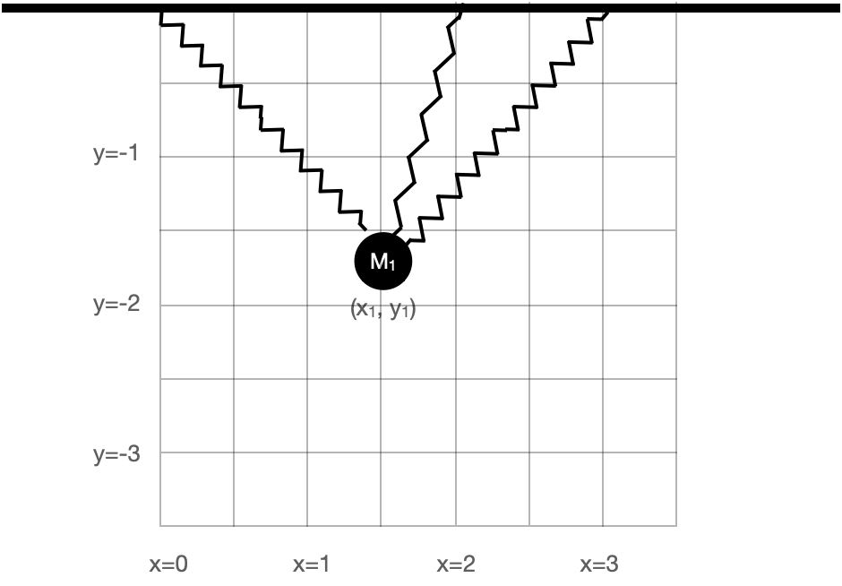

# Opimization and constraint

In Chapter `r Chaps$optimization` we introduced some basic concepts and terms relating to optimization: the ***objective function***, that is, the quantity that is to be made as large as possible (maximization) or as small as possible (minimization), depending on context; ***argmin*** and ***argmax*** values, that is, the value of the inputs to the objective function that produce the optimal output; and the ***max*** and ***min***, the output value of the objective function when the input is an argmax or argmin respectively. 

A simple optimization problem has three main phases:

i. a modeling phase in which the objective function is identified or constructed;
ii. a solution phase where argmin or argmax inputs are found.
iii. an evaluation phase where the objective function is applied to the argmin and/or argmax, and the result interpreted in terms of the real-world task at hand. 

To illustrate, we'll draw on a chestnut found in hundreds of calculus texts, finding the configuration to construct the rectangular box with the largest possible volume out of a piece of cardboard. The **modeling phase** starts with a representation of the box-construction and volume-finding process. Suppose, for the sake of simplicity, that we are working with a piece of cardboard fixed at 20 inches by 30 inches. For box construction, we'll propose cutting out squares from each corner of the box of some side length $x$. Those squares will be discarded and the box formed by folding up the flaps generated by the squares' removal, as in Figure \@ref(fig:box-folding).


```{r box-folding, echo=FALSE, out.width="40%", fig.align="center", fig.cap="Cardboard for forming the simple box."}
knitr::include_graphics("www/cardboard-box.png")
```

For the volume of the box, we'll multiply the area of the bottom of the box by the height $x$. Examination of Figure \@ref(fig:box-folding) should be enough to convince you that the volume $V$ is a function of $x$:

$$V(x) = x\cdot (20-2x)\cdot(30-2x) =  x(600 - 100 x + 4 x^2)\ .$$
Since the goal is to find the maximum possible volume, $V(x)$ is our objective function.

The **solution phase** can be adequately accomplished by drawing a graph of $V(x)$ and finding the $x$ corresponding to the peak value of $V(x)$. We'll leave this for you to do in a sandbox; you can figure out the relevant domain by noting that the corner squares cannot overlap.

Another, more classical solution method is to examine $\partial_x V(x)$ and solve for $x^\star$ such that $\partial_x V(x^\star) = 0$. Confirm for yourself that
$$\partial_x V(x) = 600 - 200 x + 12 x^2\ ,$$ This will be zero for $x^\star$ giving $600 - 200 x^\star + 12 \left[x^\star\right]^2 = 0$, which equation will be satisfied, as you can confirm with the quadratic equation at two values: when $x_1^\star = 3.92$ or $x_2^\star = 12.74$.

The **evaluation phase** can start with plugging in the objective function the values of $x^\star$.

$$V(x_1^\star) = 1056.3\ \text{in}^3 \ \ \ \ \text{and}\ \ \ \ V(x_2^\star) = -315.6\ \text{in}^3$$
It's common sense that $x_2^\star$ is not a viable solution. The negative volume at $x_2^\star$ is a consequence of looking at $V(x)$ beyond the sensible domain for cardboard boxes. More generally, as part of the evaluation phase we can look at the value of the convexity $\partial_{xx} V(x^\star)$ to find out whether an $x^\star$ value is an argmax or an argmin. Since $\partial_{xx} V(x) = 24 x - 200$ we see that $\partial_{xx} V(x_1^\star) < 0$, corresponding to an argmax, while $\partial_{xx} V(x_2^\star) > 0$ which corresponds to an argmin.  Alternatively, instead of computing the convexity, we could check whether we have an argmin or an argmax by evaluating the objective function at a *nearby* input. 

The evaluation phase ought also to produce an indication of how sensitive the output is to small changes of the input near the argmax (or argmin). For example, setting $x=4$ in will produce a volume output $V(4) = 1056$ in^2^, hardly different than the "exact" maximum of 1056.3 in^3^ and perhaps preferred for the person who wants to make standard-size boxes.

It's also good for the evaluation phase to include a reflection on how well the model reflects the real-world situation. For example we've neglected the creases that arise from folding cardboard, so a more complete examination would estimate this effect. And the person skeptical about calculus-book chestnuts might wonder whether the object is really to create a box without a top!

Optimization problems analogous to this example do sometimes come up in applied work. More commonly, however, optimization problems involve much more complicated objective functions with many inputs. The next section considers the basis for a more general and practical approach to the solving phase of optimization. Later sections examine how this more general approach leads to methods for approaching the sort of real-world optimization problem where there are multiple objectives.

## Gradient descent

The general approach we will take to the solving phase of optimization problems will be ***iterative*** as in Chapter \@ref(operations). Start with an initial guess for an argmin and then construct a new function that can improve the guess. Applying this improvement function iteratively leads to better and better estimates of the true argmin. 

For illustration purposes, we'll use optimization problems where the objective function has two inputs. Such objective functions can be graphed with, say, a contour plot and it's possible to see the action of the iterative improvement process directly. The idea of iterative improvement also applies to optimization problems with many inputs even though the action can't be seen graphically.

::: {.takenote data-latex=""}
**Spring-mass systems: an example context**

As a context for for talking about optimization, we'll consider how to use optimization to calculate the configuration of simple mechanical systems consisting of interconnected springs and masses. Such configuration problems are especially important today in understanding the structure and function of proteins, a task beyond the scope of this book.

Figure \@ref(fig:spring-mass1) shows a mechanical system consisting of a mass suspended from a fixed mounting by three nonlinear springs.

```{r spring-mass1, echo=FALSE, out.width="50%", fig.cap="A mass suspended from two springs."}

```
The masses is shown by a black circles. Springs are the zig-zag shapes. The bold bar is the fixed mounting, as if from a beam on the ceiling of a room. The system has an equilibrium configuration where the springs are stressed sufficiently to balance each other left to right and to balance the gravitational force downward on the mass. 

We want to calculate the equilibrium position. The basic strategy is to model the potential energy of the system, which consists of i. the gravitational potential energy of the mass; ii. the energy stored in stretched or compressed springs. Since the configuration of the system is set by the coordinate $(x_1, y_2)$, the potential energy is a function $E(x_1, y_1)$. For brevity, we'll leave out the physics of the formulation of the potential-energy function; shown in Figure \@ref(fig:spring-mass1-pot).

```{r spring-mass1-pot, echo=FALSE, fig.cap="The potential energy of the spring-mass system in Figure \\@ref(fig:spring-mass2)."}
# E2 <- makeFun(abs(x)^2.7 + abs(y)^2.7 - 1 + abs(x - 2)^1.5 + abs(y)^1.5 - 1 + 9.8 *y + abs(x-3)^3 + abs(y)^3 - 1 ~ x & y)
contour_plot(Zcalc::SM_2_potential(x, y) ~ x & y, domain(x=0:3, y=-3:0),
              skip=0, contours_at=c(30,20, 15, 10, 5, 0, -2, -3)) %>%
  gf_refine(coord_fixed())
```
The potential energy has a bowl-like shape. The bottom of the bowl---the argmin---is near $(x=1.7, y-=1.3)$. In terms of Figure \@ref(fig:spring-mass1), the equilibrium position is a bit upward and to the right of the position shown in the figure.

With a graph of the objective function like Figure \@ref(fig:spring-mass1-pot), the solution phase is simple. But for more complicated objective functions, with more than 2 inputs, the graph would not be feasible. For example, in the spring-mass system shown in Figure \@ref(fig:spring-mass-3), the potential energy function has six inputs: $x_1, y_2, x_2, y_2, x_3, y_3$. In genuine applications of optimization, there are often many more inputs. 

```{r spring-mass-3, echo=FALSE, out.width="50%", fig.cap="A more complicated spring-mass system."}
knitr::include_graphics("www/spring-mass3.png")

```

In a multi-input optimization problem, we don't have a picture of the whole objective function. Instead, we are able to ***evaluate*** the objective function for a single given input at a time. For instance, we have a computer function that implements the objective function and we're free to evaluate it at whatever inputs we care to choose. It's as if, instead of having the whole graph available, the graph is covered with an opaque sheet with a loophole, as in Figure \@ref(fig:loophole).

```{r loophole, echo=FALSE, fig.align="center", fig.cap="A more realistic view of what we can know about a function."}
knitr::include_graphics("www/loophole.png")
```
We can see the function only in a small region of the domain and need to use the information provided there to determine which way to move to find the argmin. 

The situation is analogous to standing on the side of a smooth hill in a dense fog and finding your way to the bottom. The way forward is to figure out which direction is uphill, which you can do directly from your sense of balance and proprioception by orienting your stance in different ways. Then, if your goal is the top of the hill (argmax) start walking uphill. If you seek a low point (argmin), walk downhill.

The mathematical equivalent to sensing which direction is uphill is to calculate the ***gradient*** of the objective function. In Chapter `r Chaps$gradient` we used partial differentiation with respect to each of the input quantities to assemble the gradient vector, denoted $\nabla f() = \left({\large \strut} \partial_x f(), \ \partial_y f()\right)$. In terms of Figure \@ref(fig:loophole), where we are standing at about $(x_i=0.8, y_i=-2.3)$, we would evaluate the each of the partial derivatives in the gradient vector at $(0.8, -2.3)$. 

The gradient points in the steepest direction uphill so, once you know the direction, take a step in that direction to head toward the argmax, or a step in the opposite direction if you seek the argmin. The process of following the gradient toward the top of the hill is called ***gradient ascent***. Correspondingly, following the gradient downhill is ***gradient descent***.

```{r loopwhole-gradient, echo=FALSE, fig.cap="The gradient provides information about the shape of the local function in a convenient form to guide the step to the next locale in your journey toward the argmin or argmax."}
# gradient_plot(SM_2_potential(x, y) ~ x & y, domain(x=0:3, y=-3:0), alpha=1, color="black") %>%
#  gf_refine(coord_fixed())
# the mask is in figures2.key
knitr::include_graphics("www/loophole-gradient.png")
```

For humans, the length of a step is fixed by the length of our legs and the size of our feet. The mathematical step has no fixed size. Often, the modeler gains some appreciation for what constitutes a small step from the modeling process. Referring to Figure \@ref(fig:spring-mass-3) for example you can see that a small increment in $x$ is, say, $0.1$, and similarly for $y$. There is little point in taking an infinitesimal step---that gets you almost nowhere! Instead, be bold and take a finite step. Then, at your new location, calculate the gradient vector again. If it's practically the same as at your earlier position, you can wager on taking a larger step next time. If the new gradient direction is substantially different, you would be well advised to take smaller steps.

Fortunately, a variety of effective ideas for determining step size have been implemented in software and packaged up as algorithms. The modeler need only provide the objective function in a suitable form and providing a starting position or domain for the search. 

::: {.rmosaic data-latex=""}
The R/mosaic function `argM()` is set up to find argmins and argmaxes using the familiar tilde-formula/domain style of arguments used throughout this book. For instance, the potential energy of the spring-mass system shown in Figure \@ref(fig:spring-mass1) is available as `Zcalc::SM_2_potential()`


```{r}
argM(SM_2_potential(x, y) ~ x & y, domain(x=0:3, y=-3:0))
```
:::

::: {.example data-latex=""}
Example with the more complicated spring-mass system.

1. Just show the argM solution
2. Trace the steps using `optim()` with `control=list(trace=1), method="CG"`
:::

MOVE THE FOLLOWING ELSEWHERE.


As examples of optimization 
One important real-world optimization problem stems from the world of molecular biology. Organisms consist in part of a large number of differently shaped proteins that interact with their environment to carry out various biological processes. For example, the COVID-19 virus has a protein in the shape of a spike whose detailed shape is well suited to attaching to another protein found in the membranes of some human cells. By attaching in this way, COVID-19 is able to pass through the cell membrane and infect the cell. Knowing the shape of the spike program can be important to developing drugs that can protect the human cells. With genetic technology, a primary aspect of the structure of the protein can be read directly from the COVID-19 RNA sequence. The optimization problem is to figure out the shape of the spike protein from the amino-acid sequence that the  Many vaccines nowadays involve proteins specifically designed to attach to and disable some part of a virus that is critical to infection. To keep the story short, technology today allows scientists to specify a protein Proteins are polymers of amino acids linked as if they were beads on a necklace. The protein can be specified as a sequence of named amino acids, which can be translated into a DNA sequence of the  long strands. 
Our strategy for presenting techniques for optimization will be to start with problems that have two input variables. For such problems, it's possible to graph the objective function and you can watch iterative solution techniques as they approach the solution. Such problems 
To illustrate techniques for the solving phase of optimization problems with multiple inputs, we'll use two examples from physics that can straightforwardly be made 

Theory and visualization

::: {.rmosaic data-latex=""}
Numerics of optimization


:::

Examples


## Constraints

1. Intro: tin can and cardboard box
1. constraint curves vs constraint functions
2. normal and tangent direction along constraint curve
3. walk along constraint.

## Constraint cost

Shadow prices and lagrange multipliers

## Multiple constraints

Optional 
