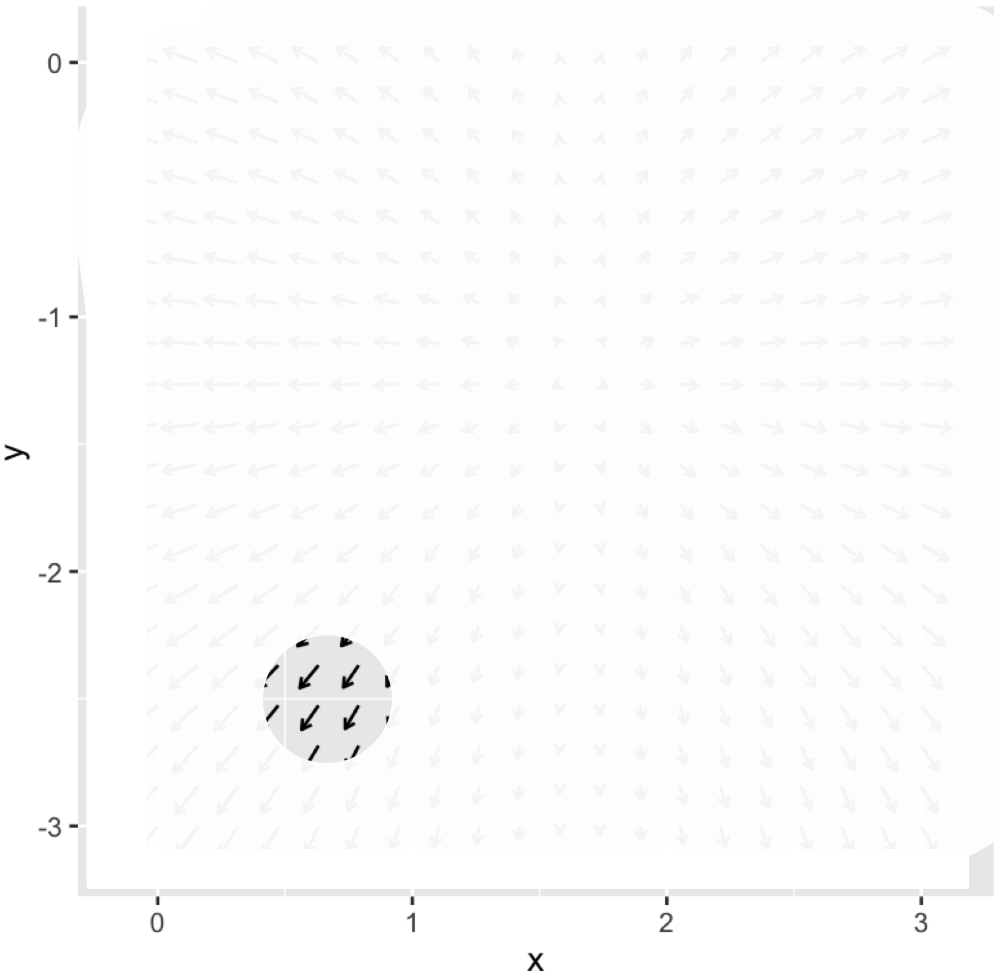

# Optimization and constraint {#optimization-and-constraint}

In Chapter `r Chaps$optimization` we introduced some basic concepts and terms relating to optimization: the ***objective function***, that is, the quantity that is to be made as large as possible (maximization) or as small as possible (minimization), depending on context; ***argmin*** and ***argmax*** values, that is, the value of the inputs to the objective function that produce the optimal output; and the ***max*** and ***min***, the output value of the objective function when the input is an argmax or argmin respectively. 

A simple optimization problem has three main phases:

i. a modeling phase in which the objective function is identified or constructed;
ii. a solution phase where argmin or argmax inputs are found.
iii. an evaluation phase where the objective function is applied to the argmin and/or argmax, and the result interpreted in terms of the real-world task at hand. 

To illustrate, we'll draw on a chestnut found in hundreds of calculus texts, finding the configuration to construct the rectangular box with the largest possible volume out of a piece of cardboard. The **modeling phase** starts with a representation of the box-construction and volume-finding process. Suppose, for the sake of simplicity, that we are working with a piece of cardboard fixed at 20 inches by 30 inches. For box construction, we'll propose cutting out squares from each corner of the box of some side length $x$. Those squares will be discarded and the box formed by folding up the flaps generated by the squares' removal, as in Figure \@ref(fig:box-folding).


```{r box-folding, echo=FALSE, out.width="40%", fig.align="center", fig.cap="Cardboard for forming the simple box."}
knitr::include_graphics("www/cardboard-box.png")
```

For the volume of the box, we'll multiply the area of the bottom of the box by the height $x$. Examination of Figure \@ref(fig:box-folding) should be enough to convince you that the volume $V$ is a function of $x$:

$$V(x) = x\cdot (20-2x)\cdot(30-2x) =  x(600 - 100 x + 4 x^2)\ .$$
Since the goal is to find the maximum possible volume, $V(x)$ is our objective function.

The **solution phase** can be adequately accomplished by drawing a graph of $V(x)$ and finding the $x$ corresponding to the peak value of $V(x)$. We'll leave this for you to do in a sandbox; you can figure out the relevant domain by noting that the corner squares cannot overlap.

Another, more classical solution method is to examine $\partial_x V(x)$ and solve for $x^\star$ such that $\partial_x V(x^\star) = 0$. Confirm for yourself that
$$\partial_x V(x) = 600 - 200 x + 12 x^2\ ,$$ This will be zero for $x^\star$ giving $600 - 200 x^\star + 12 \left[x^\star\right]^2 = 0$, which equation will be satisfied, as you can confirm with the quadratic equation at two values: when $x_1^\star = 3.92$ or $x_2^\star = 12.74$.

The **evaluation phase** can start with plugging in the objective function the values of $x^\star$.

$$V(x_1^\star) = 1056.3\ \text{in}^3 \ \ \ \ \text{and}\ \ \ \ V(x_2^\star) = -315.6\ \text{in}^3$$
It's common sense that $x_2^\star$ is not a viable solution. The negative volume at $x_2^\star$ is a consequence of looking at $V(x)$ beyond the sensible domain for cardboard boxes. More generally, as part of the evaluation phase we can look at the value of the convexity $\partial_{xx} V(x^\star)$ to find out whether an $x^\star$ value is an argmax or an argmin. Since $\partial_{xx} V(x) = 24 x - 200$ we see that $\partial_{xx} V(x_1^\star) < 0$, corresponding to an argmax, while $\partial_{xx} V(x_2^\star) > 0$ which corresponds to an argmin.  Alternatively, instead of computing the convexity, we could check whether we have an argmin or an argmax by evaluating the objective function at a *nearby* input. 

The evaluation phase ought also to produce an indication of how sensitive the output is to small changes of the input near the argmax (or argmin). For example, setting $x=4$ in will produce a volume output $V(4) = 1056$ in^2^, hardly different than the "exact" maximum of 1056.3 in^3^ and perhaps preferred for the person who wants to make standard-size boxes.

The evaluation phase should also include a reflection on how well the model reflects the real-world situation. For example we've neglected the creases that arise from folding cardboard, so a more complete examination would estimate this effect. And the person skeptical about calculus-book chestnuts might wonder whether the object is really to create a box without a top!

Optimization problems analogous to this example do sometimes come up in applied work. More commonly, however, optimization problems involve much more complicated objective functions with many inputs. The next section considers the basis for a more general and practical approach to the solving phase of optimization. Later sections examine how this more general approach leads to methods for approaching the sort of real-world optimization problem where there are multiple objectives.

## Gradient descent

The general approach we will take to the solving phase of optimization problems will be ***iterative*** as in Chapter \@ref(operations). Start with an initial guess for an argmin and then construct a new function that can improve the guess. Applying this improvement function iteratively leads to better and better estimates of the true argmin. 

For illustration purposes, we'll use optimization problems where the objective function has two inputs. Such objective functions can be graphed with, say, a contour plot and it's possible to see the action of the iterative improvement process directly. The idea of iterative improvement also applies to optimization problems with many inputs even though the action can't be seen graphically.

::: {.takenote data-latex=""}
**Spring-mass systems: an example context**

As a context for for talking about optimization, we'll consider how to use optimization to calculate the configuration of simple mechanical systems consisting of interconnected springs and masses. Such configuration problems are especially important today in understanding the structure and function of proteins, but we will stick to the simpler context of springs and masses.
:::

Figure \@ref(fig:spring-mass1) shows a mechanical system consisting of a mass suspended from a fixed mounting by three nonlinear springs.

```{r spring-mass1, echo=FALSE, out.width="50%", fig.cap="A mass suspended from two springs."}
knitr::include_graphics("www/spring-mass2.png")
```
The masses is shown by a black circles. Springs are the zig-zag shapes. The bold bar is the fixed mounting, as if from a beam on the ceiling of a room. The system has an equilibrium configuration where the springs are stressed sufficiently to balance each other left to right and to balance the gravitational force downward on the mass. 

We want to calculate the equilibrium position. The basic strategy is to model the potential energy of the system, which consists of i. the gravitational potential energy of the mass; ii. the energy stored in stretched or compressed springs. Since the configuration of the system is set by the coordinate $(x_1, y_2)$, the potential energy is a function $E(x_1, y_1)$. For brevity, we'll leave out the physics of the formulation of the potential-energy function; shown in Figure \@ref(fig:spring-mass1-pot).

```{r spring-mass1-pot, echo=FALSE, fig.cap="The potential energy of the spring-mass system in Figure \\@ref(fig:spring-mass2)."}
# E2 <- makeFun(abs(x)^2.7 + abs(y)^2.7 - 1 + abs(x - 2)^1.5 + abs(y)^1.5 - 1 + 9.8 *y + abs(x-3)^3 + abs(y)^3 - 1 ~ x & y)
contour_plot(Zcalc::SM_2_potential(x, y) ~ x & y, domain(x=0:3, y=-3:0),
              skip=0, contours_at=c(30,20, 15, 10, 5, 0, -2, -3)) %>%
  gf_refine(coord_fixed())
```
The potential energy has a bowl-like shape. The bottom of the bowl---the argmin---is near $(x=1.7, y-=1.3)$. In terms of Figure \@ref(fig:spring-mass1), the equilibrium position is a bit upward and to the right of the position shown in the figure.

With a graph of the objective function like Figure \@ref(fig:spring-mass1-pot), the solution phase is simple. But for more complicated objective functions, with more than 2 inputs, the graph would not be feasible. For example, in the spring-mass system shown in Figure \@ref(fig:spring-mass-3), the potential energy function has six inputs: $x_1, y_2, x_2, y_2, x_3, y_3$. In genuine applications of optimization, there are often many more inputs. 

```{r spring-mass-3, echo=FALSE, out.width="50%", fig.cap="A more complicated spring-mass system."}
knitr::include_graphics("www/spring-mass3.png")
```

In a multi-input optimization problem, we don't have a picture of the whole objective function. Instead, we are able to ***evaluate*** the objective function for a single given input at a time. For instance, we have a computer function that implements the objective function and we're free to evaluate it at whatever inputs we care to choose. It's as if, instead of having the whole graph available, the graph is covered with an opaque sheet with a loophole, as in Figure \@ref(fig:loophole).

```{r loophole, echo=FALSE, fig.align="center", fig.cap="A more realistic view of what we can know about a function."}
knitr::include_graphics("www/loophole.png")
```
We can see the function only in a small region of the domain and need to use the information provided there to determine which way to move to find the argmin. 

The situation is analogous to standing on the side of a smooth hill in a dense fog and finding your way to the bottom. The way forward is to figure out which direction is uphill, which you can do directly from your sense of balance and proprioception by orienting your stance in different ways. Then, if your goal is the top of the hill (argmax) start walking uphill. If you seek a low point (argmin), walk downhill.

The mathematical equivalent to sensing which direction is uphill is to calculate the ***gradient*** of the objective function. In Chapter `r Chaps$gradient` we used partial differentiation with respect to each of the input quantities to assemble the gradient vector, denoted $\nabla f() = \left({\large \strut} \partial_x f(), \ \partial_y f()\right)$. In terms of Figure \@ref(fig:loophole), where we are standing at about $(x_i=0.8, y_i=-2.3)$, we would evaluate the each of the partial derivatives in the gradient vector at $(0.8, -2.3)$. 

The gradient points in the steepest direction uphill so, once you know the direction, take a step in that direction to head toward the argmax, or a step in the opposite direction if you seek the argmin. The process of following the gradient toward the top of the hill is called ***gradient ascent***. Correspondingly, following the gradient downhill is ***gradient descent***.

```{r loopwhole-gradient, echo=FALSE, fig.cap="The gradient provides information about the shape of the local function in a convenient form to guide the step to the next locale in your journey toward the argmin or argmax."}
# gradient_plot(SM_2_potential(x, y) ~ x & y, domain(x=0:3, y=-3:0), alpha=1, color="black") %>%
#  gf_refine(coord_fixed())
# the mask is in figures2.key

```

For humans, the length of a step is fixed by the length of our legs and the size of our feet. The mathematical step has no fixed size. Often, the modeler gains some appreciation for what constitutes a small step from the modeling process. Referring to Figure \@ref(fig:spring-mass-3) for example you can see that a small increment in $x$ is, say, $0.1$, and similarly for $y$. There is little point in taking an infinitesimal step---that gets you almost nowhere! Instead, be bold and take a finite step. Then, at your new location, calculate the gradient vector again. If it's practically the same as at your earlier position, you can wager on taking a larger step next time. If the new gradient direction is substantially different, you would be well advised to take smaller steps.

Fortunately, a variety of effective ideas for determining step size have been implemented in software and packaged up as algorithms. The modeler need only provide the objective function in a suitable form and providing a starting position or domain for the search. 

::: {.rmosaic data-latex=""}
The R/mosaic function `argM()` is set up to find argmins and argmaxes using the familiar tilde-formula/domain style of arguments used throughout this book. For instance, the potential energy of the spring-mass system shown in Figure \@ref(fig:spring-mass1) is available as `Zcalc::SM_2_potential()`


```{r}
argM(SM_2_potential(x, y) ~ x & y, domain(x=0:3, y=-3:0))
```
:::

::: {.intheworld data-latex=""}
Optimization using symbolic techniques is often found in textbooks as part of the derivation of textbook formulas. The symbolic techniques are especially appropriate because they allow parameters to be represented with symbols rather than as specific numbers. Usually the objective functions involved are simple.

Numerical techniques are the most widely used in practice. Optimization is an important operation in both science and management and much human ingenuity has gone into the development of effective algorithms. The modeler rarely if ever needs to reach beyond the software provided in technical computing environments such as R, MATLAB, Mathematica, or the many packages available for Python.

In data science and machine learning, increasingly software is provided as web services and APIs (application programming interfaces) such as [TensorFlow](https://www.tensorflow.org/) for the particular machine technique called "deep learning."

In using such software systems, the modeler needs to understand the structure of the arguments handed off to the systems. It's also important to be able to test whether you have structured those arguments appropriately to represent your intentions. This often involves some level of debugging and the incremental development of objective functions so that you can verify correct performance on a simple version of the objective function before adding more detail and repeating the cycle of verify-then-add-more-detail.

As a simple example of support for such debugging, we'll examine a basic R function, `optim()`, for carrying out optimization. You can see the documentation for `optim()` by giving the command `?optim` in a sandbox. You'll likely find it hard to follow at first and using such functions requires a deeper understanding of R programming than needed in this book. (The R/mosaic `argM()` function makes use of `optim()` internally, surrounding it with an interface using tilde expressions and domains.) To illustrate, Figure \@ref(fig:trace-spring-mass-2) traces the sequence of ascent steps followed by `optim()` in working toward the argmin of `SM_2_potential()`.

```{r message=FALSE, warning=FALSE, echo=FALSE}
obj_fun <- vector_arg(SM_2_potential)
out <- capture.output(
  results <- optim(c(0,0), obj_fun,
                 control=list(trace=1, REPORT=3), method="CG")
)
lines <- grep("parameters", out)
arg_lines <- outer(seq_len(lines[2] - lines[1] - 1) - 1, lines, "+")
arg_msg <- gsub("parameters", "", out[arg_lines])
steps <- as_tibble(matrix(scan(text = arg_msg), ncol = 2, byrow = TRUE)) %>%
  mutate(rpw = as.character(row_number()-1))
names(steps) <- c("x", "y", "row")
Plot1 <- 
  gf_point(y ~ x, data = steps[1:6,], inherit=FALSE, color="blue") %>%
  gf_path(y ~ x, data = steps[1:6,], color="blue") %>%
  gf_text(y ~ x, data = steps[1:6,], label=~row, 
          inherit=FALSE, color="blue", hjust=-1.2) %>%
  gradient_plot(SM_2_potential(x, y) ~ x & y, 
                domain(x=0:3, y=-3:0), alpha=1, color="black") %>%
  gf_refine(coord_fixed())

Plot2 <- 
  gf_point(y ~ x, data = steps[6:11,], inherit=FALSE, color="blue") %>%
  gf_path(y ~ x, data = steps[6:11,], color="blue") %>%
  gf_text(y ~ x, data = steps[6:11,], label=~row, inherit=FALSE, color="blue", hjust=1.2) %>%
  gradient_plot(SM_2_potential(x, y) ~ x & y, 
                domain(x=1.65:1.656, y=-1.216:-1.20), 
                alpha=1, color="black", npts=10) %>%
  gf_refine(coord_fixed())
Plot3 <- 
  gf_point(y ~ x, data = steps[8:13,], inherit=FALSE, color="blue") %>%
  gf_path(y ~ x, data = steps[8:13,], color="blue") %>%
  gf_text(y ~ x, data = steps[8:13,], label=~row, inherit=FALSE, color="blue", hjust=1.2) %>%
  gradient_plot(SM_2_potential(x, y) ~ x & y, 
                domain(x=1.651:1.652, y=-1.2131:-1.2117), 
                alpha=1, color="black", npts=10) %>%
  gf_refine(coord_fixed())
```


```{r SM2-path, echo=FALSE, fig.show="keep", fig.cap="The path followed by `optim()` in descending the gradient, starting at (0,0). Successive steps are numbered."}
Plot1 
gridExtra::grid.arrange(Plot2, Plot3, nrow=1)
```

Starting at the initial guess, $(x_0, y_0) = (0,0)$ the algorithm takes a step of length about 1.5 to the east-south-east. The gradient at point $(x_1, y_1)$ is discernibly different than at $(x_0, y_0)$; the algorithm follows the new gradient vector but with a shorter step length. At $(x_2, y_2)$ there has been a more severe change in the gradient, so the angle takes an even shorter step to the point labeled 3.

The bottom two graphs zoom in on the gradient field for later steps. The most dramatic changes in direction are at $(x_6, y_6)$ and $(x_9, y_9)$. As the gradient vector gets shorter, so do the step sizes, terminating when the step size is insignificant.
:::

::: {.example data-latex=""}
The potential energy function of the spring-mass system in Figure\@ref(fig:spring-mass3) is available as the function `Zcalc::SM_3_potential()`. We can use `argM()` to to find the argmin:

```{r}
argM(SM_3_potential(x1, y1, x2, y2, x3, y3) ~ x1 & y1 & x2 & y2 & x3 & y3, 
     domain(x1 = 0:3, y1=-3:0, x2=0:3, y2=-3:0, x3=0:3, y3=-3:0))
```
Figure \@ref(fig:SM3-equilibrium) shows the argmin translated into the graphical format.

```{r SM3-equilibrium, echo=FALSE, fig.cap="The equilibrium configuration of the spring-mass system from Figure \\@ref(fig:spring-mass3)."}

```

Admittedly, the tilde-expression/domain interface to `argM()` is becoming ungainly with six inputs. In professional work, a different programming format based on vectors is used. We won't need that for our simple examples.
:::

## Objectives and Constraints

Many real-world optimization problems do not fit neatly into the framework of constructing an objective function and then finding the argmin (or argmax). A common situation is having multiple objectives and, often, the original problem statement does not include all of the objectives. When such missing objectives become apparent, it's necessary to visit the modeling phase of the problem to insert the new objective. By adopting the right approach to modeling, such situations can be readily handled and, even better, the modeling phase can bring new insight into the real-world problem.

We'll illustrate by returning to the mathematically simplified problem of constructing an optimal cardboard box. Before, we stipulated that the raw cardboard stock has dimension 20 inches by 30 inches. Now we'll generalize, and work with a piece of cardboard that has edges of length $y$ and from which, as before, we'll cut out square corners of length $x$ on a side. Our objective is to make a box with the largest possible volume. (This will be an **argmax** problem.)

The area of the bottom of the box is $(y - 2x)^2$ and the box height is $x$. The objective function is the volume of the box, area times height:
$$V(x, y) \equiv x (y - 2x)^2\ .$$ There are two inputs, $x$ and $y$, so a simple plot should suffice to find the argmax.

```{r box2, echo=FALSE, fig.cap="The volume of the box (in cubic inches) constructed by cutting corners of size $x$-by$x$ out of a $y$-by-$y$ piece of cardboard."}
V <- makeFun(x*(y-2*x)^2 ~ x & y)
P1 <- contour_plot(V(x,y) ~ y & x, domain(y=0:30,x=0:10),
             contours_at = c(10,20, 50,100,200,300,500,700, 1000, 1500,2000, 2500, 3000),
             skip=0)
P1
```
Scanning Figure \@ref(fig:box2) reveals a couple of things that you might not have anticipated. First, the argmax is in the extreme upper-left corner of the graphics frame, not in the center as in previous examples. Second, the argmax in this corner, $(y=0, x=10)$ is logically inconsistent with the idea of a cardboard box.

The logical inconsistency stems from an inadmissible value for $x$. For $2x > y$, the bottom of the box would have negative edge length. Multiplying the two negative edge lengths to calculate the area produces a positive area, but this is not a realistic calculation. 

To make the calculation realistic, we should look at the situation only in that region of the graphics frame where $y > 2x$. This restriction is called an ***inequality constraint***.

```{r box2b, echo=FALSE, fig.cap="The inequality constraint that $y > 2x$ renders much of the graphics frame inadmissible as a possible solution. The inadmissible region is shaded in blue. The argmax must be sought in the unshaded region of the frame."}
P1 %>%  inequality_constraint(y > 2*x ~ y + x, domain(y=0:30,x=0:10), 
                              alpha=0.75, npts=200)
```

With the $(x,y)$-domain restricted to the values that are physically realistic, we can see that the argmax is still on the edge of the frame, at $y=30$ and $x\approx 5$, where the volume of the box will be about 1800 in^3^. This result should cause you pause, since there was nothing in the problem statement that limited $y$ to be 30" or less. If we replotted with a larger domain for $y$, we should see still larger boxes, without any limit.

Essentially, the interpretation of the problem as originally posed is that, with enough cardboard we can make a box of any size! That's not so useful. The fault in the problem statement is that it omitted another objective function: use as little cardboard as possible. But if that were our sole objective, we would make a zero-volume box out of zero-area of cardboard. What we want, somehow, is to make as big a box as possible out of as little cardboard as possible: we have two objectives! In this case, the objectives are in conflict: making a bigger box (good) uses more cardboard (bad). 

Common sense tells us to balance the two objectives, but how to represent this mathematically? Ideally, we would know how much box-volume is worth to us and how much cardboard costs, and we could construct an objective function that incorporates both value and cost. If you have the information to do this, then go ahead. For instance, if each cubic inch of volume is worth 1 cent, and each square inch of cardboard costs 3 cents, then the objective function will be the following (with output in cents):

$$\text{Profit}(x,y) \equiv 10\, \sqrt{x (y-2x)^2} - 0.3 y^2$$
```{r total-cost, echo=FALSE, fig.cap="The \"profit\" (value minus cost) of the cardboad box (cents)."}
box_P2 <- contour_plot(10*sqrt(x*(y-2*x)^2) - 0.3 * y^2 ~ y & x, domain(y=10:60, x=5:15),
             contours_at=c(-200,-100,-50,0,50, 100,150,200,210), skip=0) %>% 
  inequality_constraint(y > 2*x ~ y + x, domain(y=10:60,x=5:15), 
                              alpha=0.75, npts=200) 
box_P2
```

The Profit() function has an argmax at about $y=45, x=7.5$. The value of the Profit() function at this argmax is a bit greater than 210 cents.

One problem with constructing objective functions like Profit() is finding appropriate value and cost. Typically, it requires a market and the ability to buy and sell to set a value, but for a little company designing a box there's unlikely to be such a mechanism. In a realistic modeling setting, the challenge is to convince the decision makers that the model function is right, something it can be hard to do without good evidence.

But let's imagine a new factor coming into play. At the meeting where the box-design decisions are being made and where you are presenting your analysis in Figure \@ref(fig:total-cost), the graphic designer speaks up. "The trending shape for this year is cubic. We want the box, whatever it's size, to be a cube."

Luckily, you the modeler can quickly incorporate this into your analysis. To be a cube, the height $x$ of the box has to be the same as the width and depth $y - 2x$. So you can incorporate the designer's wish into the model of the decision factors by adding a new constraint:

$$x = y - 2x \ \ \ \implies y-3x=0\ \ \ \ \text{constraint: box must be cubic}$$
This is called an ***equality constraint***. Figure \@ref(fig:cube-total-cost) shows the equality constraint in green: to be a cube, $x$ and $y$ must be somewhere along the green line.

```{r cube-total-cost, echo=FALSE, fig.cap="An equality constraint calling for the box to be cube-shaped.", warning=FALSE, message=FALSE}
box_P2 %>%
  equality_constraint(y - 3*x ~ y & x, domain(y=10:60,x=5:15), alpha=.5, fill="green", npts=300)
```

There happens to be something remarkable about the be-a-cube constraint. It runs practically parallel to the 50 cent contour of the profit function. If you look carefully, you can see that the highest profit along the green constraint occurs about $y=25$, but the differences in profit along the constraint are mainly trivial for $y < 35$ or thereabouts. This means that the profit function does not show a clear preference for one size box instead of another, pick any $y < 35$ and look up the corresponding $x$ that falls on the green constraint.


::: {.intheworld data-latex=""}

Many organizations use a budget mechanism to manage their affairs. The organization defines divisions or projects, and each of these is given a dollar budget to stay within. The individual division or project manager can arrange things more or less as she thinks best, so long as she stays within the budget. This is a kind of constraint: a ***budget constraint***.

Suppose you have been tasked to set up a new factory and given a budget of $5,500,000 to do so. You were given this task because you have a particular expertise in how best to set up the factory, but your design will of course depend on the relative prices of the different inputs to the production process. For simplicity, let's imagine that there are two main inputs: labor $L$ and capital/equipment $K$. It would be silly to spend all the budget on labor and none on capital; the workers would have no tools to work with. Similarly, capital without labor has no productive value. The best design for the factory will be a mix of labor and capital.

Since the purpose of the factory is to make things for sale, a good objective function will be the sales value of the output produced by the factory. Economists have a favored form for production functions of this sort, called a power-law called the ***Cobb-Douglas*** function. The essential insight behind the Cobb-Douglas function is that doubling **both** capital and labor (as if you built a second factory alongside the first) should double production. The Cobb-Douglas form for production as a function of capital and labor is $$Q(L, K) = p b L^a K^{1-a}\ .$$ You will use your expertise to set the values of the $a$ and $b$ parameters. The price $p$ of each unit of output will be set by the market: Let's assume for planning purposes that it's $450 per unit. Suppose you have determined that $a=0.3$ and $b=40$ are appropriate. Then the production function will be as shown in Figure \@ref(fig:cobb-doug1).

```{r cobb-doug1, echo=FALSE, fig.cap="A Cobb-Douglas production function with $p=100$, $b=40$ and $a=0.3$. (Output units in dollars)."}
P <- makeFun(p*b*(L^a)*(K^(1-a)) ~ K & L, a=0.3, p=450, b =40)
Plot1 <- contour_plot(P(L, K) ~ L & K, domain(L=300:1000, K=50:250), skip=0)
Plot1
```
As you can see from Figure \@ref(fig:cobb-doug1), the more labor and the more capital you use, the higher the production. Notice that the production function itself does not have an argmax interior to the domain being plotted. It's one of those "more is better" situations.

Suppose that labor, in person-months costs $6000 per unit. Capital, in units of production stations, costs $13,000 per unit. Your budget constraint reflects the total cost of capital and labor: $4000 \cdot L + 15000 \cdot K \leq 5500000$. This constraint is graphed in Figure \@ref(fig:cobb-doug2).

```{r cobb-doug2, echo=FALSE, fig.cap="The production function with the budget constraint shown in green."}
Plot1 %>%
  inequality_constraint(6000*L + 13000*K <= 5500000 ~ L & K, fill="green",
                      domain(L=300:1000, K=50:250), alpha=0.6, npts=250)
```
Any mixture of labor and capital that falls outside the green zone stays within your budget. What's the best mixture? The one that gives the largest production. You can read this off the graph, $L\approx 650$ and $K\approx 125$. Notice that near the argmax, the contours of the production function are parallel to the boundary of the constraint zone. A good way to think about this is to walk along the boundary of the constraint zone from top to bottom. As you start near $K=250$ and $L=380$, the path you walk goes *uphill* in terms of the production function. The path continues uphill until you reach the argmax. Near the argmax, the path is level. After the path crosses the argmax, it is leading downhill. Near the argmax, the production function contours are parallel to the constraint boundary because, as at argmaxes generally, the objective function is flat near the argmax. With the constraint boundary crossing the slope, the argmax means that the path is locally level even though it slopes up and down on either side of the path.
:::


## Constraint cost

In the previous section, the graphic designer's request that the box be cubic was translated into an equality constraint, $y-3x=0$, shown as the green line in Figure \@ref(fig:cube-total-cost). The skilled modeler can bring additional power to the analysis by translating that *constraint*, $y-3x=0$ into a *function*, for example 
$$\text{Equation:}\ \  \ y - 3x = 0\ \ \longrightarrow\ \ \ \text{Function:}\ \ \text{cube_box}(x, y) = -\| y - 3x\|\ .$$ 
Any $(x^+, y^+)$ that produces $\text{cube_box}(x^+, y^+) = 0$ is a pair that satisfies the constraint. In other words, the equality constraint amounts to the zero contour of the cube_box() function.

Translating the constraint into a function changes "the box must be a cube" into "better if the box is a cube." Thus, cube_box() becomes an objective function that has an argmax when the box is a cube. Instead of having the single objective function Profit() and a constraint ("cube-shaped box"), we have **two** objective functions. 

The constraint-to-function translated situation is shown in Figure \@ref(fig:profit-cube):

```{r profit-cube, echo=FALSE, fig.cap="The two objective functions, Profit() and cube_box(), that are to be optimized simultaneously. The cube_box() function is shown with green contours, with the heavy green line being the contour at cube_box(x,y)=0.", warning=FALSE, message=FALSE}
box_P2 %>%
  contour_plot(-abs(y-3*x) ~ y & x, label_color="green", contour_color="green", filled=FALSE, 
               contours_at = -c(5,10,15,20,30)) %>%
  gf_abline(intercept=~ 0, slope=~ 1/3, color="green", size=3, alpha=0.7)
```

The optimization problem now becomes finding a way to maximize both objectives simultaneously, that is, picking an $(x^\star, y^\star)$ that makes the value of both objectives as good as possible. Unfortunately, increasing the $Profit()$ of the box can be achieved at the cost of *decreasing* the value of cube_box() function; the two objectives are in ***conflict***. 

Admittedly, Figure \@ref(fig:profit-cube) is graphically busy and hard to read. You can start by picking a point in the middle of the graphics frame and reading out, from the appropriate contours, the output value of the Profit() function and the output value of the cube_box() function. 

Earlier, we saw that if restricted to inputs on the contour cube_box(x,y) = 0, the optimal output value of Profit() is about 50 units. Now we have a broader picture. For instance, suppose we allow a "little" deviation in box shape from a cube, say, cube_box(x,y) = -5. If we allowed this, the value of the Profit() function could be increased from 50 to about 115 cents.

Whether the 65 cent increase value justifies the deviation from a cube measured as $cube_box(x,y) = -5$ is worthwhile is a matter of judgement. It's obvious, of course that a loss of 5 is justified by a gain of 65, but remember that the 65 has units of *cents* whereas the -5 is in some kind of abstract "cube points." We don't have an immediate way to translate "cube points" into cents. The two different units are said to be ***incommensurate***, meaning that they can't be directly compared. Nonetheless, we now have a basis for a conversation. It might go like this:

Modeler to Designer: *I realize that from your perspective, a cube is the optimal shape for the box.*

Designer: *Right. Cubes are in fashion this year. Last year it was the Golden Ratio.*

Modeler: *It might sound surprising, but we find that so long as you are close to the optimal, it doesn't much matter if you are exactly on it. How close to a perfect cube would be good enough?*

Designer: *What's really important is that the box be perceived as a cube in our sales material. I think that most customers would think "cube" so long as the edge lengths are within about 15% of one another.*

Modeler: *That's very helpful. Let me re-make the graphic showing the percent deviation from cubeness. Then we can see how much extra box Profit() we can get by allowing 10% deviation.*

```{r echo=FALSE, out.width="50%", fig.align="center", warning=FALSE, message=FALSE}
percent <- makeFun(100*(1 - x/(y-2*x)) ~ x + y)
contour_plot(10*sqrt(x*(y-2*x)^2) - 0.3 * y^2 ~ y & x, domain(y=25:30, x=7:10),
             skip=0, contours_at=c(40,50,60,70,80,90,100)) %>%
  contour_plot(percent(x,y) ~ y & x, label_color="green", contour_color="green", filled=FALSE, contours_at=c(-20, -10,0,10,20, 30, 40, 50), skip=FALSE, domain(y=25:29, x=7:10)) %>%
  gf_abline(intercept=~ 0, slope=~ 1/3, color="green", size=3, alpha=0.7)
```

Modeler: *A 10% deviation lets us get to a higher Profit(): from 50 cents to 65 cents per box.*

Product manager: *How about a 30% deviation? That let's us get up to about 100 cents.*

Designer: *But it would make the box shaped almost like a brick. Bricks are so 1990s!*

Modeler: *It sounds like a 15% deviation would be about right.*

Posing the problem as the optimization of two objective functions, rather than an objective and a constraint, allows such conversations to be held. 

Let's return to a previous example about determining optimal levels of labor and capital in a factory. In that example, the objective function was the money value of the product produced. There was also a budget constraint. In translating the budget constraint into a function, we can call the function expenditure(K, L), with the constraint amounting to saying that the expenditure must be at a certain level: expenditure(K, L) = $5,500,000 in the example.

To see check whether it's worthwhile to stick to the constraint, we can plot both the production function and the expenditure function together.

```{r cobb-doug-redux, echo=FALSE, fig.cap="The production function (magenta, curved lines) and the expenditure function (brown, straight lines). Contour labels are in millions of dollars. We've drawn contours at levels that happen to be tangent to the expenditure contours.", warning=FALSE, message=FALSE}
contour_plot(P(L, K)/1e6 ~ L & K, domain(L=300:1000, K=50:250), skip=0,
             contours_at=c(4.5,5.1,5.8, 6.5, 7.1, 7.7, 8.4, 9.1, 9.7, 10.4), contour_color="magenta") %>%
  contour_plot((6000*L + 13000*K)/1e6 ~ L & K, contour_color="brown", 
               contours_at=c(3, 3.5, 4, 4.5, 5, 5.5, 6, 6.5, 7, 7.5, 8, 8.5, 9), labels=FALSE, filled=FALSE) %>%
  contour_plot((6000*L + 13000*K)/1e6 ~ L & K, contour_color="brown", 
               contours_at=c(3, 3.5, 4, 4.5, 5, 5.5, 6, 6.5, 7, 7.5, 8, 8.5, 9), 
               domain(L=300:1000, K=200:250), skip=0, filled=FALSE)
```

With the production function and budget constraint, the optimum was exactly on the $5.5 M expenditure line; the argmax for production is just about where the label 7.1 is in Figure \@ref(fig:cobb-douglas-redux). That is, the maximum production consistent with the budget is $7.1 M.  Translating the budget *constraint* into an expenditure *function* reveals some other possible choices. For instance, if the budget were expanded to $6.5 M, the production level would reach $8.4 M. 

That an increase in budget of $1 M produces an increase in production worth $1.3 M (that is, 8.4- 7.1) sounds like a good argument for increasing the budget. But higher management may have even better uses for that $1 M expenditure, perhaps in some other product line or in research and development.

It's helpful to present the increase in the objective function output that can be had by relaxing the budget constraint as a ratio. In this case, the ratio is 1.3/1.0. This ratio is often called the ***Lagrange multiplier***. Some economists have a more evocative name for it, the ***shadow price*** of the constraint. Thus, the constraint-to-function translation provides a way to put a cost on the constraint, which can be a reasonable way to determine the value of something when there is no direct market for it. 

An important example of a shadow price comes in the setting of life-saving interventions. For example, increasing spending on highway safety can save lives. If $7.5 billion in increased expenditures saves 1000 lives, the shadow price is $7.5 M per life. People who mis-interpret the constraint-to-function methodology often think that it's craven to put a money value on life. In reality, the method merely reveals the money value on life implicit in decisions such as budget allocations. Knowing that the shadow price is $7.5 M does not say what the value of life *should be*. But it provides a mechanism for comparing different uses for the money. For instance, if the shadow price for increased regulation of toxic industrial chemicals is $11.3 M per life, the relative shadow prices provide an indication that budget money might reasonably be shifted from chemical regulation to highway safety. Economists and epidemiologists who undertake such calculations reveal that the mixture of spending on different life-preserving interventions is far from optimal.

::: {.takenote data-latex=""}
Generations of calculus students have been taught a method of mathematical optimization in the presence of constraints that involves positing a ***Lagrange multiplier***, typically written as $\lambda$, and carrying out a series of differentiations followed by equation solving to find an argmax, which simultaneously provides a numerical value for $\lambda$. It's easier to understand the motivation behind this by considering the gradient of the objective function and the gradient of the constraint function. If the goal is, say, to maximize production and simultaneously minimize expenditures, we would want to walk up the production gradient and down the expenditure gradient. 

Figure \@ref(fig:cobb-doug-grad) shows two gradient fields, one for the production function in the factory-design example and one for expenditure. (The negative of the expenditure gradient is shown, since the goal is to keep expenditures small.)

```{r cobb-doug-grad, echo=FALSE, fig.cap="The production and expenditure functions displayed as gradient fields. Expenditure is brown, production is magenta."}
P <- makeFun(p*b*(L^a)*(K^(1-a)) ~ K & L, a=0.3, p=450, b =40)
Gplot1 <- gradient_plot(P(L, K) ~ L & K, domain(L=300:600, K=50:250), color="magenta", alpha=1, npts=10)
Gplot1 %>% gradient_plot(-(6000*L + 13000*K) ~ L & K, color="brown", alpha=.8, npts=10) %>%
  gf_text(250 ~ 300, label="(a)") %>%
  gf_text(100 ~ 450, label="(b)") %>%
  gf_refine(coord_fixed())
```
At each point in the graphics frame, the two gradient vectors form an angle. For example, near the point labeled (a) the angle is roughly 140 degrees, while near (b) the angle is 180 degrees.

Any value of $K$ and $L$ where the angle is less than 180 degrees is ***sub-optimal*** or ***dominated*** by some other choice of $K$ and $L$. For instance, near label (a), you could improve both production and expenditures by moving to the southeast. When the angle is 180 degrees, the objective and constraint functions are in complete opposition to one another; any movement in favor of one comes at the cost in the other.

## Exercises

`r insert_calcZ_exercise("XX.XX", "QXWRP8", "Exercises/ape-choose-closet.Rmd")`

`r insert_calcZ_exercise("XX.XX", "rG11sg", "Exercises/rat-find-magnet.Rmd")`

`r insert_calcZ_exercise("XX.XX", "LiJkK2", "Exercises/cat-show-mug.Rmd")`

`r insert_calcZ_exercise("XX.XX", "2ZoCl8", "Exercises/dolphin-hang-sheet.Rmd")`

`r insert_calcZ_exercise("XX.XX", "Mi2Ub1", "Exercises/zebra-find-dish.Rmd")`

`r insert_calcZ_exercise("XX.XX", "W11rG9", "Exercises/panda-go-kayak.Rmd")`

`r insert_calcZ_exercise("XX.XX", "B7rG9", "Exercises/panda-go-kayak2.Rmd")`

`r insert_calcZ_exercise("XX.XX", "h05BsT", "Exercises/crow-trim-laundry.Rmd")`

`r insert_calcZ_exercise("XX.XX", "VHn3UG", "Exercises/snake-walk-knife.Rmd")`

`r insert_calcZ_exercise("XX.XX", "Yb6tVr", "Exercises/duck-tell-laundry.Rmd")`


