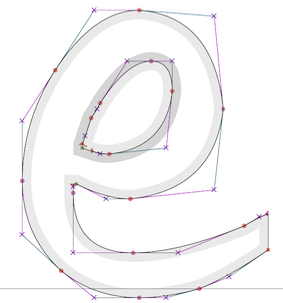

# Data-driven functions

**Objectives**

* Functions for curves in space
* Recognize interpolation as the process of building a continuous function that connects a series of $(x, y)$ data points.
* Understand the standard types of functions constructed to interpolate data points.
* Be able to characterize the smoothness of those different types of function.

```{r echo = FALSE}
Stations <- tibble::tribble(
  ~ x, ~ y,
  496, 1109,
  1037, 1162,
  1251,1109,
  1226,889,
  902,564,
  1034,432,
  1197,648,
  1389,459,
  1170,245,
  521,325,
  327,541,
  277, 948,
  492,731,
  710,811,
  928,868,
  737,1060
) %>%
  mutate(t=row_number(), y=1300-y) %>%
  select(t, x, y)

xf <- spliner(x ~ t, data = Stations)
yf <- spliner(y ~ t, data = Stations)
t <- seq(1,16,length=1000)
Path <- tibble(x = xf(t), y = yf(t))
gf_path(y ~ x, data = Path)
```


Need to explain how to trace out this curve: add in a new variable to index the position on the curve.

A major theme of this course is the selection and construction of functions. We started the course by introducing a small set of basic modeling functions that generations of experience has shown to be good models in a wide variety of circumstances. We introduced methods to derive new functions from the basic modeling ones: linear combinations, inversion, differentiation, integration. Low-order polynomial functions are useful for expressing general modeling ideas such as growth, interaction, and optimality. 

As early as Chapter 3 of this book, we noted that a function can be described as a table where each row stands for one set of input values together with a corresponding output value. We did not, however, make much use of the table-as-function concept. Instead, we used data tables to motivate the choice of parameters, generally in linear combinations of the basic modeling functions. We called this ***function fitting***, an important topic we will elaborate on in Block 5 where we'll introduce new tools for treating functions as geometrical objects. 

This chapter introduces yet another important method for constructing functions that match with data. What's different here from function fitting is that we do not consider the data as a "cloud" of points that we want our eventual function to stay close to. Today, each data point will be a **mandate**; the function is required to go through each and every point exactly.

## Generating smooth motion

As a motivating example, consider the programming of robotic arms as in the video:

<iframe width="560" height="315" src="https://www.youtube.com/embed/0L7Xk5_s3QQ?start=81" title="Robotic arms" frameborder="0" allow="accelerometer; autoplay; clipboard-write; encrypted-media; gyroscope; picture-in-picture" allowfullscreen></iframe>

This isn't a robots course, so we'll simplify. The arm has a resting position. When a car frame comes into place, the arm moves so that it's welding electrodes are at a specific, known place in space near the car body. Then it moves in sequence to other places where a weld is using and eventually back to its resting position.

The problem of converting the discrete list of weld and helper points into a continuous signal for the actuator is an instance of a mathematical process called **interpolation**. In real robot arms, there are multiple joints that need to be controlled simultaneously. For our illustration, we'll use a simple setup where the robot hand rolls along a set of rails in the y-direction and another x-rail running crosswise to the y direction.

```{r echo=FALSE, out.width="50%", fig.align="center"}
knitr::include_graphics("www/x-y-cnc.png")
```


The task for our example robot will be to visit the points shown in Figure \@ref(fig:robot-points) in order, taking 15 seconds to traverse the whole path.

```{r robot-points, echo=FALSE, fig.cap="The stations on a path the robot hand is supposed to follow. All the action is taking place in roughly 1x1 meter area."}
nudges <- rep(40, 16)
nudges[c(3,12)] <- -40
gf_path(y ~ x, data = Stations, size = 2) %>%
  gf_point(y ~ x, size=8, color="orange", alpha=.5) %>%
  gf_text(y ~ x, label= ~ t, nudge_y=nudges) %>%
  gf_refine(coord_fixed()) %>%
  gf_labs(x="x (mm)", y="y (mm)")
```
The trajectory of the robot arm consists of two functions, $x(t)$ and $y(t)$. Our starting representation is as a table:

```{r}
head(Loop)
```

The $x(t)$ and $y(t)$ functions in this table aren't complete enough to operate the robot. We need to provide the $x,y$-location data in the form of a **continuous** two functions of $t$ so that the robot, at any time $t$, can look up where it is supposed to be.

One strategy is to construct the functions as piecewise linear functions of $t$, like this:

```{r piecewise-linear-path,echo=FALSE}
xl <- mosaic::connector(x ~ t, data = Stations)
yl <- mosaic::connector(y ~ t, data = Stations)
P1 <- slice_plot(xl(t) ~ t, domain(t=1:16), npts=500) %>% gf_labs(y="x position", x="")
P2 <- slice_plot(yl(t) ~ t, domain(t=1:16), npts=500) %>% gf_labs(y="y position", x = "t (time)")
gridExtra::grid.arrange(P1, P2, nrow=2)
```
It can be difficult to see the relationship between the $x(t)$ and $y(t)$ functions and the path shown in \@ref(fig:robot-points). You might want to follow the path with your finger, focusing on the series of $x$-coordinates to confirm that the $x(t)$ function reproduces the path.

The function shown in \@ref(fig:piecewise-linear-path) is an example of an ***interpolating function***. You're entitled to think of the $x(t)$ function as connecting with lines the sequence of $x$ versus $t$ coordinates from the table. Each of the two functions is clearly continuous. But you have a richer set of concepts for interpreting those two functions.

For instance, let's look at $\partial_t x(t)$. Since $x$ is a position along the cross rail, $\partial_t x(t)$ is the velocity in that direction. Figure \@ref(fig:x-velocity) shows the velocity versus time for both the $x$ and $y$ components of the movement.

```{r x-velocity, echo=FALSE}
dt_xl <- D(xl(t) ~ t)
dt_yl <- D(yl(t) ~ t)
P1 <- slice_plot(dt_xl(t) ~ t, domain(t=1:16), npts=901, singularities = 1:16) %>% 
  gf_labs(y="x velocity (mm/s)", x="")
P2 <- slice_plot(dt_yl(t) ~ t, domain(t=1:16), npts=901,, singularities = 1:16) %>%
  gf_labs(y="y velocity (mm/s)", x = "t (time)")
gridExtra::grid.arrange(P1, P2, nrow=2)
```
The speed of the robot arm maxes out at about 400 mm-per-second. You can get a sense for this by moving your finger along the length of a piece of paper in 1 second; it's a normal human speed of movement.


Since the original $x(t)$ and $y(t)$ functions are piecewise linear, it makes sense that the derivatives with respect to time are piecewise constant. But the robot hand is a physical thing; it has to have a velocity at every instant in time. It can't instantaneously have an undefined velocity. 

Think about what it is that causes the change from one velocity step to another. There's a motor that's spinning and changing it's rate of spin, perhaps using a pulley and a belt to more the robot hand to the right position at any instant of time. Changing the velocity requires a **force** to create an acceleration. We can differentiate the velocity to see what the acceleration must be to create the simple piecewise linear function shown in Figure \@ref(fig:piecewise-linear-path).

```{r x-acceleration, echo=FALSE}
ddt_xl <- D(xl(t) ~ t & t, .hstep=0.1)
ddt_yl <- D(yl(t) ~ t & t, .hstep=0.1)
P1 <- slice_plot(ddt_xl(t) ~ t, domain(t=1:16), npts=901) %>% gf_labs(y="x acceleration (mm/s^2)", x="")
P2 <- slice_plot(ddt_yl(t) ~ t, domain(t=1:16), npts=901) %>%
  gf_labs(y="y acceleration (mm/s^2)", x = "t (time)")
gridExtra::grid.arrange(P1, P2, nrow=2)
```

Mathematically, the second derivatives $\partial_{tt} x(t)$ and $\partial_{tt} y(t)$ do not exist, because $\partial_{t} x(t)$ and $\partial_{t} y(t)$ are discontinuous. There is no physical amount of force that will change the velocity in an instant. 

As an accommodation to the physical existence of the robot hand, we've softened the transition between consecutive velocity segments to allow it to take 0.2 seconds, ramping up from zero force 0.1 second before the hand reaches the station, to maximum force at the station, then back down to zero 0.1 second after the hand reaches the station. Consequently the actual motion is smoother and the maximum acceleration is about half that of gravity. Figure \@ref(fig:ramp-force) shows the resulting trajectory which can be likened to that of a baseball player rounding a base.

```{r ramp-force, echo=FALSE, fig.cap="A smoothed x-trajectory near station 2. The position of the station is marked with a dot."}
vx <- antiD(ddt_xl(t) ~ t)
xx <- antiD(vx(t) ~ t)
slice_plot(xx(t) + 500 ~ t, domain(t=1.9:2.1)) %>% 
  gf_point(x ~ t, data = Stations[2,])
```

A consequence of smoothing the trajectory is that the robot hand comes near, but doesn't actually touch the station. It misses by about 2 mm. For many human tasks that might be good enough, but for precision manufacturing a miss by 2 mm is about 1000 times more than allowed.

If you like working with practical problems, you might find a simple solution to the problem. For instance, we could have aimed the robot hand 2 mm further to the right than the actual station. In falling short by 2mm, the hand would miss the target but cross right over the originally intended station. 

But we already have the ingredients we need to find an proper mathematical solution that keeps relatively small the forces involved in steering the robot but takes it exactly where it needs to go.

## Piecewise but smooth

The approach we will take to smoothly connect the points on the path is based on ideas of derivatives and on the construction of low-order polynomials.  In Block 2, we emphasized low-order polynomials up to the square term, and we'll pick that up again here for demonstration purposes.

Suppose our task is to find a function to interpolate the discrete points in Figure \@ref(fig:quadratic-spline). The discrete points are called ***knots***^[Called such possibly because the curves are tied together at each of the knots.] in the language of interpolating functions. 

A piecewise linear interpolating function is easily constructed and is shown as a dotted curve, but that has a discontinuous first derivative. We would like something smoother, that has a **continuous** first derivative. A curve such as the one we seek is shown as the multi-colored function.

```{r quadratic-spline, echo=FALSE, fig.cap="Two piecewise interpolating functions of the four discrete points (orange). One is piecewise linear (dotted curve), the other is piecewise quadratic (multi-color curve)."}
Pts <- tibble(
  x = 1:4,
  y = c(0, 2, 0.5, 1.7)
)
quad_spline <- function(free = 0, data = Pts) {
  M <- rbind(
    cbind(1, 0, 0, 1, 0, 0),
    cbind(0, 1, 0, 0, 1, 0),
    cbind(0, 0, 1, 0, 0, 1),
    cbind(1,-1, 0, 2, 0, 0),
    cbind(0, 1,-1, 0, 2, 0),
    cbind(0, 0, 1, 0, 0, 2)
  ) 
  b <- cbind(c(Pts$y[2:4] - Pts$y[1:3], c(0, 0, free)))
  x <- qr.solve(M, b)
  p1 <- makeFun(a1 + b1*(x-1) + c1*(x-1)^2 ~ x,
                b1 = x[1], c1 = x[4])
  p2 <- makeFun(a2 + b2*(x-2) + c2*(x-2)^2 ~ x,
                b2 = x[2], c2 = x[5])
  p3 <- makeFun(a3 + b3*(x-3) + c3*(x-3)^2 ~ x,
                b3 = x[3], c3 = x[6])
  
  makeFun(ifelse(x < 2, p1(x),
                    ifelse(x < 3, p2(x), p3(x))) ~ x)
}
f <- quad_spline(0, data=Pts)


gf_point(y ~ x, data = Pts, 
         color="orange", size=6, alpha=0.5) %>%
  gf_line(y ~ x, color="black", linetype="dotted") %>%
  gf_labs(y = "f(x)") %>%
  slice_plot(f(x) ~ x, domain(x=1:2)) %>%
  slice_plot(f(x) ~ x, domain(x=2:3), color="red") %>%
  slice_plot(f(x) ~ x, domain(x=3:4), color="blue")
```

The framework we will adopt for the smooth interpolating function is piecewise quadratic segments between adjacent knots. There are four knots, requiring three segments. We'll call the segment $p_1(x)$ connecting the first knot to the second, with $p_2(x)$ connecting the second to the third knot and $p_3(x)$ connecting the third to the fourth knot. Each of those segments will be a second-order polynomial. To keep things organized, we'll use coefficient names systematically:

$$p_1(x) \equiv a_1 + b_1 \left[x - x_1\right] + c_1 \left[x - x_1\right]^2\\
p_2(x) \equiv a_2 + b_2 \left[x - x_1\right] + c_2 \left[x - x_1\right]^2\\
p_3(x) \equiv a_3 + b_3 \left[x - x_1\right] + c_3 \left[x - x_1\right]^2\\$$
The four knots are
$$\left[\begin{array}{c}\left(x_1, y_1\right)\\
\left(x_2, y_2\right)\\
\left(x_3, y_3\right)\\
\left(x_4, y_4\right)\\
\end{array}\right]$$ which you can think of as two columns of a data frame, one with the $x$-coordinates of the knots and the other with the $y$-coordinates.

Constructing the interpolating function is a matter of making good choices for $a_1$, $a_2$, $a_3$, $b_1$, $b_2$, $b_3$, $c_1$, $c_2$, and $c_3$.

We require these things of the interpolating function:

1. It passes exactly through each of the knots.
2. At the interior knots where two polynomials join, the left-hand polynomial and the right-hand polynomial should exactly match both the function value and the derivative (with respect to $x$). Thus, the function we want to build will be $C^1$, that is, have a continuous first derivative.

How to accomplish (1) and (2)?

Notice first that the way we wrote down the polynomials, the values are $$p_1(x_1) = a_1 = y_1\\p_2(x_2) = a_2 = y_2\\p_3(x_3) = a_3 = y_3\\$$
A good start! We already know three of the coefficients from the condition that the left end of each segment match the left knot point for that segment.

We can find other coefficients by imposing the conditions that the right side of each segment pass through the knot on that side. This gives:

$$p_1(x_2) = y_2 = a_1 + b_1 \left[x_2-x_1\right] + c_1\left[x_2-x_1\right]^2\\
p_2(x_c) = y_3 = a_2 + b_2 \left[x_3-x_2\right] + c_2\left[x_3-x_2\right]^2\\
p_3(x_c) = y_4 = a_3 + b_3 \left[x_4-x_3\right] + c_3\left[x_4-x_3\right]^2$$ (Notice that $x_2 - x_1$ and the like are simply numbers that can be computed from the known knot points.)

Another two conditions are that the derivatives of the polynomials from either side of each interior knot point must match at the knot point. Finding the derivatives of the segments is a simple exercise:

$$\partial_x p_1(x) = b_1 + 2 c_1 \left[x - x_1\right]\\
\partial_x p_1(x) = b_2 + 2 c_2 \left[x - x_2\right]\\
\partial_x p_1(x) = b_3 + 2 c_3 \left[x - x_3\right]$$
Matching them up at the $x2$ and $x_3$ knot points---the interior knots where two segments come together---gives two more equations:
$$b_1 + 2 c_1 \left[x_2 - x_1\right] = b_2\\
b_2 + 2 c_2 \left[x_3 - x_2\right] = b_3$$
All together, we have **five** equations in **six** unknowns: $b_1, b_2, b_3$ and $c_1, c_2, c_3$.

This is not the place to go into the details of solving the equations to find the unknowns. (Block 5 introduces the mathematics of such things, which turns out to the came math used to find model parameters to "fit" data.)
But there are some simple things to say about the task. 

First, you may recall from high-school mathematics being told that to find six unknown you need six equations. We have only five equations to work with. But it is far from true that there is no solution for six unknowns with five equations; there are in fact an infinite number of solutions. (Again, Block 5 will show the mathematics behind this statement.) Essentially, all we need to do is make up a sixth equation to identify a particular one of the infinite number of solutions. It's nice if this made-up equation reflects something interpretable about the curve. 

We'll choose to have the sixth equation specify what the derivative of the interpolating function should be at the far right end of the graph. That right-most derivative value will be $$\partial_x p_3(x_4) = b_3 + 2 c_3 \left[x_4 - x_3\right]\ .$$
We can set this value to anything we like. For instance, in Figure \@ref(fig:quadratic-spline) the right-most derivative is set to zero; you can see this from the curve being flat at the right-most knot point.


```{r four-quads, echo=FALSE, fig.cap="For different $C^1$ piecewise quadratic functions that interpolate the knot points. Each has a unique value of the derivative at the right end of the domain."}
free_slopes <- c(-5, -1, 2, 5)
P <- list()
for (k in 1:4) {
  f <- quad_spline(free_slopes[k], data = Pts)
  P[[k]] <- slice_plot(f(x) ~ x, domain(x=1:2)) %>%
  slice_plot(f(x) ~ x, domain(x=2:3), color="red") %>%
  slice_plot(f(x) ~ x, domain(x=3:4), color="blue") %>%
  gf_point(y ~ x, data = Pts, color="orange", size=4, alpha=0.5) %>%
    gf_lims(y=c(-1.5,4.5))
}
gridExtra::grid.arrange(P[[1]], P[[2]], P[[3]], P[[4]], nrow=2)
```

## Bezier splines

Each point on the curve is associated with a control point. So each segment is specified by four points, two of which will be on the segment (at the endpoints) and two that generally will not be.

$\left[\begin{array}{c}x_0\\y_0\end{array}\right]$

$$\left[\begin{array}{c}x(t)\\y(t)\end{array}\right]  \equiv \left[1-t\right]^3 \left[\begin{array}{c}x_0\\y_0\end{array}\right] +
3\left[1-t\right]^2 t \left[\begin{array}{c}x_1\\y_1\end{array}\right] +
3\left[1-t\right] t^2 \left[\begin{array}{c}x_2\\y_2\end{array}\right] +
t^3 \left[\begin{array}{c}x_3\\y_3\end{array}\right] $$

```{r}
Pts <- tibble(
  x = c(1,5),
  y = c(0,0),
  xc = c(1.5, 2),
  yc = c(3, 0)
)

bezier <- function(Pts, npts=100) {
  p0 <- Pts[1,1:2] %>% as.numeric()
  p1 <- Pts[1,3:4] %>% as.numeric()
  p3 <- Pts[2,1:2] %>% as.numeric()
  p2 <- Pts[2,3:4] %>% as.numeric()
  t <- seq(0,1,length=npts)
  B <- outer((1-t)^3, p0) +
    3*outer((1-t)^2 * t, p1) +
    3*outer((1-t)*t^2, p2) +
    outer(t^3, p3) %>% 
    as_tibble()
  names(B) <- names(Pts)[1:2]
  
  B
}

foo <- bezier(Pts)
gf_path(y ~ x, data = foo) %>%
  gf_point(y ~ x, data = Pts, color="orange", size=2) %>%
  gf_point(yc ~ xc, data = Pts, color = "red", size=2) %>%
  gf_segment(y + yc ~ x + xc, data = Pts, linetype="dotted") %>%
  gf_refine(coord_fixed())
```


Another example ... In [computer-aided design](https://en.wikipedia.org/wiki/Computer-aided_design) (CAD) systems, curved shapes are usually described by a person's placement of isolated points which are then automatically combined into a smooth form. For instance, the outline of a letter in a computer font is often specified by a series of knot points with specified levels of smoothness (or lack thereof), as in this construction of a lower-case "e".



Humans have a natural ability to generate smooth movements. In drawing, there can be artistic value in a lack of smoothness, as illustrated in celebrated artist David Hockney's drawing of his mother. 

```{r echo=FALSE, fig.align="center", out.width="70%"}

```

[Source](https://www.tate.org.uk/art/images/work/T/T11/T11897_10.jpg)

Before the era of digital design and manufacturing, smooth curves were described by clay or wooden models hand-crafted by skilled workers. Material was removed to conform to the models by machine tools directed by cams running over the models, by hand sanding and polishing, as shown in this video of propeller manufacture during World War II.

<iframe width="560" height="315" src="https://www.youtube.com/embed/BwU9quwgYRo?start=190" title="YouTube video player" frameborder="0" allow="accelerometer; autoplay; clipboard-write; encrypted-media; gyroscope; picture-in-picture" allowfullscreen></iframe>

Spline functions and digital actuators have largely replaced such analog models.


## Data and interpolation

There are often occasions when we measure a continuous process at discrete points in time and space. In this section, we're going to explore the data Johannes Kepler (1571-1630) used in discovering and formulating his famous theory of planets in elliptical orbits. For about half the year, other planets are on the opposite side of the Sun from Earth, and so not directly observable. 

Here is a graph of Kepler's calculations of the distance of Mars from the Sun. (See "Background" section at the bottom of the page.) The sandbox makes a somewhat intricate plot, so read carefully the following:

* There are 28 observations in Kepler's data. The plot shows all of them as gray dots. 
* A handful of the 28 have been selected for emphasis: the big black dots.
* The interpolating functions have been made only with respect to the handful; the others are entirely made up.
* The cubic spline interpolant is drawn in black, the global polynomial in tan.

::: {.sandbox}
```{r}
Observations <- Kepler %>% sample_n(size=6) %>%
    select(time, kepler.angle, kepler.radius)
connector <- spliner(kepler.radius ~ kepler.angle, 
                     data = Observations)
polynomial <- makeFun(lm(kepler.radius ~ poly(kepler.angle, 2), 
                         data = Observations))
gf_point(kepler.radius ~ kepler.angle, 
         data = Kepler, alpha=0.25) %>%
gf_point(kepler.radius ~ kepler.angle, 
         data = Observations, size=3) %>%
  slice_plot(connector(kepler.angle) ~ kepler.angle) %>%
  slice_plot(polynomial(kepler.angle) ~ kepler.angle, color="orange3") 
```
:::


The black curve in the graphic drawn by the sandbox is a "cubic spline" interpolating function. Remember that the spline was constructed referencing **only** the selected points drawn as large dots. The other points from Kepler's data are there only to show how well the interpolant provides a match

```{r di2-1, echo=FALSE, results="markup"}
askMC(
  "Does the spline go through the selected points?",
  "+Yes, right through the middle of the big dots.+",
  "Pretty close, but tangent to the edge of the dots.",
  "Exactly through some, but not others.",
  "Exactly through the ones in the middle of the domain, but not so well through the ones at the extremes."
)
```

The tan curve in the graphic is a "global" polynomial. Here, "global" means "the same polynomial at all points in the domain."

```{r di2-2, echo=FALSE, results="markup"}
askMC(
  "To judge from the shape of the polynomial, what is the order of the polynomial? (Make sure the sandbox is reset to the original code before you form your answer.)",
  "Fries and a chocolate shake" = "Just kidding.",
  0, 1, "+2+" = "Right, it's a downward facing parabola.", 3, 4, 5, 6, random_answer_order = FALSE
)
``` 

```{r di2-3, echo=FALSE, results="markup"}
askMC(
  "Does the global polynomial go through the selected points?",
  "Yes, through all of them.",
  "It runs tangent to the dots.",
  "+It misses almost all of them.+" = "The polynomial needn't run through any of the data points. That it goes through one here is just a coincidence."
)
```

The 2nd-order polynomial is **not** a function that interpolates these data. This is simply because the six selected data points do not lie on a parabola. 

```{r di2-4, echo=FALSE, results="markup"}
askMC(
  "The six selected points used to construct the spline and the parabola were selected at random. When you rerun the code, a new random sample will be used. Repeatedly run the code to get some idea of the amount of random variation. This will help you see whether the spline method always constructs an interpolating function and whether the 2nd-order polynomial ever gives an interpolating function for these data.  
  
Which of these is true as you look at different samples of data?",
  "+The cubic spline *always* goes through all the data points but the global, 2nd-order polynomial *hardly ever* goes exactly through all of them.+",
  "The cubic spline *often but not always* goes exactly through all the data points but the global, 2nd-order polynomial *sometimes but not often* goes through all of them."
)
```
Actually, it's possible to get a global polynomial to act as an interpolating function. The problem we've had is with the 2nd-order polynomial. By increasing the order of the polynomial you can make it go closer and closer to the data points. At some order, the global polynomial will go exactly through the selected points.

Change the order of the polynomial used by changing the integer argument in `poly(kepler.angle, 2)`. If you make the integer too large, you'll get an error message. If you make the integer too small, the global polynomial won't go exactly through the data. 

```{r di2-5, echo=FALSE, results="markup"}
askMC(
  "What order of polynomial *always* goes exactly through the six selected points.",
  3, 4, "+5+", 6, 7, 
  random_answer_order = FALSE
)
```

Let's try making functions based on more data. To do this, in the `sample_n()` function change the argument `n`. For instance, `n=10` will select ten instead of the default six points. 

```{r di2-6, echo=FALSE, results="markup"}
askMC(
  "What order of polynomial *always* goes exactly through 10 randomly selected points. Try several different random samples of data.",
  6, 7, 8, "+9+", 10,  
  random_answer_order = FALSE
)
```

The global polynomial is a linear combination of power-law functions, e.g. $$p(x) = a_0 + a_1 x + a_2 x^2 + \cdots$$

The R function `lm()`, which we used last semester, finds the particular coefficients $a_0, a_1, \ldots$ to best match the polynomial to the data. But we could do the same thing by using any other functions we like, e.g. $\sqrt{x}$, $e^x$, $\sin(x/1.2)$, and so on.

A consequence of this is that we always have an infinite number of different interpolating functions. Which one to choose? In the next sections we'll explore the properties which so often make the cubic spline the preferred method.

Another question is whether we should use any interpolating function in the first place. Perhaps "getting close" to the data is good enough? This is the difference between *interpolating* data and *smoothing* data. The answer to the question, "interpolate or smooth," depends on the modeling context for which the function is being constructed. Smoothing is based on statistical ideas that we don't have time to cover in this course, but a core skill of expert modelers is to know when to use interpolation and when to use smoothing. 


**Background** (Optional): The raw measurements (not included here) that Kepler used in his calculation were made by Tycho Brahe (1546-1601). Those raw measurements were of the angle of Mars with respect to Earth. Kepler estimated the orbital period of Mars to be 687 Earth days. (The current accepted value is 686.980 days.) Knowing the period, Kepler could find pairs of Earth days separated by multiples of the period. In each pair, the Earth would be in a different position, but Mars would be in the same position. Thus the distance of Mars from Earth could be estimated by triangulation.

The angle was not directly measured for each occasion. Instead, knowing the radius versus time Kepler was able to discern when Mars was at its greatest and closest distance to the Sun. The angle tells where Mars is along its orbit. An angle of 0 is the position when Mars is closest to the Sun. An angle of 3.14 is when Mars is farthest from the Sun.

The `time` is time of the observation given as an interval in Earth days from 8:15am Greenwich time on 9 March 1584.

## Exploring interpolation

In this section, you'll explore some of the properties of splines and a couple of other types of interpolating functions. 

To simplify, we'll package code of the sort you encountered in the Kepler exercise into a mouse-driven app, [here](https://maa-statprep.shinyapps.io/142Z-Interpolation).

<a href="https://maa-statprep.shinyapps.io/142Z-Interpolation" target="_blank"></a>

When you start the app, it will display in the top graph a small set of randomly generated data points. These are called **knot points**; the points the interpolator is bound to go through. 

There are three types of interpolating functions on offer:

1. A piecewise-linear interpolator, which merely connects the knots with straight-line segments.
2. A cubic-spline interpolator, which is for good reason the most widely used in practice.
3. A global polynomial interpolator. For $n$ knots, an $n-1$ order polynomial suffices to connect the dots smoothly.

Pressing "Start again" generates a new set of knots. You can also select the number of knots to use.

The top graphic shows the knot points and any of the interpolators you have chosen to display.

The middle graph shows the first derivative with respect to $x$ of the interpolating functions. The last graph (if displayed) shows the 2nd derivative with respect to $x$.

There is also a control that allows you to narrow the region of display to exclude the first and last of the knots. All the knots are still being used to construct the interpolants, but only the middle segment of the interpolants is displayed.

When you start the app, five randomly generated knots are shown together with the straight-line interpolating function.

```{r ei1-1, echo=FALSE, results="markup"}
askMC(
  "True or False: The segments of the straight-line interpolator never go beyond the vertical interval defined by the two knots being connected.",
  "+TRUE+",
  "FALSE",
  random_answer_order = FALSE
)
```

```{r ei1-2, echo=FALSE, results="markup"}
askMC(
  "All of these terms, **except one**, describe the first derivative (with respect to $x$) of the straight-line interpolant. Which one doesn't fit?",
  "Discontinuous",
  "Piecewise-constant",
  "+Smooth+",
  random_answer_order = FALSE
)
```

Turn on the display of the cubic-spline interpolator.

```{r ei1-3, echo=FALSE, results="markup"}
askMC(
  "True or False: The segments of the cubic-spline interpolator never go outside the vertical interval defined by the two knots being connected.",
  "True",
  "+False+",
  random_answer_order = FALSE
)
```

```{r ei1-4, echo=FALSE, results="markup"}
askMC(
  "True or False: The first derivative (with respect to $x$) of the cubic-spline is continuous.",
  "+True+",
  "False",
  random_answer_order = FALSE
)
```

```{r ei1-5, echo=FALSE, results="markup"}
askMC(
  "True or False: The second derivative (with respect to $x$) of the cubic-spline is continuous.",
  "+True+" = "Remember, \"continous\" corresponds to being able to draw the graph without lifting the pencil from the paper.",
  "False",
  random_answer_order = FALSE
)
```

```{r ei1-6, echo=FALSE, results="markup"}
askMC(
  "True or False: The **third derivative** (with respect to $x$) of the cubic-spline is continuous.",
  "True",
  "+False+" = "The third derivative can be inferred from the second. Since the second consists of piecewise linear segments, the third derivative will be unconnected piecewise constant segments.",
  "Trick question",
  random_answer_order = FALSE
)
```

Now turn on the display of the global polynomial interpolator. (You can turn off the cubic-spline display.)


```{r ei1-7, echo=FALSE, results="markup"}
askMC(
  "True or False: The first derivative of the global polynomial is continous.",
  "+True+",
  "False",
  random_answer_order = FALSE
)
```

```{r ei1-8, echo=FALSE, results="markup"}
askMC(
  "True or False: The second derivative of the global polynomial is continuous.",
  "+True+",
  "False",
  random_answer_order = FALSE
)
```

```{r ei1-9, echo=FALSE, results="markup"}
askMC(
  "True or False: The **third derivative** of the global polynomial is continous.",
  "+True+",
  "False", 
  "Trick question",
  random_answer_order = FALSE
)
```

```{r ei1-10, echo=FALSE, results="markup"}
askMC(
  "Which is the highest-order derivative of the global polynomial that is continous? (Work with 5 knots.)",
  3, 4, 5, 10, "+$\\infty$+" = "All polynomials can be differentiated an infinite number of times. For an nth-order polynomial, the nth derivative is a constant function, and higher derivatives are the zero function. Boring, but continuous.",
  random_answer_order = FALSE
)
```


## Chasing squirrels

A global polynomial has a nice feature: all orders of derivatives are continuous. But there is a huge disadvantage. Polynomials, like dogs chasing squirrels, always run off to infinity in the end. This off-to-infinity behavior always occurs outside the domain of the knots. Even so, it is highly relevant to what goes on inside the knots' domain, because the polynomial function "wiggles" as if to gain momentum for its infinite run. To use a metaphor, a polynomial is like a player rounding the bases in baseball. To go fast and yet to touch each base requires that the runner curve considerably outside the direct path from base to base.

For this exercise, let's define a wiggle this (highly informal) way:

> *A wiggle is a change in sign of the slope of the function in the interval between two adjacent knot points.* 


Again, we'll use the "exploring interpolation" app, [here](https://maa-statprep.shinyapps.io/142Z-Interpolation/?_ga=2.39812192.233017403.1617632170-1036744100.1568230437).

Turn on both the cubic-spline and the global cubic displays; you're going to be contrasting their behavior. (You don't need the linear interpolant to be displayed.)

We're going to ask a series of questions about the behavior of the interpolants. Since knot points are generated at random, it might be that one particular set of knot points does not demonstrate clearly the feature that we'll as about. Therefore, in answering each question press "Start again" several times to find out whether the presence or absence of the feature is generic or due simply to the play of chance.

```{r cs1-1, echo=FALSE, results="markup"}
askMC(
  "True or False: the interpolating function has at most one wiggle between adjacent knots.",
  "polynomial: true; cubic-spline: false",
  "+polynomial: true; cubic-spline: true+",
  "polynomial: false; cubic-spline: true",
  "polynomial: false; cubic-spline: false",
  random_answer_order = FALSE
)
```

```{r cs1-2, echo=FALSE, results="markup"}
askMC(
  "True or false: the wiggles tend to get bigger toward the edges of the set of knots. ",
  "+polynomial: true; cubic-spline: false+",
  "polynomial: true; cubic-spline: true",
  "polynomial: false; cubic-spline: true",
  "polynomial: false; cubic-spline: false",
  random_answer_order = FALSE
)
```

```{r cs1-3, echo=FALSE, results="markup"}
askMC(
  "Turn down the number of knots to $n=3$. True or false: the cubic spline and global polynomial functions are practically the same. ",
  "+True+",
  "False",
  random_answer_order = FALSE
)
```

```{r cs1-4, echo=FALSE, results="markup"}
askMC(
  "Turn up the number of knots to $n=10$ or higher. True or false: the cubic spline and global polynomial functions are practically the same. ",
  "True",
  "+False+",
  random_answer_order = FALSE
)
```

```{r cs1-5, echo=FALSE, results="markup"}
askMC(
  "Keeping the number of knots at $n=10$ or higher ... True or false: the wiggles of the global polynomial are smaller than the wiggles of the cubic spline. ",
  "True",
  "+False+",
  random_answer_order = FALSE
)
```

The app has a control to change the $x$-scale of the display, excluding the first or last few knots. (The interpolating function, however, uses all the knots.)

```{r cs1-6, echo=FALSE, results="markup"}
askMC(
  "Keeping the number of knots at $n=10$ or higher, but excluding the first and last knot points ... True or false: the wiggles of the global polynomial are similar to or smaller than the wiggles of the cubic spline when looking at the function over the restricted domain.",
  "True",
  "+False+",
  random_answer_order = FALSE
)
```

**In case you're wondering ...** The app has a "jitter" button. This adds a small random vertical displacement to the knot points. This simulates the situation when the knot points are drawn from noisy data. A method (such as interpolation with polynomials) is called **ill-conditioned** when it tends to magnify the effect of noise. You can get an idea for this by pressing "jitter" many times and looking at the spread of the resulting interpolating functions. The higher the order of polynomial, that is, the greater the number of knot points, the worse the magnification. You can judge for yourself whether the cubic spline suffers from a similar problem.

## C'ing smoothness

Mathematicians quantify the "smoothness" of a function by looking at the continuity of the function and its derivatives. For engineering and design problems, smoothness means something substantially different. This section is about the differences and similarities of the two notions of smoothness.

The mathematical definition of smoothness is straightforward and phrased in terms of derivatives. Suppose you are examining the smoothness of a function $f(x)$. The smoothness is assessed on a scale $C^0, C^1, C^2, \ldots, C^\infty$.

- $C^0$: the function $f(x)$ is continuous. Intuitively, this means that a graph of the function can be drawn without lifting the pencil from the paper.
- $C^1$: the function $f(x)$ has a derivative over its entire domain *and* that derivative $\partial_x f(x)$ is continuous.
- $C^2$: the function $\partial_x f(x)$ has a derivative over its entire domain *and* that derivative is continuous. In other words, $\partial_{xx} f(x)$ exists and is continuous.
- $C^n$: Like $C^2$, but we're talk about the nth-derivative of $f(x)$ existing and being continuous.
- $C^\infty$: Usually when we denote a sequence with an infinite number of terms, we write down something like $C^0, C^1, C^2, \ldots$. It would be entirely valid to do this in talking about the $C^n$ sequence. But many of the mathematical functions we work with are *infinitely differentiable*, that is $C^\infty$.

**Examples of $C^\infty$ functions**:

- $\sin(x)$: the derivatives are $\partial_x \sin(x) = \cos(x)$, $\partial_{xx} \sin(x) = -\sin(x)$, $\partial_{xxx} \sin(x) =-\cos(x)$, $\partial_{xxxx} \sin(x) =\sin(x)$, ... You  can keep going infinitely.

- $e^x$: the derivatives are $\partial_x e^x = e^x$, $\partial_{xx} e^x = e^x$, and so on.

- $x^2$: the derivatives are $\partial_x x^2 = 2 x$, $\partial_{xx} x^2 = 2$, $\partial_{xxx} x^2 = 0$, ... Higher order derivatives are all simply 0. Boring, but still existing.

**Example of non-$C^2$ functions:** We see these often when we take two or more different $C^\infty$ functions and split their domain, using one function for one subdomain and the other(s) for other subdomain(s).

- $|x|$, the absolute value function. $|x|$ is a pasting together of two $C^\infty$ functions: $$|x| \equiv \left\{\begin{array}{rcl}+x & \text{for} & 0 \leq x\\-x&\text{for}& x \leq 0\end{array} \right.$$ The domain is split at $x=0$.

- Cubic splines. The domain is split at each of the knot points. Between any two adjacent knot points, the function is an ordinary cubic polynomial. At the boundary between domains, the cubics on either side have been arranged to have their first and second derivatives match. Thus, the first two derivatives are continuous. The function is at least $C^2$. The second derivative of a cubic is a straight-line function, so the second derivative of a cubic spline is a series of straight-line functions connected at the knot points. The second derivative does not itself have a derivative at the knot points. So, a cubic spline cannot satisfy the requirements for being $C^3$; it is $C^2$. 

Consider the functions shown in the table, all of which involve a domain split at $x=0$ and the pasting together of two individually $C^\infty$ functions:


```{r cn1-1, echo=FALSE, results="markup"}
askMC("Consider $$f_A(x) \\equiv \\left\\{\\begin{array}{ccl}x^2 & \\text{for} & 0 \\leq x\\\\x&\\text{for}& x \\leq 0\\end{array} \\right.$$ How smooth is it?",
               "discontinuous",
               "+$C^0$+", 
               "$C^1$",
               "$C^2$",
               "$C^3$", 
               "$C^\\infty$",
               random_answer_order=FALSE
)
```

```{r cn1-2, echo=FALSE, results="markup"}
askMC("Consider $$f_B(x) \\equiv \\left\\{\\begin{array}{ccl}x^3 & \\text{for} & 0 \\leq x\\\\0&\\text{for}& x \\leq 0\\end{array} \\right.$$ How smooth is it?",
               "discontinuous",
               "$C^0$", 
               "$C^1$",
               "+$C^2$+",
               "$C^3$", 
               "$C^\\infty$",
               random_answer_order=FALSE
)
```

```{r cn1-3, echo=FALSE, results="markup"}
askMC("Consider $$f_C(x) \\equiv \\left\\{\\begin{array}{ccl}x^3 & \\text{for} & 0 \\leq x\\\\x^3 & \\text{for}& x \\leq 0\\end{array} \\right.$$ How smooth is it?",
               "discontinuous",
               "$C^0$", 
               "$C^1$",
               "$C^2$",
               "$C^3$", 
               "+$C^\\infty$+",
               random_answer_order=FALSE
)
```

```{r cn1-4, echo=FALSE, results="markup"}
askMC("Consider $$f_D(x) \\equiv \\left\\{\\begin{array}{ccl}x^3 & \\text{for} & 0 \\leq x\\\\x^2&\\text{for}& x \\leq 0\\end{array} \\right.$$ How smooth is it?",
               "discontinuous",
               "$C^0$", 
               "+$C^1$+",
               "$C^2$",
               "$C^3$", 
               "$C^\\infty$",
               random_answer_order=FALSE
)
```

```{r cn1-5, echo=FALSE, results="markup"}
askMC("Consider $$f_E(x) \\equiv \\left\\{\\begin{array}{ccl}x^3 & \\text{for} & 0 \\leq x\\\\-x^2 &\\text{for}& x \\leq 0\\end{array} \\right.$$ How smooth is it?",
               "discontinuous",
               "$C^0$", 
               "+$C^1$+",
               "$C^2$",
               "$C^3$", 
               "$C^\\infty$",
               random_answer_order=FALSE
)
```

```{r cn1-6, echo=FALSE, results="markup"}
askMC("Consider $$f_F(x) \\equiv \\left\\{\\begin{array}{ccl}\\cos(x) & \\text{for} & 0 \\leq x\\\\0 &\\text{for}& x \\leq 0\\end{array} \\right.$$ How smooth is it?",
               "+discontinuous+",
               "$C^0$", 
               "$C^1$",
               "$C^2$",
               "$C^3$", 
               "$C^\\infty$",
               random_answer_order=FALSE
)
```

```{r cn1-7, echo=FALSE, results="markup"}
askMC("Consider $$f_G(x) \\equiv \\left\\{\\begin{array}{ccl}\\sin(x) & \\text{for} & 0 \\leq x\\\\0 &\\text{for}& x \\leq 0\\end{array} \\right.$$ How smooth is it?",
               "discontinuous",
               "+$C^0$+", 
               "$C^1$",
               "$C^2$",
               "$C^3$", 
               "$C^\\infty$",
               random_answer_order=FALSE
)
```

```{r cn1-8, echo=FALSE, results="markup"}
askMC("Consider $$f_H(x) \\equiv \\left\\{\\begin{array}{ccl}\\sin(x) & \\text{for} & 0 \\leq x\\\\x &\\text{for}& x \\leq 0\\end{array} \\right.$$ How smooth is it?",
               "discontinuous",
               "$C^0$", 
               "$C^1$",
               "+$C^2$+",
               "$C^3$", 
               "$C^\\infty$",
               random_answer_order=FALSE
)
```


## Cubic spline ... smooth!

The dots in the graph below show Johannes Kepler's calculated distance of Mars from the Sun using Tycho Brahe's observational data.

Three interpolating functions are drawn through the data points:

1. A cubic spline
2. A global polynomial
3. A simple sinusoid with a period of 687 days.

```{r echo=FALSE}
set.seed(101)
Kepler <- Kepler %>% 
  select(time, kepler.radius) %>% 
  mutate(phase = time %% 687)
orbit <- makeFun(1.52 + 0.145*sin(2*pi*(t-540)/687) ~ t)
mod <- fitModel(kepler.radius ~ A + B*sin(2*pi*time/687) + C*cos(2*pi*time/687), data = Kepler)
cubic <- spliner(kepler.radius ~ time, data = Kepler)
global <- makeFun(lm(kepler.radius ~ poly(time, 19), data = Kepler))
gf_point(kepler.radius ~ time, data = Kepler) %>%
  gf_labs(x = "Time (days after 9 March 1582)", y = "Distance from Sun (AU)") %>%
  slice_plot(mod(time) ~ time, npts=500, color="green") %>%
  slice_plot(cubic(time) ~ time, npts=500, color="dodgerblue") %>%
  slice_plot(global(time) ~ time, npts=500, color="black") %>%
  gf_lims(y=c(1,2))
```

```{r cs1-1, echo=FALSE, results="markup"}
askMC(
  "Which of the curves is the sinusoid?", 
  "black",
  "dodgerblue", 
  "+green+",
  random_answer_order = FALSE
)
```

```{r cs1-2, echo=FALSE, results="markup"}
askMC(
  "Which of the curves is the global polynomial?", 
  "+black+",
  "dodgerblue", 
  "green",
  random_answer_order = FALSE
)
```


```{r cs1-3, echo=FALSE, results="markup"}
askMC(
  "How smooth is the global polynomial? (There 28 data points.)", 
  "$C^2$",
  "$C^3$", 
  "$C^{27}$",
  "+$C^\\infty$+" = "Polynomials are always $C^\\infty$! The amount of data has nothing to do with it.",
  random_answer_order = FALSE
)
```

```{r cs1-4, echo=FALSE, results="markup"}
askMC(
  "How smooth is the cubic spline? (There 28 data knots.)", 
  "+$C^2$+" = "Cubic splines are always $C^2$, once again the number of data points is unrelated smoothness. (If there are 4 or fewer knots, the cubic spline degenerates to a global polynomial.",
  "$C^3$", 
  "$C^{27}$",
  "$C^\\infty$",
  random_answer_order = FALSE
)
```

**Just for interest**: 
The observations are in small clusters of points separated by large gaps. This is because in order to make an observation, Mars had to be visible from Earth on at least two occasions separated by the orbital period of Mars: 687 days. There were no observations when Mars wasn't visible from Tycho Brahe's observatory in Denmark, as happens whenever the line segment between Earth and Mars passes near the Sun.

The sinusoidal oscillation in the orbital radius of Mars reflects the eccentricy of the orbit; it is an ellipse rather than a circle. 
Neither the cubic spline nor the global polynomial do a creditable job tracking the actual orbit of Mars. That's because neither method has a way to "discover" that the data are periodic, which is a huge hint about the sorts of functions that are appropriate.

Now, a trick. We're going to compute for each time a phase of that time in the 687 day orbit. This will collapse all the data down to the interval $0 \leq t < 687$. Here's a plot of the data and the interpolating functions.

```{r echo=FALSE}
mod <- fitModel(kepler.radius ~ A + B*sin(2*pi*phase/687) + C*cos(2*pi*phase/687), data = Kepler)
cubic <- spliner(kepler.radius ~ phase, data = Kepler)
global <- makeFun(lm(kepler.radius ~ poly(phase, 19), data = Kepler))
gf_point(kepler.radius ~ phase, data = Kepler) %>%
  slice_plot(mod(phase) ~ phase, color="green") %>%
  slice_plot(cubic(phase) ~ phase, color="dodgerblue", size=2, alpha=0.2) %>%
  slice_plot(global(phase) ~ phase)
```

With the data spaced more evenly over the orbital cycle, both the cubic spline and the polynomial provide a smooth match to the data, while the sinusoid shows systematic deviations.

## Exercises

Code-reading
`r insert_calcZ_exercise("XX.XX", "DP2hxD", "Exercises/ash-fly-canoe.Rmd")`
