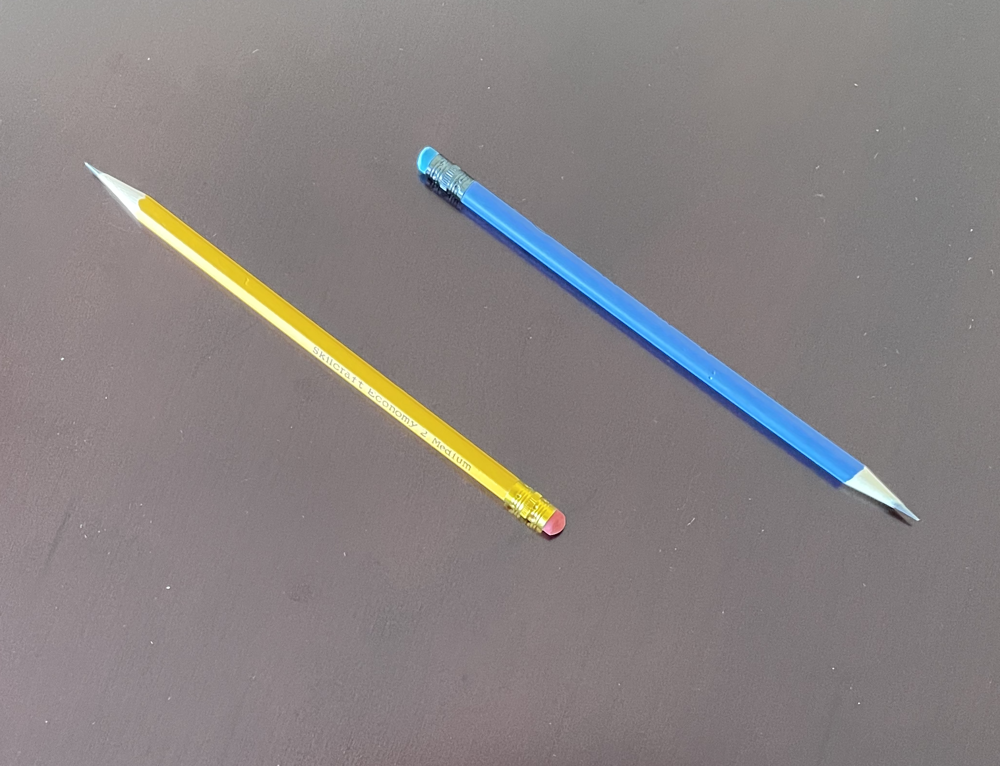

# Vectors Draft {#vectors-draft}

```{r include=FALSE}
library(Znotes)
```

Until now, our presentation of calculus has featured functions, sometimes expressed as formulas involving combinations of the basic modeling functions, sometimes generated directly from data by smoothing or splines. Now we turn to a new framework for expressing functions, the inputs on which they operate, and the kind of outputs they generate.

This framework is central to technical work in a huge range of fields. The usual name given to it by mathematicians is ***linear algebra***, although only the word "linear" conveys useful information about the subject. The physicists developing the first workable quantum theory called it ***matrix mechanics***. The framework is fundamental to scientific computation and is often the approach of choice even to non-linear problems. Application of the framework to problems of information access was the spark the ignited the modern era of search engines. 

Although the words "algebra" and "quantum" may suggest that conceptual difficulties are in store, in fact human intuition is well suited to establishing a useful understanding. 

We will introduce the framework in two different but equivalent forms. The ***geometric form*** is readily grasped by many students, even those with modest mathematical background. The geometry would have been easily grasped by the mathematicians of antiquity, who might even have regarded it as so trivial to be beneath their notice. They also could not possibly have understood the many important applications of the form which became apparent only in the last half of the 20th century with the emergence of statistics, data science, and computing generally. It can fairly be said that some of the most important developments in computer technology stem from algorithms developed from geometric properties of the form.

The other, equivalent way of describing the mathematics is via ***simple arithmetic and numbers***. This form is lacks the concreteness and visibility of the geometric approach, but more than makes up for this by the ways it makes the mathematics amenable to exact computation and to extending the applications in ways that transcend the limitations of our human, geometrical intuition.

## Length & direction

A vector is a mathematical idea that is deeply rooted in everyday physical experience. A vector is simply an object consisting only of  ***length*** and ***direction***. 

A pencil is a good physical metaphor for a vector, but a pencil has other, non-vector qualities such as diameter, color, and an eraser. And, being a physical object, a pencil always has position: the place it's at.

```{r two-vectors-pencils, echo=FALSE, fig.cap="Three pencils, but just two vectors. The yellow and blue pencils have the same length and direction, so they are exactly the same vector. Pencils have position, but vectors don't. The green pencil shares the same direction, but it has a different length, so it is a different vector from the blue/yellow vector.", out.width="50%"}
knitr::include_graphics("www/pencils/two-vectors.png")
```

Of course, a pencil has a tip and a tail; the eraser is affixed at the tail. 

```{r opposing-pencils, echo=FALSE, fig.cap="Two different vectors. They have the same length and are parallel, but they point in opposite directions.", out.width="50%"}

```

Vectors are always ***embedded*** in a ***vector space***. Our physical stand-ins for vectors, the pencils, were photographed on a table top: a two-dimensional space. Naturally, the pencil-vectors are also embedded in our everyday three-dimensional space. The table-top can be thought of as a representation of a two-dimensional ***subspace*** of three-dimensional space.

Pencils are useful for visualizing vectors, but it's helpful to conceptualize them as a ***step*** or ***displacement*** in the sense of "step to the left" or "step forward." An individual vector is a step specific length in a particular direction. Much of the mathematics of vectors can be understood as constructing instructions for reaching a target: "take three and a half steps along the green vector, then turn and take two steps backwards along the yellow vector."

Vectors embedded in three-dimensional space are central to physics and engineering. Quantities such as force, acceleration, and velocity are properly represented not as simple numerical quantities but as vectors with ***magnitude*** (that is, length) and direction. A statement like, "the plane's velocity is 450 miles per hour to the north-north-west" is perfectly intelligible to most people, describing as it magnitude and direction. Note that the vector velocity can be understood without having to know where the plane is located; vectors have only the two qualities of magnitude and direction. Position is irrelevant to describing velocity, or, for that matter, force or acceleration.

The gradients that we studied with partial differentiation (Chapter `r Chaps$gradient`) are vectors. A gradient's direction points directly uphill from a given point; it's magnitude tells how steep the hill is at that point. 

Vectors are a practical tool in many situations such as relative motion. Consider the problem of finding an aircraft heading and speed to intercept another plane that's also moving. The US Navy training movie from the 1950s shows how such calculations used to be done with paper and pencil.

<iframe width="560" height="315" src="https://www.youtube.com/embed/j197C0XuNUA?start=20" title="YouTube video player" frameborder="0" allow="accelerometer; autoplay; clipboard-write; encrypted-media; gyroscope; picture-in-picture" allowfullscreen></iframe>

Nowadays such relative motion calculations are computerized. You may well wonder how the computer is able to represent vectors, since pencils aren't part of computer hardware. The answer is disappointingly simple: the properties of direction and magnitude can also be represented by a set of numbers. Two numbers will do for a vector embedded in two-dimensional space, three for a vector embedded in three-dimensions.

Representing a vector as a set of numbers requires the imposition of a framework: a coordinate system. In Figure \@ref(fig:vector-graph-paper), the vector (that is, the green pencil) has been placed in a coordinate system. Usually you would expect there to be labels for each of the coordinate lines, but this labelling is not necessarily to show a vector even if it is needed to specify a *position*. The two coordinates to be assigned to the vector are the difference between the tip and the tail. In the figure, there are 20 units horizontally and 16 units vertically, so the vector is $(20, 16)$. 

```{r vector-graph-paper, echo=FALSE, fig.cap="Representing a vector as a set of numbers requires reference to a coordinate system, shown here as graph paper.", out.width="50%"}

```

By convention, when we write a vector as a set of coordinate numbers, we write the numbers in a ***column***. For instance, the vector in Figure \@ref(fig:vector-graph-paper), which we'll call $\overset{\longrightarrow}{\text{green}}$, would be written:

$$\overset{\longrightarrow}{\text{green}} \equiv \left[\begin{array}{c}20\\16\end{array}\right]$$
Such notation is intended for a human reader, perhaps clearly to distinguish a vector from a coordinate description of a position such as $(20,16)$. It's also useful to carry over the idea of "this is a column" in computer software, by including into the computer data structure connecting the numbers themselves---20 and 16 here---to a description of the "shape" of the vectors. By convention we would say that $\left[\begin{array}{c}20\\16\end{array}\right]$ has a $2 \times 1$ shape, which will be printed out as 2 rows in one column. A vector like velocity will have three numerical components, that is
$$\vec{v} = \left[\begin{array}{c}v_x\\v_y\\v_z\end{array}\right]\ .$$ Each of these components might be a function of time, so $$\partial_t \vec{v}(t) = \left[\begin{array}{c}\partial_t v_x(t)\\\partial_t v_y(t)\\\partial_t v_z(t)\end{array}\right] = \vec{a(t)}\ ,$$
where $\vec{a}(t)$ is the vector acceleration. 


The numerical representation of vectors is convenient when we need to perform mathematical operations on vectors such as addition, subtraction, reversal, and scaling. For instance, if an object with velocity vector $\vec{v}$ is subjected to a force vector $\vec{f}$, the velocity vector will change over time: $$\partial_t \vec{v} = \frac{1}{m}\vec{f}$$ (where $m$ is the mass of the object). 

Concretely, the above equation can be seen as shorthand for the description of the derivative of **three functions**, one each for the $x$, $y$, and $z$ components of $\vec{v}$, that is:
$$\partial_t v_x(t) = f_x/m\\
\partial_t v_y(t) = f_y/m\\
\partial_t v_z(t) = f_z/m\ .$$
We can apply numerical techniques such as integration to each of the components, for instance to find out what the velocity will be at some future time.

The numerical representation of vectors is also the way that most people can understand a tremendously important generalization of vectors to something that will at first seem absurdly abstract: 4-dimensional space, 5-dimensional space, and on up. In general: $n$-dimensional space.


## The n^th^ dimension

Living as we do in a palpably three-dimensional space, and being part of a species whose senses and brains developed in three dimensions, it's hard and maybe even impossible to get a grasp on what higher-dimensional spaces would be like.

A lovely 1884 book, *[Flatland](https://en.wikipedia.org/wiki/Flatland)*  features the inhabitants of a two-dimensional world. The central character, Square, receives a visitor, Sphere, from the three-dimensional world in which Flatland is embedded. Only with difficulty can Square assemble a conception of Sphere from the appearing, growing, and vanishing of Sphere's intersection with the flat world. Square's attempt to convince Sphere that his three-dimensional world might be embedded in a four-dimensional one leads to rejection and disgrace.  

<iframe width="560" height="315" src="https://www.youtube.com/embed/yBbZmwROv84" title="YouTube video player" frameborder="0" allow="accelerometer; autoplay; clipboard-write; encrypted-media; gyroscope; picture-in-picture" allowfullscreen></iframe>

But even if the spatial extent of higher dimensions is not accessible, the one-dimensional vector inhabitants of any such space can be readily perceived and constructed as alist of numbers. With this device, allow us to introduce vectors from 4, 5, and 6 dimensions, and even $n$ dimensional space.

$$\left[\begin{array}{r}6.4\\3.0\\-2.5\\17.3\end{array}\right]\ \ \ \left[\begin{array}{r}-14.2\\-6.9\\18.0\\1.5\\-0.3\end{array}\right]\ \ \ \left[\begin{array}{r}5.3\\-9.6\\84.1\\5.7\\-11.3\\4.8\end{array}\right]\ \ \ \cdots\ \ \ \left.\left[\begin{array}{r}7.2\\-4.4\\0.6\\-4.1\\4.7\\\vdots\ \ \\-7.3\\8.3\end{array}\right]\right\} n$$

Sensible people may consider it mathematical tomfoolery to promote of an everyday column of numbers into a vector in high-dimensional space, but there is a good reason. It encourages us to think about the arithmetic we are about to do on vectors in terms of familiar geometrical concepts: lengths, angles, alignment, and so on. Perhaps unexpectedly, it also guides us to think about data---which consists of columns of numbers in a data frame---using our powerful geometrical intuition.

## Geometry & arithmetic

In Chapter \@ref(target-problem) we will apply a mathematical apparatus based on vectors to using data in models and to a deeper understanding of technological systems such as radio and spectroscopy based on sinusoidal oscillations. In applied work, there may be dozens or thousands of vectors involved. But three simple geometric properties will lay the foundation for even advanced techniques:

1. The ***length*** of a vector.
2. The ***scaling*** of a vector to make it longer or shorter or point in the opposite direction.
3. The ***angle*** between two vectors.

You can measure the length of a vector with a ruler. For instance, Figure \@ref(fig:vector-graph-paper) shows a green vector on ruled paper; the spacing between adjacent lines in the graph paper is 0.2 inches. If you place your index finger on the eraser and your little finger on the tip, and hold that distance, you can bring your fingers into alignment with the graph paper and see that the vector is roughly 5.2 inches long.

Another way to find the length of the distance is with arithmetic. Recall that by counting squares between tip and tail, we found:
$$\overset{\longrightarrow}{\text{green}} \equiv \left[\begin{array}{c}20\\16\end{array}\right]\ .$$
Applying the Pythagorean theorem, we can calculate the vector length as 

$$\| \overset{\longrightarrow}{\text{green}} \| =
0.2\, \text {inches} \sqrt{\strut 20^2 + 16^2} = \\0.2\, \text{inches} \times 25.6125 = \\\strut5.12\,\text{inches}\ .$$
The notation  $\| \vec{v} \|$ should be read, "the length of $\vec{v}$."

For simplicity, we generally leave the length in the same units as the numbers specifying the vector, so 
$$\| \overset{\longrightarrow}{\text{green}} \| =
\sqrt{\strut 20^2 + 16^2} =  25.6125\ .$$

For a vector with $n$ components, $$\vec{w} = \left[\begin{array}{c}w_1\\w_2\\\vdots\\w_n\end{array}\right]\ ,$$
the length is $\|\vec{w}\| \equiv \sqrt{\strut w_1^2 + w_2^2 + \cdots + w_n^2}$. This arithmetic formula for length allows us to find the length even of those vectors in 4- or higher-dimensional space, where we would be hard pressed to find a ruler.

To ***scale a vector*** $\vec{w}$ means more or less to change the vector's length. Perhaps a better way to think about this is to think about the vector as a step of length $\|\vec{w}\|$ in the vector's direction. Scaling the vector by 2 means to take two steps, scaling it by 10 means to take 10 steps. Fractional steps and backward steps are also allowed, so scaling $\vec{w}$ by -2.5 means to take two and a half steps backward from the direction in which the vector points. 

Arithmetically, scaling a vector is accomplished simply by multiplying each of the vector's components by the same number. For instance, scaling $\vec{w}$ by -2.5 gives:
$$-2.5\, \vec{w} \equiv \left[\begin{array}{c}-2.5\,w_1\\-2.5\,w_2\\\vdots\\-2.5\,w_n\end{array}\right]$$ 
The number doing the scaling is called a ***scalar***, and the multiplication by a scalar is called ***scalar multiplication***. 

## Angles

Any two vectors of the same dimension have a distinct ***angle*** between them. This is easily seen for two-dimensional vectors. Draw two vectors on a sheet of paper. Since vectors have only two properties, length and direction, in your mind's eye you can pick up one of the vectors and relocate its "tail" to meet the tail of the other vector. The letters **L** and **V** illustrate the connection between the two vectors as do the characters **^**, **>**, and **<**. The angle for **L** is roughly 90 degrees, the other characters are made of vectors with acute angles (that is, less than 90 degrees). The two vectors <strong>_</strong> and <strong>/</strong>, when brought together as <strong>_/</strong> subtend an obtuse angle.

In describing the angle between two vectors, we always measure the short way round. So angles between vectors are always between 0 and 180 degrees. Any larger angle, say 260 degrees, will be identified with its circular complement: 100 degrees is the complement of a 260 degree angle.

In 2- and 3-dimensional spaces, we can measure the angle between two vectors using a protractor: arrange the vectors so they are tail to tail, align the baseline of the protractor with one of the vectors and read off the angle marked by the second vector.

It's also possible to measure the angle using arithmetic. Suppose we have vectors $\vec{v}$ and $\vec{w}$ that are in the same dimensional space. That is, $\vec{v}$ and $\vec{w}$ have the same number of components:

$$\vec{v} = \left[\begin{array}{c}v_1\\v_2\\\vdots\\v_n\end{array}\right]\ \ \ \text{and}\ \ \ \vec{w} = \left[\begin{array}{c}w_1\\w_2\\\vdots\\w_n\end{array}\right]\ ,$$

There is a straightforward arithmetic formula for the cosine of the angle $\theta$ between $\vec{v}$ and $\vec{w}$:

$$\cos(\theta) = \frac{v_1\, w_1 \ + \ v_2\, w_2 \ + \  \cdots\  + \ v_n\, w_n}{\sqrt{\strut v_1^2 + v_2^2 + \cdots + v_n^2}\  \sqrt{\strut w_1^2 + w_2^2 + \cdots + w_n^2}}$$
You might recognize the two quantities in the denominator of the ratio as the lengths $\|\vec{v}\|$ and $\|\vec{w}\|$ respectively. 

There's also a special notation and name for the quantity in the numerator. The ***dot product*** between $\vec{v}$ and $\vec{w}$ is written $\vec{v}\cdot\vec{w}$ and the sum of pairwise products of the vectors components:
$$\text{dot product:}\ \ \ \ \ \vec{v}\cdot\vec{w} \equiv v_1\, w_1 + v_2\, w_2 +  \cdots + v_n\, w_n\ .$$
Using the dot-product and length notation, we can write the formula for the cosine of the angle between two vectors as 
$$\cos(\theta) \equiv \frac{\vec{v}\cdot\vec{w}}{\|\vec{v}\|\ \|\vec{w}\|}\ .$$

If you insist on knowing the angle $\theta$ rather than $\cos(\theta)$, there is a function that will do the conversion show in in Figure \@ref(fig:cosine-conversion).

```{r cosine-conversion, echo=FALSE, fig.cap="The $\\arccos()$ function converts $\\cos(\\theta)$ to $\\theta$."}
slice_plot(180*acos(theta)/pi ~ theta, domain(theta=-1:1), npts=300) %>%
    gf_labs(x="cos(theta)", y = "theta (degrees)") %>%
    gf_refine(scale_y_continuous(breaks=c(0,15, 30,45,60,75, 90,105, 120,135,150,165, 180)))
```
::: {.intheworld data-latex=""}
What does the angle $\theta$ between two vectors tell us?

In geometrical terms, the angle tells us how strongly aligned the vectors are. An angle of 0 tells us the vectors point in exactly the same direction, and angle of 180 degrees means that the vectors point in exactly opposing directions. Either of these---0 or 180 degrees---indicates that the two vectors are perfectly aligned. Such alignment means that by appropriate scalar multiplication, the two vectors could be made exactly equal to one another and, consequently, that the scaled vectors would be one and the same.

Angles such as 5 or 175 degrees indicate that the two vectors are mostly aligned, but imperfectly. When the angle is 90 degrees of course---a right angle---the two vectors are perpendicular.

The vector alignment has a particularly important meaning in terms of data. Suppose the two vectors are two columns in a data frame: two different variables. In statistics there is an important quantity called the ***correlation coefficient***, denoted $r$. To say that two variables are correlated means that the variables are connected to one another in some way. For instance, among children, height and age are correlated. Since height tends to increase along with age (for children), the two variables are said to be ***positively correlated***. The largest possible correlation is $r=1$. 

A ***negative correlation*** means that as one variable increases the other tends to decrease. Temperature and elevation are negatively correlated, as are the pressure and volume of a gas at a given temperature. The most negative possible correlation is $r=-1$.


A ***zero correlation*** indicates that there is no simple relationship between the two variables.

In terms of vectors, that is, the columns in the data frame, the correlation coefficient $r$ is exactly the same quantity as the cosine of the angle between the vectors. At the time the correlation coefficient was invented in the 1880s, it was not widely appreciated that $r$ is simply the cosine of an angle. Perhaps the several generations of statistics students who have studied correlation would have had a better grasp on the subject if it had been called ***alignment*** and measured in degrees.
:::

## Orthogonality

Two vectors are said to be ***orthogonal*** when the angle between them is 90 degrees. In everyday speech we call a 90 degree angle a "right angle." The word "orthogonal" is really just a literal translation of "right angle." The syllable "gon" indicates an angle, as in the five-angled pentagon or six angled hexagon. "Ortho" means "right" or "correct," as in "orthodox" (right beliefs) or "orthodontics" (right teeth) or "orthopedic" (right feet).

Two vectors are at right angles---we prefer "orthogonal" since "right" has many meanings not related to angles---when the dot product between them is zero.

::: {.example data-latex=""}
Find a vector that's orthogonal to $\left[\strut\begin{array}{r}1\\2\end{array}\right]$. 

The arithmetic trick is to reverse the order of the components and put a minus sign in front of one of them, so $\left[\strut\begin{array}{r}-2\\1\end{array}\right]$.

We can confirm the orthogonality by calculating the dot product: $\left[\strut\begin{array}{r}-2\\1\end{array}\right] \cdot \left[\strut\begin{array}{r}1\\2\end{array}\right] = -2\times1 + 1 \times 2 = 0$.
:::

::: {.example data-latex=""}
Find a vector orthogonal to $\left[\strut\begin{array}{r}1\\2\\3\end{array}\right]$.

We have a little more scope here. A simple approach is to insert a zero component in the new vector and then use the two-dimensional trick to fill in the remaining components.

For instance, starting with $\left[\strut\begin{array}{r}0\\ __\\ __\end{array}\right]$ the only non-zero components of the dot product will involve the 2 and 3 of the original vector. So $\left[\strut\begin{array}{r}0\\ -3\\ 2\end{array}\right]$ is orthogonal. Or, if we start with $\left[\strut\begin{array}{r}1\\0\\3\end{array}\right]$ we would construct $\left[\strut\begin{array}{r}-3\\ 0\\ 1\end{array}\right]$. 

In addition to the two vectors we constructed with the arithmetic trick, any vector that is a linear combination of those two vectors will also be orthogonal to $\left[\strut\begin{array}{r}1\\2\\3\end{array}\right]$.
:::


## Exercises

`r insert_calcZ_exercise("XX.XX", "Of7QlW", "Exercises/snake-choose-ring.Rmd")`

`r insert_calcZ_exercise("XX.XX", "dwALW7", "Exercises/octopus-sell-mattress.Rmd")`

`r insert_calcZ_exercise("XX.XX", "xuENab", "Exercises/rhinosaurus-break-knob.Rmd")`

`r insert_calcZ_exercise("XX.XX", "MBTGQt", "Exercises/duck-do-pantry.Rmd")`

`r insert_calcZ_exercise("XX.XX", "Q2ars0", "Exercises/squirrel-hear-glasses.Rmd")`

`r insert_calcZ_exercise("XX.XX", "OoPatc", "Exercises/dog-let-coat.Rmd")`

`r insert_calcZ_exercise("XX.XX", "Gw42pX", "Exercises/beech-iron-clock.Rmd")`

`r insert_calcZ_exercise("XX.XX", "1Jxboc", "Exercises/snake-ride-glasses.Rmd")`

`r insert_calcZ_exercise("XX.XX", "N98zli", "Exercises/falcon-begin-door.Rmd")`

`r insert_calcZ_exercise("XX.XX", "PCfYDo", "Exercises/crocodile-talk-mattress.Rmd")`

`r insert_calcZ_exercise("XX.XX", "4QzeWP", "Exercises/cat-do-pants.Rmd")`

`r insert_calcZ_exercise("XX.XX", "5zmmBu", "Exercises/girl-send-scarf.Rmd")`

`r insert_calcZ_exercise("XX.XX", "7KJQQd", "Exercises/bear-fight-closet.Rmd")`

`r insert_calcZ_exercise("XX.XX", "k5u7hG", "Exercises/titmouse-stand-pantry.Rmd")`

## Outline

a. Dual representations of vectors.
    i. arithmetic: a vector is a column of numbers.
    ii. graphically: an arrow.
        a.  direction and a magnitude.
        b. Position isn't a feature. You can draw the vector whereever is convenient so long as you keep the direction and magnitude.
b. A vector is embedded ("lives in") a space. The dimension of that space is the count of rows in the column of numbers (arithmetic representation). Graphically, the dimension must be figured out in context, since all arrows look the same.
b. Scalar multiplication and addition in both representations.
c. Dot product
    i. takes two vectors, produces a *number*
    ii. arithmetical operation: componentwise multiply then add
    iii. interpreting graphically
        a. proportional to (cosine of) angle between vectors
d. Length of a vector
    i. arithmetically: pythagorus
    ii. arithmetically: sqruare root of dot product with itself
    iii. graphically: ruler.

```{r}
gvec(from=c(-2,3), to=c(4,4), color="red") %>%
graph_paper(xticks=-5:5, yticks=-5:5) %>%
    gvec(from=c(0,0), to=c(-2,3))
```
