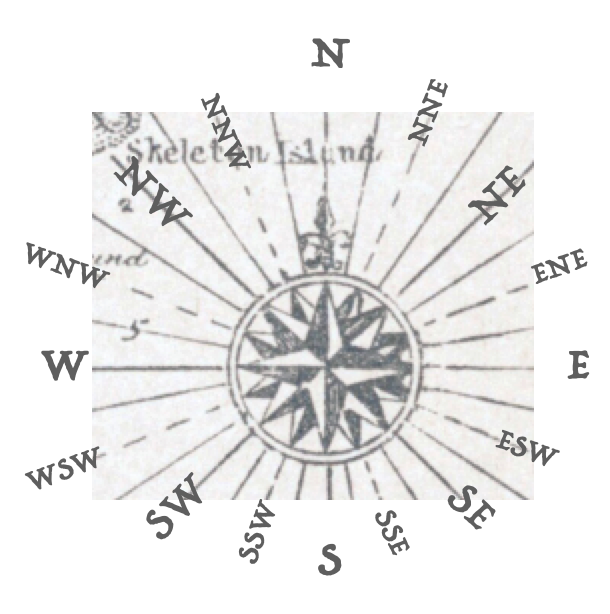

# Linear combinations of vectors

```{r include=FALSE}
library(Znotes)
```

In the previous chapter, we suggested that you think of a vector as a "step" in a given direction and of a given magnitude: for example 1 foot to the northeast. This interpretation highlights the mathematical structure of vectors: just a direction and a length, nothing else. 

The "step"-interpretation is also faithful to an important reason why vectors are useful. We use steps to get from one place to another. Similarly, a central use for the formalism of vectors is to guide our thinking and our algorithms for figuring out how best to get from one "place" to another. We've used quotation marks around "place" because we are not necessarily referring to a physical destination. We'll get to what else we might mean by "place" later in this chapter.

For now, let's focus on the word "steps." Notice that it's plural. Generally, you cannot get to the desired destination with just one step. For instance, a pirate's treasure map might contain an instruction, "Dig 10 paces to the east of the tall tree." East is the direction of the vector. "Pace" is the length of the vector (about 3 feet). And 10 is the number of steps to take. 

If pirates wrote in vector notation, those directions might have been given like this: $$\text{Let}\ \vec{p} \equiv \left[\begin{array}\,1\,\text{pace}\\0\end{array}\strut\right]\ .\ \  \text{Then}, \ 
\text{treasure spot} \equiv \text{tall tree} \ + 10 \vec{p}\ .$$ 

The count of steps is the ***scalar*** that multiplies the vector. It tells you the length of the journey in units of 1 vector. 

In a typical journey, there can be more than one vector involved. For instance, the vector pointing from the hidden cove to the tall tree might be identified as 1 nautical mile to the north-west. We'll call this vector $\overset{\longrightarrow}{\text{tree}}$. The full directions to the treasure might then be, "Start from the hidden cove. Then march $3.2\, \overset{\longrightarrow}{\text{tree}} + 10\, \vec{p}$.

This is a description of a journey as a ***linear combination of vectors***. The vectors themselves are $\vec{p}$ and $\overset{\longrightarrow}{\text{tree}}$. The vector $3.2\, \overset{\longrightarrow}{\text{tree}}$ is a scaled version of $\overset{\longrightarrow}{\text{tree}}$; it points in the same direction as $\overset{\longrightarrow}{\text{tree}}$, but it has length 3.2 nautical miles. Similarly, $10\, \vec{p}$ is a vector of length 10 paces, pointing the the same direction of $\vec{p}$. When we scale a set of vectors and then add them, we have a linear combination, just as in Block 1 we created a linear combination of functions by scaling them and adding the results together. 

Pirates and other mariners use direction terms like "one point north of north-north-east." Their maps are annotated with compass roses that translate the words into a direction.

```{r compass-rose,echo=FALSE, fig.caption="A compass rose from the map in the children's classic book *Treasure Island*. One point north of north-north-east is the direction of the radial line passing through the 'd' in \"Skeleton Island\".", out.width="20%", fig.align="center"}

```
Mathematicians can replace a compass rose with just two vectors, say, $\overset{\longrightarrow}{\text{North}}$ and $\overset{\longrightarrow}{\text{East}}$. Other directions can be given as a linear combination. For instance, the compass rose's "north-north-west" is the linear combination $0.9239\,\overset{\longrightarrow}{\text{North}} -0.3827\,\overset{\longrightarrow}{\text{East}}$.

Geometrically, that is, in terms of arrows or pencils, the scaling of a vector is stretching or shrinking, without changing the direction. (Scaling with a negative number means to reverse the tip and tail of the vector.) For a linear combination of two or more vectors, choose one of the vectors as a start, then move the tail of the second vector to the tip of the first, as in Figure \@ref(fig:add-yellow-green).

```{r add-yellow-green, echo=FALSE, fig.cap="Adding two vectors, yellow and green, by placing them tail to tip. The result is the vector going from the tail of yellow to the tip of green. This resultant is equivalent to the blue vector."}
knitr::include_graphics("www/pencils/addition.png")
```

Subtraction is similar. For $\vec{v} - \vec{w}$, 
$\vec{v}$ and $\vec{w}$ tail-to-tail. Read out the result as the vector running from the tip of $\vec{v}$ to the tip of $\vec{w}$. In Figure \@ref(fig:subtract-blue-from-yellow), the yellow vector is $\vec{v}$, the blue vector is $\vec{w}$. The result of the subtraction is the green vector.

```{r subtract-blue-from-yellow, echo=FALSE, fig.cap="Subtracting blue from yellow gives green."}
knitr::include_graphics("www/pencils/subtraction.png")
```

## Scaling

As you know, scaling a vector changes it's length. If the scalar is negative, the vector tip and tail are swapped. Figure \@ref(fig:single-scale) shows a vector $\vec{v}$ and, as a dotted line, all of the possible results of scaling the vector. For instance, the tip of the vector $-\frac{1}{2} \vec{v}$ is located at the point marked (a). The vector $\frac{4}{5} \vec{v}$ has its tip at (b) and $2.5 \vec{v}$ has the tip at (c). For any point on the dotted line, there is some numerical scalar $\alpha$ such that the scaled vector $\alpha \vec{v}$ will have its tip at that point.

The dotted line, that is, all the points that can be "reached" by scaling $\vec{v}$ is called a ***subspace***: the subspace ***spanned*** by $\vec{v}$. You can think of the subspace as all of the "destinations" that can be reached by stepping in the direction of $\vec{v}$. (Steps backward steps are also legitimate.) 

```{r single-scale, echo=FALSE, fig.cap="With a suitable scalar multiplying the vector $\\vec{v}$, any point on the dotted line can be reached. The dotted line is the subspace spanned by the vector."}
Pts <- tibble(
  x = c(-2, 1/2, 4),
  y = c(1, -1.5, -5),
  lab = c("a", "b", "c")
)
gf_segment(2 + - 5 ~ (-3) + 4, color = "magenta", linetype="dotted") %>%
  Znotes::gvec(from=c(-1,0), to=c(1, -2), color="magenta") %>%
  gf_text(y ~ x, label= ~ lab, data = Pts) %>%
  gf_refine(coord_fixed(), 
            scale_y_continuous(breaks=NULL),
            scale_x_continuous(breaks=NULL)) %>%
  gf_labs(y="", x="")

```
Every vector is associated with a subspace that is ***one-dimensional***; you can only reach the points on a line by stepping in the direction of a vector.

## Sub-spaces

Figure \@ref(fig:two-vecs) includes a second vector $\vec{w}$ along with the vector $\vec{v}$ seen in Figure \@ref(fig:single-scale). Each vector has its own subspace, again shown as dotted lines.

```{r two-vecs, echo=FALSE, fig.cap="The subspaces spanned by each of two vectors $\\vec{v}$ and $\\vec{w}$."}
gf_segment(2 + - 5 ~ (-3) + 4, color = "magenta", linetype="dotted") %>%
  gvec(from=c(-1,0), to=c(1, -2), color="magenta") %>%
  gvec(from=c(0,-3), to=c(1,-1), color="brown") %>%
  gf_segment(-5 + 3 ~ -1 + 3, color="brown", linetype="dotted") %>%
  gf_refine(coord_fixed(), 
            scale_y_continuous(breaks=NULL),
            scale_x_continuous(breaks=NULL)) %>%
  gf_labs(y="", x="")
```


Things get interesting when we consider not just the subspace spanned by the vectors individually, but the subspace spanned by them ***jointly***. Recall that the subspace spanned by $\vec{v}$ is all the vectors that can be created by scalar multiplication of $\vec{v}$, that is, all the vectors $\alpha \vec{v}$ for $-\infty < \alpha < \infty$. 

With two vectors, the subspace is all the vectors that can be created by a linear combination of the two, that is $$\alpha \vec{v} + \beta \vec{w}$$ where $-\infty < \alpha < \infty$ and $-\infty < \beta < \infty$. The entire plane is spanned by such linear combination; any vector at all in the plane can be generated.

Figure \@ref(fig:two-vecs), lying as it does on the two-dimensional surface of your screen or paper, fails to indicate clearly that even in three- or higher-dimensional space, two (non-aligned) vectors will span a plane with a particular orientation. To see this better, a worthwhile experiment is to pick up two pencils pointing in different directions. Place the eraser ends together, pinched between thumb and forefinger. You can point the whole rigid assembly in any direction you like. The angle between them will remain the same. 

Place a card on top of the pencils, slipping it between your pressed fingers to hold it tightly in place. The card is another kind of geometrical object: a planar surface. The orientation of two vectors together determine the orientation of the surface. This simple fact will be extremely important later on.

You could replace the pencils with line segments drawn on the card underneath each pencil. Now you have the angle readily measurable in two dimensions. The angle between two vectors in three dimensions is the same as the angle drawn on the two-dimension surface that rests on the vectors.

Notice that you can also lay a card along a *single* vector. What's different here is that you can roll the card around the pencil; there are many different orientations for such a card even while the vector stays fixed. So a single fixed vector does not determine uniquely the orientation of the planar surface in which the two vectors can reside. But with two fixed vectors, there is only one such surface.

## Functions as vectors

In Section `r Sections$exp_curve_fitting` we looked at the use of the exponential function to describe the temperature of hot water cooling to room temperature. The exponential decreasing function is of course $e^{-kt}$ and we can find $k$ by estimating the half-life of exponential decay, which is about 36 minutes in the data we used. (Figure \@ref(fig:water-scaled-exp)).

In this section, we're going to think about functions in terms of vectors. There are huge advantages to thinking in this way, but it will take some time for you to see them clearly.

Recall the data on cooling water gave the temperature (in degrees C) versus time (in minutes). Economy on the page argues against showing all the rows of the `CoolingWater` data frame, but you have access to it in the `r sandbox_link()`.

```{r echo=FALSE}
CW <- CoolingWater[c(1,3,5,7,10,15,20,30,40,50, 75, 100, 125, 150, 175),]
row.names(CW) <- NULL
knitr::kable(CW) %>% kableExtra::kable_minimal()
```

The `temp` column of the data frame is a set of numbers, hence interpretable as a vector. As a vector in 15 dimensions, there's not much to be said about its *direction*, but the length is easy enough: take the square root of the sum of squares of the components. That comes to 251.3 degrees C. This is merely an arithmetic fact, the consequence of adding together 15 numbers. It has the dimension of temperature T, but has nothing to do with the hot-oven-like 251 C temperature.

This `temp` vector is playing to role of the buried treasure; it's the destination we want to reach. What have we got to reach it with?

This is where our basic modeling function $e^{-kt}$ comes in. By evaluating $e^{-kt}$ at each of the values of $t$ in the `time` column, we create another column, which we'll call `expkt`. Knowing that the half-life is about 36 minutes, we'll use $k=\ln(2)/36 \approx 0.02$. At the same time, anticipating what is to come, we'll add another column which we'll call, following statistical practice, the `intercept` column and which represents the constant function (evaluated at each of the times).

```{r}
CW <- CW %>% 
  mutate(expkt = exp(-0.02*time),
         intercept = 1)
```

```{r echo=FALSE}
knitr::kable(CW) %>% kableExtra::kable_minimal()
```

Confirm for yourself that the `expkt` column really does match an exponential decay with a half-life of about 36 minutes. You can see that at time zero the value of expkt, just as expected for an exponential. At time 36, somewhere between the rows for times 29 and 39, the value is about 0.5. At time 72---two half-lives after the start---the value should be 0.25, closely matching the recorded temperature at time 74.

The two vectors `expkt` and `intercept`, like any two (non-aligned) vectors, span a planar subspace. Since `expkt` and `intercept` are embedded in a 15-dimensional space---this is just saying that there are 15 rows in the data frame---the plane is a subspace of the 15-dimensional space. This statement can seem hopelessly abstract, so let's try to give a more concrete visualization. For the visualization, we'll move onto the familiar ground of a graph of temperature versus time. 

In the domain of temperature vs time, each of the linear combinations $\alpha$`expkt`$\ + \beta$`intercept`, appears as a set of 15 dots. Figure \@ref(fig:water-dots) shows three such sets of 15 does in three different colors, along with the 15 points of the actual temperature data. To show more than the three sets of dots would be visually confusing. Instead, we'll add to the graph functions of the form $\alpha\, e^{-0.02 t} + \beta\, 1$.

```{r water-dots, echo=FALSE, fig.cap="Some of the possible linear combinations of the vectors `expkt` and `intercept`. Each combination is a set of 15 dots, but many of them are shown here as continuous functions that would connect the dots for that particular linear combination.",warning=FALSE}
CW <- CW %>%
  mutate(one = -51*expkt + 80*intercept,
         two = -36*expkt + 120*intercept,
         three = 100*expkt + 15*intercept,
         )
colors <- rainbow(10)
gf_point(temp ~ time, data = CW) %>%
  gf_point(one ~ time, color = "magenta") %>%
  gf_point(two ~ time, color = "brown") %>%
  gf_point(three ~ time, color = "tomato") %>%
  slice_plot(80 - 51*exp(-0.02*time) ~ time, color="magenta") %>%
  slice_plot(120 - 36*exp(-0.02*time) ~ time, color="brown") %>%
  slice_plot(15 + 100*exp(-0.02*time) ~ time, color="tomato") %>%
  slice_plot(35 - 20*exp(-0.02*time) ~ time, color=colors[1]) %>%
  slice_plot(45 - 70*exp(-0.02*time) ~ time, color=colors[2]) %>%
  slice_plot(55 + 45*exp(-0.02*time) ~ time, color=colors[4]) %>%
  slice_plot(65 - 40*exp(-0.02*time) ~ time, color=colors[5]) %>%
  slice_plot(75 + 30*exp(-0.02*time) ~ time, color=colors[6]) %>%
  slice_plot(95 + 10*exp(-0.02*time) ~ time, color=colors[7]) %>%
  slice_plot(25.4 + 65.7*exp(-0.02*time) ~ time, color = "black") %>%
  gf_lims(y = c(0,125))
  
  
```

We we to plot *all* the linear combinations of `expkt` and `intercept`, the graphics frame would be completely covered with ink. But each individual vector produced by a linear combination will look much of a kind with the ten shown here.

The functions shown in Figure \@ref(fig:water-dots) all inhabit the two-dimensional subspace spanned by `expkt` and `intercept`. But there is a lot more to the 15 dimensional space. What do functions look like that inhabit the space outside of the two-dimensional `expkt`&`intercept` subspace? Figure \@ref(fig:13-handful) shows a handful of them. Each is different in kind from the functions shown in Figure \@ref(fig:water-dots).

```{r 13-handful, echo=FALSE, fig.cap="A handful of the vectors in the 15-dimensional space outside of the 2-dimensional `expkt`&`intercept` subspace.", warning=FALSE}
P <- ggplot() + geom_blank()

for (k in 1:8) {
  Pts <- tibble(time = CW$time + runif(15,0, 25)) 
  Pts <- Pts %>%
    mutate(y=runif(15,20,80))
  f <- spliner(y ~ time, data = Pts)
  P <- P %>% 
    slice_plot(f(time) ~ time, color = colors[k], 
               domain(time=0:200), npts=200)
}
P %>% gf_lims(y=c(0,125))
```
There are a lot of crazy-looking functions out there in 15-dimensional space!

Look back at Figure \@ref(fig:water-dots) and focus your attention on the function drawn in black. That function is a reasonable match to the data (plotted as black dots). The question we face now is how to find such a function by searching through a 15-dimensional space. That's the task we take on in the next chapter.

::: {.intheworld}
It's pretty easy to visualize the length of a vector and the arithmetic is straightforward even in n-dimensional space. For a vector $\vec{v}$ with components $$\vec{v} \equiv \left[\strut \begin{array}{c}v_1\\v_2\\\vdots\\v_n\end{array}\right]$$ the length is $\sqrt{\strut v_1^2 + v_2^2 + \cdots + v_n^2}$. Similarly, the ***dot product*** between $\vec{v}$ and $\vec{w}$ is $\vec{v} \cdot \vec{w} \equiv v_1 w_1 + v_2 w_2 + \cdots + v_n w_n$. In terms of the dot product, the vector length is $\sqrt{\strut\vec{v} \cdot \vec{v}}$. And by combining the dot products, we can calculate the angle between two vectors: $$\cos(\theta_{v,w}) = \frac{\vec{v}\cdot\vec{w}}{\sqrt{\strut (\vec{v}\cdot\vec{v})\ (\vec{w}\cdot\vec{w}})}$$

As you know, a vector has two properties: length and direction. Both of these can be calculated using the dot product.

This suggests a way to consider other mathematical objects, such as functions, as vectors. All we need is a reasonable definition for a dot product. Suppose we have two functions, $f(t)$ and $g(t)$ defined on some domain, say $0 < t < 2\pi$. A dot product multiplies the objects together and accumulates the products. When the vectors are sets of numbers, the accumulation is to add up component-by-component products. By analogy, to take the dot product of $f(t)$ and $g(t)$ over the domain, we can do an integral: $$f() \cdot g() \equiv \int_0^{2\pi} f(t) g(t) dt\ .$$

To illustrate, consider these two functions: $f(t) \equiv \sin(t)$ and $g(t) \equiv \sin(2 t)$, plotted below.

```{r, echo=FALSE, results=FALSE}
slice_plot(sin(t) ~ t, domain(t=0:(2*pi)),
           label_text = "f(t)", label_x=.92) %>%
slice_plot(sin(2*t) ~ t, color="magenta", label_text = "g(t)", label_x=.25)
```
How "long" are $f(t)$ and $g(t)$? `

`r {Integrate(sin(t)*sin(t) ~ t, domain(t=0:(2*pi))) %>% sqrt()} |> matrix_block(inline=FALSE, width="90%")`

`r {Integrate(sin(2*t)*sin(2*t) ~ t, domain(t=0:(2*pi))) %>% sqrt()} |> matrix_block(inline=FALSE, width="90%")`

They are both the same "length", which you might recognize as $\sqrt{\strut\pi}$.

What's the cosine of the angle between them?

`r {Integrate(sin(t) * sin(2*t) ~ t, domain(t=0:(2*pi))) / pi} |> matrix_block(inline=FALSE, width="90%")`

The cosine of the angle is zero---`1.3e-16` is just a round-off error. That means that the functions $\sin(t)$ and $\sin(2t)$ are **orthogonal** on the domain $0 < t < 2\pi$.
:::


## Matrices

We have been writing linear combinations of vectors in this format, where $a$ and  $b$are ***scalars***: $$a \vec{u} + b \vec{v}\ .$$
It's helpful to have a standard notation that makes it evident which things are being combined. 

A ***matrix*** is a collection of vectors, all of which live in the same dimensional space. For instance, the matrix containing $\vec{u}$ and  $\vec{v}$ looks like
$$\left[\begin{array}{cc}|&|\\\vec{u} & \vec{v} \\|&|\\ \end{array}\right]$$
The vertical lines are meant to indicate that each of $\vec{u}$ and $\vec{v}$ are a column in the matrix. For instance, supposing $$\vec{u} \equiv \left[\begin{array}{r}2\\5\\-3\end{array}\right]\ \ \text{and}\ \ \ \vec{v} \equiv \left[\begin{array}{r}1\\-4\\0\end{array}\right]\ ,$$
the matrix $\mathbf A$ containing $\vec{u}$ and $\vec{v}$ consists of two columns:
$$ {\mathbf A} \equiv \left[\overset{\strut}{\left[\begin{array}{r}2\\5\\-3\end{array}\right]}\ \left[\begin{array}{r}1\\-4\\0\end{array}\right]\ \right]$$
In this book, when we write the name of a matrix, we'll use a CAPITAL **bold-face** letter, as **M**. Conventionally, we do without the interior square brackets, writing
$$ {\mathbf A} \equiv \left[\begin{array}{r}2\\5\\-3\end{array}\ \begin{array}{r}1\\-4\\0\end{array}\right]$$

In scientific computing languages, there is almost always a type of object called a "matrix" or an "array." The one shown here, ${\mathbf A}$ has 3 rows and 2 columns. (Columns always run vertically, as with the columns in a building.)

Also, as a matter of convention, the linear combination of the vectors in a matrix is indicated by placing to the right of the matrix a column containing the coefficients of the combination $3 \vec{u} + 1 \vec{v}$, as with

$$ {\mathbf A} \left[\begin{array}{c}3\\1\end{array}\right] = \left[\begin{array}{r}2\\5\\-3\end{array}\ \begin{array}{r}1\\-4\\0\end{array}\right] \left[\begin{array}{c}3\\1\end{array}\right] = \left[\begin{array}{r}7\\11\\-9\end{array}\right]$$
In R, we make vectors with the `rbind()` command, that places its arguments in a row. We'll make matrices with the `cbind()` command, which places its arguments in a column. Of course, the `r` in `rbind()` stands for "row" while the `c` in `cbind()` stands for "column."

```{r}
u <- rbind(2, 5, -3)
v <- rbind(1, -4, 0)
A <- cbind(u, v)
A
```
We take a linear combination of the vectors in a matrix by writing down the coefficients in the same style as a vector and multiplying using `%*%`:

```{r}
c <- rbind(3, 1)
A %*% c
```

Often, we'll want to make several different linear combinations of the vectors in a matrix. Since each individual linear combination is specified with a column of coefficients, the convention is to place the several sets of coefficients as side-by-side columns, that is, as a matrix. 

For example, consider these three different linear combinations of the two vectors $\vec{v}$ and $\vec{w}$:
$$\left[\begin{array}{r}2\\5\\-3\end{array}\ \begin{array}{r}1\\-4\\0\end{array}\right] \left[\begin{array}{rr}3 & 0 & -1\\1 & 2 & 0\end{array}\right] = \left[\begin{array}{r}7 &2 &-2\\11 & -8 & -5\\-9 & 0 & 3\end{array}\right]$$
In R, the left-hand side of the equation would involve constructing a matrix with the three pairs of coefficients:
```{r}
X <- cbind(
  rbind(3, 1),
  rbind(0, 2),
  rbind(-1, 0)
)
A %*% X
```

::: {.intheworld data-latex=""}
A CATEGORICAL VARIABLE AND HOW IT TRANSLATES INTO A SET OF VECTORS.
:::


## Exercises

`r insert_calcZ_exercise("XX.XX", "9bAVr2", "Exercises/cat-understand-car.Rmd")`

`r insert_calcZ_exercise("XX.XX", "dIobrt", "Exercises/rabbit-buy-hamper.Rmd")`

`r insert_calcZ_exercise("XX.XX", "DPY4Ue", "Exercises/crow-cut-mug.Rmd")`

