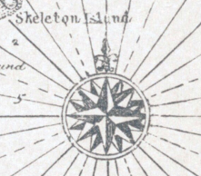
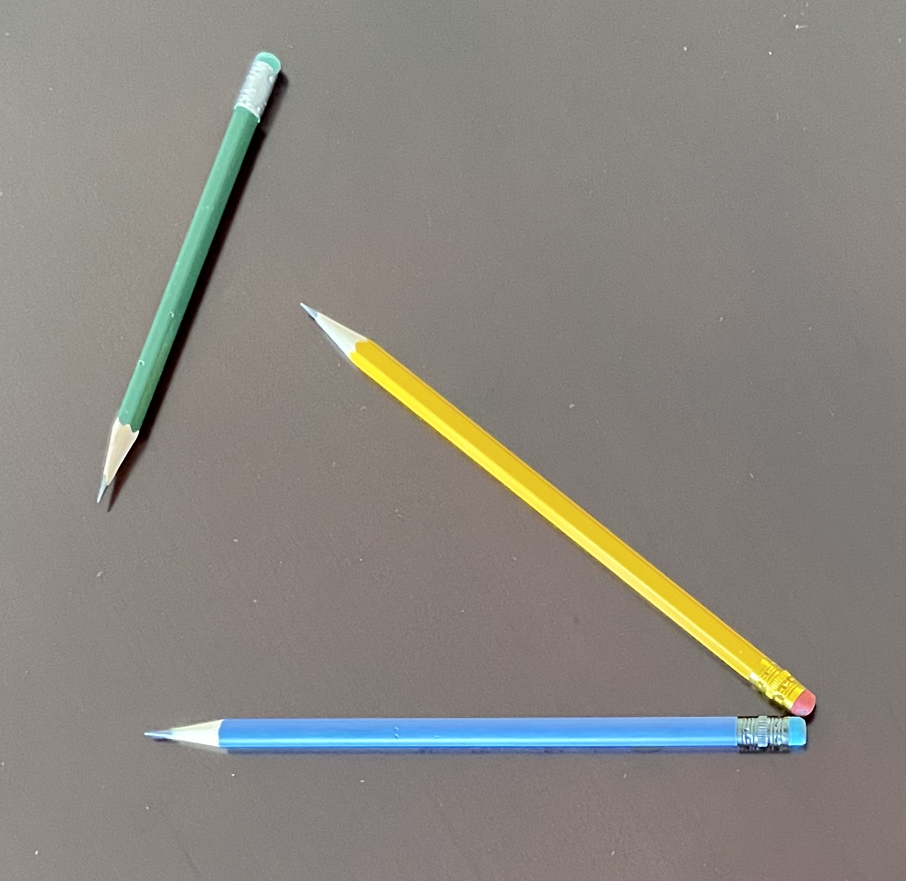

# Linear combinations of vectors

In the previous chapter, we suggested that you think of a vector as a "step" in a given direction and of a given magnitude: for example 1 foot to the northeast. This interpretation highlights the mathematical structure of vectors: just a direction and a length, nothing else. 

The "step"-interpretation is also faithful to an important reason why vectors are useful. We use steps to get from one place to another. Similarly, a central use for the formalism of vectors is to guide our thinking and our algorithms for figuring out how best to get from one "place" to another. We've used quotation marks around "place" because we are not necessarily referring to a physical destination. We'll get to what else we might mean by "place" later in this chapter.

For now, let's focus on the word "steps." Notice that it's plural. Generally, you cannot get to the desired destination with just one step. For instance, a pirate's treasure map might contain an instruction, "Dig 10 paces to the east of the tall tree." East is the direction of the vector. "Pace" is the length of the vector (about 3 feet). And 10 is the number of steps to take. 

If pirates wrote in vector notation, those directions might have been given like this: $$\text{Let}\ \vec{p} \equiv \left[\begin{array}\,1\,\text{pace}\\0\end{array}\strut\right]\ .\ \  \text{Then}, \ 
\text{treasure spot} \equiv \text{tall tree} \ + 10 \vec{p}\ .$$ 

The count of steps is the ***scalar*** that multiplies the vector. It tells you the length of the journey in units of 1 vector. 

In a typical journey, there can be more than one vector involved. For instance, the vector pointing from the hidden cove to the tall tree might be identified as 1 nautical mile to the north-west. We'll call this vector $\overset{\longrightarrow}{\text{tree}}$. The full directions to the treasure might then be, "Start from the hidden cove. Then march $3.2\, \overset{\longrightarrow}{\text{tree}} + 10\, \vec{p}$.

This is a description of a journey as a ***linear combination of vectors***. The vectors themselves are $\vec{p}$ and $\overset{\longrightarrow}{\text{tree}}$. The vector $3.2\, \overset{\longrightarrow}{\text{tree}}$ is a scaled version of $\overset{\longrightarrow}{\text{tree}}$; it points in the same direction as $\overset{\longrightarrow}{\text{tree}}$, but it has length 3.2 nautical miles. Similarly, $10\, \vec{p}$ is a vector of length 10 paces, pointing the the same direction of $\vec{p}$. When we scale a set of vectors and then add them, we have a linear combination, just as in Block 1 we created a linear combination of functions by scaling them and adding the results together. 

Pirates and other mariners use direction terms like "one point north of north-north-east." Their maps are annotated with compass roses that translate the words into a direction.

```{r compass-rose,echo=FALSE, fig.caption="A compass rose from the map in the children's classic book *Treasure Island*. One point north of north-north-east is the direction of the radial line passing through the 'd' in \"Skeleton Island\".", out.width="20%", fig.align="center"}

```
Mathematicians can replace a compass rose with just two vectors, say, $\overset{\longrightarrow}{\text{North}}$ and $\overset{\longrightarrow}{\text{East}}$. Other directions can be given as a linear combination. For instance, the compass rose's "north-north-west" is the linear combination $0.9239\,\overset{\longrightarrow}{\text{North}} -0.3827\,\overset{\longrightarrow}{\text{East}}$.

Geometrically, that is, in terms of arrows or pencils, the scaling of a vector is stretching or shrinking, without changing the direction. (Scaling with a negative number means to reverse the tip and tail of the vector.) For a linear combination of two or more vectors, choose one of the vectors as a start, then move the tail of the second vector to the tip of the first, as in Figure \@ref(fig:add-yellow-green).

```{r add-yellow-green, echo=FALSE, fig.cap="Adding two vectors, yellow and green, by placing them tail to tip. The result is the vector going from the tail of yellow to the tip of green. This resultant is equivalent to the blue vector."}
knitr::include_graphics("www/pencils/addition.png")
```

Subtraction is similar. For $\vec{v} - \vec{w}$, 
$\vec{v}$ and $\vec{w}$ tail-to-tail. Read out the result as the vector running from the tip of $\vec{v}$ to the tip of $\vec{w}$. In Figure \@ref(fig:subtract-blue-from-yellow), the yellow vector is $\vec{v}$, the blue vector is $\vec{w}$. The result of the subtraction is the green vector.

```{r subtract-blue-from-yellow, echo=FALSE, fig.cap="Subtracting blue from yellow gives green."}

```

## Sub-spaces

## Sub-spaces

A worthwhile experiment is to pick up two pencils pointing in different directions. Place the eraser ends together, pinched between thumb and forefinger. You can point the whole rigid assembly in any direction you like. The angle between them will remain the same. 

Place a card on top of the pencils, slipping it between your pressed fingers to hold it tightly in place. The card is another kind of geometrical object: a planar surface. The orientation of two vectors together determine the orientation of the surface. This simple fact will be extremely important later on.

You could replace the pencils with line segments drawn on the card underneath each pencil. Now you have the angle readily measurable in two dimensions. The angle between two vectors in three dimensions is the same as the angle drawn on the two-dimension surface that rests on the vectors.

Notice that you can also lay a card along a *single* vector. What's different here is that you can roll the card around the pencil; there are many different orientations for such a card even while the vector stays fixed. So a single fixed vector does not determine uniquely the orientation of the planar surface in which the two vectors can reside. But with two fixed vectors, there is only one such surface.

## Functions as vectors

In Section `r Section$exp_curve-fitting` we looked at the use of the exponential function to describe the temperature of hot water cooling to room temperature. The exponential decreasing function is of course $e^{-kt}$ and we can find $k$ by estimating the half-life of exponential decay, which is about 36 minutes in the data we used. (Figure \@ref(fig:water-scaled-exp)).

In this section, we're going to think about functions in terms of vectors. There are huge advantages to thinking in this way, but it will take some time for you to see them clearly.

Recall the data on cooling water gave the temperature (in degrees C) versus time (in minutes). Economy on the page argues against showing all the rows of the `CoolingWater` data frame, but you have access to it in the `r sandbox_link()`.

```{r echo=FALSE}
CW <- CoolingWater[c(1,3,5,7,10,15,20,30,40,50, 75, 100, 125, 150, 175, 200),]
row.names(CW) <- NULL
knitr::kable(CW) %>% kableExtra::kable_minimal()
```

The `temp` column of the data frame is a set of numbers, hence interpretable as a vector. As a vector in 15 dimensions, there's not much to be said about its *direction*, but the length is easy enough: take the square root of the sum of squares of the components. That comes to 251.3 degrees C. This is merely an arithmetic fact, the consequence of adding together 15 numbers. It has the dimension of temperature T, but has nothing to do with the hot-oven-like 251 C temperature.

This `temp` vector is playing to role of the buried treasure; it's the destination we want to reach. What have we got to reach it with?

This is where our basic modeling function $e^{-kt}$ comes in. By evaluating $e^{-kt}$ at each of the values of $t$ in the `time` column, we create another column, which we'll call `expkt`. Knowing that the half-life is about 36 minutes, we'll use $k=\ln(2)/36 \approx 0.02$. At the same time, anticipating what is to come, we'll add another column which we'll call, following statistical practice, the `intercept` column and which represents the constant function (evaluated at each of the times).

```{r}
CW <- CW %>% 
  mutate(expkt = exp(-0.02*time),
         intercept = 1)
```

```{r echo=FALSE}
knitr::kable(CW) %>% kableExtra::kable_minimal()
```

Confirm for yourself that the `expkt` column really does match an exponential decay with a half-life of about 36 minutes. You can see that at time zero the value of expkt, just as expected for an exponential. At time 36, somewhere between the rows for times 29 and 39, the value is about 0.5. At time 72---two half-lives after the start---the value should be 0.25, closely matching the recorded temperature at time 74. 

Our goal is to scale the `expkt` vector so that the scaled numbers will be as close as possible to our destination, namely, `temp`. Comparing the two columns of numbers, you might anticipate that the scalar will be about 100. We'll see how to calculate it exactly in the next chapter. The result turns out to be 99.23. The resulting model will be $$T(t) = 99.23\, e^{-0.02 t}\ .$$

How are we to judge whether this is a good model or not? Common sense suggests plotting out the model function along with the data, as in Figure \@ref(fig:just-exp).

```{r just-exp, echo=FALSE, fig.cap="Comparing the model $99.23\\, e^{-0.02 t}$ to the recorded data in `CoolingWater."}
gf_point(temp ~ time, data = CW) %>%
  slice_plot(99.23*exp(-0.02*time) ~ time, color="magenta")

```

Judge for yourself whether this is a good model. The obvious deficiency is that the model falls, as decaying exponentials will do, toward a temperature of 0, whereas the water is cooling to a room temperature of about 25 degrees.

Let's return to the model seen in terms of vectors. The advantage of doing this is to develop a general procedure we can use for interpreting models of all sorts, rather than just the particular situation of the cooling-water data.

What are the geometric facts? We know that the `temp` vector has length 251.3 deg C. Similarly we can calculate the length of the `expkt` vector: 2.46 deg C. 

It might seem that the "direction" of the vector is meaningless, because it's a direction in an abstract, hard-to-envision 15-dimensional space. (There are 15 components to each of `temp` and `expkt`.) Even so, we can calculate the ***angle*** between the two vectors, using the formula $\cos(\theta) = \frac{\vec{v}\cdot \vec{w}}{\|\vec{v}\|\ \|\vec{w}\|}$. Doing the arithmetic gives $$\cos{\theta} = \frac{599.8}{251.3 \times 2.46} = 0.9708\ \ \implies \ \ \ \theta = 13.88^\circ$$

```{r temp-expkt-picture, echo=FALSE, fig.cap="The vectors `temp` and `expkt` have an angle of 13.88 deg between them. Here, `expkt` has been drawn 10x it's actual size."}
gvec(from = c(0,0), to = c(250, 25.1), color = "black") %>%
  gf_segment(0 + 3*28.8 ~ 0 + 3*116.5, 
             color="magenta", linetype = "dotted") %>%
  gvec(from=c(0,0), to = 2*c(11.6, 2.88), color="magenta") %>%
  gf_refine(coord_fixed())
```

With these geometrical facts, we can draw a picture. Figure \@ref(fig:temp-expkt-picture) shows `temp` in black and `expkt` in magenta. (We've drawn it 10 times as long as it really is so that you can see it well.) For the `expkt` vector to be a good model of `temp`, we need to scale it so that the result, which must be on the dotted line in the picture, is as close as possible to the tip of `temp`. You can count off yourself how many `expkt` steps will bring you close to `temp`. (Remember to multiply your result by 10, since in the picture we drew `expkt` ten times longer than its arithmetic length.)

One reasonable way to quantify how good a model of `temp` can be made by a properly scaled version of vector `expkt` is the angle between them: 13.88 degrees. 

Likewise, we can scale the vector `intercept` to make it match `temp` as well as possible. The angle between `intercept` and `temp` works out to be 75.7 degrees; the vectors are not very well aligned. Scaling by 58.2 will bring `intercept` as close as it is ever going to get to `temp`, which is not very close at all.

The idea of a linear combination is to scale and add multiple vectors. As a **very rough start**, let's look at the combination 58.2 `intercept` + 99.23 `expkt`, the combination of the two individual models we constructed by vector analogy. CAUTION: The model will be poor. That's not because the vector analogy is poor but because we still have to work out, as we will in the next two chapters, how properly to work with vectors. 

```{r}
CW <- CW %>% 
  mutate(model = 99.23*expkt + 58.2*intercept)
```

```{r echo=FALSE}
knitr::kable(CW) %>% kableExtra::kable_minimal()
```

The resulting model is ... well, terrible! Figure \@ref(fig:two-temp-models) shows the linear combination 

```{r two-temp-models, echo=FALSE}
gf_point(temp ~ time, data = CW) %>%
  gf_point(model ~ time, data = CW, color="magenta") %>%
  slice_plot(58.2+ 99.23*exp(-0.02*time) ~ time, color="magenta")
```

EXERCISE: Repeat the calculations for the entire `CoolingData` data frame.


Adding vectors. The result is a vector

Scaling and adding vectors: a linear combination of vectors.


## MOVED FROM VECTORS


A pencil is a physical object that does a good job representing a vector in three dimensional space. Three-dimensional space is all around us and it's easy---indeed, inevitable---to situate a pencil in it. We have no such physical access to 4-dimensional space or higher-dimensional spaces. Instead of a physical representation, we need to rely on a mathematical one: a column of numbers. And we can't use a protractor to measure the angle between two vectors in 4- or higher-dimensional space. Instead, we calculate the angle using arithmetic. But to define the numerical process for calculating an angle, we need to make sure that the result follows the familiar conventions for angles, specifically that they be between 0 and 180 degrees, that the angle between two vectors with the same orientation is 0, and that the angle between two opposite-pointing vectors is 180 degrees.

The arithmetic formula for computing the angle between two vectors is simple. Or, rather, it's simple if we allow ourselves to calculate the cosine of the angle rather than the angle $\theta$ itself. The underlying quantity can be calculated using dot products: 
$$\cos(\theta) \equiv \frac{\vec{v}^T \cdot \vec{w}}{\sqrt{\strut (\vec{v}^T\cdot \vec{v})(\vec{w}^T\cdot \vec{w})}}$$


A starting  point  is creating a vector on the computer. In  some sense this a vector is just a collection  of numbers, but it's helpful  to  be disciplined  and  remember that, for our purposes, a  vector is  a **column** of numbers. R knows about such columns and will  handle them appropriately.

One way to create a column vector is with  the  `rbind()` function.

use the  `rbind()` function applied to individual arguments. Here,  for instance,  is a command that makes a three-dimensional vector we are calling `b`.

```{r}
b <- rbind(4, -2, 6)
b
```

Notice that in  printing out a  vector, R  includes a series of indices  (e.g. `[1,]` or `[3,]`) to help the reader identify the location  of any element in  the vector. It also  prints a header (`[,1]`) which  is helpful later when we work with  collections of vectors.

## Matrix

You are going to hear the word "matrix" a lot.  Later in  this tutorial we will use the term "matrix multiplication." A matrix is a collection  of  vectors, all of the same dimension. We'll get to them  in good time.  

## Scalar multiplication

You  can multiply a vector times  a  number. The result is a new vector with exactly the  same direction as  the original, but with  a different length. The  arithmetic  is  very  simple: do ordinary multiplication  of the number by  each of the elements  of the  vector. Examples:

$$2 \left(\begin{array}{c}4\\7\end{array}\right) = \left(\begin{array}{c}8\\14\end{array}\right)$$

This  simple  multiplication is called "scalar multiplication" for two  reasons:

1. The result is to "scale" the vector, in the sense of a  "scale  model",  that  is, to make the vector bigger or smaller.
2. There is another important form of vector  arithmetic called "matrix multiplication." By  saying  "scalar multiplication,"  we avoid the  confusion  that might arise if  we  used "multiplication" alone.

In R, scalar multiplication of a vector is  done with `*`, just like ordinary multiplication   with numbers:

```{r echo=TRUE}
b <- rbind(4, -2, 6)
2.3 * b
```

::: {.example data-latex=""}
In a `r sandbox_link()`, Write  the  R  code to create a vector named `w` with  components 4, -1,  and -3.5.  Then scalar multiply `w` by 6.3.

```{r echo=TRUE, eval=FALSE} 
w <- _______
6.3 _______ w
```

<details>
<summary>Solution</summary>
```{r}
w <- rbind(4,  -1,  -3.5)
6.3 *  w
```
</details>
:::

## Dot product and `%*%`

Now to  introduce  a new R arithmetic function, written `%*%`. This symbol is pronounced "matrix multiply."  In traditional mathematical notation, matrix multiplication is indicated by putting the two quantities next to one another, like this: $\vec{\mathbf m}^T \vec{\mathbf x}$, or sometimes with a dot $\vec{\mathbf m}T\cdot \vec{\mathbf x}$. The superscript $^T$ means "transpose." For us, this  is merely a  book-keeping convention.

The operation `%*%` will do several  different types  of  arithmetic  with  vectors. The one we will work with here is  called  a *dot product*.  (There are  also "matrix products"  and "outer products".)

The R notation for a dot product very  much echoes the  traditional matrix  notation,  at least  with  respect to $^T$.  We'll  illustrate by creating  two vectors `u`  and `v` and then calculating their dot  product.

```{r}
u <- rbind(6, -3,  7)
v <- rbind(2,  1,  3)
t(u) %*%  v
```

Notice  that the  output  of a dot product is  a single number: a scalar. (R prints the output as if the scalar were  a vector in one-dimension.)

Arithmetically, the dot product is calculated by multiplying the corresponding components in the two vectors  (e.g.  $6  \times 2$ and  $-3 \times 1$ and  $7 \times 3$) and adding up the  result. You can see why the dot product always involves two vectors with the same number of elements.

The R `t()` function corresponds to  the mathematical notation for the transpose: $^T$. So `t(u)` would be written, mathematically, as $\vec{u}^T$. The  purpose of `t()` is to turn columns (like our vector `u`) into rows,  and vice versa.  If you  like,  try the command `t(u)` in  the sandbox to see how it  is printed.

For us,  the purpose of writing `t(u)` is  to signal  to  the `%*%`  matrix multiplication  operation that we want a particular operation: the dot product.

The  dot product always involves the transpose of a column vector on  the left side of  `%*%`  and a column vector on  the right side.

You  can  also  write a command  `u %*% t(v)`,  but  this is not a  dot product. It is  called  an "outer product" and we will not need it in this course. Try it out in  the sandbox.

::: {.caution}
The ***dot product*** and the ***outer product*** are written in very similar ways but produce completely different results. We won't have much use for outer products in this course, but you should be aware what they look like so that you can diagnose the problem if your attempt at a dot product goes wrong.

**Dot products**
```{r}
t(u) %*% v
t(v) %*% u
```

**Outer product**
```{r}
u %*% t(v)
v %*% t(u)
```
:::


## Vector lengths

For  a vector $\vec{v}$, the  length is denoted $|| \vec{v} ||$. Vector length can  be measured with  a ruler ...  so long as you have physical access to  the vector. But often, all we have  is the numerical representation. So, we use arithmetic---the dot product---to calculate vector length: 
$$|| \vec{v}  || \equiv \sqrt{\ \vec{v}^T \cdot \vec{v}}$$

::: {.example data-latex=""}
Consider the two vectors 
$$\vec{u} \equiv \left(\begin{array}{c}3\\4\end{array}\right) \  \  \ \mbox{and}  \ \ \ \vec{w} \equiv \left(\begin{array}{c}1\\1\\1\\1\end{array}\right)
$$

The length of $\vec{u}$ is $|| \vec{u} || = \sqrt{\strut 3^2 + 4^2} = \sqrt{\strut 25} = 5$.

The length of $\vec{w}$ is $|| \vec{w} || = \sqrt{\strut 1^2 + 1^2 + 1^2 + 1^2} = \sqrt{\strut 4} = 2$.

Using a `r sandbox_link()`, use R commands to create the vectors $\vec{u}$ and $\vec{w}$ and find their lengths using the `dot-product operator`%*%` operator.

```{r eval=FALSE}
u <- rbind( ____ )
# length of u
sqrt( ____ %*% ____ )

v <- rbind( ______ )
# length of v
sqrt( ____ %*% ____ )
```

<details>
<summary>Solution</summary>
```{r}
u <- rbind(3, 4)
sqrt(t(u) %*% u)
w <- rbind(1, 1, 1, 1)
sqrt(t(w) %*% w)
```
</details>


## Orthogonality

Two vectors are said to be ***orthogonal*** when the angle between them is 90 degrees. In everyday speech we call a 90 degree angle a "right angle." The word "orthogonal" is really just a literal translation of "right angle." The syllable "gon" indicates an angle, as in the five-angled pentagon or six angled hexagon. "Ortho" means "right" or "correct," as in "orthodox" (right beliefs) or "orthodontics" (right teeth) or "orthopedic" (right feet).

Two vectors are at right angles---we prefer "orthogonal" since "right" has many meanings not related to angles---when the dot product between them is zero.

::: {.example data-latex=""}
Find a vector that's orthogonal to $(1,2)$. 

The arithmetic trick is to reverse the order of the components and put a minus sign in front of one of them, so $(-2, 1)$.

We can confirm the orthogonality by calculating the dot product: $(-2, 1)^T \cdot (1,2) = -2\times1 + 1 \times 2 = 0$.
:::

::: {.example data-latex=""}
Find a vector orthogonal to $(1,2,3)$.

We have a little more scope here. A simple approach is to insert a zero component in the new vector and then use the two-dimensional trick to fill in the remaining components.

For instance, starting with $(0, __, __)^T$ the only non-zero components of the dot product will involve the 2 and 3 of the original vector. So $(0, -3, 2)$ is orthogonal. Or, if we start with $(1,0,3)$ we would construct $(-3, 0, 1)$. 

In addition to the two vectors we constructed with the arithmetic trick, any vector that is a linear combination of those two vectors will also be orthogonal to $(1,2,3)$.
:::

## Outline

a. Write a system of linear equations as a "target problem" involving a linear combination of vectors. 
b. Definition of a linear combination of vectors.
c. Matrix is a collection of vectors
    i. Linear combination is written as matrix multiplied by vector
d. Solve target problem algebraically or graphically in two dimensions.
e. Subtracting vectors algebraically and graphically


## Matrices

## Solving the target problem with R


## Exercises

`r insert_calcZ_exercise("XX.XX", "9bAVr2", "Exercises/cat-understand-car.Rmd")`

`r insert_calcZ_exercise("XX.XX", "dIobrt", "Exercises/rabbit-buy-hamper.Rmd")`

`r insert_calcZ_exercise("XX.XX", "DPY4Ue", "Exercises/crow-cut-mug.Rmd")`

