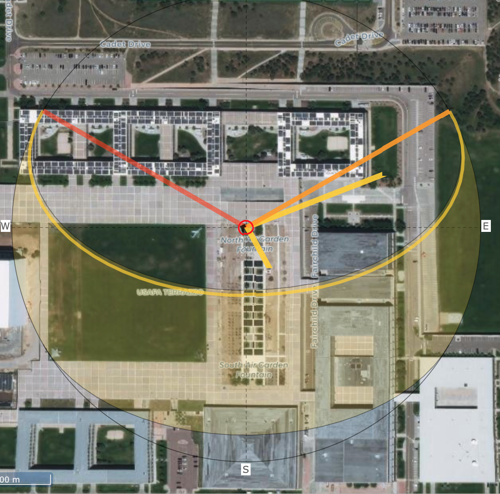

# Linear combinations of vectors {#linear-combs-vectors}

```{r include=FALSE}
library(Znotes)
```

::: {.underconstruction}
Chapter not yet released

<!--
$\vec{v}$ \vec

$\mathit{M}$ \mathit

$\color{magenta}{\alpha}$


$\color{red}{\mathit{M}}$
$\color{green}{\mathit{M}}$
$\color{blue}{\mathit{M}}$
$\color{cyan}{\mathit{M}}$
$\color{magenta}{\mathit{M}}$
$\color{yellow}{\mathit{M}}$
$\color{black}{\mathit{M}}$
$\color{gray}{\mathit{M}}$
$\color{white}{\mathit{M}}$
$\color{darkgray}{\mathit{M}}$
$\color{lightgray}{\mathit{M}}$
$\color{brown}{\mathit{M}}$
$\color{lime}{\mathit{M}}$
$\color{olive}{\mathit{M}}$
$\color{orange}{\mathit{M}}$
$\color{pink}{\mathit{M}}$
$\color{purple}{\mathit{M}}$
$\color{teal}{\mathit{M}}$
$\color{violet}{\mathit{M}}$
-->
:::

<div style="float:right;">[](https://github.com/ProjectMOSAIC/MOSAIC-Calculus/blob/main/Block-5/B5-linear-combinations.Rmd)</div>

In this chapter, we introduce ***linear combinations of vectors***. As you recall, a linear combination is a sum of basic elements each of which has been ***scaled***. For instance, in Block 1 we looked at linear combinations of functions such as $$g(t) = A + B e^{kt}$$ which involves the basic functions $\text{one}(t)$ and $e^{kt}$ scaled respectively by $A$ and $B$. Linear combinations of vectors involve scaling and addition, which are simple seen either as numerical operations or a geometric ones. A useful concept will be the set of all vectors that can be constructed as linear combinations of given vectors. This set of all possibilities, called the ***subspace spanned*** by the given vectors is key to understanding how to find the "best" scalars for a given purpose.

## Scaling vectors

To scale a vector means to change its length without altering its direction. Scaling by a negative number flips the vector tip-for-tail. Figure \@ref(fig:scaling) shows two vectors $\vec{v}$ and $\vec{w}$ together with several scaled versions of each.

```{r scaling, echo=FALSE, fig.cap="Vectors $\\vec{v}$ and $\\vec{w}$ and some scaled versions of them."}
Znotes::gvec(from=c(0,2), to=c(1/2, 1.5), color="magenta", label="W", where=0.5, nudge=0.2, flip=TRUE) %>%
  Znotes::gvec(from=c(0.8,1.8), to=c(1.8,0.8), color="magenta", label="2W", nudge=0.2, flip=FALSE) %>%
  Znotes::gvec(from=c(3,0.7), to=c(1.5,2.2), color="magenta", label="--3W", nudge= 0.2, flip=TRUE) %>%
  Znotes::gvec(from=c(3.5,1.2), to=c(3.75,0.95), color="magenta", label="0.5 W", nudge= 0.4, flip=TRUE) %>%
  Znotes::gvec(from=c(2,3.2), to=c(3,3.2), color="brown", label="V", nudge= 0.2, flip=TRUE) %>%
  Znotes::gvec(from=c(2,2.6), to=c(2.75,2.6), color="brown", label="0.75 V", nudge= 0.3, flip=FALSE) %>%
  Znotes::gvec(from=c(1,3.7), to=c(3,3.7), color="brown", label="2 V", nudge= 0.2, flip=TRUE) %>%
  Znotes::gvec(from=c(1.5,2.5), to=c(0,2.5), color="brown", label="-1.5 V", nudge= 0.2, flip=TRUE) %>%
  gf_refine(coord_fixed(xlim=c(0,4), ylim=c(0,4))) %>%
  Znotes::graph_paper(xticks=seq(0,4,by=0.25))
```

The vectors we create by scalar multiplication can be placed anywhere we like.

Arithmetically, scaling a vector is accomplished by multiplying each component of the vector by the scalar, e.g.

$$\vec{u} = \left[\begin{array}{r}1.5\\-1\end{array}\right]\ \ \ \ 2\vec{u} = \left[\begin{array}{r}3\\-2\end{array}\right]\ \ \ \ 
-\frac{1}{2}\vec{u} = \left[\begin{array}{r}-0.75\\0.5\end{array}\right]\ \ \ \ $$

Every vector is associated with a subspace that is ***one-dimensional***; you can only reach the points on a line by stepping in the direction of a vector.

## Adding vectors

To add two vectors, choose either one of the vectors as a start, then move the tail of the second vector to the tip of the first, as in Figure \@ref(fig:add-yellow-green).

```{r add-yellow-green, echo=FALSE, fig.align="center", out.width="50%", fig.cap="Adding two vectors, yellow and green, by placing them tail to tip. The result is the vector going from the tail of yellow to the tip of green. This resultant is equivalent to the blue vector."}
knitr::include_graphics("www/pencils/addition.png")
```

Adding vectors in this way takes advantage of the rootlessness of a vector. So long as we keep the direction and length the same, we can move a vector to whatever place is convenient. For adding vectors, the convenient arrangement is to place the tail of the second vector at the tip of the first. The result---the blue pencil in the picture above---has the length and direction from the tail of the first pencil (yellow) to the tip of the second (green). But so long as we maintain this length and direction, we can put the result (blue) anywhere we want.


Arithmetically, vector addition is simply a matter of working with each component individually. For instance, consider adding two vectors $\vec{v}$ and $\vec{w}$:
$$\underbrace{\left[\begin{array}{r}1.5\\-1\\2\\6\end{array}\right]}_\vec{v} + \underbrace{\left[\begin{array}{r}2\\4\\-2\\-3.2\end{array}\right]}_\vec{w} = \underbrace{\left[\begin{array}{r}3.5\\3\\0\\2.8\end{array}\right]}_{\vec{v} + \vec{w}}$$   

Unlike our pencil exemplars of vectors, which must of physical necessity always be in the three-dimensional space we inhabit, mathematical vectors can be embedded in any-dimensional space. Addition is applicable to vectors embedded in the same space. Arithmetically, this means that the two vectors to be added must have the same number of components.  

Arithmetic ***subtraction*** of one vector from another is a simple component-wise operation. For example:
$$\underbrace{\left[\begin{array}{r}1.5\\-1\\2\\6\end{array}\right]}_\vec{v} {\Large -} \underbrace{\left[\begin{array}{r}2\\4\\-2\\-3.2\end{array}\right]}_\vec{w} = \underbrace{\left[\begin{array}{r}-0.5\\-5\\4\\9.2\end{array}\right]}_{\vec{v} - \vec{w}}\ .$$
From a geometrical point of view, many people like to think of $\vec{v} - \vec{w}$ in terms of placing the two vectors **tail to tail** as in Figure \@ref(fig:subtract-blue-from-yellow). Read out the result as the vector running from the tip of $\vec{v}$ to the tip of $\vec{w}$. In Figure \@ref(fig:subtract-blue-from-yellow), the yellow vector is $\vec{v}$, the blue vector is $\vec{w}$. The result of the subtraction is the green vector.

```{r subtract-blue-from-yellow, echo=FALSE, fig.align="center", out.width="50%", fig.cap="Subtracting blue from yellow gives green."}
knitr::include_graphics("www/pencils/subtraction.png")
```

::: {.takenote data-latex=""}
Vector addition and subtraction work just like arithmetic with scalars, but vector ***multiplication*** and ***division*** do not follow the same pattern.

As a matter of arithmetic, it's easy to carry out the ***component-wise multiplication*** or ***component-wise division***, for instance

$$\underbrace{\left[\begin{array}{r}1.5\\-1\\2\\6\end{array}\right]}_\vec{v} {\Large \times} \underbrace{\left[\begin{array}{r}2\\4\\-2\\-3.2\end{array}\right]}_\vec{w}\ \ \  = \underbrace{\left[\begin{array}{r}3\\-4\\-4\\-18.12\end{array}\right]}_\text{componentwise product}\ \ \text{is NOT vector multiplication}\ .$$
In vector mathematics, "multiplication" is a much richer concept than componentwise arithmetic. In fact, there are four different kinds of "multiplication" and it's important to keep track of which one you mean in any context. In this book, we will use two kinds of "multiplication":

* ***matrix multiplication*** which, as you'll see later in the chapter, is about linear combinations of vectors.
* ***inner product***, which we prefer to call ***dot product*** and encountered in the previous chapter as a way of calculating vector lengths and the angle between vectors, is a special case of matrix multiplication.

Another two forms of "multiplication," which we won't use in this book are:

* ***cross product*** which is very important in physics and engineering.
* ***outer product*** which has important applications in data science.

:::


## Linear combinations

In the previous chapter, we suggested that you think of a vector as a "step" or displacement in a given direction and of a given magnitude as in, "1 foot to the northeast." This interpretation highlights the mathematical structure of vectors: just a direction and a length, nothing else. 

The "step"-interpretation is also faithful to an important reason why vectors are useful. We use steps to get from one place to another. Similarly, a central use for the formalism of vectors is to guide our thinking and our algorithms for figuring out how best to get from one "place" to another. We've used quotation marks around "place" because we are not necessarily referring to a physical destination. We'll get to what else we might mean by "place" later in this chapter.

As a fanciful example of getting to a "place," consider a treasure hunt. You are given these instructions to get there:

> i. On June 1, go to the flagpole before sunrise.
ii. At 6:32, walk 213 paces away from the sun.
iii. At 12:19, walk 126 paces toward the sun.

The sun position varies over the day, so the direction to the sun on June 1 at 6:32  will be different than at 12:19. Figure \@ref(fig:sun-direction) show an aerial views annotated with the direction of the sun at 6:32 and 12:19 on June 1.

```{r sun-direction, echo=FALSE, out.width="40%", fig.show="keep", fig.cap="Maps showing the directions of sunrise and sunset on June 1 at latitude/longitude (38.0091,-104.8871). The Sun's direction at 6:32 is shown in the left map, the direction at 12:19 in the right map. Source: [suncalc.org](https://www.suncalc.org/)"}

knitr::include_graphics("www/Sun-12-19.png")
```

The treasure-hunt directions are in the form of a ***linear combination*** of vectors. For each of the two vectors described in the treasure instructions, the length of the vector is 1 pace. (Admittedly, not a scientific unit of length.) The direction of each vector is toward the sun. Scaling vector (ii) by -213 and vector (iii) by 126, then adding the two scaled vectors gives a vector that takes you from the flagpole to the treasure. 

Since this is a calculus book, and calculus is about functions, our interest in linear combinations of vectors in this book relates to the construction (and de-construction) of functions. 

Recall from Block 1 (Section `r Sections$functions_as_tables`) the idea of representing a function as a ***table*** of inputs and the corresponding outputs. 

Here is such a table with some of our pattern-book functions.

```{r echo=FALSE}
CW <- tibble(t=seq(0,5, by=0.1)) %>%
  mutate(`one(t)` = 1) %>%
  mutate("identity(t)" = t) %>%
  mutate("exp(t)" = exp(t)) %>%
  mutate("sin(t)" = sin(t)) %>%
  mutate("pnorm(t)" = pnorm(t))

and_so_on(CW, top=5, bottom=5) %>% kableExtra::kable_minimal()
```
In this representation, each of the pattern-book functions is a column of numbers, that is, a ***vector***.

Functions that we construct by linear combination are, in this vector format, just a linear combination of the vectors. For instance, the function $g(t) \equiv 3 - 2 t$ is $3\cdot \text{one}(t) - 2 \cdot \text{identity}(t)$

```{r echo=FALSE}
CW <- tibble(t=seq(0,5, by=0.1)) %>%
  mutate(`one(t)` = 1) %>%
  mutate("identity(t)" = t) %>%
  mutate("g(t)" = 3 - 2*t)

and_so_on(CW, top=5, bottom=5) %>% kableExtra::kable_minimal()
```

The table above is a collection of four vectors:  $\vec{\text{t}}$, $\vec{\text{one(t)}}$,  $\vec{\text{identity(t)}}$, and $\vec{\text{g(t)}}$. Each of those vectors has 51 components. In math-speak, we can say that the vectors are "embedded in a 51-dimensional space."


## Matrices and linear combinations

A collection of vectors, such as the one displayed in the previous table, is called a ***matrix***. Each of the vectors in a matrix must have the same number of components. 

As mathematical notation, we will use **bold-faced**, capital letters to stand for matrices, for example $\mathit{M}$. The symbol $\Uparrow$ is a reminder that a matrix can contain multiple vectors, just as the symbol $\uparrow$ in $\vec{v}$ reminds us that the name "$v$" refers to a vector.

In the conventions for data, we give a name to each column of a data frame so that we can refer to it individually. In the conventions used in vector mathematics, names are not used to refer to the individual vectors. 

As a case in point, let's look at a matrix $\mathit{M}$ containing the two vectors which we've previously called $\stackrel{\uparrow}{\text{one(t)}}$ and  $\stackrel{\uparrow}{\text{identity(t)}}$:
$$\mathit{M} \equiv \left[\begin{array}{rr}1 & 0\\
1 & 0.1\\
1 & 0.2\\
1 & 0.3\\
\vdots & \vdots\\
1 & 4.9\\
1 & 5.0\\
\end{array}\right]\ .$$
The linear combination which we might previous have called $3\cdot \stackrel{\uparrow}{\text{one(t)}} - 2\cdot \stackrel{\uparrow}{\text{identity(t)}}$ can be thought of as 
$$\left[\overbrace{\begin{array}{r}
1\\
1 \\
1 \\
1 \\
\vdots &\\
1 \\
1 
\end{array}}^{3 \times}
\stackrel{\begin{array}{r}
\\
\\
\\
\\
\\
\\
\\
\\
\end{array}}{\Large + \ }
\overbrace{\begin{array}{r}
0\\
0.1 \\
0.2 \\
0.3 \\
\vdots\\
4.9 \\
5.0 
\end{array}}^{-2 \times}\right] = \left[\begin{array}{r}
\\ \\ 3\\
2.8\\2.6\\2.4\\\vdots\\-6.8\\-7.0\\ \\ \\
\end{array}\right]\ ,$$ but this is not conventional notation. Instead, we would write this more concisely as 
$$\stackrel{\Large\mathit{M}}{\left[\begin{array}{rr}1 & 0\\
1 & 0.1\\
1 & 0.2\\
1 & 0.3\\
\vdots & \vdots\\
1 & 4.9\\
1 & 5.0\\
\end{array}\right]} \cdot 
\stackrel{\Large\vec{w}}{\left[\begin{array}{r}2\\-3\end{array}\right]}$$
In symbolic form, the linear combination of the columns of $\mathit{M}$ using respectively the scalars in $\vec{w}$ is simply $\mathit{M} \cdot \vec{w}$. This is called ***matrix multiplication***. 

Naturally, the operation only makes sense if there are as many components to $\vec{w}$ as there are columns in $\mathit{M}$.

::: {.takenote data-latex=""}
"Matrix multiplication" might better have been called "$\mathit{M} linearly combined by $\vec{w}$." But "matrix multiplication" is the phrase you will hear in other courses. 
:::

::: {.rmosaic data-latex=""}
In R, you can make vectors with the `rbind()` command, short for "bind rows," as in 
```{r}
rbind(2, 5, -3)
```

with the components of the vector presented as successive arguments to the function. 

One way to make a matrix is with the `cbind()` command, short for "bind columns". The arguments to `cbind()` will typically be vectors created by `rbind().` For instance, the matrix 
$$\mathit{A} \equiv \left[\vec{u}\ \ \vec{v}\right]\ \ \text{where}\ \ \vec{u} \equiv \left[\begin{array}{r}2\\5\\-3\end{array}\right]\ \ \text{and}\ \ \vec{v} \equiv \left[\begin{array}{r}1\\-4\\0\end{array}\right]$$
can be constructed in R with these commands.


```{r}
u <- rbind(2, 5, -3)
v <- rbind(1, -4, 0)
A <- cbind(u, v)
A
```

To compute the linear combination $3 \vec{u} + 1 \vec{v}$, that is, $\mathit{A} \cdot \left[\begin{array}{r}3\\1\end{array}\right]$ you use the matrix multiplication operator `%*%`. For instance, the following defines a vector $$\vec{x} \equiv \left[\begin{array}{r}3\\1\end{array}\right]$$ to do the job in a way that's easy to read:

```{r}
x <- rbind(3, 1)
A %*% x
```

It's a mistake to use `*` instead of `%*%` for matrix multiplication. Remember that `*` is for **componentwise multiplication** which is different from matrix multiplication. Componentwise multiplication with vectors and matrices will usually give an error message as with:

```{r error=TRUE}
A * x
```
The phrase "non-conformable arrays" is R-speak for saying "The arguments to `*` don't have compatible shapes for componentwise multiplication."
:::

In chapters to come, we will sometimes make several different linear combinations of the vectors in a matrix. Of course the result of each individual linear combination will be a vector, so the "several different linear combinations" can be thought of as a collection of vectors, that is, a matrix.  

For example, consider linear combinations of the two vectors in a matrix $$\mathit{A} = \left[\begin{array}{r}2\\5\\-3\end{array}\ \begin{array}{r}1\\-4\\0\end{array}\right]$$:


The combinations we have in mind are: $$
\mathit{A}\cdot \left[\begin{array}{r}3\\1\end{array}\right]= 
\left[\begin{array}{r}7\\11\\-9\end{array}\right]
\ ,\ \ 
\mathit{A} \cdot \left[\begin{array}{r}-0\\2\end{array}\right]= \left[\begin{array}{r}2\\-8\\0\end{array}\right]
\ ,\ \ \ 
\mathit{A}\cdot \left[\begin{array}{r}-1\\0\end{array}\right] = \left[\begin{array}{r}-2\\-5\\3\end{array}\right]
$$ 
A more concise way to write this collects the vectors with the values for the scalars into a matrix, which we'll call $$\mathit{X} \equiv \left[\begin{array}{rr}3 & 0 & -1\\1 & 2 & 0\end{array}\right]\ .$$ 

$$\mathit{A} \cdot \mathit{X}  = \left[\begin{array}{r}7 &2 &-2\\11 & -8 & -5\\-9 & 0 & 3\end{array}\right]$$

::: {.rmosaic data-latex=""}
In R, to create the set of linear combinations, we create the matrices $\mathit{A}$ and $\mathit{X}$ and combine them with matrix multiplication. 
```{r}
A <- cbind(
       rbind( 2,  5, -3),
       rbind( 1, -4,  0)
     )
X <- cbind(
       rbind( 3, 1),
       rbind( 0, 2),
       rbind(-1, 0)
)
A %*% X
```


## Sub-spaces

Recall that a vector with $n$ components can be said to be embedded in an $n$-dimensional space. You might like to think of the embedding space as a kind of club with restricted membership. A vector with 2 elements is entitled to join the 2-dimensional club, but a vector with more or fewer than 2 elements cannot be admitted to the club. Similarly, there are clubs for 3-component vectors, 4-component vectors, and so on.

The clubhouse itself is a kind of space, the space in which any and all of the vectors that are eligible for membership can be embedded. 

Now imagine that the clubhouse can be arranged into meeting rooms. Each meeting room is just part of the clubhouse space. Which part? That depends on a set of vectors who sponsor the meeting. For instance, in the ten-dimensional clubhouse, a few members, let's say $\vec{v}$ and $\vec{w}$ decide to sponsor a meeting. That meeting room, part of the whole clubhouse space, is called a ***subspace***. 

A subspace has it's own rules for admission. New vectors can be in the subspace only if they can be constructed as a linear combination of the sponsoring members. The subspace itself consists of all vectors that are a linear combination of the sponsors.

As an example, consider the clubhouse that is open to any and all vectors with two components. The diagram in Figure \@ref(fig:vector-2-clubhouse)

```{r vector-2-clubhouse, echo=FALSE, fig.cap="The clubhouse for vectors with two components, with several members in attendence. Member $\\vec{v}$ has sponsored a subspace. All the members of the subspace must be scaled versions of $\\vec{v}$."}
# Show the whole clubhouse and a subspace sponsored by $\vec{v}$
```

Now suppose that some of the other vectors decide to sponsor subspaces. The subspace sponsored by $\vec{u}$ and $\vec{w}$ contains all the vectors that can be constructed as linear combinations of $\vec{u}$ and $\vec{w}$. This subspace is, in fact, the entirety of the 2-dimensional clubhouse.

On the other hand, the subspace sponsored by $\vec{w}$ and $\vec{x}$ is not the entire clubhouse because $\vec{w}$ and $\vec{x}$  are aligned with one another. The $\vec{w}$ and $\vec{x}$ subspace can contain only vectors that are aligned in the same way.

More mathematically, given one or more vectors with the same number of components, the embedding space is the set of all possible vectors with that number of components. A subspace of the embedding space is defined by a collection of one or more vectors. If the vectors are $\vec{u}$ and $\vec{w}$, we speak of the ***subspace spanned*** by $\vec{u}$ and $\vec{w}$. The subspace spanned by a matrix is the subspace spanned by the vectors that compose the matrix. 

A helpful intuition of subspaces can be developed by displaying a few subspaces for vectors with 3 components. As an aid, we'll 3-D drawing software that allows you to look at the inhabitants of the space from different perspectives.

THIS IS WHERE CALCPLOT3D will come in.

There is one, and only one vector in any given dimension that is part of any and all subspaces, regardless of which vectors happen to be the sponsors. This is the vector of all zeros. Why? Because $\vec{\text{0}}$ can be constructed by multiplying any of the sponsors by the scalar 0. can be constructed the  that might be constructed 


Figure \@ref(fig:two-vecs) includes a second vector $\vec{w}$ along with the vector $\vec{v}$ seen in Figure \@ref(fig:single-scale). Each vector has its own subspace, again shown as dotted lines.

TURN THIS INTO A CALCPLOT3D
```{r two-vecs, echo=FALSE, fig.cap="The subspaces spanned by each of two vectors $\\vec{v}$ and $\\vec{w}$."}
gf_segment(2 + - 5 ~ (-3) + 4, color = "magenta", linetype="dotted") %>%
  gvec(from=c(-1,0), to=c(1, -2), color="magenta", 
       label="") %>%
  gvec(from=c(0,-3), to=c(1,-1), color="brown",
       label="") %>%
  gf_text(-1.5 ~ 0, label="v", color="magenta") %>%
  gf_text(-3 ~ 0.4, label="w", color="brown") %>%
  gf_segment(-5 + 3 ~ -1 + 3, color="brown", linetype="dotted") %>%
  gf_refine(coord_fixed(), 
            scale_y_continuous(breaks=NULL),
            scale_x_continuous(breaks=NULL)) %>%
  gf_labs(y="", x="")
```


Things get interesting when we consider not just the subspace spanned by the vectors individually, but the subspace spanned by them ***jointly***. Recall that the subspace spanned by $\vec{v}$ is all the vectors that can be created by scalar multiplication of $\vec{v}$, that is, all the vectors $\alpha \vec{v}$ for $-\infty < \alpha < \infty$. 

With two vectors, the subspace is all the vectors that can be created by a linear combination of the two, that is $$\alpha \vec{v} + \beta \vec{w}$$ where $-\infty < \alpha < \infty$ and $-\infty < \beta < \infty$. To start the trip, walk to the point $\alpha \vec{v}$ on the subspace of $\vec{v}$. Now, pick up $\vec{w}$ and place its tail at the point you just reached, $\alpha \vec{v}$. Finally, walk from that point in the direction of $\vec{w}$ for $\beta$ steps.

By adjusting $\alpha$ and $\beta$ appropriately, you can get to any point in the plane. In other words, the subspace spanned by the set of vectors $\{\vec{a}, \vec{b}\}$ is the entire plane. 

CAN WE PLACE A CALCPLOT3D picture here.

Figure \@ref(fig:two-vecs), lying as it does on the two-dimensional surface of your screen or paper, fails to indicate clearly that even in three- or higher-dimensional space, two (non-aligned) vectors will span a plane with a particular orientation. To see this better, a worthwhile experiment is to pick up two pencils pointing in different directions. Place the eraser ends together, pinched between thumb and forefinger. You can point the whole rigid assembly in any direction you like. The angle between them will remain the same. 

Place a card on top of the pencils, slipping it between your pressed fingers to hold it tightly in place. The card is another kind of geometrical object: a planar surface. The orientation of two vectors together determine the orientation of the surface. This simple fact will be extremely important later on.

You could replace the pencils with line segments drawn on the card underneath each pencil. Now you have the angle readily measurable in two dimensions. The angle between two vectors in three dimensions is the same as the angle drawn on the two-dimension surface that rests on the vectors.

Notice that you can also lay a card along a *single* vector. What's different here is that you can roll the card around the pencil; there are many different orientations for such a card even while the vector stays fixed. So a single fixed vector does not determine uniquely the orientation of the planar surface in which the two vectors can reside. But with two fixed vectors, there is only one such surface.


## Exercises

`r insert_calcZ_exercise("XX.XX", "9bAVr2", "Exercises/cat-understand-car.Rmd")`

`r insert_calcZ_exercise("XX.XX", "djpDYI", "Exercises/bee-beat-hamper.Rmd")`

`r insert_calcZ_exercise("XX.XX", "l5UR71", "Exercises/kid-become-pants.Rmd")`

`r insert_calcZ_exercise("XX.XX", "K8hC6q", "Exercises/pig-find-canoe.Rmd")`

`r insert_calcZ_exercise("XX.XX", "dIobrt", "Exercises/rabbit-buy-hamper.Rmd")`

`r insert_calcZ_exercise("XX.XX", "DPY4Ue", "Exercises/crow-cut-mug.Rmd")`

