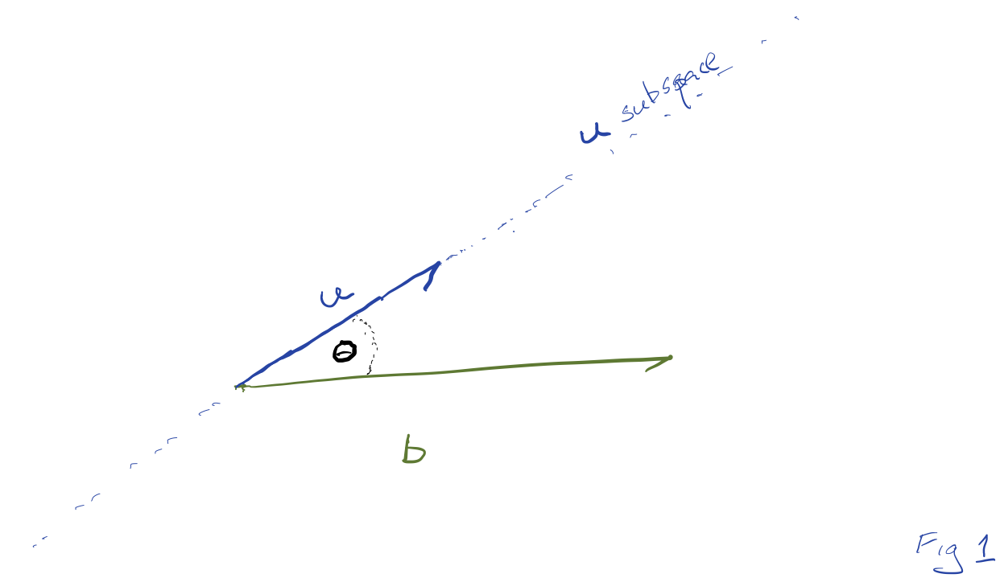
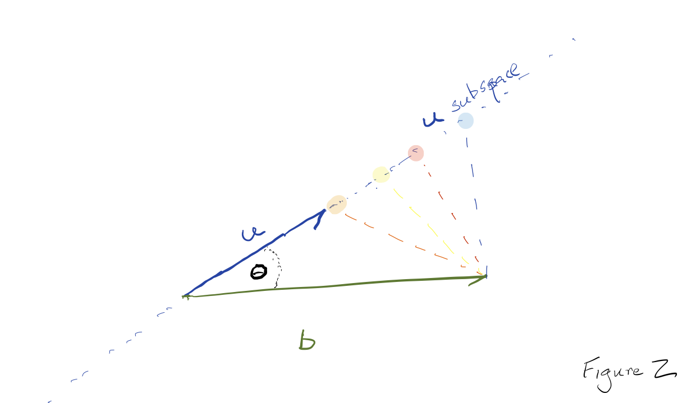
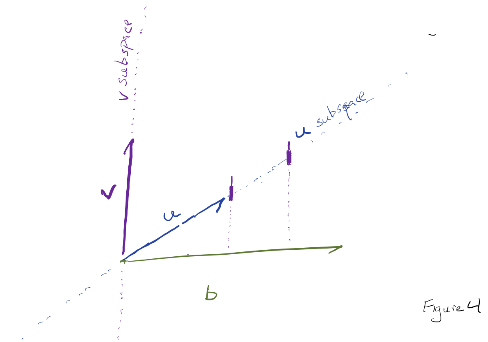

# Projection & residual {#projection-residual}

In the previous chapter, we took linear combinations of vectors. Using the notation of ***matrices***, we solved the problem
$$\text{previous chapter:}\ \ {\mathbf A}\, \vec{x} = \vec{?}$$ where $\vec{x}$ is a column of coefficients, one coefficient for each of the columns in the matrix ${\mathbf A}$. Finding $\vec{?}$ is a simple, if somewhat tedious, matter of multiplication. 

$$\text{this chapter:}\ \ {\mathbf A}\, \vec{?} = \vec{b}$$
In other words, the task of this chapter is to show how to solve ${\mathbf A} \vec{x} = \vec{b}$ when we know the result of the linear combination $\vec{b}$, and the set of vectors being combined, $\mathbf M$, but we don't yet know $\vec{x}$. 

As motivation for this "find $\vec{x}$" problem, we refer you to Figure \@ref(fig:water-dots) which showed the temperature-vs-time data from the `CoolingWater` data frame. That figure shows several possible linear combinations of the vectors $u(t) \equiv e^{-0.02 t}$ (we called this `expkt`) and $v(t) \equiv 1$ (we called this `intercept`. Suppose we seek to find the particular linear combination of $u(t)$ and $v(t)$ that comes as close as possible to the black dots in the figure. That is, we know ${\mathbf A}$: the two columns `expkt` and `intercept` from the data frame, and we know $\vec{b}$: the column `temp` from the data frame. 

This sort of problem is extremely common and important throughout quantitative fields of all sorts, from astronomy to zoology, and is one of the foundation techniques in statistics and data science. We'll present the approach graphically, algorithmically, and computationally.

::: {.takenote data-latex=""}
Let's highlight the three different modes in which we're going to introduce the topic of projection and residual. Ultimately, in your professional work, you will rely on

***computation***, getting the computer to do the work. For us in this chapter, the basic R functions you will use are `rbind()`, `cbind()`, `qr.solve()`, and "matrix multiplication" `%*%`, as well as the usual addition, subtraction, division, square root, and scalar multiplication.^[Scalar multiplication is just the regular sort of multiplication that you grew up with, as in $3 \times 4 \rightarrow 12$. We call it "scalar multiplication" to make it clear that we are not talking about "matrix multiplication." Terms such as "scalar multiplication are called [retronyms](https://www.merriam-webster.com/dictionary/retronym), a modification to a long-existing word that has become ambiguous because of the introduction of a new equivalent. Example: the existing "mail" was at first supplemented by "e-mail". Now that e-mail is more common than the old-fashioned postal kind, the retronym "snail mail" is used to indicate the kind delivered by postal workers.] 

As we introduce them, you will want to make sure you know exactly what each of `rbind()`, `cbind()`, `qr.solve()`, and `%*%` are used for. In the world of linear combinations, these are fundamental operations.

**algorithmic** describes a process of carrying out an operation. The R operators `qr.solve()` and `%*%` (and others!) are implemented as software. That software describes a series of steps to accomplish the operation. With linear combinations, most of those steps are **arithmetic** as with the dot product and vector length.

We will show the arithmetic steps for the vector operations in the simple case of one, two, or three vectors. The generalization to more vectors requires the organizational principles provided by computer languages, and this is not a course in computer programming. By rendering the operations of linear combinations in arithmetic, we hope to provide a better understanding of what's happening in the operations so you can be an aware consumer of the output of computer programmers.

**geometrically** in two and three dimensions. We humans have powerful intuitive abilities to make sense of simple geometric constructions. Since many people are able to assimilate simple geometry more readily than arithmetic, the geometric presentation provides a good alternative route to understanding the mathematics of linear combinations, even though it's restricted to the simple situations of two and three dimensional space.

Again, ultimately professionals use the **computational** tools for working out tasks in linear combinations. You will use those tools better if you can think about them in terms of arithmetic and geometry. 
:::


## Projecting a vector onto another vector

We'll start with one of the most fundamental operations: projecting one vector onto another. The geometric situation is shown in Figure \@ref(fig:proj1). In our notation, we will **always** write the vector being projected as $\vec{b}$ or some variation of the letter "b." The vectors onto which $\vec{b}$ is being projected will be written $\vec{u}$, $\vec{v}$, and so on. In this section, there is only a single vector being projected onto, and we're calling it $\vec{u}$.

```{r proj1, echo=FALSE, fig.cap="Two vectors. Vector $\\vec{b}$ is to be projected onto vector $\\vec{u}$."}

```

A physical analogy for projection is the casting of shadows on a screen in the same manner as an old-fashioned slide projector or movie projector. The vector $\vec{u}$ is the screen. The light source is arranged to generate parallel rays which arrive perpendicularly to the screen. In this situation, the shadow cast by $\vec{b}$ on the screen $\vec{u}$ is the "projection of $\vec{b}$ onto $\vec{u}$."

In terms of vector-language, the projection of $\vec{b}$ onto $\vec{u}$ is the vector $\alpha\,\vec{u}$ where the scalar multiplier $\alpha$ is selected to place $\alpha\,\vec{u}$ as **close as possible** to $\vec{b}$.

What do we mean exactly by "as close as possible?" We need to render this into vector-language. We'll do this by a combination of length and vector subtraction. For any scalar value of $\alpha$, there is a vector $\vec{b} - \alpha\, \vec{u}$. Figure \@ref(fig:proj-2) shows the situation for a handful of candidates for $\alpha$. As always, the vector $\alpha\,\vec{u}$ lies on the linear subspace defined by $\vec{u}$. Supposing that $\alpha = 2$, corresponding to the blue dot in Figure \@ref(fig:proj-2), the vector $\vec{b} - \alpha\,\vec{u}$ is the vector extending from the blue dot to the tip of $\vec{b}$.

```{r proj-2, echo=FALSE, fig.cap="The vector $\\alpha\\,\\vec{u}$ is shown for several values of $\\alpha$$, each value being marked by a colored dot. (The values shown are roughly $\alpha =\ $1.1 (orange), 1.3 (yellow), 1.6 (red), and 2.0 (blue).) The vector $\\vec{b} - \\alpha\\,\\vec{u}$ for each of the colors is indicated by a dashed line connecting the tip of $\\alpha\\,\\vec{u}$ to the tip of $\\vec{b}$."}

```

In this context, "as close as possible" means the value of $\alpha$ that makes the length $\| \vec{b} - \alpha\,\vec{u} \|$ as small as possible. It's possible for many people to find the argmin $\alpha^\star$ by eye. In the Figure, the orange and blue dots are clearly not the best. Yellow and red are about the same length, with yellow winning by a hair.

The vector $\vec{b} - \alpha^\star\,\vec{u}$ will always be perpendicular to $\vec{u}$. In other words, the three vectors $\vec{b}$, $\alpha^\star\,\vec{u}$, and $\vec{b}-\alpha^\star\,\vec{u}$ will constitute the sides of a ***right triangle***, with $\vec{b}$ as the hypothenuse. This gives an important clue to finding $\alpha^\star$ arithmetically. The **length** of $\alpha^\star\, u$ will be, using the trigonometry of right triangles, $\|\vec{b}\| \cos(\theta)$, where $\theta$ is the angle between $\vec{u}$ and $\vec{b}$. Recall that
$$\cos(\theta) = \frac{\vec{u}\cdot \vec{b}}{\|\vec{u}\|\ \|\vec{b}\|}\ .$$

Consequently, $$\|\vec{b}\| \cos(\theta) = \frac{\vec{u}\cdot \vec{b}}{\|\vec{u}\|}$$

The above quantity is a length. But the projection of $\vec{b}$ onto $\vec{u}$ will be a vector. Since we know $\vec{u}$, we know the direction of the result of the projection. and the previous formula gives  the length. We can create the ***unit-length vector*** pointing in the direction of $\vec{u}$ by appropriate scaling: $\vec{u} / \|\vec{u} \|$. So the projection of $\vec{b}$ onto $\vec{u}$, which we'll denote by $\overset{\longrightarrow}{b \|_{u}}$ is
$$\overset{\longrightarrow}{{b}\|_{u}} = \underbrace{\frac{\vec{u}\cdot\vec{b}}{\|\vec{u}\|}}_\text{length}\underbrace{\frac{\vec{u}}{\|\vec{u} \|}}_\text{direction} = \frac{\vec{u}\cdot\vec{b}}{\vec{u}\cdot\vec{u}} \vec{u} = \alpha^\star\,\vec{u}$$

Read $\overset{\longrightarrow}{b \|_{u}}$ as "the component of $\vec{b}$ parallel to $\vec{u}$," or as "$\vec{b}$ projected onto $\vec{u}$."

Remember that the vector $\vec{b} - \alpha^\star\, \vec{u}$ is perpendicular to $\vec{u}$ and connects $\overset{\longrightarrow}{b \|_{u}}$ to $\vec{b}$. This vector, called the ***residual vector*** in statistics, we will denote with 
$$\overset{\longrightarrow}{b\! \perp_u}$$
which you can pronounce as "the component of $\vec{b}$ **perpendicular** to $\vec{u}$," or as "the residual from projecting $\vec{b}$ onto $\vec{u}$." Adding up the projection of $\vec{b}$ onto $\vec{u}$ and the residual vector from that projection reproduces the original $\vec{b}$:

$$\overset{\longrightarrow}{b\|_u}\ +\ \overset{\longrightarrow}{b\! \perp_u} = \vec{b}\ .$$

::: {.todo}
MOVE THESE FUNCTIONS to `{mosaicCalc}`. We're going to give the students some training wheels
```{r}
`%dot%` <- function(u, v) {
  sum(u * v)
}
`%onto%` <- function(b, A) {
  A %*% qr.solve(A, b)
}
`%perp%` <- function(b, A) {
  b - (b %onto% A)
}
as_unit <- function(A) {
  helper <- function(v) { v / sqrt(sum(v^2)) }
  apply(A, 2, helper)
}
as_mag <- function(A, method=c("2", "O", "I", "F", "M")) {
  method <- match.arg(method)
  helper <- function(v) {Matrix::norm(v, type=method)}
  
  apply(A, 2, helper)
}
```

Using the geometry of vectors and a little bit of trigonometry, we have now created the arithmetic formulas needed to:

i. **Project a vector $\vec{b}$ onto another vector $\vec{u}$**, and
ii. **Find the residual vector from the projection.**

To help you make the transition from arithmetic to computation, we provide you with two training-wheel functions, `%onto%` and `%perp`. Use them like this:

```{r}
b <- rbind(3, 1, 7, 4)
u <- rbind(1,1,1,1)
b %onto% u
b %perp% u
```
:::

::: {.example data-latex=""}
Using `%dot%`, `%perp%` and `%onto%` and two vectors $\vec{b}$ and $\vec{u}$ of your own choosing, demonstrate that 
$$\overset{\longrightarrow}{b\|_u}\ +\ \overset{\longrightarrow}{b\! \perp_u} = \vec{b}\|$$ and that $\overset{\longrightarrow}{b\|_u}$ is perpendicular to $\overset{\longrightarrow}{b\! \perp_u}$.

For instance, 
```{r}
# create your own vectors!
b <- rbind(8, -3, 2, 1, 4)
u <- rbind(1,  2, 1, 2, 3)
# demonstrate properties
projected <- b %onto% u
residual <- b %perp% u
projected + residual
projected %dot% residual
```
:::

::: {.example data-latex=""}
Show that $\overset{\longrightarrow}{b\|_u}$ is parallel to $\vec{u}$.

Two vectors are parallel if one of them is a scalar multiple of the other. 
For instance, suppose we have three vectors $\vec{u}$, $\vec{v}$, and $\vec{w}$, like this:
```{r}
u <- rbind(1, 2, 3)
v <- rbind(2, 4, 6)
b <- rbind(3, 1, 2)
```

Notice that $\vec{v} = 2 \vec{u}$, that is, $\vec{u}$ and $\vec{v}$ are parallel. Here's what we get when we divide $\vec{v}$ by $\vec{u}$ on a component-by-component basis:
```{r}
v / u
```

Every component of $\vec{v}$ is the same multiple of the corresponding component of $\vec{u}$.

On the other hand, $\vec{b}$ is not a scalar multiple of $\vec{u}$. Consequently:
```{r}
b / u
```
The component-by-component multipliers are not all the same.

Now to show $\overset{\longrightarrow}{b\|_u}$ is parallel to $\vec{u}$. First, we'll compute $\overset{\longrightarrow}{b\|_u}$ and then divide it, component-by-component, by $\vec{u}$
```{r}
(b %onto% u) / u
```
In contrast, $\overset{\longrightarrow}{b\!\perp_u}$ is, obviously, not parallel to $\vec{u}$:
```{r}
(b %perp% u) / u
```
:::


::: {.example data-latex=""}
Find the scalar multiplier $\alpha^\star$ such that $$\overset{\longrightarrow}{b\!\perp_u} = \alpha^\star\,\vec{u}\ .$$

This is just a matter of dividing $\overset{\longrightarrow}{b\!\perp_u}$ by $\vec{u}$ on a component-by-component basis:

```{r}
(b %onto% u) / u
```
We see that $\alpha^\star = 0.7857143$.

:::


::: {.takenote data-latex=""}
You should commit the commands used in the previous demonstrations to memory, making sure you understand what each of the commands in the demonstration is doing.
:::


## Projection onto a set of vectors

THERE'S SOMETHING MISSING. A FORGOTTEN PUSH from the laptop?


As we have just seen, projecting a target $\vec{b}$ onto a single vector is a matter of arithmetic:
$$\overset{\longrightarrow}{b\|_u} = \frac{\vec{u}\cdot\vec{b}}{\vec{u}\cdot\vec{u}} \vec{u}$$
Now we take on the problem of projecting the target $\vec{b}$ onto a **set of vectors**. Figure \@ref(fig:telescope) shows the general case with vector $\vec{b}$ to be approached by a linear combination of $\vec{u}$ and $\vec{v}$.

An early variation of this problem appears in Robert Louis Stevenson's famous novel, *Treasure Island*. The story is about the discovery of a treasure map indicating the location of buried treasure on the eponymous Island. There is a red X on the map labelled "bulk of treasure here," but that is hardly sufficient to guide the dig for treasure. But on the back of the map is written a cryptic clue to the precise location:

> Tall tree, Spy-glass shoulder, bearing a point to the N. of N.N.E.     
Skeleton Island E.S.E. and by E.    
Ten feet.

Skeleton Island is clearly marked on the map, as is Spy-glass Hill. The plateau marked by the red X "was dotted thickly with pine-trees of varying height. Every here and there, one of a different species rose forty or fifty feed clear above its neighbours." But which of these was the "tall tree" mentioned in the clue.

Long John Silver, obviously an accomplished mathematician, starts near Skeleton Island, moving on along the vector that keeps Skeleton Island to the compass bearing one point east of east-south-east. While on the march, he keeps a telescope trained on the shoulder of Spy-glass Hill. The goal  When that telescope points one point north of north-north-east, they are in the vicinity of a tall tree. That's the tree matching the crew.

A similar strategy works for the general problem of projection. As in Figure \@ref(fig:telescope), you walk along vector $\vec{u}$. As you walk, you keep a telescope trained in the direction marked by vector $\vec{v}$. When the tip of $\vec{b}$ falls on the telescope's cross-hairs, you can mark the projection coefficient on $\vec{u}$. All that remains is to measure the distance from there to $\vec{b}$. In Figure \@ref(fig:telescope), two steps along $\vec{u}$ brings you to a spot on the $\vec{u}$-subspace where the telescope aligned with $\vec{v}$ points at the tip of $\vec{b}$. From there, you will need -1 step along $\vec{v}$ to reach $\vec{b}$. Thus, the linear combination that matches $\vec{b}$ is
$$\vec{b} = 2 \vec{u} - 1 \vec{v}\ .$$


```{r telescope, echo=FALSE, fig.cap="The telescope method of solving projection onto two vectors."}

```

With two vectors $\vec{u}$ and $\vec{v}$ in two-dimensional space, there is a linear combination that will match *any* $\vec{b}$ in that space.

A more general situation is an $n$-dimensional space with only $p < n$ vectors to form the linear combination. Typically, the target $\vec{b}$ will not be in the subspace spanned by the p vectors. We can illustrate using 3-dimensional space and two vectors $\vec{u}$ and $\vec{v}$ to be linearly combined.

```{r echo=FALSE}
# the vectors in the following plot
u <- rbind(-1, 1, 0)
v <- rbind(2, 1, 0)
b <- rbind(.5, 2, 2.5)
A <- cbind(u, v)
b %onto% A
b %perp% A

```

<p style="text-align:center">
<iframe frameborder="0" height="480px" 
        src="https://c3d.libretexts.org/CalcPlot3D/dynamicFigure/index.html?type=jaxlabel;position=middle;math=%255Cpsi_%257Bn_x%252Cn_y%257D;textonly=false&type=vector;vector=%3C2,1,0%3E;visible=true;color=rgb(17,109,192);size=2;initialpt=(0,0,0)&type=vector;vector=%3C-1,1,0%3E;visible=true;color=rgb(208,20,240);size=2;initialpt=(0,0,0)&type=vector;vector=%3C1/2,2,2.5%3E;visible=true;color=rgb(106,168,79);size=2;initialpt=(0,0,0)&type=parametric;parametric=2;x=2sin(v)*cos(u);y=2sin(v)*sin(u);z=2cos(v);visible=false;umin=0;umax=2pi;usteps=30;vmin=0;vmax=pi;vsteps=15;alpha=-1;hidemyedges=false;view=0;format=normal;constcol=rgb(255,0,0)&type=z;z=0;visible=true;umin=-2;umax=2;vmin=-2;vmax=2;grid=30;format=normal;alpha=51;hidemyedges=true;constcol=rgb(255,0,0);view=0;contourcolor=red;fixdomain=false;contourplot=true;showcontourplot=false;firstvalue=-1;stepsize=0.2;numlevels=11;list=;xnum=46;ynum=46;show2d=false;hidesurface=false;hidelabels=true;showprojections=false;surfacecontours=true;projectioncolor=rgba(255,0,0,1);showxygrid=false;showxygridonbox=true;showconstraint=false&type=vector;vector=%3C.5,2,0%3E;visible=true;color=rgb(173,255,0);size=2;initialpt=(0,0,0)&type=vector;vector=%3C0,0,2.5%3E;visible=true;color=rgb(255,0,0);size=2;initialpt=(.5,2,0)&type=text;text=Target%3A%20b;visible=true;point=(1/2,1,1.4);color=rgb(106,168,79);font=Arial;fontsize=14pt;bold=true;italic=false;fontmath=true;align=Lower-right&type=text;text=Residual;visible=true;point=(.5,2,1);color=rgb(255,0,0);font=Arial;fontsize=11pt;bold=false;italic=false;fontmath=true;align=Upper-right&type=text;text=u;visible=true;point=(1,.6,0);color=rgb(17,109,192);font=Arial;fontsize=14pt;bold=true;italic=false;fontmath=true;align=Upper-right&type=text;text=v;visible=true;point=(-.6,.4,.1);color=rgb(208,20,240);font=Arial;fontsize=14pt;bold=true;italic=false;fontmath=true;align=Upper-right&type=window;hsrmode=0;nomidpts=true;anaglyph=-1;center=-0.4822344390871397,-2.5892131963621314,9.64693863199627,1;focus=0,0,0,1;up=-0.2643040221980104,0.9346987625406009,0.2376585936906613,1;transparent=false;alpha=140;twoviews=false;unlinkviews=false;axisextension=0.7;xaxislabel=x;yaxislabel=y;zaxislabel=z;edgeson=true;faceson=true;showbox=false;showaxes=false;showticks=true;perspective=true;centerxpercent=0.5;centerypercent=0.5;rotationsteps=30;autospin=true;xygrid=false;yzgrid=false;xzgrid=false;gridsonbox=true;gridplanes=true;gridcolor=rgb(128,128,128);xmin=-2;xmax=2;ymin=-2;ymax=2;zmin=-2;zmax=2;xscale=1;yscale=1;zscale=1;zcmin=-4;zcmax=4;xscalefactor=1;yscalefactor=1;zscalefactor=1;tracemode=0;keep2d=false;zoom=1.088235"
        width="90%">
</iframe>
</p>
🔗


Of course, a set of vectors is simply a ***matrix***, so we'll cast the problem as one of projecting $\vec{b}$ onto a matrix $\mathbf A$.

There is one case that is extremely simple: when the vectors in $\mathbf A$ are ***mutually orthogonal***. Let's make sure we understand this case well. The geometry is simple, as in Figure \@ref(fig:orthog-A).

```{r orthog-A, echo=FALSE, fig.cap="Projecting $\\vec{b}$ onto two orthogonal vectors. REPLACE THIS WITH THE ACTUAL IMAGE."}

```

To demonstrate the projection a bit more generally, let's set up 3 orthogonal vectors in a four-dimensional space as $\mathbf A$:
```{r}
u <- rbind(2, 3, 0, 6)
v <- rbind(0,-2,-2, 1)
w <- rbind(3,-2, 2, 0)
b <- rbind(1, 1, 1, 1)
A <- cbind(u, v, w)
```
You should be able to confirm with simple arithmetic that $\vec{u}$ is orthogonal to $\vec{v}$, that $\vec{u}$ is orthogonal to $\vec{w}$, and that $\vec{w}$ is orthogonal to $\vec{v}$. (Hint: Use the dot product.) You can also see that $\vec{b}$ is not parallel to any one of the three columns in ${\mathbf A}$.

We'll compute the correct answer and then see how we could do it with simple arithmetic.
```{r}
b %onto% A
qr.solve(A, b)
```
This is telling us that 
$$\overset{\longrightarrow}{b\|_{\mathbf A}} = \left[\begin{array}{r}0.9783914
\\0.9871949
\\1.0196078
\\1.0136054\end{array}\right] = 0.2244898 \vec{u} - 0.3333333 \vec{v} + 0.1764706 \vec{w}$$

We can find the coefficients of the linear combination with simple, independent uses of the formula for projecting $\vec{b}$ onto each of the columns of ${\mathbf A}$ one at a time:
```{r}
(b %dot% u) / (u %dot% u)
(b %dot% v) / (v %dot% v)
(b %dot% w) / (w %dot% w)
```

This simple procedure of independent projections **does not work** if the columns of $\mathbf A$ are **not mutually orthogonal***. For instance:
```{r}
u <- rbind(1,2,3,4)
v <- rbind(4,3,2,5)
A2 <- cbind(u, v)
# The right coefficients
qr.solve(A2, b)
# Independent projections give a different result
(b %dot% u) / (u %dot% u)
(b %dot% v) / (v %dot% v)
```

Since independent projections won't solve the target problem (when the columns of $\mathbf A$ are not mutually orthogonal), how do we solve it?

The strategy is two simplify the problem by constructing from $\mathbf A$ another matrix that we'll call  $\mathbf Q$ which spans exactly the same subspace as $\mathbf A$ but which has mutually orthogonal columns.

To start, well set the first column of $\mathbf Q$ to be any one of the vectors in $\mathbf A$. We'll use $\vec{u}$ for the example.

The second column of $\mathbf Q$ will be based on one of the remaining vectors, say $\vec{v}$. But $\vec{v}$ is not orthogonal to $\vec{u}$. For the second column of $\mathbf Q$ we'll insert not $\vec{v}$ itself, but the component of $\vec{v}$ that is orthogonal to $\vec{u}$, that is:
$$\overset{\longrightarrow}{v\!\perp_u} = \vec{v} - \frac{\vec{u}\cdot\vec{v}}{\vec{u}\cdot\vec{u}} \vec{u}$$
In computer notation, we'll refer to $\overset{\longrightarrow}{v\!\perp_u}$ with the name `v_perp_u`.

```{r}
coef <- ((u %dot% v) / (u %dot% u))
coef
v_perp_u <- v - coef * u
```

Now the ${\mathbf Q}$ matrix is
$${\mathbf Q} \equiv \left[\begin{array}{cc}|&|\\ \vec{u}&\overset{\longrightarrow}{v\!\perp_u}\\|&|\end{array}\right]$$
Caution: The next few paragraphs are rough going. It suffices to follow the flow of the argument and to note that the only operations used are scalar multiplication, addition, subtraction, and the simple dot-product form for the coefficient produced by projecting one vector onto another vector.

Since $\vec{u}$ and $\overset{\longrightarrow}{v\!\perp_u}$ are orthogonal, we can easily calculate the coefficients on the two vectors for projecting $\vec{b}$ onto the subspace spanned by $\mathbf Q$.

```{r}
alpha1 <- (u %dot% b) / (u %dot% u)
alpha1
alpha2 <- (v_perp_u %dot% b) / (v_perp_u %dot% v_perp_u)
alpha2
```

These coefficients---$\alpha_1 =\ $`r alpha1` and $\alpha_2 =\ $`r alpha2` respectively, when multiplied by $\vec{u}$ and $\overset{\longrightarrow}{v\!\perp_u}$ will give us the projection of $\vec{b}$ onto the subspace spanned by ${\mathbf Q}$. Since the subspace spanned by ${\mathbf Q}$ is exactly the same as the subspace spanned by ${\mathbf A}$, we have the answer for $\overset{\longrightarrow}{b\|_{\mathbf A}}$ and consequently for $$\overset{\longrightarrow}{b\!\perp_{\mathbf A}} = \vec{b} - \overset{\longrightarrow}{b\|_{\mathbf A}}\ .$$

In terms of the coefficients, the projection of $\vec{b}$ onto $\mathbf A$ is 
$$\overset{\longrightarrow}{b\|_{\mathbf A}} = 0.3333333 \vec{u} + 0.1851852 \overset{\longrightarrow}{v\!\perp_u}$$
These are not the coefficients on $\vec{u}$ and $\vec{v}$ that we originally sought. But recognizing that $\overset{\longrightarrow}{v\!\perp_u} = v - 1.2 \vec{u}$, we have 
$$\overset{\longrightarrow}{b\|_{\mathbf A}} = 0.3333333 \vec{u} + 0.1851852 \left[\strut \vec{v} - 1.2 \vec{u}\right] \\= [0.3333333 - 1.2\times0.1851852] \vec{u} + 0.1851852 \vec{v}\\= 0.1111111 \vec{u} + 0.1851852 \vec{v}$$
These coefficients on $\vec{u}$ and $\vec{v}$ are the ones we sought and the ones produced by the professional software.
```{r}
qr.solve(A2, b)
```


Of course, nobody would want to undertake the process described above in the step-by-step fashion we've followed. In addition to being hard to follow, it's hard to avoid making mistakes along the way. Fortunately, expert programmers have done the work for us and encapsulated the process in a software function. For us using R, that function is `qr.solve()`.

The result is that we now have a way to solve the target problem, finding the coefficients on for the linear combination of a set of vectors that will bring us as close as possible to a target $\vec{b}$.

In the next chapter, we'll use this capability to solve real-world modeling problems. 

 
## Exercises

`r insert_calcZ_exercise("XX.XX", "wniqMc", "Exercises/panda-begin-shoe.Rmd")`

`r insert_calcZ_exercise("XX.XX", "yeY17y", "Exercises/kangaroo-light-bowl.Rmd")`

Exercises confirming that `qr.solve()` produces results that are as they should be: residual orthogonal to every vector in A, projected + residual = $\vec{b}$.

Exercises confirming that adding more columns to A produces a smaller residual.

Demonstration that even random vectors can be combined to exactly equal $\vec{b}$, so long as we have enough of them.

`r insert_calcZ_exercise("XX.XX", "p209w8", "Exercises/beech-build-shirt.Rmd")`


`r insert_calcZ_exercise("XX.XX", "dvWdE7", "Exercises/puppy-dream-spoon.Rmd")`


a. Calculate the angle between two vectors
    i. arithmetically, using dot product
    ii. graphically, using protractor
b. Find a nonzero vector orthogonal to a given vector
c. Calculate the projection of a vector onto another vector
    i. arithmetically with dot product
    ii. graphically
d. Decompose a vector into a residual and a component directed along a second vector
    i. graphically
    ii. arithmetically


Our goal is to scale the `expkt` vector so that the scaled numbers will be as close as possible to our destination, namely, `temp`. Comparing the two columns of numbers, you might anticipate that the scalar will be about 100. We'll see how to calculate it exactly in the next chapter. The result turns out to be 99.23. The resulting model will be $$T(t) = 99.23\, e^{-0.02 t}\ .$$

How are we to judge whether this is a good model or not? Common sense suggests plotting out the model function along with the data, as in Figure \@ref(fig:just-exp).

```{r just-exp, echo=FALSE, fig.cap="Comparing the model $99.23\\, e^{-0.02 t}$ to the recorded data in `CoolingWater."}
gf_point(temp ~ time, data = CW) %>%
  slice_plot(99.23*exp(-0.02*time) ~ time, color="magenta")

```

Judge for yourself whether this is a good model. The obvious deficiency is that the model falls, as decaying exponentials will do, toward a temperature of 0, whereas the water is cooling to a room temperature of about 25 degrees.

Let's return to the model seen in terms of vectors. The advantage of doing this is to develop a general procedure we can use for interpreting models of all sorts, rather than just the particular situation of the cooling-water data.

What are the geometric facts? We know that the `temp` vector has length 251.3 deg C. Similarly we can calculate the length of the `expkt` vector: 2.46 deg C. 

It might seem that the "direction" of the vector is meaningless, because it's a direction in an abstract, hard-to-envision 15-dimensional space. (There are 15 components to each of `temp` and `expkt`.) Even so, we can calculate the ***angle*** between the two vectors, using the formula $\cos(\theta) = \frac{\vec{v}\cdot \vec{w}}{\|\vec{v}\|\ \|\vec{w}\|}$. Doing the arithmetic gives $$\cos{\theta} = \frac{599.8}{251.3 \times 2.46} = 0.9708\ \ \implies \ \ \ \theta = 13.88^\circ$$

```{r temp-expkt-picture, echo=FALSE, fig.cap="The vectors `temp` and `expkt` have an angle of 13.88 deg between them. Here, `expkt` has been drawn 10x it's actual size."}
gvec(from = c(0,0), to = c(250, 25.1), color = "black") %>%
  gf_segment(0 + 3*28.8 ~ 0 + 3*116.5, 
             color="magenta", linetype = "dotted") %>%
  gvec(from=c(0,0), to = 2*c(11.6, 2.88), color="magenta") %>%
  gf_refine(coord_fixed())
```

With these geometrical facts, we can draw a picture. Figure \@ref(fig:temp-expkt-picture) shows `temp` in black and `expkt` in magenta. (We've drawn it 10 times as long as it really is so that you can see it well.) For the `expkt` vector to be a good model of `temp`, we need to scale it so that the result, which must be on the dotted line in the picture, is as close as possible to the tip of `temp`. You can count off yourself how many `expkt` steps will bring you close to `temp`. (Remember to multiply your result by 10, since in the picture we drew `expkt` ten times longer than its arithmetic length.)

One reasonable way to quantify how good a model of `temp` can be made by a properly scaled version of vector `expkt` is the angle between them: 13.88 degrees. 

Likewise, we can scale the vector `intercept` to make it match `temp` as well as possible. The angle between `intercept` and `temp` works out to be 75.7 degrees; the vectors are not very well aligned. Scaling by 58.2 will bring `intercept` as close as it is ever going to get to `temp`, which is not very close at all.

The idea of a linear combination is to scale and add multiple vectors. As a **very rough start**, let's look at the combination 58.2 `intercept` + 99.23 `expkt`, the combination of the two individual models we constructed by vector analogy. CAUTION: The model will be poor. That's not because the vector analogy is poor but because we still have to work out, as we will in the next two chapters, how properly to work with vectors. 

```{r}
CW <- CW %>% 
  mutate(model = 99.23*expkt + 58.2*intercept)
```

```{r echo=FALSE}
knitr::kable(CW) %>% kableExtra::kable_minimal()
```

The resulting model is ... well, terrible! Figure \@ref(fig:two-temp-models) shows the linear combination 

```{r two-temp-models, echo=FALSE}
gf_point(temp ~ time, data = CW) %>%
  gf_point(model ~ time, data = CW, color="magenta") %>%
  slice_plot(58.2+ 99.23*exp(-0.02*time) ~ time, color="magenta")
```

EXERCISE: Repeat the calculations for the entire `CoolingData` data frame.


Adding vectors. The result is a vector

Scaling and adding vectors: a linear combination of vectors.


## MOVED FROM VECTORS


A pencil is a physical object that does a good job representing a vector in three dimensional space. Three-dimensional space is all around us and it's easy---indeed, inevitable---to situate a pencil in it. We have no such physical access to 4-dimensional space or higher-dimensional spaces. Instead of a physical representation, we need to rely on a mathematical one: a column of numbers. And we can't use a protractor to measure the angle between two vectors in 4- or higher-dimensional space. Instead, we calculate the angle using arithmetic. But to define the numerical process for calculating an angle, we need to make sure that the result follows the familiar conventions for angles, specifically that they be between 0 and 180 degrees, that the angle between two vectors with the same orientation is 0, and that the angle between two opposite-pointing vectors is 180 degrees.

The arithmetic formula for computing the angle between two vectors is simple. Or, rather, it's simple if we allow ourselves to calculate the cosine of the angle rather than the angle $\theta$ itself. The underlying quantity can be calculated using dot products: 
$$\cos(\theta) \equiv \frac{\vec{v}^T \cdot \vec{w}}{\sqrt{\strut (\vec{v}^T\cdot \vec{v})(\vec{w}^T\cdot \vec{w})}}$$


A starting  point  is creating a vector on the computer. In  some sense this a vector is just a collection  of numbers, but it's helpful  to  be disciplined  and  remember that, for our purposes, a  vector is  a **column** of numbers. R knows about such columns and will  handle them appropriately.

One way to create a column vector is with  the  `rbind()` function.

use the  `rbind()` function applied to individual arguments. Here,  for instance,  is a command that makes a three-dimensional vector we are calling `b`.

```{r}
b <- rbind(4, -2, 6)
b
```

Notice that in  printing out a  vector, R  includes a series of indices  (e.g. `[1,]` or `[3,]`) to help the reader identify the location  of any element in  the vector. It also  prints a header (`[,1]`) which  is helpful later when we work with  collections of vectors.

## Matrix

You are going to hear the word "matrix" a lot.  Later in  this tutorial we will use the term "matrix multiplication." A matrix is a collection  of  vectors, all of the same dimension. We'll get to them  in good time.  

## Scalar multiplication

You  can multiply a vector times  a  number. The result is a new vector with exactly the  same direction as  the original, but with  a different length. The  arithmetic  is  very  simple: do ordinary multiplication  of the number by  each of the elements  of the  vector. Examples:

$$2 \left(\begin{array}{c}4\\7\end{array}\right) = \left(\begin{array}{c}8\\14\end{array}\right)$$

This  simple  multiplication is called "scalar multiplication" for two  reasons:

1. The result is to "scale" the vector, in the sense of a  "scale  model",  that  is, to make the vector bigger or smaller.
2. There is another important form of vector  arithmetic called "matrix multiplication." By  saying  "scalar multiplication,"  we avoid the  confusion  that might arise if  we  used "multiplication" alone.

In R, scalar multiplication of a vector is  done with `*`, just like ordinary multiplication   with numbers:

```{r echo=TRUE}
b <- rbind(4, -2, 6)
2.3 * b
```

::: {.example data-latex=""}
In a `r sandbox_link()`, Write  the  R  code to create a vector named `w` with  components 4, -1,  and -3.5.  Then scalar multiply `w` by 6.3.

```{r echo=TRUE, eval=FALSE} 
w <- _______
6.3 _______ w
```

<details>
<summary>Solution</summary>
```{r}
w <- rbind(4,  -1,  -3.5)
6.3 *  w
```
</details>
:::

## Dot product and `%*%`

Now to  introduce  a new R arithmetic function, written `%*%`. This symbol is pronounced "matrix multiply."  In traditional mathematical notation, matrix multiplication is indicated by putting the two quantities next to one another, like this: $\vec{\mathbf m}^T \vec{\mathbf x}$, or sometimes with a dot $\vec{\mathbf m}T\cdot \vec{\mathbf x}$. The superscript $^T$ means "transpose." For us, this  is merely a  book-keeping convention.

The operation `%*%` will do several  different types  of  arithmetic  with  vectors. The one we will work with here is  called  a *dot product*.  (There are  also "matrix products"  and "outer products".)

The R notation for a dot product very  much echoes the  traditional matrix  notation,  at least  with  respect to $^T$.  We'll  illustrate by creating  two vectors `u`  and `v` and then calculating their dot  product.

```{r}
u <- rbind(6, -3,  7)
v <- rbind(2,  1,  3)
t(u) %*%  v
```

Notice  that the  output  of a dot product is  a single number: a scalar. (R prints the output as if the scalar were  a vector in one-dimension.)

Arithmetically, the dot product is calculated by multiplying the corresponding components in the two vectors  (e.g.  $6  \times 2$ and  $-3 \times 1$ and  $7 \times 3$) and adding up the  result. You can see why the dot product always involves two vectors with the same number of elements.

The R `t()` function corresponds to  the mathematical notation for the transpose: $^T$. So `t(u)` would be written, mathematically, as $\vec{u}^T$. The  purpose of `t()` is to turn columns (like our vector `u`) into rows,  and vice versa.  If you  like,  try the command `t(u)` in  the sandbox to see how it  is printed.

For us,  the purpose of writing `t(u)` is  to signal  to  the `%*%`  matrix multiplication  operation that we want a particular operation: the dot product.

The  dot product always involves the transpose of a column vector on  the left side of  `%*%`  and a column vector on  the right side.

You  can  also  write a command  `u %*% t(v)`,  but  this is not a  dot product. It is  called  an "outer product" and we will not need it in this course. Try it out in  the sandbox.

::: {.caution}
The ***dot product*** and the ***outer product*** are written in very similar ways but produce completely different results. We won't have much use for outer products in this course, but you should be aware what they look like so that you can diagnose the problem if your attempt at a dot product goes wrong.

**Dot products**
```{r}
t(u) %*% v
t(v) %*% u
```

**Outer product**
```{r}
u %*% t(v)
v %*% t(u)
```
:::


## Vector lengths

For  a vector $\vec{v}$, the  length is denoted $|| \vec{v} ||$. Vector length can  be measured with  a ruler ...  so long as you have physical access to  the vector. But often, all we have  is the numerical representation. So, we use arithmetic---the dot product---to calculate vector length: 
$$|| \vec{v}  || \equiv \sqrt{\ \vec{v}^T \cdot \vec{v}}$$

::: {.example data-latex=""}
Consider the two vectors 
$$\vec{u} \equiv \left(\begin{array}{c}3\\4\end{array}\right) \  \  \ \mbox{and}  \ \ \ \vec{w} \equiv \left(\begin{array}{c}1\\1\\1\\1\end{array}\right)
$$

The length of $\vec{u}$ is $|| \vec{u} || = \sqrt{\strut 3^2 + 4^2} = \sqrt{\strut 25} = 5$.

The length of $\vec{w}$ is $|| \vec{w} || = \sqrt{\strut 1^2 + 1^2 + 1^2 + 1^2} = \sqrt{\strut 4} = 2$.

Using a `r sandbox_link()`, use R commands to create the vectors $\vec{u}$ and $\vec{w}$ and find their lengths using the `dot-product operator`%*%` operator.

```{r eval=FALSE}
u <- rbind( ____ )
# length of u
sqrt( ____ %*% ____ )

v <- rbind( ______ )
# length of v
sqrt( ____ %*% ____ )
```

<details>
<summary>Solution</summary>
```{r}
u <- rbind(3, 4)
sqrt(t(u) %*% u)
w <- rbind(1, 1, 1, 1)
sqrt(t(w) %*% w)
```
</details>


## Outline

a. Write a system of linear equations as a "target problem" involving a linear combination of vectors. 
b. Definition of a linear combination of vectors.
c. Matrix is a collection of vectors
    i. Linear combination is written as matrix multiplied by vector
d. Solve target problem algebraically or graphically in two dimensions.
e. Subtracting vectors algebraically and graphically


