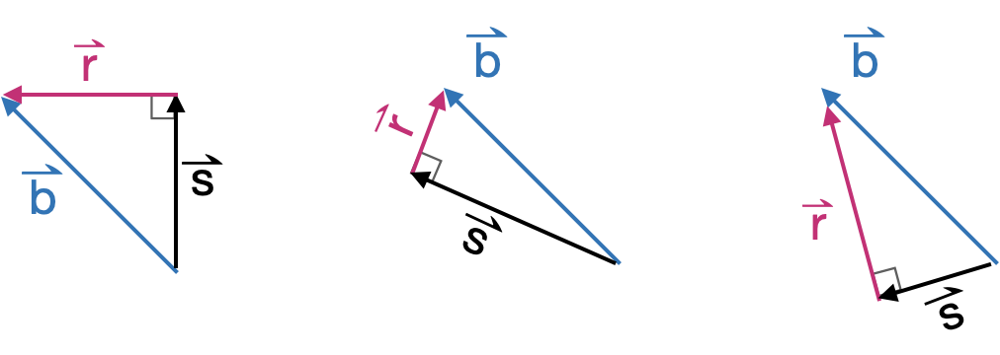

# Projection & residual {#projection-residual}

```{r include=FALSE}
library(Znotes)
```

::: {.underconstruction}
Chapter not yet released
:::

<div style="float:right;">[](https://github.com/ProjectMOSAIC/MOSAIC-Calculus/blob/main/Block-5/B5-projection.Rmd)</div>

Many problems in physics and engineering involve the task of ***decomposing*** a vector $\vec{b}$ into two perpendicular component vectors $\vec{s}$ and $\vec{r}$, such that $\vec{s} + \vec{r} = \vec{b}$ and 
$\vec{s} \cdot \vec{r} = 0$. There is an infinite number of ways to accomplish such a decomposition, one for each way or orienting $\vec{s}$ relative to $\vec{b}$. Figure \@ref(fig:decompose-1) shows a few examples.

```{r decompose-1, echo=FALSE, out.width="60%", fig.align="center", fig.cap="A few ways of decomposing $\\vec{b}$ into perpendicular components $\\vec{s}$ and $\\vec{r}$"}

```
::: {.example data-latex=""}
Gravitational force, as you know, always points downward. The effective acceleration due to gravity of a mass depends, however, on how that mass is situated with respect to other elements of the structure. The figure below shows several diagrams that might well be found on the pages of a physics textbook. In each diagram, there is a mass and a constraining structure: a ramp, a pendulum, an inclined plane. The force of gravity on the mass always points directly downward. In each diagram, $\vec{s}$ is the effective gravitational force on the mass, pointing down the ramp, or perpendicular to the pendulum strut, or aligned with the gradient vector of the inclined plane.

```{r echo=FALSE, out.width="100%", fig.align="center"}
knitr::include_graphics("www/gravity-settings.png")
```

The $\vec{r}$ in each diagram gives the component of gravitational force that will be counter-acted by the structure: the pull downward into the ramp, the pull along the pendulum strut, or the pull into the inclined plane.
:::

The task of ***decomposition*** is important also outside of physics and engineering. Our particular interest will be in finding how best to take a linear combination of the columns of a matrix $\mathit{A}$ in order to make the best approximation to a given vector $\vec{b}$. This problem solves all sorts of problems: finding a linear combination of functions to match a relationship laid out in data, constructing statistical models such as those found in machine learning, effortlessly solving sets of simultaneous linear equations with any number of equations and any number of unknowns.

## Projection terminology

The problem of decomposition can be considered to be a special case of ***projection***. The word "projection" may bring to mind the casting of shadows on a screen in the same manner as an old-fashioned slide projector or movie projector. The light source is arranged to generate parallel rays which arrive perpendicularly to the screen. A movie screen is two-dimensional, a subspace defined by two vectors. Imagining those two vectors to be collected into matrix $\mathit{A}$, the idea is to decompose $\vec{b}$ into a component that lies in the subspace defined by $\mathit{A}$ and another component that is perpendicular to the screen. That perpendicular component is what we have been calling $\vec{r}$ while the vector $\vec{s}$ is the projection of $\vec{b}$ onto the screen. To make it easier to keep track of the various roles played by $\vec{b}$, $\vec{s}$, $\vec{r}$ and $\mathit{A}$, we'll give these vectors English-language names. The motivation for these names will become apparent in later chapters, but for now, here they are. You will want to memorize them.

- $\vec{b}$ the ***target vector***
- $\vec{s}$ the ***model vector***
- $\vec{r}$ the ***residual vector***
- $\mathit{A}$ the ***model space*** (or "model subspace")

In projection problems, the model vector will always be a member of the model subspace. The residual vector will always be perpendicular to every vector in the model subspace. The target vector will always be exactly the sum of the model vector and the residual vector.

The ***target problem*** is to find the model vector that is as close as possible to the target vector $\vec{b}$. Another way to see this is as finding the model vector that makes the residual vector as short as possible.

## Projection onto a vector

As we said, projection involves a vector $\vec{b}$ and a matrix $\mathit{A}$ that defines the model space. We'll start with the simplest case, where $\mathit{A}$ has only one column. That column is, of course, a vector. We'll call that vector $\vec{a}$, so the projection problem is to project $\vec{b}$ onto the subspace spanned by $\vec{a}$.

Geometrically, the situation of projecting the target vector $\vec{b}$ onto the model space $\vec{a}$ is diagrammed in Figure \@ref{fig:b-onto-a}.

```{r b-onto-a, out.width="100%", echo=FALSE, fig.align="center", fig.cap="The geometry of projecting $\\vec{b}$ onto $\\vec{a}$ to produce the model vector $\\vec{s}$."}
knitr::include_graphics("www/project-b-onto-a.png")
```

The angle between $\vec{a}$ and $\vec{b}$ is labelled $\theta$. You already know how to calculate $\theta$ from $\vec{b}$ and $\vec{a}$ by using the dot product:

$$\cos(\theta) = \frac{\vec{b} \bullet \vec{a}}{\len{b}\, \len{a}}\ .$$
Knowing $\theta$ and $\len{b}$, you can calculate the length of the model vector $\vec{s}$: 
$$\len{s} = \len{b} \cos(\theta) = \vec{b} \bullet \vec{a} / \len{a}\ .$$

Scaling $\vec{a}$ by $\len{a}$ would produce a vector oriented in the model subspace, but it would have the wrong length: length $\len{a} \len{s}$. So we need to divide $\vec{a}$ by $\len{a}$ to get a ***unit length vector*** oriented along $\vec{a}$:

$$\text{model vector:}\ \ \vec{s} = \left[\vec{b} \bullet \vec{a}\right] \,\vec{a} / {\len{a}^2} = \frac{\vec{b} \bullet \vec{a}}{\vec{a} \bullet \vec{a}}\  \vec{a}.$$
. <!-- must have some text before a <div> -->

::: {.rmosaic data-latex=""}

In R/mosaic, you can calculate the projection of $\vec{b}$ onto $\vec{a}$ using `%onto%`. For instance
```{r}
b <- rbind(-1, 2)
a <- rbind(-2.5, -0.8)
s <- b %onto% a
s
```
Having found $\vec{s}$, the residual vector $\vec{r}$ can be calculated as $\vec{b}- \vec{s}$.

```{r}
r <- b - s
r
```
The two properties that a projection satisfies are:

1. The residual vector is perpendicular to each and every vector in $\mathit{A}$. Since in this example, $\mathit{A}$ contains only the one vector $\vec{a}$, we need only look at $\vec{r} \cdot \vec{a}$ and confirm that it's zero.
```{r}
r %dot% a
```
2. The residual vector plus the model vector exactly equal the target vector. Since we computed ` r <- b - s`, we know this must be true, but still ...
```{r}
(r+s) - b
```

If the difference between two vectors is zero for every coordinate, the two vectors must be identical.
:::

## Projection onto a set of vectors

As we have just seen, projecting a target $\vec{b}$ onto a single vector is a matter of arithmetic.

Now we take on the problem of projecting the target $\vec{b}$ onto **two vectors** simultaneously. Following our previous convention, The vectors to be projected onto will be $\vec{u}$ and $\vec{v}$. We'll package those vectors into a matrix $\mathit{A}$, that is,
$$\mathit{A} \equiv \left[\vec{u}, \vec{v}\right]\ .$$
We'll refer to the space spanned by the vectors in $\mathit{A}$ as $span(\mathit{A})$. Since there are two vectors in ${\bf A}$, that span is a plane.

Finding the linear combination of the vectors in $\mathit{A}$ that comes as close as possible to $\vec{b}$ involves two tasks.

$\vec{b}\!\perp \!\mathit{A}$

i. Project $\vec{b}$ onto $span(\mathit{A})$. The resulting vector is called the ***model vector*** and we'll denote it by $\modeledby{\vec{b}}{\mathit{A}}$. You can pronounce $\modeledby{\vec{b}}{\mathit{A}}$ as "$\vec{b}$ **modeled by** $\mathit{A}$." A common metaphor is that $\modeledby{\vec{b}}{\mathit{A}}$ lives in $span(\mathit{A})$. Or, in terms of our clubhouse metaphor, $\modeledby{\vec{b}}{\mathit{A}}$ is always eligible for membership in the subspace sponsored by $\mathit{A}$.

ii. Find the scalar coefficients to make a linear combination of the vectors in $\mathit{A}$ that will produce $\modeledby{\vec{b}}{\mathit{A}}$. We know we can do this exactly because $span(\mathit{A})$ is *defined to be* those vectors that can be created by a linear combination of the vectors in $\mathit{A}$. The vector $\modeledby{\vec{b}}{\mathit{A}}$ was *created* specifically to live in $span(\mathit{A})$.

We'll start with a reduced problem in which $\vec{b}$ happens to be already in $span(\mathit{A})$, that is, we'll work with some $\vec{b}$ such that $\vec{b} = \modeledby{\vec{b}}{\mathit{A}}$. Thus, step (i) is unnecessary and we can move on to step (ii).

You may already have encountered the step (ii) technique in your childhood reading. The problem appears in Robert Louis Stevenson's famous novel, [*Treasure Island*](https://www.gutenberg.org/cache/epub/120/pg120-images.html#link2H_4_0039). The story is about the discovery of a treasure map indicating the location of buried treasure on the eponymous Island. There is a red X on the map labelled "bulk of treasure here," but that is hardly sufficient to guide the dig for treasure. After all, every buried treasure needs some secret to protect it.  On the back of the map is written a cryptic clue to the precise location:

> Tall tree, Spy-glass shoulder, bearing a point to the N. of N.N.E.     
Skeleton Island E.S.E. and by E.    
Ten feet.

Skeleton Island is clearly marked on the map, as is Spy-glass Hill. The plateau marked by the red X "was dotted thickly with pine-trees of varying height. Every here and there, one of a different species rose forty or fifty feed clear above its neighbours." But which of these was the "tall tree" mentioned in the clue.

```{r treasure-island, echo=FALSE, fig.cap="The map of *Treasure Island*. The heading 'E.S.E. and by E.' is marked with a solid black line starting at Skeleton Island. The heading 'N. of N.N.E.' is marked by dotted lines, one of which is positioned to point at the shoulder of Spy-glass Hill. Where the bearing from Skeleton Island meets the bearing to Spy-glass Hill will be the Tall tree.", out.width="70%", fig.align="center"}
knitr::include_graphics("www/drawings/treasure-island-annotated.png")
```

Long John Silver, obviously an accomplished mathematician, starts near Skeleton Island, moving on along the vector that keeps Skeleton Island to the compass bearing one point east of east-south-east. While on the march, he keeps a telescope trained on the shoulder of Spy-glass Hill. The goal  When that telescope points one point north of north-north-east, they are in the vicinity of a tall tree. That's the tree matching the clue.

The vectors in *Treasure Island* were perpendicular to one another. We say of such a set of vectors that they are ***mutually orthogonal***.  The usual situation is that the vectors in $\mathit{A}$ will be somewhat aligned with one another: they are not mutually orthogonal. \@ref(fig:telescope) illustrates the situation: $\vec{v}$ is not perpendicular to $\vec{u}$. The task, still, is to find a linear combination of $\vec{u}$ and $\vec{v}$ that will match $\vec{b}$. The diagram shows the $\vec{u}$ vector and the subspace aligned with $\vec{u}$, and similarly for $\vec{v}$

```{r telescope, echo=FALSE, fig.cap="The telescope method of solving projection onto two vectors."}
knitr::include_graphics("www/drawings/u-v-spyglass.png")
```

The algorithm is based in Long John Silver's technique. Pick either $\vec{u}$ or $\vec{v}$, it doesn't matter which. In the diagram, we've picked $\vec{v}$. Align your telescope with that vector. Now march along the other vector, $\vec{u}$, carefully keeping the telescope on the bearing aligned with $\vec{v}$. From the diagram, you can see that when you've marched to $\frac{1}{2} \vec{u}$, the telescope does not yet have $\vec{b}$ in view. Similarly, at $1 \vec{u}$, the target $\vec{b}$ isn't yet visible. Marching a little further, to about $1.6 \vec{u}$ brings you to the point in the $\vec{u}$-subspace where the target falls into view. This tells us that the coefficient on $\vec{u}$ will be 1.6.

To find the coefficient on $\vec{v}$, you'll need to march along the line of the telescope, taking steps of size $\len{\vec{v}}$. In the diagram, we've marked the march with copies of $\vec{v}$ to make the counting easier. We'll need to march *opposite* the direction of $\vec{v}$, so the coefficient will be negative. Taking 2.8 steps of size $\|\vec{v}\|$ brings us to the target. Thus:

$$\vec{b} = 1.6 \vec{u} - 2.8 \vec{v}\ .$$

To handle vectors in spaces where telescopes are not available, we need an arithmetic algorithm. The easy case is the one faced by Long John Silver: the vectors in $\mathit{A}$ are mutually orthogonal.

Exercise: Construct a 3-by-3 matrix whose columns are mutu


We were able to find a linear combination of $\vec{u}$ and $\vec{v}$---the vectors making up matrix $\mathit{A}$---because, as on Treasure Island, $\vec{b}$ happened to live in $span(\mathit{A})$. In a complete algorithm, we would have to project $\vec{b}$ onto $span(\mathit{A})$ before we started our march in $span(\mathit{A})$. Also, to make the algorithm general, we need to render it into a form that will work in **any** dimensional space. This means that telescopes and dotted lines are out, and we'll have to work with arithmetic.


Figure \@ref(fig:b-onto-u-v) the three vectors $\vec{u}$, $\vec{v}$ and $\vec{b}$ in a three dimensional space. It turns out that the algorithm we will develop for this case is perfectly general, it will work in any-dimensional space. As before, we seek a linear combination of $\vec{u}$ and $\vec{v}$ which will match $\vec{b}$ as closely as possible. To acquaint yourself with the geometry, rotate the diagram and perform these experiments.

i. $\vec{u}$ and $\vec{v}$ are fixed in length. However, their lengths will appear to change as you rotate the space. This might be called the "gun-barrel" effect; a tube looks very short when you look down it's longitudinal axis, but looks longer when you look at it from the side.  Rotate the space until **both** $\vec{u}$ and $\vec{v}$ reach their maximum apparent length. The viewpoint that accomplishes this is looking downward perpendicularly onto the $\left[\vec{u},\vec{v}\right]$-plane. Vector $\vec{b}$ is not in that plane, but from the downward perpendicular viewpoint, you can see $\widehat{b}$, the point in the plane where the projection of $\vec{b}$ will fall. From this viewpoint, it's very easy to find the linear combination of $\vec{u}$ and $\vec{v}$ that reaches 
ii. Again rotate the space until the vector $\vec{u}$ is pointing straight toward you. You'll see only the arrowhead of $\vec{u}$, but you'll be able to figure out how many steps along $\vec{v}$ will be the projection of $\vec{b}$ onto $\vec{v}$. The plane you are looking downward onto is the plane spanned by $\left[\vec{v}, \vec{b}\right]$.
iii. Again rotate the space to look straight down vector $\vec{v}$. From this perspective, you can calculate how many steps along $\vec{v}$ will be the projection of $\vec{b}$ onto $\vec{v}$.


```{r child="CalcPlot3D/diagram5.Rmd"}
```

```{r b-onto-u-v, echo=FALSE, fig.cap="Showing the relative orientation of the three vectors $\\vec{u}$, $\\vec{v}$ and $\\vec{b}$. Drag the image to rotate it.",out.width="1%"}
knitr::include_graphics("www/tiny-blank.png")
```

Many people have difficulty with a bare vector diagram in 3-space. Much of our visual ability to see in three dimensions has to do with shape, shadow, and, to some extent, our stereo vision (which doesn't apply to projection of an image onto the flat space of a screen or page of a book).

Figure \@ref(fig:b-onto-u-v2) shows the same diagram as the previous, but a translucent plane has been placed onto onto the $\vec{u}$ and $\vec{v}$ vectors to mark $span(\mathit{A})$. Try the rotations as before, but this time you will have the subspace to refer to visually.


```{r child="CalcPlot3D/diagram6.Rmd"}
```

```{r b-onto-u-v2, echo=FALSE, fig.cap="The same three vectors as in Figure \\@ref(fig:b-onto-u-v), but now the space spanned by $\\left[\\vec{u}, \\vec{v}\\right]$ marked with a translucent plane.",out.width="1%"}
knitr::include_graphics("www/tiny-blank.png")
```


Figure \@ref(fig:telescope) shows the general case with vector $\vec{b}$ to be approached by a linear combination of $\vec{u}$ and $\vec{v}$.


With two vectors $\vec{u}$ and $\vec{v}$ in two-dimensional space, there is a linear combination that will match *any* $\vec{b}$ in that space.

A more general situation is an $n$-dimensional space with only $p < n$ vectors to form the linear combination. Typically, the target $\vec{b}$ will not be in the subspace spanned by the p vectors. We can illustrate using 3-dimensional space and two vectors $\vec{u}$ and $\vec{v}$ to be linearly combined.

```{r echo=FALSE}
# the vectors in the following plot
u <- rbind(-1, 1, 0)
v <- rbind(2, 1, 0)
b <- rbind(.5, 2, 2.5)
A <- cbind(u, v)
```

`r {b %onto% A} |> matrix_block()`
`r {b %perp% A} |> matrix_block()`


```{r ornamented-vectors, echo=FALSE, fig.cap="This diagram needs to show b projected and the residual vector.",out.width="1%"}
knitr::include_graphics("www/tiny-blank.png")
```

```{r child="CalcPlot3D/diagram8.Rmd"}
```

Of course, a set of vectors is simply a ***matrix***, so we'll cast the problem as one of projecting $\vec{b}$ onto a matrix $\mathit{A}$.

There is one case that is extremely simple: when the vectors in $\mathit{A}$ are ***mutually orthogonal***. Let's make sure we understand this case well. The geometry is simple, as in Figure \@ref(fig:orthog-A).

```{r orthog-A, echo=FALSE, fig.cap="Projecting $\\vec{b}$ onto two orthogonal vectors. REPLACE THIS WITH THE ACTUAL IMAGE."}
knitr::include_graphics("www/tiny-blank.png")
```

To demonstrate the projection a bit more generally, let's set up 3 orthogonal vectors in a four-dimensional space as $\mathit{A}$:
```{r}
u <- rbind(2, 3, 0, 6)
v <- rbind(0,-2,-2, 1)
w <- rbind(3,-2, 2, 0)
b <- rbind(1, 1, 1, 1)
A <- cbind(u, v, w)
```
You should be able to confirm with simple arithmetic that $\vec{u}$ is orthogonal to $\vec{v}$, that $\vec{u}$ is orthogonal to $\vec{w}$, and that $\vec{w}$ is orthogonal to $\vec{v}$. (Hint: Use the dot product.) You can also see that $\vec{b}$ is not parallel to any one of the three columns in $\mathit{A}$.

We'll compute the correct answer and then see how we could do it with simple arithmetic.

`r {b %onto% A} |> matrix_block()`
`r {qr.solve(A, b)} |> matrix_block()`

This is telling us that 
$$\overset{\longrightarrow}{b\|_\mathit{A}} = \left[\begin{array}{r}0.9783914
\\0.9871949
\\1.0196078
\\1.0136054\end{array}\right] = 0.2244898 \vec{u} - 0.3333333 \vec{v} + 0.1764706 \vec{w}$$

We can find the coefficients of the linear combination with simple, independent uses of the formula for projecting $\vec{b}$ onto each of the columns of $\mathit{A}$ one at a time:

`r {(b %dot% u) / (u %dot% u)} |> matrix_block(inline=FALSE)`

`r {(b %dot% v) / (v %dot% v)} |> matrix_block(inline=FALSE)`

`r {(b %dot% w) / (w %dot% w)} |> matrix_block(inline=FALSE)`

::: {.example data-latex=""}
Let's return for a moment to the Lagrange polynomials introduced in Chapter \@ref(linear-combs-vectors). Recall that a Lagrange polynomial is set up to pass exactly through $k$ knot points with a $k-1$-order polynomial. The Lagrange polynomial is a linear combination of $k$ simple but ingenious functions, one for each knot point. Each of the functions being combined has a similar form:

$$p_i(x) = \frac{(x-x_1)(x-x_2)}{(x_i -x_1)(x_i-x_2)}\left[\strut\cdots\right]\frac{(x-x_k)}{(x_i -x_k)}$$ where the $\left[\strut\cdots\right]$ means to include all the intermediate terms in the sequence **except** the term $\frac{(x-x_i)}{(x_i - x_i)}$. 

Evaluate any of the $p_i(x)$ at the set of knot inputs $(x_j, y_j)$ gives a vector consisting of a single 1 and all zeros otherwise. For instance:
$$p_1\left(\begin{array}{c}x_1\\x_2\\x_3\\\vdots\\x_k\end{array}\right) = \left[\begin{array}{c}1\\0\\0\\\vdots\\0\end{array}\right]\ \ \ \ \ \ \ \ \ p_2\left(\begin{array}{c}x_1\\x_2\\x_3\\\vdots\\x_k\end{array}\right) = \left[\begin{array}{c}0\\1\\0\\\vdots\\0\end{array}\right] \ \ \ \ \ \ \ \ p_3\left(\begin{array}{c}x_1\\x_2\\x_3\\\vdots\\x_k\end{array}\right) = \left[\begin{array}{c}0\\0\\1\\\vdots\\0\end{array}\right]\ \ \text{and so on.}$$
Notice that each of the functions $p_i()$, when applied to this set of $x$-coordinates of the knot points, will produce a vector output that is orthogonal to every other one of the functions. That is, the whole set $p_1(x_{knots}), p_2(x_{knots}), \cdots, p_k(x_{knots})$ creates a set of vectors (a **matrix**) whose columns are to be combined linearly to reach produce the $y$-values of the knots. For the system of six knot points shown in Figure \@ref(fig:lagrange-sine), the matrix, coefficients, and target are related this way:

$$\!\!\!\begin{array}{rrrrrr}p_1\!\!&\!p_2&\!\!p_3&\!\!\!p_4&\!\!\!p_5&\!\!p_6& & & & & & \end{array}\\\left[\begin{array}{rrrrrr}1&0&0&0&0&0\\
0&1 &0& 0 & 0 & 0\\0&0&1&0&0&0\\
0&0&0&1&0&0\\
0&0&0&0&1&0\\
0&0&0&0&0&1\end{array}\right]\cdot
\left[\begin{array}{c}\strut a_1\\a_2\\a_3\\a_4\\a_5\\a_6\end{array}\right] = \left[\begin{array}{c}\strut y_1\\y_2\\y_3\\y_4\\y_5\\y_k\end{array}\right]\ .$$
Since the vectors in the matrix are mutually orthogonal, to find any of the $a_i$ we need only project the target onto the corresponding $i$th column in the matrix.

MAYBE ILLUSTRATE THIS WITH COMPUTER CODE?
:::


This simple procedure of independent projections **does not work** if the columns of $\mathit{A}$ are **not mutually orthogonal***. For instance:
```{r}
u <- rbind(1,2,3,4)
v <- rbind(4,3,2,5)
A2 <- cbind(u, v)
```
The right coefficients
`r {qr.solve(A2, b)} |> matrix_block()`

Are different from the "one-projection-at-a-time" coefficients:

`r {(b %dot% u) / (u %dot% u)} |> matrix_block(inline=FALSE)`

`r {(b %dot% v) / (v %dot% v)} |> matrix_block(inline=FALSE)`


Since independent projections won't solve the target problem (when the columns of $\mathit{A}$ are not mutually orthogonal), how do we solve it?

The strategy is two simplify the problem by constructing from $\mathit{A}$ another matrix that we'll call  $\mathit{Q}$ which spans exactly the same subspace as $\mathit{A}$ but which has mutually orthogonal columns.

To start, well set the first column of $\mathit{Q}$ to be any one of the vectors in $\mathit{A}$. We'll use $\vec{u}$ for the example.

The second column of $\mathit{Q}$ will be based on one of the remaining vectors, say $\vec{v}$. But $\vec{v}$ is not orthogonal to $\vec{u}$. For the second column of $\mathit{Q}$ we'll insert not $\vec{v}$ itself, but the component of $\vec{v}$ that is orthogonal to $\vec{u}$, that is:
$$\overset{\longrightarrow}{v\!\perp_u} = \vec{v} - \frac{\vec{u}\cdot\vec{v}}{\vec{u}\cdot\vec{u}} \vec{u}$$
In computer notation, we'll refer to $\overset{\longrightarrow}{v\!\perp_u}$ with the name `v_perp_u`.

```{r}
coef <- ((u %dot% v) / (u %dot% u))
v_perp_u <- v - coef * u
```
`r {coef} |> matrix_block(inline=FALSE)`


Now the $\mathit{Q}$ matrix is
$$\mathit{Q} \equiv \left[\begin{array}{cc}|&|\\ \vec{u}&\overset{\longrightarrow}{v\!\perp_u}\\|&|\end{array}\right]$$
Caution: The next few paragraphs are rough going. It suffices to follow the flow of the argument and to note that the only operations used are scalar multiplication, addition, subtraction, and the simple dot-product form for the coefficient produced by projecting one vector onto another vector.

Since $\vec{u}$ and $\overset{\longrightarrow}{v\!\perp_u}$ are orthogonal, we can easily calculate the coefficients on the two vectors for projecting $\vec{b}$ onto the subspace spanned by $\mathit{Q}$.

```{r}
alpha1 <- (u %dot% b) / (u %dot% u)
alpha2 <- (v_perp_u %dot% b) / (v_perp_u %dot% v_perp_u)
```
`r {alpha1} |> matrix_block(inline=FALSE)`

`r {alpha2} |> matrix_block(inline=FALSE)`


These coefficients---$\alpha_1 =\ $ `r alpha1` and $\alpha_2 =\ $ `r alpha2` respectively---when multiplied by $\vec{u}$ and $\overset{\longrightarrow}{v\!\perp_u}$ will give us the projection of $\vec{b}$ onto the subspace spanned by $\mathit{Q}$. Since the subspace spanned by $\mathit{Q}$ is exactly the same as the subspace spanned by $\mathit{A}$, we have the answer for $\overset{\longrightarrow}{b\|_\mathit{A}}$ and consequently for $$\overset{\longrightarrow}{b\!\perp_\mathit{A}} = \vec{b} - \overset{\longrightarrow}{b\|_\mathit{A}}\ .$$

In terms of the coefficients, the projection of $\vec{b}$ onto $\mathit{A}$ is 
$$\overset{\longrightarrow}{b\|_\mathit{A}} = 0.3333333 \vec{u} + 0.1851852 \overset{\longrightarrow}{v\!\perp_u}$$
These are not the coefficients on $\vec{u}$ and $\vec{v}$ that we originally sought. But recognizing that $\overset{\longrightarrow}{v\!\perp_u} = v - 1.2 \vec{u}$, we have 
$$\overset{\longrightarrow}{b\|_\mathit{A}} = 0.3333333 \vec{u} + 0.1851852 \left[\strut \vec{v} - 1.2 \vec{u}\right] \\= [0.3333333 - 1.2\times0.1851852] \vec{u} + 0.1851852 \vec{v}\\= 0.1111111 \vec{u} + 0.1851852 \vec{v}$$
These coefficients on $\vec{u}$ and $\vec{v}$ are the ones we sought and the ones produced by the professional software.

`r {qr.solve(A2, b)} |> matrix_block()`


Of course, nobody would want to undertake the process described above in the step-by-step fashion we've followed. In addition to being hard to follow, it's hard to avoid making mistakes along the way. Fortunately, expert programmers have done the work for us and encapsulated the process in a software function. For us using R, that function is `qr.solve()`.

The result is that we now have a way to solve the target problem, finding the coefficients on for the linear combination of a set of vectors that will bring us as close as possible to a target $\vec{b}$.

In the next chapter, we'll use this capability to solve real-world modeling problems. 
 
## Exercises

`r insert_calcZ_exercise("XX.XX", "wniqMc", "Exercises/panda-begin-shoe.Rmd")`

`r insert_calcZ_exercise("XX.XX", "yeY17y", "Exercises/kangaroo-light-bowl.Rmd")`

`r insert_calcZ_exercise("XX.XX", "xSoxzL", "Exercises/child-dig-shoe.Rmd")`

`r insert_calcZ_exercise("XX.XX", "zK7fQn", "Exercises/maple-draw-closet.Rmd")`

`r insert_calcZ_exercise("XX.XX", "vUbXdq", "Exercises/eagle-hold-piano.Rmd")`


Exercises confirming that `qr.solve()` produces results that are as they should be: residual orthogonal to every vector in A, projected + residual = $\vec{b}$.

Exercises confirming that adding more columns to A produces a smaller residual.

Demonstration that even random vectors can be combined to exactly equal $\vec{b}$, so long as we have enough of them.

`r insert_calcZ_exercise("XX.XX", "p209w8", "Exercises/beech-build-shirt.Rmd")`


`r insert_calcZ_exercise("XX.XX", "dvWdE7", "Exercises/puppy-dream-spoon.Rmd")`


a. Calculate the angle between two vectors
    i. arithmetically, using dot product
    ii. graphically, using protractor
b. Find a nonzero vector orthogonal to a given vector
c. Calculate the projection of a vector onto another vector
    i. arithmetically with dot product
    ii. graphically
d. Decompose a vector into a residual and a component directed along a second vector
    i. graphically
    ii. arithmetically


Our goal is to scale the `expkt` vector so that the scaled numbers will be as close as possible to our destination, namely, `temp`. Comparing the two columns of numbers, you might anticipate that the scalar will be about 100. We'll see how to calculate it exactly in the next chapter. The result turns out to be 99.23. The resulting model will be $$T(t) = 99.23\, e^{-0.02 t}\ .$$

How are we to judge whether this is a good model or not? Common sense suggests plotting out the model function along with the data, as in Figure \@ref(fig:just-exp).

```{r just-exp, eval=FALSE, fig.cap="Comparing the model $99.23\\, e^{-0.02 t}$ to the recorded data in `CoolingWater."}
gf_point(temp ~ time, data = CW) %>%
  slice_plot(99.23*exp(-0.02*time) ~ time, color="magenta")

```

Judge for yourself whether this is a good model. The obvious deficiency is that the model falls, as decaying exponentials will do, toward a temperature of 0, whereas the water is cooling to a room temperature of about 25 degrees.

Let's return to the model seen in terms of vectors. The advantage of doing this is to develop a general procedure we can use for interpreting models of all sorts, rather than just the particular situation of the cooling-water data.

What are the geometric facts? We know that the `temp` vector has length 251.3 deg C. Similarly we can calculate the length of the `expkt` vector: 2.46 deg C. 

It might seem that the "direction" of the vector is meaningless, because it's a direction in an abstract, hard-to-envision 15-dimensional space. (There are 15 components to each of `temp` and `expkt`.) Even so, we can calculate the ***angle*** between the two vectors, using the formula $\cos(\theta) = \frac{\vec{v}\cdot \vec{w}}{\|\vec{v}\|\ \|\vec{w}\|}$. Doing the arithmetic gives $$\cos{\theta} = \frac{599.8}{251.3 \times 2.46} = 0.9708\ \ \implies \ \ \ \theta = 13.88^\circ$$

```{r temp-expkt-picture, echo=FALSE, fig.cap="The vectors `temp` and `expkt` have an angle of 13.88 deg between them. Here, `expkt` has been drawn 10x it's actual size."}
gvec(from = c(0,0), to = c(250, 25.1), color = "black") %>%
  gf_segment(0 + 3*28.8 ~ 0 + 3*116.5, 
             color="magenta", linetype = "dotted") %>%
  gvec(from=c(0,0), to = 2*c(11.6, 2.88), color="magenta") %>%
  gf_refine(coord_fixed())
```

With these geometrical facts, we can draw a picture. Figure \@ref(fig:temp-expkt-picture) shows `temp` in black and `expkt` in magenta. (We've drawn it 10 times as long as it really is so that you can see it well.) For the `expkt` vector to be a good model of `temp`, we need to scale it so that the result, which must be on the dotted line in the picture, is as close as possible to the tip of `temp`. You can count off yourself how many `expkt` steps will bring you close to `temp`. (Remember to multiply your result by 10, since in the picture we drew `expkt` ten times longer than its arithmetic length.)

One reasonable way to quantify how good a model of `temp` can be made by a properly scaled version of vector `expkt` is the angle between them: 13.88 degrees. 

Likewise, we can scale the vector `intercept` to make it match `temp` as well as possible. The angle between `intercept` and `temp` works out to be 75.7 degrees; the vectors are not very well aligned. Scaling by 58.2 will bring `intercept` as close as it is ever going to get to `temp`, which is not very close at all.

The idea of a linear combination is to scale and add multiple vectors. As a **very rough start**, let's look at the combination 58.2 `intercept` + 99.23 `expkt`, the combination of the two individual models we constructed by vector analogy. CAUTION: The model will be poor. That's not because the vector analogy is poor but because we still have to work out, as we will in the next two chapters, how properly to work with vectors. 

```{r eval=FALSE}
# This is broken
CW <- CoolingWater
CW <- CW %>% 
  mutate(model = 99.23*expkt + 58.2*intercept)
```

```{r eval=FALSE}
# Broken
Znotes::and_so_on(CW) %>% kableExtra::kable_minimal()
```

The resulting model is ... well, terrible! Figure \@ref(fig:two-temp-models) shows the linear combination 

```{r two-temp-models, eval=FALSE}
gf_point(temp ~ time, data = CW) %>%
  gf_point(model ~ time, data = CW, color="magenta") %>%
  slice_plot(58.2+ 99.23*exp(-0.02*time) ~ time, color="magenta")
```

EXERCISE: Repeat the calculations for the entire `CoolingData` data frame.


Adding vectors. The result is a vector

Scaling and adding vectors: a linear combination of vectors.

As motivation for this "find $\vec{x}$" problem, we refer you to Figure \@ref(fig:water-dots) which showed the temperature-vs-time data from the `CoolingWater` data frame. That figure shows several possible linear combinations of the vectors $u(t) \equiv e^{-0.02 t}$ (we called this `expkt`) and $v(t) \equiv 1$ (we called this `intercept`). Suppose we seek to find the particular linear combination of $u(t)$ and $v(t)$ that comes as close as possible to the black dots in the figure. That is, we know $\mathit{A}$: the two columns `expkt` and `intercept` from the data frame, and we know $\vec{b}$: the column `temp` from the data frame. 

This sort of problem is extremely common and important throughout quantitative fields of all sorts, from astronomy to zoology, and is one of the foundation techniques in statistics and data science. We'll present the approach graphically, algorithmically, and computationally.


## MOVED FROM VECTORS


A pencil is a physical object that does a good job representing a vector in three dimensional space. Three-dimensional space is all around us and it's easy---indeed, inevitable---to situate a pencil in it. We have no such physical access to 4-dimensional space or higher-dimensional spaces. Instead of a physical representation, we need to rely on a mathematical one: a column of numbers. And we can't use a protractor to measure the angle between two vectors in 4- or higher-dimensional space. Instead, we calculate the angle using arithmetic. But to define the numerical process for calculating an angle, we need to make sure that the result follows the familiar conventions for angles, specifically that they be between 0 and 180 degrees, that the angle between two vectors with the same orientation is 0, and that the angle between two opposite-pointing vectors is 180 degrees.

The arithmetic formula for computing the angle between two vectors is simple. Or, rather, it's simple if we allow ourselves to calculate the cosine of the angle rather than the angle $\theta$ itself. The underlying quantity can be calculated using dot products: 
$$\cos(\theta) \equiv \frac{\vec{v}^T \cdot \vec{w}}{\sqrt{\strut (\vec{v}^T\cdot \vec{v})(\vec{w}^T\cdot \vec{w})}}$$


A starting  point  is creating a vector on the computer. In  some sense this a vector is just a collection  of numbers, but it's helpful  to  be disciplined  and  remember that, for our purposes, a  vector is  a **column** of numbers. R knows about such columns and will  handle them appropriately.

One way to create a column vector is with  the  `rbind()` function.

use the  `rbind()` function applied to individual arguments. Here,  for instance,  is a command that makes a three-dimensional vector we are calling `b`.

```{r}
b <- rbind(4, -2, 6)
b
```

Notice that in  printing out a  vector, R  includes a series of indices  (e.g. `[1,]` or `[3,]`) to help the reader identify the location  of any element in  the vector. It also  prints a header (`[,1]`) which  is helpful later when we work with  collections of vectors.

## Matrix

You are going to hear the word "matrix" a lot.  Later in  this tutorial we will use the term "matrix multiplication." A matrix is a collection  of  vectors, all of the same dimension. We'll get to them  in good time.  

## Scalar multiplication

You  can multiply a vector times  a  number. The result is a new vector with exactly the  same direction as  the original, but with  a different length. The  arithmetic  is  very  simple: do ordinary multiplication  of the number by  each of the elements  of the  vector. Examples:

$$2 \left(\begin{array}{c}4\\7\end{array}\right) = \left(\begin{array}{c}8\\14\end{array}\right)$$

This  simple  multiplication is called "scalar multiplication" for two  reasons:

1. The result is to "scale" the vector, in the sense of a  "scale  model",  that  is, to make the vector bigger or smaller.
2. There is another important form of vector  arithmetic called "matrix multiplication." By  saying  "scalar multiplication,"  we avoid the  confusion  that might arise if  we  used "multiplication" alone.

In R, scalar multiplication of a vector is  done with `*`, just like ordinary multiplication   with numbers:

```{r echo=TRUE}
b <- rbind(4, -2, 6)
2.3 * b
```

::: {.example data-latex=""}
In a `r sandbox_link()`, Write  the  R  code to create a vector named `w` with  components 4, -1,  and -3.5.  Then scalar multiply `w` by 6.3.

```{r echo=TRUE, eval=FALSE} 
w <- _______
6.3 _______ w
```

<details>
<summary>Solution</summary>
```{r}
w <- rbind(4,  -1,  -3.5)
6.3 *  w
```
</details>
:::


## Vector lengths

For  a vector $\vec{v}$, the  length is denoted $|| \vec{v} ||$. Vector length can  be measured with  a ruler ...  so long as you have physical access to  the vector. But often, all we have  is the numerical representation. So, we use arithmetic---the dot product---to calculate vector length: 
$$|| \vec{v}  || \equiv \sqrt{\ \vec{v}^T \cdot \vec{v}}$$

::: {.example data-latex=""}
Consider the two vectors 
$$\vec{u} \equiv \left(\begin{array}{c}3\\4\end{array}\right) \  \  \ \mbox{and}  \ \ \ \vec{w} \equiv \left(\begin{array}{c}1\\1\\1\\1\end{array}\right)
$$

The length of $\vec{u}$ is $|| \vec{u} || = \sqrt{\strut 3^2 + 4^2} = \sqrt{\strut 25} = 5$.

The length of $\vec{w}$ is $|| \vec{w} || = \sqrt{\strut 1^2 + 1^2 + 1^2 + 1^2} = \sqrt{\strut 4} = 2$.

Using a `r sandbox_link()`, use R commands to create the vectors $\vec{u}$ and $\vec{w}$ and find their lengths using the `dot-product operator`%*%` operator.

```{r eval=FALSE}
u <- rbind( ____ )
# length of u
sqrt( ____ %*% ____ )

v <- rbind( ______ )
# length of v
sqrt( ____ %*% ____ )
```

<details>
<summary>Solution</summary>
```{r}
u <- rbind(3, 4)
sqrt(t(u) %*% u)
w <- rbind(1, 1, 1, 1)
sqrt(t(w) %*% w)
```
</details>


