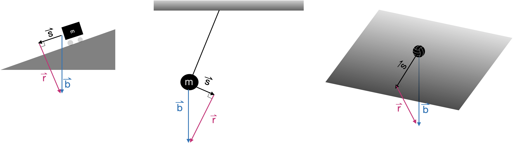
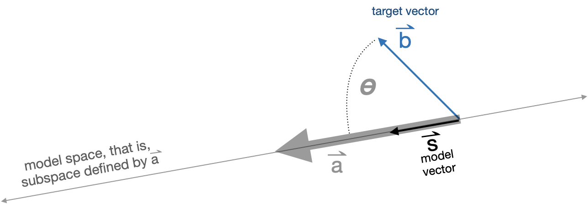

# Projection & residual {#projection-residual}

```{r include=FALSE}
library(Znotes)
```

<div style="float:right;">[](https://github.com/ProjectMOSAIC/MOSAIC-Calculus/blob/main/Block-5/B5-projection.Rmd)</div>

Many problems in physics and engineering involve the task of ***decomposing*** a vector $\vec{b}$ into two perpendicular component vectors $\hat{b}$ and $\vec{r}$, such that $\hat{b} + \vec{r} = \vec{b}$ and 
$\hat{b} \cdot \vec{r} = 0$. There is an infinite number of ways to accomplish such a decomposition, one for each way or orienting $\hat{b}$ relative to $\vec{b}$. Figure \@ref(fig:decompose-1) shows a few examples.

::: {.takenote data-latex=""}
This is the first time that we are encountering a symbol like $\hat{b}$, pronounced "b-hat." You will see it especially in statistics and machine learning.
:::

```{r decompose-1, echo=FALSE, out.width="60%", fig.align="center", fig.cap="A few ways of decomposing $\\vec{b}$ into perpendicular components $\\hat{b}$ and $\\vec{r}$"}
knitr::include_graphics("www/decompose-1.png")
```
::: {.example data-latex=""}
Gravitational force, as you know, always points downward. The effective acceleration due to gravity of a mass depends, however, on how that mass is situated with respect to other elements of the structure. The figure below shows several diagrams that might well be found on the pages of a physics textbook. In each diagram, there is a mass and a constraining structure: a ramp, a pendulum, an inclined plane. The force of gravity on the mass always points directly downward. In each diagram, $\hat{b}$ is the effective gravitational force on the mass, pointing down the ramp, or perpendicular to the pendulum strut, or aligned with the gradient vector of the inclined plane.

```{r echo=FALSE, out.width="100%", fig.align="center"}

```

The $\vec{r}$ in each diagram gives the component of gravitational force that will be counter-acted by the structure: the pull downward into the ramp, the pull along the pendulum strut, or the pull into the inclined plane.
:::

The task of ***decomposition*** is important also outside of physics and engineering. Our particular interest will be in finding how best to take a linear combination of the columns of a matrix $\mathit{A}$ in order to make the best approximation to a given vector $\vec{b}$. This problem solves all sorts of problems: finding a linear combination of functions to match a relationship laid out in data, constructing statistical models such as those found in machine learning, effortlessly solving sets of simultaneous linear equations with any number of equations and any number of unknowns.

## Projection terminology

The problem of decomposition can be considered to be a special case of ***projection***. The word "projection" may bring to mind the casting of shadows on a screen in the same manner as an old-fashioned slide projector or movie projector. The light source is arranged to generate parallel rays which arrive perpendicularly to the screen. A movie screen is two-dimensional, a subspace defined by two vectors. Imagining those two vectors to be collected into matrix $\mathit{A}$, the idea is to decompose $\vec{b}$ into a component that lies in the subspace defined by $\mathit{A}$ and another component that is perpendicular to the screen. That perpendicular component is what we have been calling $\vec{r}$ while the vector $\hat{b}$ is the projection of $\vec{b}$ onto the screen. To make it easier to keep track of the various roles played by $\vec{b}$, $\hat{b}$, $\vec{r}$ and $\mathit{A}$, we'll give these vectors English-language names. The motivation for these names will become apparent in later chapters, but for now, here they are. You will want to memorize them.

- $\vec{b}$ the ***target vector***
- $\hat{b}$ the ***model vector***
- $\vec{r}$ the ***residual vector***
- $\mathit{A}$ the ***model space*** (or "model subspace")

***Projection*** is the process of finding the model vector that is as close as possible to the target vector $\vec{b}$. Another way to see this is as finding the model vector that makes the residual vector as short as possible.

::: {.example data-latex=""}
Figure \@ref(fig:b-onto-u-v2) shows a a solved projection problem in 3-dimensional space. The figure can be rotated or set spinning, which makes it much easier to interpret the diagram as a three dimensional object. In addition to $\vec{b}$ and the vectors $\vec{u}$ and $\vec{b}$ that constitute the matrix $\mathit{A}$, the diagram includes a translucent plane marking $span{\mathit{A}$. The goal of projection is, from these givens, to find the model vector (shown in light green). Once the model vector $\vec{x}$ is known, the residual vector is easy to calculate $$\vec{r} \equiv \vec{b} - \hat{b}\ .$$ Another approach to the problem is to find the residual vector $r$ first, then use that to find the model vector as $$\hat{b} \equiv \vec{b} - \vec{r}\ .$$

```{r child="CalcPlot3D/diagram7.Rmd"}
```

```{r b-onto-u-v2, echo=FALSE, fig.cap="A three-dimensional diagram showing the target vector $\vec{b}$ and the vectors $\vec{u}$ and $\vec{v}$. The subspace spanned by $\vec{u}$ and $\vec{v}$ is indicated with a translucent plane. The model vector (green) is the result produced in solving the projection problem.", out.width="1%"}
knitr::include_graphics("www/tiny-blank.png")
```

Interpreting such three dimensional diagrams can be difficult. But there are tricks involving watching the diagram as it is rotated. For instance, how do we know that the translucent plane in Figure \@ref(fig:b-onto-u-v2) contains $\vec{u}$ and $\vec{v}$? As the diagram rotates, from time to time you will be looking edge on at the plane, so that the plane appears as a line on the screen. At such times, you can see that vectors $\vec{u}$ and $\vec{v}$ disappear. There is no component to $\vec{u}$ and $\vec{v}$ that sticks out from the plane. 
:::


## Projection onto a single vector

As we said, projection involves a vector $\vec{b}$ and a matrix $\mathit{A}$ that defines the model space. We'll start with the simplest case, where $\mathit{A}$ has only one column. That column is, of course, a vector. We'll call that vector $\vec{a}$, so the projection problem is to project $\vec{b}$ onto the subspace spanned by $\vec{a}$.

Geometrically, the situation of projecting the target vector $\vec{b}$ onto the model space $\vec{a}$ is diagrammed in Figure \@ref{fig:b-onto-a}.

```{r b-onto-a, out.width="100%", echo=FALSE, fig.align="center", fig.cap="The geometry of projecting $\\vec{b}$ onto $\\vec{a}$ to produce the model vector $\\hat{b}$."}

```

The angle between $\vec{a}$ and $\vec{b}$ is labelled $\theta$. You already know how to calculate $\theta$ from $\vec{b}$ and $\vec{a}$ by using the dot product:

$$\cos(\theta) = \frac{\vec{b} \bullet \vec{a}}{\len{b}\, \len{a}}\ .$$
Knowing $\theta$ and $\len{b}$, you can calculate the length of the model vector $\hat{b}$: 
$$\len{s} = \len{b} \cos(\theta) = \vec{b} \bullet \vec{a} / \len{a}\ .$$

Scaling $\vec{a}$ by $\len{a}$ would produce a vector oriented in the model subspace, but it would have the wrong length: length $\len{a} \len{s}$. So we need to divide $\vec{a}$ by $\len{a}$ to get a ***unit length vector*** oriented along $\vec{a}$:

$$\text{model vector:}\ \ \hat{b} = \left[\vec{b} \bullet \vec{a}\right] \,\vec{a} / {\len{a}^2} = \frac{\vec{b} \bullet \vec{a}}{\vec{a} \bullet \vec{a}}\  \vec{a}.$$
. <!-- must have some text before a <div> -->

::: {.rmosaic data-latex=""}

In R/mosaic, you can calculate the projection of $\vec{b}$ onto $\vec{a}$ using `%onto%`. For instance
```{r}
b <- rbind(-1, 2)
a <- rbind(-2.5, -0.8)
s <- b %onto% a
s
```
Having found $\hat{b}$, the residual vector $\vec{r}$ can be calculated as $\vec{b}- \hat{b}$.

```{r}
r <- b - s
r
```
The two properties that a projection satisfies are:

1. The residual vector is perpendicular to each and every vector in $\mathit{A}$. Since in this example, $\mathit{A}$ contains only the one vector $\vec{a}$, we need only look at $\vec{r} \cdot \vec{a}$ and confirm that it's zero.
```{r}
r %dot% a
```
2. The residual vector plus the model vector exactly equal the target vector. Since we computed ` r <- b - s`, we know this must be true, but still ...
```{r}
(r+s) - b
```

If the difference between two vectors is zero for every coordinate, the two vectors must be identical.
:::

## Projection onto a set of vectors

As we have just seen, projecting a target $\vec{b}$ onto a single vector is a matter of arithmetic. Now we will expand the technique to project the target vector $\vec{b}$ onto multiple vectors collected into a matrix $\mathit{b}$. Whereas in the chapter we used trigonometry to find the component of $\vec{b}$ aligned with the single vector $\vec{a}$, now we have to deal with multiple vectors **at the same time**. The result will be the component of $\vec{b}$ aligned with the **subspace** sponsored by $\mathit{A}$. 

There is one situation where the projection is easy: when the vectors in $\mathit{A}$ are **mutually orthogonal**. In this situation, carry out several one vector at a time projections: 
$$\vec{p_1} = modeledby{\vec{b}}{\vec{v_1}}\\
\vec{p_2} = modeledby{\vec{b}}{\vec{v_2}}\\
\vec{p_3} = modeledby{\vec{b}}{\vec{v_3}}\\
\text{and so on}$$
The projection of $\vec{b}$ onto $\mathit{A}$ will be the sum $\vec{p_1} + \vec{p2} + \vec{p3}$.

::: {.example data-latex=""}
To illustrate the method of projection when the vectors in $\mathit{A}$ are mutually orthogonal, we can construct such a matrix. 
```{r}
b  <- rbind( 1,  1,  1, 1)
v1 <- rbind( 1,  2,  0, 0)
v2 <- rbind(-2,  1,  3, 1)
v3 <- rbind( 0,  0, -1, 3)
A <- cbind(v1, v2, v3)
```

You can verify using a dot product that `v1`, `v2`, and `v3` are mutually orthogonal. 

Now construct the one-at-a-time projections:
```{r}
p1 <- b %onto% v1
p2 <- b %onto% v2
p3 <- b %onto% v3
```

To find the projection of $\vec{b}$ onto the subspace spanned by $\mathit{A}$, add up the one-at-a-time projections:

```{r}
b_on_A <- p1 + p2 + p3
```

Now we'll confirm that `b_on_A` really is the projection of `b` onto `A`.  The strategy is to construct the residual from the projection.
```{r}
resid <- b - b_on_A
```
All that's needed is to confirm that the residual is perpendicular to each and every vector in `A`:
```{r}
resid %dot% v1
resid %dot% v2
resid %dot% v3
```
:::

Now that we have a satisfactory method for projecting $\vec{b}$ onto a matrix $\mathit{A}$ consisting of mutually orthogonal vectors, we need to develop a method for the projection when the vectors in $\mathit{A}$ are not mutually orthogonal. The big picture here is that we will construct a new matrix $\mathit{Q}$ that spans the same space as $\mathit{A}$ but whose vectors are mutually orthogonal. We'll construct $\mathit{Q}$ out of linear combinations of the vectors in $\mathit{A}$, so we can be sure that $span(\mathit{Q}) = span(\mathit{A})$.

We introduce the process with an example, involving a vectors in a 4-dimensional space. $\mathit{A}$ will be a matrix with two columns, $\vec{v_1}$ and $\vec{v_2}$. Here's the setup for the example vectors and model matrix:


```{r}
b <- rbind(1,1,1,1)
v1 <- rbind(2,3,4,5)
v2 <- rbind(-4,2,4,1)
A <- cbind(v1, v2)
```

We set out to find the ***residual*** $\vec{r}$ first. Then calculating the model vector will be easy: $\hat{b} =\vec{b} - \vec{r}$.

The first step in the process is to calculate the residual from projecting $\vec{b}$ onto the first vector in $\mathit{A}$. This will be a matter of projecting $\vec{b}$ onto $\vec{v}$ and finding the residual, that is, `b - (b %onto% v1)`. We're going to be using this sort of residual-finding via projection a lot, so for convenience, R/mosaic packages up residual finding into an operator named `%perp%`.

Here's the residual from the first projection:

```{r}
r1 <- b %perp% v1
```

The basic idea of the algorithm is to take the residual `r1` from the first projection and use that as the input to the next projection. For vectors with more than two columns, take the residual `r2` from the second projection and use that as the input to the third projection, and so on.  But there's a catch as you can see by carrying out this algorithm.

```{r}
r1 <- b %perp% v1
r2 <- r1 %perp% v2
```

The hoped-for result is that $\vec{r2}$ will be perpendicular to every vector in $span(\mathit{A})$. We can use a dot project to check this out.

```{r}
r2 %dot% v1
```
If `r2` were perpendicular to `v1` the dot product would be zero. It's not. What went wrong?

The first projection produces `r1` which will be some linear combination of `b` and `v1`.  The second projection produces `r2` which will be some linear combination of `r1` and `v2`.  Certainly `r1` is perpendicular to `v1`, but `v2` is not. So a linear combination of `r1` and `v2` will not be perpendicular to `v1`.

Suppose, however, that we replaced `v2` with another vector `w2` that is perpendicular to `v1` and lies in the `v1`-`v2` subspace. This new vector will be the residual from projecting `v2` onto `v1`. Since `w2` is a linear combination of `v1` and `v2`, it  must be in the `v1`-`v2` subspace. Now `r2` will be a linear combination of `r1` and `w2`, both of which are perpendicular to `v1`. So `r2` will be perpendicular to both `v1` and `w2`, that is, `r2` will be perpendicular to the `v1`-`w2` subspace which is the same as the `v1`-`v2` subspace.

The correct procedure looks like this:
```{r}
r1 <- b %perp% v1
w2 <- v2 %perp% v1
# both r1 and w2 are perpendicular to v1
r2 <- r1 %perp% w2
```
Again, we can use the dot product of `r2` versus `v1` and `v2` to confirm that `r2` is perpendicular to both.
```{r}
r2 %dot% v1
r2 %dot% v2
```

This process can be extended to any number of vectors in $\mathit{A}$. Here's the algorithm for constructing $\mathit{Q}$:

i. Take the first vector from $\mathit{A}$ and call it $\vec{q_1}$.
ii. Take the second vector from $\mathit{A}$ and find the residual from projecting it onto $\vec{q_1}$. This residual will be $\vec{q_2}$. At this point, the matrix $\left[\strut \vec{q_1}, \ \ \vec{q_2}\right]$ consists of mutually orthogonal vectors.
iii. Take the third vector from $\mathit{A}$ and project it onto $\left[\strut \vec{q_1}, \ \ \vec{q_2}\right]$. We can do this because we already have an algorithm for projecting a vector onto a matrix with mutually orthogonal columns. Call the residual from this projection $\mathit{q_3}$. It will be orthogonal to the vectors in $\left[\strut \vec{q_1}, \ \ \vec{q_2}\right]$, so all three of the q vectors we've created are mutually orthogonal.
iv. Continue onward, taking the next vector in $\mathit{A}$, projecting it onto the q-vectors already assembled, and finding the residual from that projection.
v. Repeat step (iv) until all the vectors in $\mathit{A}$ have been handled. 

::: {.example data-latex=""}
Project a $\vec{b}$ that lives in 10-dimensional space onto the subspace sponsored by five vectors that are not mutually orthgonal:

```{r}
b <- rbind(3,2,7,3,-6,4,1,-1, 8, 2) # or any set of 10 numbers
v1 <- rbind(4, 7, 1, 0, 3, 0, 6, 1, 1, 2)
v2 <- rbind(8, 8, 4, -3, 3, -2, -4, 9, 6, 0)
v3 <- rbind(12, 0, 4, -2, -6, -4, -1, 4, 6, -7)
v4 <- rbind(0, 3, 9, 6, -4, -5, 4, 0, 5, -4)
v5 <- rbind(-2, 5, -4, 8, -9, 3, -5, 0, 11, -4)
A  <- cbind(v1, v2, v3, v4, v5)
```
You can confirm using dot products that the `v`-vectors are **not** mutually orthogonal.

Now to construct the vectors in $\mathit{Q}$.

```{r}
q1 <- v1
q2 <- v2 %perp% q1
q3 <- v3 %perp% cbind(q1, q2)
q4 <- v4 %perp% cbind(q1, q2, q3)
q5 <- v5 %perp% cbind(q1, q2, q3, q4)
Q <- cbind(q1, q2, q3, q4, q5)
```

Since `Q` consists of mutually orthogonal vectors, the projection of `b` onto `Q` can be done one vector at a time.
```{r}
p1 <- b %onto% q1
p2 <- b %onto% q2
p3 <- b %onto% q3
p4 <- b %onto% q4
p5 <- b %onto% q5
# put together the components
b_on_A <- p1 + p2 + p3 + p4 + p5
# check the answer: resid should be perpendicular to A
resid <- b - b_on_A
resid %dot% v1
resid %dot% v2
resid %dot% v3
resid %dot% v4
resid %dot% v5
```
:::


## Exercises

`r insert_calcZ_exercise("XX.XX", "wniqMc", "Exercises/panda-begin-shoe.Rmd")`

`r insert_calcZ_exercise("XX.XX", "yeY17y", "Exercises/kangaroo-light-bowl.Rmd")`

`r insert_calcZ_exercise("XX.XX", "xSoxzL", "Exercises/child-dig-shoe.Rmd")`

`r insert_calcZ_exercise("XX.XX", "zK7fQn", "Exercises/maple-draw-closet.Rmd")`

`r insert_calcZ_exercise("XX.XX", "vUbXdq", "Exercises/eagle-hold-piano.Rmd")`


Exercises confirming that `qr.solve()` produces results that are as they should be: residual orthogonal to every vector in A, projected + residual = $\vec{b}$.

Exercises confirming that adding more columns to A produces a smaller residual.

Demonstration that even random vectors can be combined to exactly equal $\vec{b}$, so long as we have enough of them.

`r insert_calcZ_exercise("XX.XX", "p209w8", "Exercises/beech-build-shirt.Rmd")`


`r insert_calcZ_exercise("XX.XX", "dvWdE7", "Exercises/puppy-dream-spoon.Rmd")`


Our goal is to scale the `expkt` vector so that the scaled numbers will be as close as possible to our destination, namely, `temp`. Comparing the two columns of numbers, you might anticipate that the scalar will be about 100. We'll see how to calculate it exactly in the next chapter. The result turns out to be 99.23. The resulting model will be $$T(t) = 99.23\, e^{-0.02 t}\ .$$

How are we to judge whether this is a good model or not? Common sense suggests plotting out the model function along with the data, as in Figure \@ref(fig:just-exp).

```{r just-exp, eval=FALSE, fig.cap="Comparing the model $99.23\\, e^{-0.02 t}$ to the recorded data in `CoolingWater."}
gf_point(temp ~ time, data = CW) %>%
  slice_plot(99.23*exp(-0.02*time) ~ time, color="magenta")

```

Judge for yourself whether this is a good model. The obvious deficiency is that the model falls, as decaying exponentials will do, toward a temperature of 0, whereas the water is cooling to a room temperature of about 25 degrees.

Let's return to the model seen in terms of vectors. The advantage of doing this is to develop a general procedure we can use for interpreting models of all sorts, rather than just the particular situation of the cooling-water data.

What are the geometric facts? We know that the `temp` vector has length 251.3 deg C. Similarly we can calculate the length of the `expkt` vector: 2.46 deg C. 

It might seem that the "direction" of the vector is meaningless, because it's a direction in an abstract, hard-to-envision 15-dimensional space. (There are 15 components to each of `temp` and `expkt`.) Even so, we can calculate the ***angle*** between the two vectors, using the formula $\cos(\theta) = \frac{\vec{v}\cdot \vec{w}}{\|\vec{v}\|\ \|\vec{w}\|}$. Doing the arithmetic gives $$\cos{\theta} = \frac{599.8}{251.3 \times 2.46} = 0.9708\ \ \implies \ \ \ \theta = 13.88^\circ$$

```{r temp-expkt-picture, echo=FALSE, fig.cap="The vectors `temp` and `expkt` have an angle of 13.88 deg between them. Here, `expkt` has been drawn 10x it's actual size."}
gvec(from = c(0,0), to = c(250, 25.1), color = "black") %>%
  gf_segment(0 + 3*28.8 ~ 0 + 3*116.5, 
             color="magenta", linetype = "dotted") %>%
  gvec(from=c(0,0), to = 2*c(11.6, 2.88), color="magenta") %>%
  gf_refine(coord_fixed())
```

With these geometrical facts, we can draw a picture. Figure \@ref(fig:temp-expkt-picture) shows `temp` in black and `expkt` in magenta. (We've drawn it 10 times as long as it really is so that you can see it well.) For the `expkt` vector to be a good model of `temp`, we need to scale it so that the result, which must be on the dotted line in the picture, is as close as possible to the tip of `temp`. You can count off yourself how many `expkt` steps will bring you close to `temp`. (Remember to multiply your result by 10, since in the picture we drew `expkt` ten times longer than its arithmetic length.)

One reasonable way to quantify how good a model of `temp` can be made by a properly scaled version of vector `expkt` is the angle between them: 13.88 degrees. 

Likewise, we can scale the vector `intercept` to make it match `temp` as well as possible. The angle between `intercept` and `temp` works out to be 75.7 degrees; the vectors are not very well aligned. Scaling by 58.2 will bring `intercept` as close as it is ever going to get to `temp`, which is not very close at all.

The idea of a linear combination is to scale and add multiple vectors. As a **very rough start**, let's look at the combination 58.2 `intercept` + 99.23 `expkt`, the combination of the two individual models we constructed by vector analogy. CAUTION: The model will be poor. That's not because the vector analogy is poor but because we still have to work out, as we will in the next two chapters, how properly to work with vectors. 

```{r eval=FALSE}
# This is broken
CW <- CoolingWater
CW <- CW %>% 
  mutate(model = 99.23*expkt + 58.2*intercept)
```

```{r eval=FALSE}
# Broken
Znotes::and_so_on(CW) %>% kableExtra::kable_minimal()
```

The resulting model is ... well, terrible! Figure \@ref(fig:two-temp-models) shows the linear combination 

```{r two-temp-models, eval=FALSE}
gf_point(temp ~ time, data = CW) %>%
  gf_point(model ~ time, data = CW, color="magenta") %>%
  slice_plot(58.2+ 99.23*exp(-0.02*time) ~ time, color="magenta")
```

EXERCISE: Repeat the calculations for the entire `CoolingData` data frame.


Adding vectors. The result is a vector

Scaling and adding vectors: a linear combination of vectors.

As motivation for this "find $\vec{x}$" problem, we refer you to Figure \@ref(fig:water-dots) which showed the temperature-vs-time data from the `CoolingWater` data frame. That figure shows several possible linear combinations of the vectors $u(t) \equiv e^{-0.02 t}$ (we called this `expkt`) and $v(t) \equiv 1$ (we called this `intercept`). Suppose we seek to find the particular linear combination of $u(t)$ and $v(t)$ that comes as close as possible to the black dots in the figure. That is, we know $\mathit{A}$: the two columns `expkt` and `intercept` from the data frame, and we know $\vec{b}$: the column `temp` from the data frame. 

This sort of problem is extremely common and important throughout quantitative fields of all sorts, from astronomy to zoology, and is one of the foundation techniques in statistics and data science. We'll present the approach graphically, algorithmically, and computationally.


