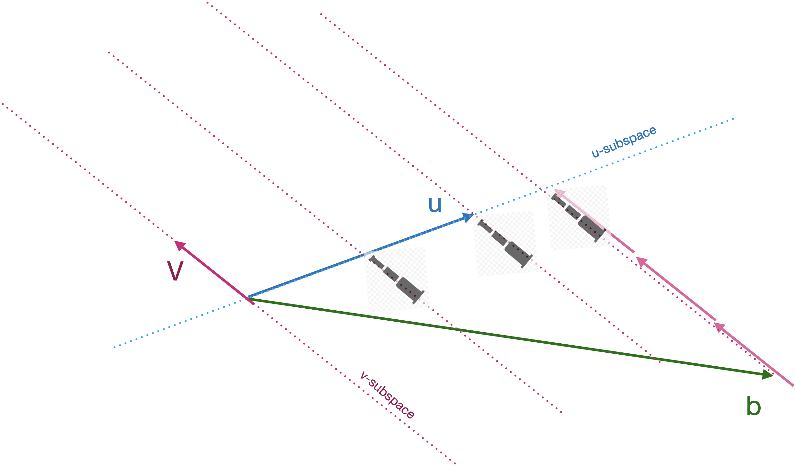

# The target problem {#target-problem}


::: {.underconstruction}
Chapter not yet released
:::

<div style="float:right;">[](https://github.com/ProjectMOSAIC/MOSAIC-Calculus/blob/main/Block-5/B5-target-problem.Rmd)</div>


MOVE THIS TO TARGET PROBLEM CHAPTER, where we'll discuss how to get the scalar multipliers 

It's helpful to divide the overall problem into two sub-tasks:

i. Project $\vec{b}$ onto $span(\mathit{A})$. The resulting vector is called the ***model vector*** and we'll denote it by $\modeledby{\vec{b}}{\mathit{A}}$. You can pronounce $\modeledby{\vec{b}}{\mathit{A}}$ as "$\vec{b}$ **modeled by** $\mathit{A}$." A common metaphor is that $\modeledby{\vec{b}}{\mathit{A}}$ lives in $span(\mathit{A})$. Or, in terms of our clubhouse metaphor, $\modeledby{\vec{b}}{\mathit{A}}$ is always eligible for membership in the subspace sponsored by $\mathit{A}$.

ii. Find the scalar coefficients to make a linear combination of the vectors in $\mathit{A}$ that will produce $\modeledby{\vec{b}}{\mathit{A}}$. We know we can do this exactly because $span(\mathit{A})$ is *defined to be* those vectors that can be created by a linear combination of the vectors in $\mathit{A}$. The vector $\modeledby{\vec{b}}{\mathit{A}}$ was *created* specifically to live in $span(\mathit{A})$.

## Long John Silver

You may already have encountered the step (ii) technique in your childhood reading. The problem appears in Robert Louis Stevenson's famous novel, [*Treasure Island*](https://www.gutenberg.org/cache/epub/120/pg120-images.html#link2H_4_0039). The story is about the discovery of a treasure map indicating the location of buried treasure on the eponymous Island. There is a red X on the map labelled "bulk of treasure here," but that is hardly sufficient to guide the dig for treasure. After all, every buried treasure needs some secret to protect it.  On the back of the map is written a cryptic clue to the precise location:

> Tall tree, Spy-glass shoulder, bearing a point to the N. of N.N.E.     
Skeleton Island E.S.E. and by E.    
Ten feet.

Skeleton Island is clearly marked on the map, as is Spy-glass Hill. The plateau marked by the red X "was dotted thickly with pine-trees of varying height. Every here and there, one of a different species rose forty or fifty feed clear above its neighbours." But which of these was the "tall tree" mentioned in the clue.

```{r treasure-island, echo=FALSE, fig.cap="The map of *Treasure Island*. The heading 'E.S.E. and by E.' is marked with a solid black line starting at Skeleton Island. The heading 'N. of N.N.E.' is marked by dotted lines, one of which is positioned to point at the shoulder of Spy-glass Hill. Where the bearing from Skeleton Island meets the bearing to Spy-glass Hill will be the Tall tree.", out.width="70%", fig.align="center"}
knitr::include_graphics("www/drawings/treasure-island-annotated.png")
```

Long John Silver, obviously an accomplished mathematician, starts near Skeleton Island, moving on along the vector that keeps Skeleton Island to the compass bearing one point east of east-south-east. While on the march, he keeps a telescope trained on the shoulder of Spy-glass Hill. The goal  When that telescope points one point north of north-north-east, they are in the vicinity of a tall tree. That's the tree matching the clue.

The vectors in *Treasure Island* were perpendicular to one another. We say of such a set of vectors that they are ***mutually orthogonal***.  The usual situation is that the vectors in $\mathit{A}$ will be somewhat aligned with one another: they are not mutually orthogonal. \@ref(fig:telescope) illustrates the situation: $\vec{v}$ is not perpendicular to $\vec{u}$. The task, still, is to find a linear combination of $\vec{u}$ and $\vec{v}$ that will match $\vec{b}$. The diagram shows the $\vec{u}$ vector and the subspace aligned with $\vec{u}$, and similarly for $\vec{v}$

```{r telescope, echo=FALSE, fig.cap="The telescope method of solving projection onto two vectors."}

```

The algorithm is based in Long John Silver's technique. Pick either $\vec{u}$ or $\vec{v}$, it doesn't matter which. In the diagram, we've picked $\vec{v}$. Align your telescope with that vector. Now march along the other vector, $\vec{u}$, carefully keeping the telescope on the bearing aligned with $\vec{v}$. From the diagram, you can see that when you've marched to $\frac{1}{2} \vec{u}$, the telescope does not yet have $\vec{b}$ in view. Similarly, at $1 \vec{u}$, the target $\vec{b}$ isn't yet visible. Marching a little further, to about $1.6 \vec{u}$ brings you to the point in the $\vec{u}$-subspace where the target falls into view. This tells us that the coefficient on $\vec{u}$ will be 1.6.

To find the coefficient on $\vec{v}$, you'll need to march along the line of the telescope, taking steps of size $\len{\vec{v}}$. In the diagram, we've marked the march with copies of $\vec{v}$ to make the counting easier. We'll need to march *opposite* the direction of $\vec{v}$, so the coefficient will be negative. Taking 2.8 steps of size $\|\vec{v}\|$ brings us to the target. Thus:

$$\vec{b} = 1.6 \vec{u} - 2.8 \vec{v}\ .$$

To handle vectors in spaces where telescopes are not available, we need an arithmetic algorithm. The easy case is the one faced by Long John Silver: the vectors in $\mathit{A}$ are mutually orthogonal.

E


Figure \@ref(fig:b-onto-u-v) the three vectors $\vec{u}$, $\vec{v}$ and $\vec{b}$ in a three dimensional space. It turns out that the algorithm we will develop for this case is perfectly general, it will work in any-dimensional space. As before, we seek a linear combination of $\vec{u}$ and $\vec{v}$ which will match $\vec{b}$ as closely as possible. To acquaint yourself with the geometry, rotate the diagram and perform these experiments.

i. $\vec{u}$ and $\vec{v}$ are fixed in length. However, their lengths will appear to change as you rotate the space. This might be called the "gun-barrel" effect; a tube looks very short when you look down it's longitudinal axis, but looks longer when you look at it from the side.  Rotate the space until **both** $\vec{u}$ and $\vec{v}$ reach their maximum apparent length. The viewpoint that accomplishes this is looking downward perpendicularly onto the $\left[\vec{u},\vec{v}\right]$-plane. Vector $\vec{b}$ is not in that plane, but from the downward perpendicular viewpoint, you can see $\widehat{b}$, the point in the plane where the projection of $\vec{b}$ will fall. From this viewpoint, it's very easy to find the linear combination of $\vec{u}$ and $\vec{v}$ that reaches 
ii. Again rotate the space until the vector $\vec{u}$ is pointing straight toward you. You'll see only the arrowhead of $\vec{u}$, but you'll be able to figure out how many steps along $\vec{v}$ will be the projection of $\vec{b}$ onto $\vec{v}$. The plane you are looking downward onto is the plane spanned by $\left[\vec{v}, \vec{b}\right]$.
iii. Again rotate the space to look straight down vector $\vec{v}$. From this perspective, you can calculate how many steps along $\vec{v}$ will be the projection of $\vec{b}$ onto $\vec{v}$.


```{r child="CalcPlot3D/diagram5.Rmd"}
```

```{r b-onto-u-v, echo=FALSE, fig.cap="Showing the relative orientation of the three vectors $\\vec{u}$, $\\vec{v}$ and $\\vec{b}$. Drag the image to rotate it.",out.width="1%"}
knitr::include_graphics("www/tiny-blank.png")
```

Many people have difficulty with a bare vector diagram in 3-space. Much of our visual ability to see in three dimensions has to do with shape, shadow, and, to some extent, our stereo vision (which doesn't apply to projection of an image onto the flat space of a screen or page of a book).


Figure \@ref(fig:telescope) shows the general case with vector $\vec{b}$ to be approached by a linear combination of $\vec{u}$ and $\vec{v}$.


With two vectors $\vec{u}$ and $\vec{v}$ in two-dimensional space, there is a linear combination that will match *any* $\vec{b}$ in that space.

A more general situation is an $n$-dimensional space with only $p < n$ vectors to form the linear combination. Typically, the target $\vec{b}$ will not be in the subspace spanned by the p vectors. We can illustrate using 3-dimensional space and two vectors $\vec{u}$ and $\vec{v}$ to be linearly combined.

```{r echo=FALSE}
# the vectors in the following plot
u <- rbind(-1, 1, 0)
v <- rbind(2, 1, 0)
b <- rbind(.5, 2, 2.5)
A <- cbind(u, v)
```

`r {b %onto% A} |> matrix_block()`
`r {b %perp% A} |> matrix_block()`


<!-- this diagram is too busy 

```{r ornamented-vectors, echo=FALSE, fig.cap="This diagram needs to show b projected and the residual vector.",out.width="1%"}
knitr::include_graphics("www/tiny-blank.png")
```

```{r eval=FALSE, child="CalcPlot3D/diagram8.Rmd"}
```

-->

Of course, a set of vectors is simply a ***matrix***, so we'll cast the problem as one of projecting $\vec{b}$ onto a matrix $\mathit{A}$.

There is one case that is extremely simple: when the vectors in $\mathit{A}$ are ***mutually orthogonal***. Let's make sure we understand this case well. The geometry is simple, as in Figure \@ref(fig:orthog-A).

```{r orthog-A, echo=FALSE, out.width="1%", fig.cap="Projecting $\\vec{b}$ onto two orthogonal vectors. REPLACE THIS WITH THE ACTUAL IMAGE."}
knitr::include_graphics("www/tiny-blank.png")
```

To demonstrate the projection a bit more generally, let's set up 3 orthogonal vectors in a four-dimensional space as $\mathit{A}$:
```{r}
u <- rbind(2, 3, 0, 6)
v <- rbind(0,-2,-2, 1)
w <- rbind(3,-2, 2, 0)
b <- rbind(1, 1, 1, 1)
A <- cbind(u, v, w)
```
You should be able to confirm with simple arithmetic that $\vec{u}$ is orthogonal to $\vec{v}$, that $\vec{u}$ is orthogonal to $\vec{w}$, and that $\vec{w}$ is orthogonal to $\vec{v}$. (Hint: Use the dot product.) You can also see that $\vec{b}$ is not parallel to any one of the three columns in $\mathit{A}$.

We'll compute the correct answer and then see how we could do it with simple arithmetic.

`r {b %onto% A} |> matrix_block()`
`r {qr.solve(A, b)} |> matrix_block()`

This is telling us that 
$$\overset{\longrightarrow}{b\|_\mathit{A}} = \left[\begin{array}{r}0.9783914
\\0.9871949
\\1.0196078
\\1.0136054\end{array}\right] = 0.2244898 \vec{u} - 0.3333333 \vec{v} + 0.1764706 \vec{w}$$

We can find the coefficients of the linear combination with simple, independent uses of the formula for projecting $\vec{b}$ onto each of the columns of $\mathit{A}$ one at a time:

`r {(b %dot% u) / (u %dot% u)} |> matrix_block(inline=FALSE)`

`r {(b %dot% v) / (v %dot% v)} |> matrix_block(inline=FALSE)`

`r {(b %dot% w) / (w %dot% w)} |> matrix_block(inline=FALSE)`

::: {.example data-latex=""}
Let's return for a moment to the Lagrange polynomials introduced in Chapter \@ref(linear-combs-vectors). Recall that a Lagrange polynomial is set up to pass exactly through $k$ knot points with a $k-1$-order polynomial. The Lagrange polynomial is a linear combination of $k$ simple but ingenious functions, one for each knot point. Each of the functions being combined has a similar form:

$$p_i(x) = \frac{(x-x_1)(x-x_2)}{(x_i -x_1)(x_i-x_2)}\left[\strut\cdots\right]\frac{(x-x_k)}{(x_i -x_k)}$$ where the $\left[\strut\cdots\right]$ means to include all the intermediate terms in the sequence **except** the term $\frac{(x-x_i)}{(x_i - x_i)}$. 

Evaluate any of the $p_i(x)$ at the set of knot inputs $(x_j, y_j)$ gives a vector consisting of a single 1 and all zeros otherwise. For instance:
$$p_1\left(\begin{array}{c}x_1\\x_2\\x_3\\\vdots\\x_k\end{array}\right) = \left[\begin{array}{c}1\\0\\0\\\vdots\\0\end{array}\right]\ \ \ \ \ \ \ \ \ p_2\left(\begin{array}{c}x_1\\x_2\\x_3\\\vdots\\x_k\end{array}\right) = \left[\begin{array}{c}0\\1\\0\\\vdots\\0\end{array}\right] \ \ \ \ \ \ \ \ p_3\left(\begin{array}{c}x_1\\x_2\\x_3\\\vdots\\x_k\end{array}\right) = \left[\begin{array}{c}0\\0\\1\\\vdots\\0\end{array}\right]\ \ \text{and so on.}$$
Notice that each of the functions $p_i()$, when applied to this set of $x$-coordinates of the knot points, will produce a vector output that is orthogonal to every other one of the functions. That is, the whole set $p_1(x_{knots}), p_2(x_{knots}), \cdots, p_k(x_{knots})$ creates a set of vectors (a **matrix**) whose columns are to be combined linearly to reach produce the $y$-values of the knots. For the system of six knot points shown in Figure \@ref(fig:lagrange-sine), the matrix, coefficients, and target are related this way:

$$\!\!\!\begin{array}{rrrrrr}p_1\!\!&\!p_2&\!\!p_3&\!\!\!p_4&\!\!\!p_5&\!\!p_6& & & & & & \end{array}\\\left[\begin{array}{rrrrrr}1&0&0&0&0&0\\
0&1 &0& 0 & 0 & 0\\0&0&1&0&0&0\\
0&0&0&1&0&0\\
0&0&0&0&1&0\\
0&0&0&0&0&1\end{array}\right]\cdot
\left[\begin{array}{c}\strut a_1\\a_2\\a_3\\a_4\\a_5\\a_6\end{array}\right] = \left[\begin{array}{c}\strut y_1\\y_2\\y_3\\y_4\\y_5\\y_k\end{array}\right]\ .$$
Since the vectors in the matrix are mutually orthogonal, to find any of the $a_i$ we need only project the target onto the corresponding $i$th column in the matrix.

MAYBE ILLUSTRATE THIS WITH COMPUTER CODE?
:::


This simple procedure of independent projections **does not work** if the columns of $\mathit{A}$ are **not mutually orthogonal***. For instance:
```{r}
u <- rbind(1,2,3,4)
v <- rbind(4,3,2,5)
A2 <- cbind(u, v)
```
The right coefficients
`r {qr.solve(A2, b)} |> matrix_block()`

Are different from the "one-projection-at-a-time" coefficients:

`r {(b %dot% u) / (u %dot% u)} |> matrix_block(inline=FALSE)`

`r {(b %dot% v) / (v %dot% v)} |> matrix_block(inline=FALSE)`


Since independent projections won't solve the target problem (when the columns of $\mathit{A}$ are not mutually orthogonal), how do we solve it?

The strategy is two simplify the problem by constructing from $\mathit{A}$ another matrix that we'll call  $\mathit{Q}$ which spans exactly the same subspace as $\mathit{A}$ but which has mutually orthogonal columns.

To start, well set the first column of $\mathit{Q}$ to be any one of the vectors in $\mathit{A}$. We'll use $\vec{u}$ for the example.

The second column of $\mathit{Q}$ will be based on one of the remaining vectors, say $\vec{v}$. But $\vec{v}$ is not orthogonal to $\vec{u}$. For the second column of $\mathit{Q}$ we'll insert not $\vec{v}$ itself, but the component of $\vec{v}$ that is orthogonal to $\vec{u}$, that is:
$$\overset{\longrightarrow}{v\!\perp_u} = \vec{v} - \frac{\vec{u}\cdot\vec{v}}{\vec{u}\cdot\vec{u}} \vec{u}$$
In computer notation, we'll refer to $\overset{\longrightarrow}{v\!\perp_u}$ with the name `v_perp_u`.

```{r}
coef <- ((u %dot% v) / (u %dot% u))
v_perp_u <- v - coef * u
```
`r {coef} |> matrix_block(inline=FALSE)`


Now the $\mathit{Q}$ matrix is
$$\mathit{Q} \equiv \left[\begin{array}{cc}|&|\\ \vec{u}&\overset{\longrightarrow}{v\!\perp_u}\\|&|\end{array}\right]$$
Caution: The next few paragraphs are rough going. It suffices to follow the flow of the argument and to note that the only operations used are scalar multiplication, addition, subtraction, and the simple dot-product form for the coefficient produced by projecting one vector onto another vector.

Since $\vec{u}$ and $\overset{\longrightarrow}{v\!\perp_u}$ are orthogonal, we can easily calculate the coefficients on the two vectors for projecting $\vec{b}$ onto the subspace spanned by $\mathit{Q}$.

```{r}
alpha1 <- (u %dot% b) / (u %dot% u)
alpha2 <- (v_perp_u %dot% b) / (v_perp_u %dot% v_perp_u)
```
`r {alpha1} |> matrix_block(inline=FALSE)`

`r {alpha2} |> matrix_block(inline=FALSE)`


These coefficients---$\alpha_1 =\ $ `r alpha1` and $\alpha_2 =\ $ `r alpha2` respectively---when multiplied by $\vec{u}$ and $\overset{\longrightarrow}{v\!\perp_u}$ will give us the projection of $\vec{b}$ onto the subspace spanned by $\mathit{Q}$. Since the subspace spanned by $\mathit{Q}$ is exactly the same as the subspace spanned by $\mathit{A}$, we have the answer for $\overset{\longrightarrow}{b\|_\mathit{A}}$ and consequently for $$\overset{\longrightarrow}{b\!\perp_\mathit{A}} = \vec{b} - \overset{\longrightarrow}{b\|_\mathit{A}}\ .$$

In terms of the coefficients, the projection of $\vec{b}$ onto $\mathit{A}$ is 
$$\overset{\longrightarrow}{b\|_\mathit{A}} = 0.3333333 \vec{u} + 0.1851852 \overset{\longrightarrow}{v\!\perp_u}$$
These are not the coefficients on $\vec{u}$ and $\vec{v}$ that we originally sought. But recognizing that $\overset{\longrightarrow}{v\!\perp_u} = v - 1.2 \vec{u}$, we have 
$$\overset{\longrightarrow}{b\|_\mathit{A}} = 0.3333333 \vec{u} + 0.1851852 \left[\strut \vec{v} - 1.2 \vec{u}\right] \\= [0.3333333 - 1.2\times0.1851852] \vec{u} + 0.1851852 \vec{v}\\= 0.1111111 \vec{u} + 0.1851852 \vec{v}$$
These coefficients on $\vec{u}$ and $\vec{v}$ are the ones we sought and the ones produced by the professional software.

`r {qr.solve(A2, b)} |> matrix_block()`


Of course, nobody would want to undertake the process described above in the step-by-step fashion we've followed. In addition to being hard to follow, it's hard to avoid making mistakes along the way. Fortunately, expert programmers have done the work for us and encapsulated the process in a software function. For us using R, that function is `qr.solve()`.

The result is that we now have a way to solve the target problem, finding the coefficients on for the linear combination of a set of vectors that will bring us as close as possible to a target $\vec{b}$.

In the next chapter, we'll use this capability to solve real-world modeling problems. 
 


For  a vector $\vec{v}$, the  length is denoted $|| \vec{v} ||$. Vector length can  be measured with  a ruler ...  so long as you have physical access to  the vector. But often, all we have  is the numerical representation. So, we use arithmetic---the dot product---to calculate vector length: 
$$|| \vec{v}  || \equiv \sqrt{\ \vec{v}^T \cdot \vec{v}}$$

::: {.example data-latex=""}
Consider the two vectors 
$$\vec{u} \equiv \left(\begin{array}{c}3\\4\end{array}\right) \  \  \ \mbox{and}  \ \ \ \vec{w} \equiv \left(\begin{array}{c}1\\1\\1\\1\end{array}\right)
$$

The length of $\vec{u}$ is $|| \vec{u} || = \sqrt{\strut 3^2 + 4^2} = \sqrt{\strut 25} = 5$.

The length of $\vec{w}$ is $|| \vec{w} || = \sqrt{\strut 1^2 + 1^2 + 1^2 + 1^2} = \sqrt{\strut 4} = 2$.

Using a `r sandbox_link()`, use R commands to create the vectors $\vec{u}$ and $\vec{w}$ and find their lengths using the `dot-product operator`%*%` operator.

```{r eval=FALSE}
u <- rbind( ____ )
# length of u
sqrt( ____ %*% ____ )

v <- rbind( ______ )
# length of v
sqrt( ____ %*% ____ )
```

<details>
<summary>Solution</summary>
```{r}
u <- rbind(3, 4)
sqrt(t(u) %*% u)
w <- rbind(1, 1, 1, 1)
sqrt(t(w) %*% w)
```
</details>


In Chapter \@ref(projection-residual), we solve the problem of finding the scalar multiple $\alpha^\star$ such that $\alpha^\star\, \vec{u}$ is as close as possible to another vector $\vec{b}$. In this chapter, we'll generalize that method to let us finding the particular ***linear combination*** of any set of vectors $\vec{u}$, $\vec{v}$, $\vec{w}, \ldots$ that is a close as possible to $\vec{b}$. We call this the ***target problem***. For clarity, we'll always write the target as $\vec{b}$: the place we want to get to.

## Properties of the solution

As you might expect, there is a known solution to the target problem. We'll start by using a computer implementation of this solution to demonstrate some simple properties of the solution. As an example, we'll use three vectors in a 5-dimensional space as the "screen" to be projected onto, and another vector $\vec{b}$ as the object being projected. 

The notation $$\overset{\longrightarrow}{{b}\|_{u,v,w}}$$ is expressive of the solution we seek. But it's more concise to place $\vec{u}$, $\vec{v}$, and $\vec{w}$ into a matrix ${\mathbf A}$:
$${\mathbf A} \equiv \left[\strut \begin{array}{ccc}|&|&|\\\vec{u} & \vec{v} & \vec{w}\\|&|&|\end{array}\right]$$ so that we can write the solution as 
$$\overset{\longrightarrow}{{b}\|_{\mathbf A}}\ .$$

Such notation, lovely and expressive though it may be, is hardly suited for a computer expression, which has to be constructed from typewriter characters. So, we'll adopt another convention by writing `b_hat` on the computer to stand for $\overset{\longrightarrow}{{b}\|_{\mathbf A}}$. 

In the same spirit, we'll write `b_resid` to stand for $\overset{\longrightarrow}{b\!\perp_{\mathbf A}}$.

```{r}
# the three vectors
u <- rbind(6, 4, 9, 3, 1)
v <- rbind(1, 5,-2, 0, 7)
w <- rbind(3,-5, 2, 8, 4)
A <- cbind(u, v, w)
# the target
b <- rbind(8, 2,-5, 7, 0)
# the solution and residual
b_hat <- b %onto% A
b_resid <- b %perp% A
```


`r {b_hat} |> matrix_block()`

`r {b_resid} |> matrix_block()`

How can we confirm that this really is the solution to the target problem for this set of vectors? One check is that `b_hat + b_resid` should be identical to the original `b`:

`r {b - (b_hat + b_resid)} |> matrix_block()`

So far, so good.

Another check is that `b_hat` be perpendicular to `b_resid`. If so, the dot product of `b_hat` and `b_resid` should be 0.

`r {b_hat %dot% b_resid} |> matrix_block(inline=FALSE)`

Close enough! (Round-off error in computer arithmetic has created this slight deviation from 0.)

An interesting consequence of the residual being perpendicular to `b_hat` is that the residual will also be perpendicular to each and every one of the vectors being projected onto, and to any linear combination of those vectors.

`r {b_resid %dot% u} |> matrix_block(inline=FALSE)`

`r {b_resid %dot% v} |> matrix_block(inline=FALSE)`

`r {b_resid %dot% w} |> matrix_block(inline=FALSE)`

Examples of linear combinations

`r {b_resid %dot% (2*u - 4.7*v + pi*w)} |> matrix_block(inline=FALSE, width="80%")`

`r {b_resid %dot% (-5.4*u - 0.7*v + 8.3*w)} |> matrix_block(inline=FALSE, width="80%")`

Check!

Although we know `b_hat` and `b_resid`, we still don't know what particular linear combination of the columns in `A` produces `b_hat`. Here's how to find out:

```{r echo=FALSE}
# just to create `x` so it's available later on.
x <- qr.solve(A, b)
```

`r {x <- qr.solve(A, b); x} |> matrix_block()`

`x` contains the coefficients for the linear combination. To demonstrate, let's compare `b_hat` to the linear combination:

`r {b_hat - (0.03835171*u + 0.33478133*v + 0.48849968*w)}  |> matrix_block(width="80%")`

`r {b_hat / (0.03835171*u + 0.33478133*v + 0.48849968*w)}  |> matrix_block(width="80%")`

Ideally, the result should be all ones. It's not because of round-off error and because we copied only the first several digits of the coefficients into the calculation. It would have been better not to copy. Instead, we can calculate the linear combination by matrix multiplication:

`r {b_hat - (A %*% x)} |> matrix_block()`

`r {b_hat / (A %*% x)} |> matrix_block()`


::: {.takenote data-latex=""}
You should add `qr.solve()` to your computational toolbox of R functions. It carries out the projection calculations, but instead of returning `b_hat` or $\overset{\longrightarrow}{{b}\|_{\mathbf A}}$ or whatever we want to call the shadow of $\vec{b}$ onto ${\mathbf A}$, it returns the coefficients for the linear combination of the vectors in ${\mathbf A}$ to produce $\overset{\longrightarrow}{{b}\|_{\mathbf A}}$.
:::

## The geometry of `qr.solve()`


## Finding the target with QR 

Start with the very simple example of the identity matrix and reaching a target with that.

Show that the vectors in the identity matrix are mutually orthogonal.

Show that we can find a mutually orthogonal basis set for any matrix.


-----

a. Write a target problem in the form A x = b
b. Relationship between $\vec{b}$, $\hat{b}$, and the residual.
c. Compose linear combination problems and solve using R/`qr.solve()`
d. Applications of projection
e. Relationship between projection and method of least squares
f. Computations on results from `qr.solve()`
    i. b-hat
    ii. residual
    iii. orthogonality between b-hat and residual
