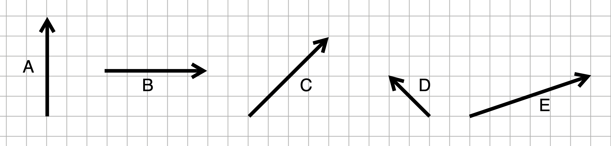

Find the lengths of these vectors. Each square on the "graph paper" is 1 unit.  Assume  vectors begin  and end exactly on  the graph-paper intersections.

```{r echo=FALSE,  out.width  = "90%",  fig.align="center"}

```


```{r gssV-A, echo=FALSE} 
askMC(
  prompt = "Length of vector  $\\vec{A}$.",
  "2", "2.82", "4", 4.12, "+5+", "5.66", "6.32", "8", "11.18",  "11.66", 12,  12.22,
  allow_retry = FALSE,
  random_answer_order = FALSE
  #QC
)
```

```{r gssV-B, echo=FALSE}
askMC(
  prompt = "Length of vector  $\\vec{B}$.",
  "2", "2.82", "4", 4.12,  "+5+", "5.66", "6.32", "8", "11.18",  "11.66", 12, 12.22,
  allow_retry = FALSE,
  random_answer_order = FALSE
  #QC
)
```

```{r gssV-C, echo=FALSE}
askMC(
  prompt = "Length of vector  $\\vec{C}$.",
  "2", "2.82", "4", 4.12,  "5", "+5.66+", "6.32", "8", "11.18",  "11.66", 12,  12.22,
  allow_retry = FALSE,
  random_answer_order = FALSE
  #QC
)
```

```{r gssV-D, echo=FALSE}
askMC(
  prompt = "Length of vector  $\\vec{D}$.",
  "2", "+2.82+", "4", 4.12, "5", "5.66", "6.32", "8", "11.18",  "11.66", 12,  12.22,
  allow_retry = FALSE,
  random_answer_order = FALSE
  #QC
)
```

```{r gssV-E, echo=FALSE}
askMC(
  prompt = "Length of vector  $\\vec{E}$.",
  "2", "2.82", "4", 4.12, "5", "5.66", "+6.32+", "8", "11.18",  "11.66", 12, 12.22,
  allow_retry = FALSE,
  random_answer_order = FALSE
  #QC
)
```

```{r gssV-F, echo=FALSE}
askMC(
  prompt = "Length of vector  $\\vec{A} +  2  \\vec{B}$.",
  "2", "2.82", "4", 4.12, "5", "5.66", "6.32", "8", "+11.18+", "11.66", 12,  12.22,
  allow_retry = FALSE,
  random_answer_order = FALSE
  #QC
)
```

```{r gssV-G, echo=FALSE}
askMC(
  prompt = "Length of vector  $\\vec{C} - \\vec{B}$.",
  "2", "2.82", "4", "+4.12+", "5", "5.66", "6.32", "8", "11.18",  11.66,   12, 12.22,
  allow_retry = FALSE,
  random_answer_order = FALSE
  #QC
)
```

```{r gssV-H, echo=FALSE}
askMC(
  prompt = "Length of vector  $\\vec{C} + \\vec{E}$.",
  "2", "2.82", "4", "4.12", "5", "5.66", "6.32", "8", "11.18",  "+11.66+", 12, 12.22,
  allow_retry = FALSE,
  random_answer_order = FALSE
  #QC
)
```

