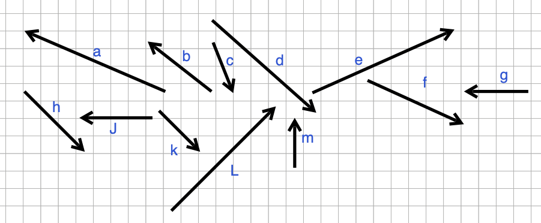

Here are 12 vectors, labeled "a" through "m." (Letter "i" has been left out.) There are several quick questions, each of which makes a claim about whether the sum of two vectors equals a third. Answer *true* or *false* to the claim. There are no tricks about exactitude, so if the claim is close to being true, answer true.

```{r echo=FALSE, out.width="90%",  fig.align="center"}

```

```{r tspK-1, echo=FALSE}
askMC( prompt = "1)  $\\vec{a} + \\vec{b} = \\vec{L}$", 
        "True", "+False+", 
       random_answer_order = FALSE
       )
#QC
```

```{r tspK-2, echo=FALSE}
askMC( prompt = "2)  $\\vec{b} + \\vec{J} = \\vec{a}$", 
        "True", "+False+", random_answer_order = TRUE)
#QC
```

```{r tspK-3, echo=FALSE}
askMC( prompt = "3)  $\\vec{b} + \\vec{m} = \\vec{J}$", 
        "True", "+False+", random_answer_order = FALSE)
#QC
```

```{r tspK-4, echo=FALSE}
askMC( prompt = "4)  $\\vec{c} + \\vec{f} = \\vec{d}$", 
         "+True+", "False", random_answer_order = TRUE)
#QC
```

```{r tspK-5, echo=FALSE}
askMC( prompt = "5)  $\\vec{k} + \\vec{L} = \\vec{e}$", 
        "True", "+False+", random_answer_order = TRUE)
#QC
```

```{r tspK-6, echo=FALSE}
askMC( prompt = "6)  $\\vec{e} + \\vec{b} = \\vec{m}$", 
        "True", "+False+", random_answer_order = FALSE)
#QC
```

```{r tspK-7, echo=FALSE}
askMC( prompt = "7)  $\\vec{m} + \\vec{g} = \\vec{b}$", 
         "+True+", "False", random_answer_order = TRUE)
#QC
```

