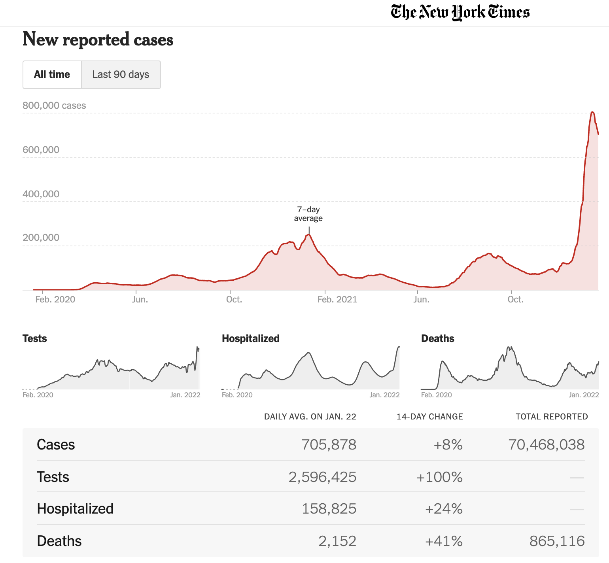

# Differential equations


<div style="float:right;">[](https://github.com/ProjectMOSAIC/MOSAIC-Calculus/blob/main/Block-6/B6-diff-eq.Rmd)</div>

::: {.underconstruction}

i. Explain the format in which we present dynamics as opposed to trajectories
i. Find qualitative solutions from an initial condition
i. Articulate the difference between state, dynamics, and trajectory

**Vocabulary**

* Differential equation
* Dynamical function
* Initial condition (or, initial value or boundary value)
* State & state variable & state space
* Solution
* Time series (state variable versus time)
* Trajectory (Movement in the state space)
* Fixed point
* Flow field
* Euler integration (iteration)

**Examples**


- Bank interest or sapling growth.
- Gompertz growth
- Logistic growth (e.g. population, or change in height of tree versus height).
- Pendulum
- Disease
- Rocket
:::

## The language for change

Calculus is the dominant means of describing change. Developed initially in the 1600s as a means of relating planetary motion to the force of gravity felt on Earth, it nonetheless remained the way of describing heat, sound, and  electromagnetism in the 1800s. It the 1900s, calculus was turned to representing the basic mechanisms of quantum mechanics.

The beginning student may see calculus as consisting of manipulations and transformations (e.g. differentiation and integration). The first stages of learning calculus consists of applying such manipulations and transformations to textbook exercises. To use these observations productively in solving real-world problems, you need to have a way of describing the world and the mechanisms of the world in terms of calculus. For this, you need to start seeing calculus as a ***language*** for description.

We'll use four concepts of language in describing calculus: nouns, verbs, clauses, and sentences.

- A calculus ***noun*** is an object such as a function, scalar, vector, or matrix.

- A calculus ***verb*** is an operation such as differentiation and accumulation. Other verbs come from arithmetic and algebra: square roots, addition, multiplication, and so on.

- A calculus ***clause*** is the application of a verb to one or more nouns to produce a new noun. For instance, if the original noun is the function $x(t)$ representing the position of an object in time, then the application of the verb $\partial_t$ to the function is a new function $\partial_t\, x(t)$, which we interpret as velocity. 

- A calculus ***sentence*** is an equation: a statement of the equivalence of two nouns.

Natural languages such as English or Chinese are much more complicated. Calculus involves sentences such as "The color of John's bike is blue," where "is" stands for equality:
$$\underbrace{\text{The color of John's bike}}_{\text{noun}}\  \underbrace{\text{is}}_{=}\ 
\underbrace{\text{blue.}}_{\text{noun}}$$

In both calculus and natural languages, such sentences allow us to draw conclusions that may be useful or informative. For instance, combined with the sentence, "The bike I see is red," a conclusion might be, "The bike I see is not John's."

Early calculus sentences were often about positions, velocities, forces, and accelerations, for instance $$F_\text{air} = \alpha v^2$$
which is a simple model of the force due to air resistance.

In this Block, we'll use the language of calculus to represent ***dynamics***, situations of motion, growth, decay, and oscillation. This Chapter introduces some of the nouns involved. 

## State 

Here are a few of the situations we will construct calculus-language descriptions of:

- physics
    i. swing of a pendulum
    ii. bobbing of a mass hanging from a string.
    iii. a rocket shooting up from the launch pad
    
- commerce
    i. investment growth
    ii. growth in equity in a house as a mortgage is paid up. ("Equity" is the amount of the value of the house that belongs to you.)

- biology
    i. growth of animal populations, including predator and prey. 
    ii. growth of a tumor
    iii. growth of an organism or a crop.

A model describing such situation has a basic component called the ***dynamical state***, as in "the state of affairs," or "his mental state," or "the state of their finances."

One of the things you learn when you study a field such as physics or epidemiology or engineering is what constitutes a useful description of the dynamical state for different situations. 

As an example, consider the rather simple physical system of a pendulum. A pendulum, as you know, consists of a mass hanging from a rod or rope pivoting to another object such as the ceiling. In physics, you learn the essential elements of the pendulum system: the length of the rod, the gravitational acceleration. These aspects of the system are *fixed*, they don't change in time. Although such characteristics may be important in describing the system, they are not elements of the *dynamical* state.

The dynamical state consists of the  aspects of the system that are changing in time, seen ***instantaneously***. For instance, the angle that the pendulum makes from the vertical changes in time.  Such changing aspects, seen at each *instant of time*, constitute the dynamical state. We say, for example, that angle-from-the-vertical is a ***state variable*** and that the state at any instant is the angle at that instant..

In a physics class, you learn that angle is not a complete description of state. You need also to know the *velocity* of the pendulum, described for instance as the velocity of the mass at the end of the pendulum.

To be complete, the dynamical state of a system has to include all those changing aspects of the system that allow you to calculate from the state at this instant what the state will be at the next instant. For example, from the angle of the pendulum at an instant it's not possible so say what the angle will be at the next instant. You need to know which way the pendulum is swinging and how fast. And you also need to know the relevant *fixed* aspects of the system, such as the length of the pendulum.^[More generally, since the rod has mass and the pendulum bob is not a single point, you need to know the distribution of mass along the pendulum, from which you can calculate quantities such as the moment of inertia.]

Figuring out what constitutes the dynamical state requires knowledge of the mechanics of the system, e.g. the action of gravity, the constraint imposed by the pivot of the pendulum. You get that knowledge by studying the relevant field: electrical engineering, economics, epidemiology, etc. You also learn what aspects of the system change slowly enough that they can be considered fixed.

But there are a few things we can say mathematically about states that provide a valuable clue about the state of any continuous-time system.

i. If the change is ***monotonic***, the state can consist of just a single element.
ii. If the change is ***non-monotonic***, that is, oscillates back and forth, the state must have two or more elements.
iii. If the change is ***irregular***, the state must have at least three elements.

In this book, we will work almost exclusively with systems that have a one- or two-dimensional state. The methods you learn will be broadly applicable to systems with higher-dimensional state.

::: {.takenote data-latex="0"}
One of the ways in which calculus is the language of change can be seen in the words used in this section. For instance, *instantaneous*, *continuous-time*, and *monotonic* are all words introduced in Block 1 of this book. 
:::

::: {.intheworld data-latex=""}
What does it take to describe the dynamical state of an epidemic? 

News reports of the COVID pandemic usually focus on the number of new cases each day and the fraction of the population that has been vaccinated. But this is not adequate, even for a simple description of the dynamics.

From a history of new-case counts over time (e.g. Figure \@ref(fig:NYT-covid-history)) you can see that the number of new cases waxes and wanes. Knowing that the number of cases today is, say, 100 thousand doesn't tell you what the number of cases *will be* in two weeks: 100 thousand is encountered both on the way up and on the way down.

```{r NYT-covid-history, echo=FALSE, fig.cap="COVID-19 new-case counts in the US over the first two years of the pandemic. [Source: [*New York Times*]](https://www.nytimes.com/interactive/2021/us/covid-cases.html)"}

```
:::

## Dynamics

The ***dynamics*** of a system is a description of how the individual components of the *state* change as a *function of the entire set of components of the state.* In continuous-time dynamics, the state is a function of time. For instance, if the state has component $x$, $y$, and $z$, the state at any instant $t$ is the value of functions of $t$: 
$$x(t)\ \ \ \ y(t) \ \ \ \ z(t)\ .$$the change in state is the derivative with respect to time of each of these components:
$$\partial_t x(t)\ \ \ \partial_t y(t)\ \ \ \partial_t z(t)$$the instantaneous rate of change of state, $\partial_t r$ is described as a function of the 


A simple example is the dynamics of retirement-account interest. In a retirement account, you put aside money---this is called "contributing"---each month. The value $V(t)$ of the account accumulates over time, both due to new monthly deposits and to the interest $r$ earned on the current account value. If you are setting aside $M$ dollars per month, the dynamics are:
$$\partial_t V(t) = (1+r) V(t) + M\ .$$
For the sake of simplicity, we can imagine that the interest rate and monthly contribution are constants: they are not part of the dynamical state. This leaves $V$ at any given time as the state variable. The dynamics tell the rate of change in the state variable, $\partial_t V(t)$ as a function of the current value $V(t)$ of the state variable.

There is a special name for the equation describing dynamics: ***differential equation***. The above differential equation, having just one component to the state, is sometimes called a ***first-order differential equation***. Another way to recognize a first-order equation is that it is a single equation with just a first-order derivative appearing.

A more complete model might include the monthly contribution $M(t)$ changing with time. For instance if you income changes over the years, your contribution will likely change along with it. Similarly, interest rates are notoriously variable over time. Still, these are not included in the dynamical state There's a simple reason: we don't have usually have any model describing how $r(t)$ and $M(t)$ change *as a function of* the state. That is, we can't say how $r(t)$ changes as a function of $V(t)$, $r(t)$, and $M(t)$. Quantities such as interest rate and contribution amount are said to be ***exogenous*** meaning "outside the system." (The word comes from the root "exo," meaning "outside," and "indigenous," meaning "native to.") Your retirement account doesn't *determine* the interest rate; interest rate is something (from your perspective) that comes from outside, largely uncontrollable factors. 

Another example, found in physics textbooks, is the dynamics of the pendulum. In studying physics, you learn how to identify and keep track of the forces involved. Without getting involved much with the physics, we note that the oscillatory nature of pendulum movement means that there must be at least two state variable. We'll take these to be the angle $\theta(t)$ of the rod with respect to the vertical, and the angular velocity $v_\theta(t)$ telling how the velocity changes with time. The dynamics consist of two functions, the first being $\partial_t \theta(t)$ and the second $\partial_t v_\theta(t)$. They are:
$$\partial_t \theta(t)  =  v_\theta(t)\\
\partial_t v_\theta(t)  =  - \sin(\theta)
$$

::: {.why data-latex=""}
Why did you bother to define a state variable $v_\theta(t)$ when it is, by definition, exactly the same as $\partial_t \theta(t)$?

Even though the dynamical equation $\partial_t \theta(t) = v_\theta(t)$ is a calculus tautology, we need always to be explicit about what are the two quantities in the dynamical state. The first of the two dynamical equations comes for free from basic calculus concepts. The second equation, however, is about the physics, the relationship between forces and acceleration.

There is a style of writing dynamics equations that discards such tautologies. For example, the pendulum dynamics are often written $$\partial_{tt} \theta(t) = - \sin(\theta)\ .$$ This sort of equation, containing a second-order derivative, is called a second-order differential equation. It's exactly equivalent to the pair of first order equations, one for $\partial_t \theta(t)$ and one for $\partial v_\theta(t)$. We'll return to this style in Chapter \@ref(second-order-de). We are avoiding this style because it obscures the fact that there are two state variables: $\theta(t)$ and $v_\theta(t)$,
:::

::: {.example data-latex=""}
Consider the population of two interacting species, say rabbits and foxes. As you know, the relationship between rabbits and foxes is rather unhappy from the rabbits' point of view even if it is fulfilling for the foxes.

Many people assume that such populations are more or less fixed: that the rabbits are in a steady balance with the foxes. In fact, as any gardener can tell you, some years there are lots of rabbits and others not: an oscillation. Just from this fact, we know that the dynamical state must have at least two components. 

In a simple, but informative, model, the two components of the dynamical state are $R(t)$ and $F(t)$, the population of rabbits and foxes respectively. In the absence of foxes, the dynamics of rabbits are exponential growth; each successive generation is larger than the previous one. This can be described by a dynamical equation $\partial_t R(t) = \alpha R(t)$, where $\alpha$ is a fixed quantity that describes rabbit fecundity.

Similarly, in the absence of food (rabbits are fox food), the foxes will starve or emigrate, so the dynamical equation for foxes is very similar $\partial_t F(t) = - \gamma F(t)$, where $\gamma$ is a fixed quantity that indicates the rate at which foxes die or emigrate.

Of course, in real ecosystems there are many other quantities that change and that are relevant. For instance, foxes eat not only rabbits, but birds and frogs and earthworms and berries. And the diet of rabbits eat weeds and grass (which is generally in plentiful supply), but also the gardener's flowers and carrots (and other vegetables). Growth in the rabbit population leads to decrease in available flowers and vegetables, which in turn leads to slower growth (or even population decline) for rabbits.

In the spirit of illustrating dynamics, we'll leave out these important complexities and imagine that the state consists of just two numbers: how many rabbits there are and how many foxes. The dynamics therefore involve two equations, one for $\partial_t R(t)$ and one for $\partial_t F(t)$, usually written:
$$\partial_t R(t) = \alpha\, R(t) - \beta\, F(t) R(t)\\
\partial_t F(t) = \delta\, R(t) F(t) - \gamma\, F(t)$$ 
The quantities $\alpha$, $\beta$, $\gamma$, and $\delta$ quantify the biology of the system: the reproduction rate of rabbits, the need of foxes for food (rabbits) in order to reproduce, the hunting success of foxes, and the death or emigration of foxes in response to a shortage of food.

Coming up with this description of dynamics requires knowing something about rabbits and foxes. The particular forms used, for instance the *interaction term* $R(t) F(t)$, coming from modeling experience. When we write such dynamics here, the point is to illustrate some of the forms commonly used to represent real-world phenomena. For instance, the interaction term is well named because it is about the literal, biological interaction of foxes and rabbits, for better ($+ \delta R(t) F(t)$) or for worse ($-\gamma R(t) F(t)$) depending on which species we are looking at.
:::

## State space and flow field

A helpful representation of dynamics for the purpose of developing intuition is to represent the instantaneous state as a point in a graphical frame and the dynamics as a field of vectors showing how, for each possible state, the state changes. For instance, in the Rabbit-Fox dynamics, the state is the pair $(R, F)$ and the ***state space*** is the coordinate plane spanned by $R$ and $F$.

The present state of the system might be any point in the state space. But if we know the present state, the vectors tell us how the state is changing with time: move the state in the direction of the vector at the present state.

Let's illustrate with the Rabbit-Fox system, whose dynamical equations are given above. To make a plot, we need numerical values for all the parameters in those equations. 

The vector field corresponding to the dynamics is called a ***flow***, as if it were a pool of swirling water. Figure \@ref(fig:rabbit-fox-vectors) shows the flow of the rabbit/fox system.

```{r rabbit-fox-vectors, echo=FALSE, fig.cap="The dynamics of the rabbit/fox system shown as a vector field over the state space. The parameters have been set, for the purpose of illustration, to $\\alpha = 2/3$, $\\beta = 4/3$, $\\gamma = 1$, and $\\delta = 1$."}
vectorfield_plot(0.66*r - 1.33*r*f ~ r & f, 
                 1*f*r -1*f ~ r & f, 
                 domain(r=.1:2, f=0:1), npts=20, 
                 transform=function(x) x^0.3) %>%
  gf_labs(x="Rabbit density", y="Fox density")
```

Staying with the analogy to a pool of swirling water or the currents in a river, you can place a lightweight marker such as a leaf at some point in the flow and follow its path over time. This path---position in state space as a function of time---is called the ***trajectory*** of the flow. There are many possible trajectories, depending on where you place the leaf.

In Chapter `r Chaps$splines` we considered the path followed by a robot arm. In that chapter, we separated out the $x$- and $y$-components of the arm's position over time, calling them functions $x(t)$ and $y(t)$. Analogously, the the decomposition of a trajectory from an initial condition in the flow---this would be $R(t)$ and $F(t)$ for the rabbit/fox system---gives us the ***solution*** to the differential equation. 

Each component of the solution is called a ***time series*** and is often plotted as a function of time, for instance $R(t)$ versus $t$.

From the flow field, you can approximate the trajectory that will be followed from any initial condition. Starting from the ***initial condition***, just follow the flow. You already have some practice following a flow from your study of the ***gradient ascent*** method of optimization described in Chapter `r Chaps$optimization`. At the argmax, the gradient is nil. Thus, the gradient ascent method stops at the argmax. We'll see an analogous behavior in dynamical systems: any place where the flow is nil is a potential resting point for the state, called a ***fixed point***. 

::: {.example data-latex=""}
Let's return to the pendulum and examine its flow field. We'll modify the equations just a little bit to include air resistance in the model. Air resistance is a force, so we know it will appear in the $\partial_t v_\theta(t)$ equation. A common model for air resistance has it proportional in size to the square of the velocity and with a direction that is the opposite of the velocity. In a differential equation, the model of air resistance can be written as $- \alpha\, L\, \text{sign}(v(t))\ v(t)^2$, where $\text{sign}()$ is a piecewise function that has the value $+1$ when the argument is positive and $-1$ when the argument is negative. $L$ is the length of the pendulum.
$$\partial_t \theta = v_\theta\\
\partial_t v_\theta = - \sin(\theta) - \alpha\,L\, \text{sign}(v)\ v^2$$
Note that we've dropped the $(t)$ in $\theta(t)$ and in $v_\theta(t)$. Whenever you have a state variable, you know that it's a function of time and so the explicit $(t)$ is often omitted for the sake of conciseness.

Figure \@ref(fig:pendulum-in-air) shows the flow field of the pendulum. Also shown is a trajectory and the two time series corresponding to that trajectory.

```{r pendulum-in-air, echo=FALSE, fig.cap="The flow field of a pendulum with air resistance. From the initial condition (marked by $\\color{red}{\\text{x}}$), a trajectory is sketched out for $0 \\leq t \\leq 20$. The individual components of that trajectory are graphed as time series.", fig.show="keep"}
theta_exp <- latex2exp::TeX("$\\theta$")
v_exp <- latex2exp::TeX("$v_\\theta$$")
soln <- integrateODE(dtheta ~ v, dv ~ -sin(theta) - 0.1*2*sign(v)*v^2, theta = pi/4, v=+1, tdur=20)
Flow <- traj_plot(v(t) ~ theta(t), soln, color="blue") %>%
vectorfield_plot(v  ~ theta & v, 
                 -sin(theta) - 0.1*2*sign(v)*v^2 ~ theta & v, 
                 domain(theta=-(pi/2):(pi/2), v=-1:1), npts=20) %>% 
  gf_point(1 ~ pi/4, color="red", shape="x", size=5) %>%
  #gf_refine(coord_fixed()) %>%
  gf_labs(y = v_exp, x = theta_exp, subtitle="Flow field in state space") %>% 
  gf_refine(scale_x_continuous(
    breaks=c(-pi/4, 0, pi/4),
    labels=latex2exp::TeX(c("$-45^o$", 0, "$45^\\o$"))))
  
TS_theta <- slice_plot(soln$theta(t) ~ t, domain(t=0:20)) %>% gf_labs(y = theta_exp , subtitle="Time series") %>%
  gf_refine(scale_y_continuous(breaks=c(-pi/4, 0, pi/4), labels=latex2exp::TeX(c("$-45^o$", 0, "$45^\\o$"))))
TS_v <- slice_plot(soln$v(t) ~ t, domain(t=0:20)) %>% gf_labs(y = v_exp, subtitle="Time series")
Flow
gridExtra::grid.arrange(TS_theta, TS_v, nrow=2)
```

The pendulum was started out by lifting it to an angle of $45^\circ$ and giving it an initial upward velocity. The bob swings up for a bit before being reversed by gravity and swinging toward $\theta = 0$ and beyond. Due to air resistance, the amplitude of swinging decreases over time. 

:::


<!--
Because the word "solution" appears so often in textbooks it's helpful to know what they look like and how they are different from dynamics.

i. Arithmetic sequences
    - Dynamics: $x_{n+1} = x_n + b$
    - Solution: $x_n = x_0 + n b$
ii. Geometric sequences
    - Dynamics: $x_{n+1} = \alpha\, x_n$
    - Solution: $x_n = x_0\, \alpha^n$
iii. Combined sequences
    - Dynamics: $x_{n+1} = \alpha\, x_n + b$   <br>
    - Solution: $x_n = \left(x_0 - b/\alpha\right) \alpha^n + b/\alpha$

-->


## Exercises

`r insert_calcZ_exercise("XX.XX", "DtLAhm", "Exercises/kitten-mean-tv.Rmd")`

`r insert_calcZ_exercise("XX.XX", "mJRDLy", "Exercises/rat-lend-piano.Rmd")`

`r insert_calcZ_exercise("XX.XX", "DzIhgb", "Exercises/ape-leave-shirt.Rmd")`

`r insert_calcZ_exercise("XX.XX", "9mSE8t", "Exercises/lobster-become-sofa.Rmd")`

`r insert_calcZ_exercise("XX.XX", "FUIt1Q", "Exercises/spider-find-book.Rmd")`

`r insert_calcZ_exercise("XX.XX", "Amzsqx", "Exercises/sheep-chew-dish.Rmd")`

`r insert_calcZ_exercise("24.20", "uifJjv", "Exercises/aspen-take-cotton.Rmd")`


