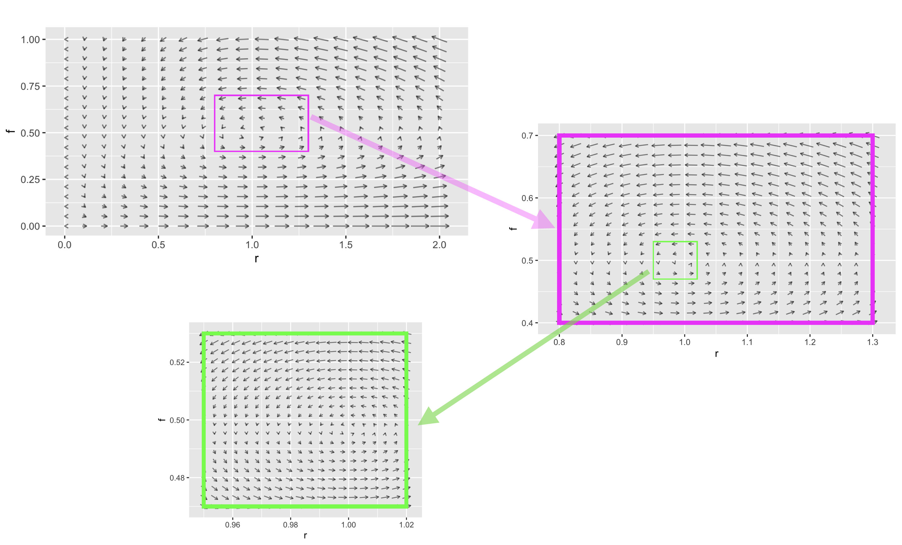

## Flows on the plane {#flow-on-plane}

<div style="float:right;">[](https://github.com/ProjectMOSAIC/MOSAIC-Calculus/blob/main/Block-6/B6-fixed-points.Rmd)</div>

::: {.underconstruction}
i. Classify fixed points as stable/unstable given the dynamics
i. Identify the dynamics of constant growth
i. Compute Euler solutions (format for expressing the system and the format of the result)
i. Analyze models in application contexts (for example May’s Cows - a model of bistability in ecology)


[Last year's daily digitals](https://maa-statprep.shinyapps.io/142Z-DD-17) from DD-15 to about DD-20 
:::


Let's return the rabbit/fox system as an example of flow. Since there are two state quantities, $r$ and $f$, the state space $(r, f)$ is a plane. At each point in the state space, the flow vector gives the direction and speed of motion. Like all vectors, a flow vector has only two properties: the direction and length. The speed of motion is the length of the flow vector.

The flow itself is a ***vector field***. This is an assignment of a vector to each point of the state space. Graphically, we depict a flow field by selecting a grid of points in the state space, finding the flow vector for each grid point, and drawing those vectors positioned at their respective grid points.

```{r rf-flow-2, echo=FALSE, fig.cap="The flow field has a vector at each point in state space but we can draw only a few if the plot is to be legible. Zooming in on a region produces more detail."}
# commands to make the individual plots in the figure
# vectorfield_plot(0.66*r - 1.33*r*f ~ r & f,
#                  -f + r*f ~ r & f,
#                  domain(r=0:2, f=0:1)) %>%
#   gf_rect(.4 + .7 ~ .8 + 1.3, color="magenta", fill=NA) %>%
#   gf_refine(coord_fixed())
# vectorfield_plot(0.66*r - 1.33*r*f ~ r & f,
#                  -f + r*f ~ r & f,
#                  domain(r=.8:1.3, f=.4:.7)) %>% 
#   gf_rect(.4 + .7 ~ .8 + 1.3, color="magenta", size=2, fill=NA) %>%
#   gf_rect(.47 + .53 ~ .95 + 1.02, color="green", fill=NA) %>%
#   gf_refine(coord_fixed())
# vectorfield_plot(0.66*r - 1.33*r*f ~ r & f,
#                  -f + r*f ~ r & f,
#                  domain(r=.95:1.02, f=.47:.53)) %>% 
#   gf_rect(.47 + .53 ~ .95 + 1.02, color="green", size=2, fill=NA) %>%
#   gf_refine(coord_fixed())

```

Recall from Block 5 that it's conventional to specify a vector by giving a coordinate pair for the tip of the vector with the understanding that the tail is at the origin. For the rabbit/fox system, the tip's coordinate is $\left({\Large\strut} g_r(r, f),\  g_f(r, f)\right)$. This notation is potentially confusing, because the letters $r$ and $f$ appear in so many places. Each each vector in Figure \@ref(fig:rf-flow2) is drawn at a particular point, say $(r=0.96, f=0.48)$. At that point, evaluate the dynamical functions: $g_r(r=0.96, f=0.48) = $ and $g_r(r=0.96, f=0.48)= , 
a flow vector is given by the dynamical functions, $g_r(r, f)$ and $g_f(r, f)$. The state space is :
$$\partial_t r = g_r(r, f) = \alpha r - \beta r f\\
\partial_t f = g_f(r, f) = - \delta f + \gamma r f$$

A fixed point in a second-order system exists at a state where both of the differential equations evaluate to zero. This amounts These simple dynamical functions can be manipulated algebraically to show that there is one fixed point:

$$\text{zeros for}\ r:\ \ \alpha r - \beta r f = 0 \ \ \ \implies\ \ \ f^\star = \frac{\alpha}{\beta}\\
\ \\
\text{zeros for}\ f:\ \ - \delta f + \gamma r f = 0 \ \ \ \implies \ \ \ r^\star = \frac{\gamma}{\delta}$$
We were able to solve the above equations


More generally, considering that the dynamical functions have two inputs, $r$, and $f$, we can see where each of the functions is zero by looking at the zero contour of each function individually. Where the zero contours cross, there is a fixed point.  Figure \@ref(fig:rabbit-fox-nullclines) shows the situation for the rabbit/fox system. These zero contours are called ***nullclines***. At any point on the rabbit nullcline, the flow arrows have zero component in the rabbit direction in state space. Similarly, at any point on the fox nullcline, the flow field has zero component in the fox direction.


```{r rabbit-fox-nullclines, echo=FALSE, fig.cap="Flow field for the rabbit/fox system. The rabbit nullcline is magenta, the fox nullcline is blue." } 
contour_plot(0.66*r - 1.33*r*f ~ r & f, domain(r=.1:2, f=0.05:1), contours_at = 0, contour_color = "magenta", filled = FALSE, labels=FALSE) %>%
  contour_plot(-f + f*r ~ r & f, contours_at=0, contour_color="blue", filled=FALSE, labels=FALSE ) %>%
vectorfield_plot(0.66*r - 1.33*r*f ~ r & f, 
                 1*f*r -1*f ~ r & f, 
                 domain(r=.1:2, f=0.05:1), npts=20, 
                 transform=I) %>%
  gf_labs(x="Rabbit density", y="Fox density")
```


```{r}
show_abcd <- function(a, b, c, d) {
  dx <- makeFun(a*x + b*y ~ x & y)
  dy <- makeFun(c*x + d*y ~ x & y)
  # contour_plot(dx(x,y) ~ x&y, contour_color="red", labels=FALSE, filled=FALSE,  
  #              contours_at=0, domain(x=-1:1, y=-1:1)) %>%
  #   contour_plot(dy(x,y) ~ x&y, contour_color="blue", labels=FALSE, filled=FALSE, 
  #                contours_at=0) %>%
    inequality_constraint(dy(x,y) < 0 ~ x&y, fill="blue", alpha=0.3, domain(x=-1:1, y=-1:1)) %>%
      inequality_constraint(dx(x,y) < 0 ~ x&y, fill="red", alpha=0.3, domain(x=-1:1, y=-1:1)) %>%
  vectorfield_plot((dx(x,y)) ~ x&y, sign(dy(x,y)) ~ x & y, transform=function(x) x^0.3) %>%
    gf_refine(coord_fixed())
    #vectorfield_plot(sign(dx(x,y)) ~ x&y, 0 ~ x & y, color="red") %>%
    #vectorfield_plot(0.001 ~ x&y, sign(dy(x,y)) ~ x&y, color="blue", transform=I)
   }

show_abcd(.5, 1, 1, -.7)
show_abcd(-.5, -1, 1, .7)
show_abcd(-1, -.5, -.2, -.7)
show_abcd(1, .5, -.2, -.7)
show_abcd(-1, -.5, .2, .7)
show_abcd(1, .5, .2, .7)
```

## Stability

hurricanes, tornados, orbits, sand dunes and beach ripples, Galloping Gurdy, ..., orbit around Lagrange point, 

## Linearization


::: {.intheworld data-latex=""}
Given a choice between a numerical and a symbolic solution to exactly the same problem, the symbolic solution is generally better: it's exact and it can incorporate parameters symbolically.


> *"Far better an approximate answer to the right question, which is often vague, than an exact answer to the wrong question, which can always be made precise."* -- John Tukey (1915-2000)
:::


### Tree example

A tree provides a simple example of equilibrium. A living tree grows slowly, with essentially no change from day to day. The tree is usually in equilibrium with its surroundings. But there are disruptions that can place the tree out of equilibrium. The wind is a familiar disruption, changing the dynamics so that the tree no longer stands straight and still; it sways in the wind. A severe storm or a chain saw creates an opportunity for bigger disruption, removing the fixed point of upright posture and replacing it with an entirely different sort of fixed point. The steady, slow process of rot can weaken the equilibrium to the point where it no longer exists or is too weak to withstand the wind. The tree falls.

Mathematics provides several concepts for thinking about equilibrium and the loss of equilibrium. The idea of a **fixed point** is at the center of things. The idea of disruption also has a mathematical equivalent called "forcing." The slow change (as in the rot of a tree) leading to a dramatic, sometimes sudden, collapse is represented by a "bifurcation." We'll explore forcing and bifurcation later, when we've developed better tools and ways of thinking to understand dynamics.


Previously, we examined the stability of fixed points by using iteration: start at an initial condition arbitrarily close (but not exactly on!) a fixed point and see if the trajectory tends toward or away from the fixed point.

Now we'll look at stability another way, by considering the shape of of the dynamical function near a fixed point. At this point in CalcZ, you're aware that "near" suggests local, and that we routinely model (continuous) functions in terms of the value at a point, the value of the derivative at the point, and the value of the 2nd derivative at the point.


