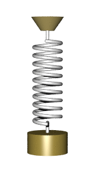

# Force-balance equations {#second-order-de}

<div style="float:right;">[](https://github.com/ProjectMOSAIC/MOSAIC-Calculus/blob/main/Block-6/B6-equalibria.Rmd)</div>

9. Calculus of second order differential equations
    a. Objectives/topics
        i. Force balance equations
        i. Equivalence to phase plane description
        i. Exponential Ansatz (solution is made up of exponentials, which one?)
        i. Complex eigenvalues
        

Up to now, we have been studying dynamics in the format of one or more first-order differential equations. For instance,
$$\partial_t x = f(x, y)\\
\partial_t y = g(x, y)$$
where $f(x,y)$ and $g(x,y)$ are the dynamical functions. This is not the style in which differential equations were introduced in the late 1600s. Instead, [Isaac Newton](https://en.wikipedia.org/wiki/Isaac_Newton) (1642-1727) wrote his differential equations in the format of his Second Law of Motion, which reads (in a 1792 translation):

> **LAW II**: *The alteration of motion is ever proportional to the motive force impressed; and is made in the direction of the right line in which that force is impressed.* --- [Source](https://cudl.lib.cam.ac.uk/view/PR-ADV-B-00039-00001/9)

In contemporary language, we would say things differently. Instead of "alteration of motion" we would write $\partial_t v$, where $v$ is the velocity of the moving object. We call $\partial_t v$ the acceleration.  Instead of "motive force" we would say simply "force," and instead of "made in the direction of the right line in which that force is impressed", we would say that velocity, acceleration, and force are vector quantities. Newton's "ever proportional to" amounts to saying that 
$$\partial_t \vec{v} = b \vec{F}\,$$
that is, change in motion is proportional to force. Newton stipulated that the constant of proportionality, $b$, is the reciprocal of mass, that is $1/m$. Writing acceleration $\vec{a} = \partial_t \vec{v}$, the previous equation amounts to $$m \vec{a} = \vec{F}\ ,$$  
the form in which beginning physics students first hear it.

Newton, of course, was very interested in ***gravity***. From previous experiments dropping weights and rolling balls down ramps, as was done by Galileo Galilee (1564-1642), Newton knew that the force of gravity on an object (near the surface of Earth) is proportional to the object's mass, that is $$\vec{F} = -g m\ ,$$ where the direction of $\vec{F}$ is straight downwards toward the center of the Earth. The negative sign in front of $g$ reflects this downward direction. We're assuming that position and velocity are both defined in a positive, upward direction.^[It's remarkable that the same $m$ appears both in Newton's Second Law and in the description of the force of gravity. There was no mathematical theory for this until Albert Einstein (1879-1955)] developed his ***Theory of General Relativity***.]

The simple model of an object moving under the force of gravity is $\partial_t v = g$. Notice that this is not a linear differential equation---$g$ is not a linear function of $v$ but a constant, and there's no fixed point---so the solution is not an exponential. But we can find the solution easily enough by integrating both sides of the equation with respect to $t$.

$$\int \partial_t v\, dt = \int -g\, dt \ \ \implies v(t) = -g\, t + C$$
where $C$ captures the constants of integration from both integrals into one number.

It's worth noticing how much mathematics needs to be understood before this method of solution makes sense. The ***fundamental theorem of calculus*** is what tells us that $\int \partial_t v\, dt = v(t) + B$, and you have to know about how to anti-differentiate a constant function to make sense of $\int g\, dt = -g\,t + D$. You also need to know why constants of integration, such as $B$ and $D$, get included when writing the function that results from an anti-differentiation. (You might need to revisit Block 3 to refresh your memory about such things.)

There's also some physical context to be considered. By setting $t=0$ in $v(t) = -g\,t + C$, for instance, we can identify $C$ as the velocity at time zero, which we might write $v(0)$ or $v_0$ for short. And what about the position of the object? The solution $v(t) = -g\,t + v_0$ has nothing to say directly about the position $x(t)$ of the object as a function of time. We can work position $x(t)$ into things by recognizing that $v(t) = \partial_t x(t)$, which is the definition of velocity.

Anti-differentiating both sides of $v(t) = -g\, t + v_0$ gives us a more complete story that include both initial velocity $v_0$ and initial position $x_0$:
$$\int v(t)\, dt = \int \left(\strut -g\, t + v_0\right)\ dt \implies x(t) = -\frac{1}{2} g\,t^2 + v_0\,t + x_0\ ,
$$
where $x_0$ is the constant of integration from this second stage of anti-differentiation. (Plug in $t=0$ to see why we're justified in taking $x_0$ as the initial position.)^[Another bit of physics which is still not included in the differential equation is that it will only hold until the object hits the ground, at which point the force of gravity will be counter-acted by the force of the ground on the object.]

Still one more way to write the dynamics of falling under the influence of gravity .... Recognizing that $v(t) = \partial_t x(t)$, we can see that $\partial_t v(t) = \partial_{tt} x(t)$. So the original differential equation could be written:

$$\partial_{tt} x = -g$$
This is an example of a ***second-order differential equation***, so called because of the appearance of a second derivative, $\partial_{tt}x$. 

In this chapter, we'll study second-order differential equations in a variety of contexts. But, as for Newton, movement under the influence of gravity will be a focus. Since the second-order differentiation can be interpreted as representing the balance between force and acceleration, we'll call these ***force-balance equations***.

In general, a force-balance equation has the form
$$\partial_{tt} x = f(\partial_t x, x)$$, the acceleration is a function both of position and velocity. In the above example, the dynamical function has a particularly simple form: $f(\partial_t x, x) \equiv -g$.

Second-order differential equations can always be written as a pair of first-order differential equations. To see this, let one of the first-order equations be $$\partial_t x = v\ .$$ The other equation, $\partial_{tt} x = f(\partial_t x, x)$ can be re-written in terms of $v$:
$$\partial_t v = f(v, x)\ .$$

Since we know how to solve sets of first-order differential equations by Euler's method, we can always find the solution $x(t)$ to any second-order differential equation.

## Ballistics

A lot of the theory of second-order differential equations was developed in the setting of a ball being set off with an initial velocity from an initial position. Such a focus on the flight of balls might seem trivial. Fortunately, language allows us to construct a scientific-sounding word by adding the suffix "istic" to the root "ball." This suffixing produces the word ***ballistics***.

The importance of ballistics to Newton can be seen by a famous diagram he drew, shown in Figure \@ref(fig:newton-ballistics). In the diagram, Newton traces the path of a ball shot horizontally from a cannon placed at the top of a mountain. 

```{r newton-ballistics, echo=FALSE, fig.cap="Newton's diagram showing ballistic motion under the force of gravity."}
knitr::include_graphics("www/Newton-cannon.png")
```

Since the motion in Newton's diagram has both vertical and horizontal components, we're going to need *two* second-order differential equations:

$$\text{Horizontal}: \ \ \partial_{tt} x = 0\\
\ \ \ \text{Vertical}: \ \ \ \ \ \ \partial_{tt} y = -g$$
The zero on the right-hand side of the equation of horizontal movement reflects that gravity does not act horizontally.

We found a solution for the vertical equation in the previous section, $$y(t) = -\frac{1}{2} g\,t^2 + 0\,t + y_0\ .$$ The $0\, t$ component to the solution reflects that the vertical component of the ball, coming out of the cannon, is zero.

The solution for the horizontal component of motion can be found by anti-differentiating both sides of the equation of hortizontal motion:
$$\int \partial_{tt} x(t)\, dt = \partial_t x(t) = \int 0\, dt = v_0$$ where $v_0$ is the initial horizontal velocity. A second stage of anti-differentiation gives $x(t)$ itself:
$$\int \partial_t x(t) = \int v_0 dt = v_0\, t + x_0$$

Regrettably, symbolic anti-differentiation works only in simple cases. To support more realistic models of ballistics, let's see how to translate the two second-order differential equations into sets of first-order equations.  The state variables will be $x(t)$ and $y(t)$, but we also have to add another pair, $u(t)$ and $v(t)$ standing for the horizontal and vertical velocities respectively. The first-order equations will be:
$$\partial_t x = u\\
\partial_t y = v\\
\partial_t u = 0\\
\partial_t v = -g
$$
To illustrate, we'll solve this set of four first-order equations numerically. We need to specify the initial values for $x_0$, $y_0$, $u_0$ and $v_0$. We'll let the cannon be located at horizontal position $x_0 = 0$ and vertical position $y_0 = 100$ meters. The vertical velocity is, initially, zero, so $v_0 = 0$. And suppose the cannon produces an initial horizontal velocity of $u_0 = 250$ meters/sec. The constant $g$ is known to be 9.8 meters/sec^2^. 

Here's the trajectory:
```{r results="hide"}
traj <- integrateODE(
  dx ~ u, dy ~ v, du ~ 0, dv ~ -9.8, #dynamics
  x=0, y=100, u = 250, v=0, #initial conditions
  tdur=5
) 
traj_plot(y(t) ~ x(t), traj)
traj_plot(v(t) ~ u(t), traj)
```
```{r cannon-shot-1, fig.cap="Trajectory of the cannon ball shot with an initial horizontal velocity and no initial vertical velocity. The trajectory is plotted in slices of state space: position $(x, y)$ and velocity $(u, v)$. The time at which the ball reaches the points marked on the trajectory give the time."}
P1 <- traj_plot(y(t) ~ x(t), traj) %>%
  gf_hline(yintercept=~0, color="brown") %>%
  gf_labs(subtitle="(x, y) position as a function of time")
P2 <- traj_plot(v(t) ~ u(t), traj) %>%
  gf_labs(subtitle="(u, v) velocity as a function of time")
gridExtra::grid.arrange(P1, P2, nrow=1)
```
The left panel in Figure \@ref(fig:cannon-shot-1) shows that the trajectory is a parabola. At about $t=4.4$ secs the $y$ position is zero. If zero is the location of the ground, the part of the trajectory for $4.4 < t$ is invalid, since the ball has already hit the ground. The ball travels a little more than 1100 meters horizontally before hitting the ground.

The right panel might seem somewhat strange. You can see that the vertical component of velocity, $v(t)$ starts out at zero and increases linearly with time, becoming more and more negative as gravity continuous to accelerate the ball downward. The vertical velocity, $u(t)$, stays constant at $u(t) = 250$ meters per second. This is because there is no horizontal force on the ball.

::: {.intheworld data-latex=""}
The world's first programmable, electronic, general-purpose digital computer was started up in 1945 at the University of Pennsylvania, where it is still on display. The date and location have something to say about why the computer was built. 1945 is, of course, at the end of World War II. The computer was built to carry out some important war-time calculations. The place, Philadelpha, Pennsylvania, has to do with the location of the US Army's center for developing and testing ordnance: the [Aberdeen Proving Ground](https://en.wikipedia.org/wiki/Aberdeen_Proving_Ground#History) which is only 75 miles from the University of Pennsylvania.

The name given to the computer, ENIAC, has a science-fiction flavor but is in fact rooted in its purpose: the Electronic Numerical Integrator and Computer. ENIAC was constructed to calculate the trajectories of artillery shells. Knowing the trajectory is essential to being able to fire artillery accurately.

The ballistics of real world artillery shells is more complex than the simple model we constructed earlier. What's missing from that model is air resistance, which is a function of the shell's velocity and altitude. To illustrate, let's add in a simple model of air resistance to the earlier ballistic model. In this model, the force of air resistence is a vector pointing in the opposite direction to overall velocity and proportional to velocity squared.

The velocity vector is simply $\left[\begin{array}{c}u\\v\end{array}\right]$. The air resistence force will be $$-\alpha\sqrt{\strut u^2 + v^2} \left[\begin{array}{c}u\\v\end{array}\right]\ .$$ Consequently, the horizontal component of the air-resistence vector is $-\alpha\, u \sqrt{\strut u^2 + v^2}$ and the vertical component is $-\alpha\, v \sqrt{\strut u^2 + v^2}$. 

Incorporating air resistence into the model can be done like this:
$$r(u, v) \equiv \alpha \sqrt{\strut u^2 + v^2}\\
\partial_t x = u\\
\partial_t y = v\\
\partial_t u = -u\, r(u,v)\\
\partial_t v = -g - v\, r(u,v)$$
ENIAC would have been programmed to carry out the calculation we now do with `integrateODE()`:

```{r}
r <- makeFun(alpha*sqrt(u^2 + v^2) ~ u & v, alpha=0.003)
traj2 <- integrateODE(
  dx ~ u, dy ~ v, du ~ -u*r(u,v), dv ~ -9.8 - v*r(u,v), #dynamics
  x=0, y=100, u = 250, v=0, #initial conditions
  tdur=6
)
traj_plot(y(t) ~ x(t), traj)
traj_plot(v(t) ~ u(t), traj)
```

```{r cannon-shot-2, fig.cap="Adding air resistence to the model changes the trajectory. For reference, the trajectory *without air resistence* is plotted in $\color{orange}{\text{orange}}."}
P1 <- 
  gf_hline(yintercept=~0, color="brown") %>%
  traj_plot(y(t) ~ x(t), traj, nt=2, color="orange") %>%
  traj_plot(y(t) ~ x(t), traj2) %>%
  gf_labs(subtitle="(x, y) position as a function of time")
P2 <- traj_plot(v(t) ~ u(t), traj2) %>%
  gf_labs(subtitle="(u, v) velocity as a function of time")
gridExtra::grid.arrange(P1, P2, nrow=1)
```
Air resistance causes the cannon ball to travel a shorter horizontal distance and to arrive with a much reduced velocity.
:::

## The harmonic oscillator

Consider the motion of a weight attached to a spring, as in Figure \@ref(fig:spring-mass). We'll denote the vertical position of the mass by $y(t)$. Such a spring-mass system has a fixed point where the spring is stretched just enough to cancel out gravity and the velocity is zero. We'll measure $y$ relative to this fixed point. 

```{r spring-mass1, echo=FALSE, fig.cap = "A spring-mass system in motion. [Source: Svjo](https://commons.wikimedia.org/wiki/File:Animated-mass-spring.gif) [CC BY-SA](https://creativecommons.org/licenses/by-sa/3.0) via Wikimedia Commons"}

```
According to Hooke's Law, a stretched or compressed spring exerts a force that is proportional to the amount of extension or compression. With our measuring $y$ relative to the fixed point, the Hooke's Law force will be
$$m\, \partial_{tt} y = - k\, y\ ,$$ where $m$ is the amount of mass.
This force-balance equation corresponds to the second-order differential equation $$\partial_{tt} y = - \frac{k}{m} y\ .$$

You can see that the motion is oscillatory, which suggests that the solution to the differential equation will be of the form $y(t) = A \sin(\omega t)$. Taking this as an ***ansatz*** leads to finding a value of $\omega$, which is called the ***angular frequency*** of the oscillation. (In terms of the period of oscillation $P$, the angular frequency is $\omega = 2 \pi/P$.)

To find $\omega$, plug in the ansatz to the differential equation:

$$\partial_{tt} \sin(\omega t) = - \frac{k}{m}\, \sin(\omega t)$$ 
Differentiating $\sin(\omega t)$ once let's us re-write the left-hand side of the equation in terms of a *first derivative*

$$\partial_{t} \omega\, \cos(\omega t) = - \frac{k}{m}\, \sin(\omega t)$$
Differentiating again gives
$$- \omega^2 \sin(\omega\, t) = - \frac{k}{m}\, \sin(\omega t)\ .$$
Simplifying this by cancelling out the sine term gives $\omega = \sqrt{\frac{k}{m}}$, the angular frequency of the oscillation.

It's common for their to be friction, called ***damping***, in a spring mass system. To keep things very simple, we'll consider that the friction is proportional to the velocity and, as in the cannon-ball example, in the direction opposite to velocity. That is:
$$\partial_{tt} y = a\, \partial_t y + b y\ ,$$ where $b$ would be the negative number $- \frac{k}{m}$ and $a$ is another negative number reflecting the magnitude of friction.

As always, this second-order differential equation can be written as a pair of first-order differential equations. One of the first-order differential equations will be
$$\partial_t y = v\ ,$$, which is just the definition of velocity $v$. The other first-order equation will be
$$\partial_t v = a v + b y\ .$$ Both equations are linear.

In the previous chapter, we wrote such a pair of linear first-order differential equations in terms of a vector
$$\vec{w(t)} = \left[\begin{array}{c}v(t)\\y(t)\end{array}\right]\ .$$
In terms of the vector $\vec{w(t)}$ the dynamics can be written in vector/matrix form:
$$\partial_t \vec{w} = \left[\begin{array}{cc}a & b\\1 & 0\end{array}\right]\, \vec{w}\ .$$
This form suggests to the avid reader of the previous chapter, that we look for a solution $y(t) = m_1\, e^{\lambda_1\, t} + m_2\, e^{\lambda_2\, t}$ in terms of the eigenvectors and eigenvalues of the matrix $\left[\begin{array}{cc}a & b\\1 & 0\end{array}\right]$.

We used the R function `eigen()` to compute the eigenvalues and eigenvectors of the matrix, given numerical values for $a$ and $b$. Let's now try to find an algebraic formula for the eigenvalues. After all, it's the eigenvalues that determine the stability of the fixed point.

As an *ansatz* for the for the original second-order differential equation $$\partial_{tt} y = a\, \partial_t y + b y\ ,$$ let's use $y(t) = A e^{\lambda t}$, a simple exponential function. Plugging in the ansatz to the differential equation gives:
$$A \lambda^2 e^{\lambda t} = a A \lambda e^{\lambda t} + b A e^{\lambda t}\ .$$ 
We can cancel out the common term $A e^{\lambda t}$ from all the terms in the equation, and bring all the terms to the left-hand side of the equation, leaving us with
$$\lambda^2 - a \lambda - b = 0\ .$$
This is a quadratic polynomial in $\lambda$, so we can use the "quadratic formula" to find values for $\lambda$ that are consistent with the parameters $a$ and $b$.

$$\lambda = \frac{a \pm \sqrt{\strut a^2 + 4 b}}{2}\ .$$
::: {.example data-latex=""}
Consider the second-order linear differential equation $$\partial_{tt} y - 2\, \partial_t y - 3\, y = 0\ .$$ Is this system stable?

For this system, $a=2$ and $b = 3$, so the eigenvalues are 
$$\lambda = \left(2 \pm \sqrt{\strut 4 + 12}\right)/2 = 1 \pm \sqrt{16}/2 = 1 \pm 2$$
In other words, $\lambda_1 = 3$ and $\lambda_2 = -1$. This indicates that the system is a saddle: unstable in one direction and stable in the other.

To confirm our work, let's use `eigen()` to find the eigenvalues of the matrix $\left[\begin{array}{cc}2 & 3\\1 & 0\end{array}\right]$:

```{r}
M <- cbind(rbind(2,1), rbind(3,0))
eigen(M)
```

Actually, there is a simpler way to write the directions of the eigenvectors:
$$\vec{\Lambda_1} = \left[\begin{array}{c}\lambda_1\\1\end{array}\right]\ \ \text{and}\ \ \vec{\Lambda_2} = \left[\begin{array}{c}\lambda_2\\1\end{array}\right]$$

For the system with $\lambda_1 = 3$ and $\lambda_2 = -1$, you can confirm that the eigenvectors calculated with this formula point in the same directions as the eigenvectors reported by `eigen()`.
:::

## Exponential or sinusoid?

We've said that the solutions to second-order linear differential equations have the form $m_1 e^{\lambda_1 t} + m_2 e^{\lambda_2 t}$. On the other hand, we saw one linear second-order differential equation, $\partial_{tt} y = - \frac{k}{m} y$ where the solution was a sinusoid: $y(t) = A \sin(\omega t)$ with $\omega = \sqrt{\frac{k}{m}}$.

How is it possible for exponential solutions to oscillate like a sinusoid? Sinusoids oscillate up and down and up and down, whereas exponentials just keep growing (or decaying---which is growth backwards in time). 

To find out what might be the relationship between an exponential and a sinusoid, let's plug an exponential *ansatz* $y(t) = A e^{\lambda t}$ into the spring-mass system $\partial_{tt} y = - \frac{k}{m} y$.

$$\partial_{tt} A e^{\lambda t} = \lambda^2 A e^{\lambda t} = -\frac{k}{m} A e^{\lambda t}\ .$$
As before, we'll cancel out the common term $A e^{\lambda t}$ to get a simple relationship:
$$\lambda^2 = -\frac{k}{m}\ \ \ \implies\ \ \ \lambda = \pm \sqrt{\strut-1}\  \sqrt{\frac{k}{m}} \ .$$
Generally, the symbol $i$ is used to stand for $\sqrt{\strut -1}$, so our eigenvalues can be written $\lambda = \pm i \sqrt{\frac{k}{m}}$. 

$i$ is often called the ***imaginary unit***, which tempts many people to disregard $i$ as something mystical and outside of arithmetic. But in fact, $i$ fits in to a more extensive system of arithmetic called the ***complex numbers***.

In your more advanced studies, when you use stability concepts or examine oscillatory functions, you will make considerable use of imaginary numbers. It will likely take you some time to get used to the idea of using something "imaginary," which is a legacy of the unfortunate name given to numbers involving $i$ before it was realized that $i$ is genuinely useful.

It's better to think about $i$ as an accounting device rather than something outside reality.

Here's how the accounting works. A ***complex number*** is a quantity like $3 - 2 i$, which has both a ***real part*** (3) and an ***imaginary part*** (2i). R and other technical systems are designed to do arithmetic and other operations with complex numbers. The starting point is to write complex numbers in a special format, like `3 - 2i`. Notice that there is no multiplication sign between the `2` and the `i`. This is the part of the notation that signals R to carry out complex-number calculations. For example:

```{r}
x <- 3 - 2i
y <- 1 + 3i
2*x
x + y
sqrt(x)
sqrt(x^2 + y^2)
Re(x)
Im(x)
Re(y)
Im(y)
```
Many function can take complex numbers as input. The output may also be a complex number. To draw a graph of such a function, we need to plot the real part of the output separately from the imaginary part. Like this:
```{r}
lambda1 <- -1 + 5i
lambda2 <- -1 - 5i
exp(lambda1)
Re(exp(lambda1))
Im(exp(lambda1))
Re(exp(lambda1*(0:5)))
slice_plot(Re(exp((-1+5i)*t)) ~ t, domain(t=0:3))
slice_plot(Re(exp((lambda1)*t)) ~ t, domain(t=0:3))
```

SOMETHING IS FUNNY WITH `slice_plot()`. Debug it.


It is clear that exponential functions are fundamentally different from sinusoidal functions. And we know that the spring-mass system oscillates up and down, just like the sinusoid. So it will seem pointless even to try an exponential form of ansatz. But we proceed nevertheless and try $x(t) = e^{kt}$ which gives us $$k^2 e^{kt} = b e^{kt}\ \ \implies\ \ k = \sqrt{\strut b} = \sqrt{\strut -\kappa/m} = i \sqrt{\strut\kappa/m} = i \omega$$ 
where we've used our earlier notation $\omega^2 = \kappa/m$. And, following convention, we've written $\sqrt{-1}$ as $i$.

In other words, $e^{i \omega t}$ is a sinusoid with angular frequency $\omega$.

## RESERVE


Now that you know some calculus, you might think that the word "Law" is a bit pompous, since any continuous function can be approximated locally as $f(x) \approx a_0 + a_1 x$, and if $f(0) = 0$ the approximation is even simpler: $f(x) \approx a_1 x$. To a modern cynic, Hooke's contribution might be described as noticing that the coefficient $a_1 < 0$, which is to say that when you stretch a spring it pulls back and when you compress a spring it pushes back. `r mark(6715)`

Putting Newton's 2nd Law and Hooke's Law together is  like mixing peanut butter and chocolate into a candy: it's found almost everywhere. The system it creates (the two Laws, not the candy) turns out to be a fundamental description of so many physical systems that it's at the heart of dynamics:
$$m \ddot{x} = -\kappa x \ \ \ \ \text{or, more simply,}\ \ \ \ \ddot{x} = bx$$ where $b = -\kappa/m$. Since mass $m$ and the spring elasticity $\kappa$ are positive, $b$ will be negative. 

This is a differential equation, although perhaps as yet unfamiliar since it involves a second derivative with respect to time rather than just a first derivative. We'll call it a "force-balance" format, since $m \ddot{x}$ is in balance with the spring force $-\kappa\, x$. `r mark(6720)`

Looking at the animated picture of the spring-mass system in motion, you can see the sustained oscillations. Of our modeling functions, the sinusoids are the ones that oscillate steadily.

In terms of the differential equation $\ddot{x} = b x$, the solution will be a function $x(t)$ whose second derivative with respect to time is proportional to $x(t)$ but with a minus sign (because $b < 0$). Happily, the sinusoids have exactly this property. `r mark(6725)`

The *ansatz* we'll propose for $\ddot{x} = b\,x$ is $x(t) = \sin(\omega t)$. Plugging in this ansatz to the differential equation gives: $$-\omega^2 \sin(\omega t) = b \sin(\omega t)$$
This will be true so long as $$\omega = \sqrt{\strut -b} = \sqrt{\strut\kappa/m}$$ The motion of the simple spring-mass system is not just *like* a sinusoid, but *is* a sinusoid.

Now on to something that will likely surprise you and probably discomfort you as well. 

It is clear that exponential functions are fundamentally different from sinusoidal functions. Sinusoids oscillate up and down and up and down, whereas exponentials just keep growing (or decaying---which is growth backwards in time). And we know that the spring-mass system oscillates up and down, just like the sinusoid. So it will seem pointless even to try an exponential form of ansatz. But we proceed nevertheless and try $x(t) = e^{kt}$ which gives us $$k^2 e^{kt} = b e^{kt}\ \ \implies\ \ k = \sqrt{\strut b} = \sqrt{\strut -\kappa/m} = i \sqrt{\strut\kappa/m} = i \omega$$ 
where we've used our earlier notation $\omega^2 = \kappa/m$. And, following convention, we've written $\sqrt{-1}$ as $i$.

In other words, $e^{i \omega t}$ is a sinusoid with angular frequency $\omega$.

-----

The previous section deduced an unexpected link between exponentials and sinusoids:

> $e^{i \omega t}$ is a sinusoid with angular frequency $\omega$.

The symbol $i$ is part of a system for working with coordinate pairs of numbers, called *complex numbers* e.g. (3, 2). For historical reasons, the first number in the pair is called the "real part," while the second part in the pair is called the "imaginary part."  Unfortunately, the name "imaginary" suggests to students starting out that the second part of the pair does not exist. That's silly, because in (3, 2) the imaginary part is simply 2---an ordinary number.  `r mark(6730)`

In interpreting the word "imaginary," you should keep in mind a long history in mathematics of assigning insulting names to mathematical objects that, at the time they were first introduced. That's why some numbers are vilified as "negative," and some as "irrational."  `r mark(6735)`

In R as in many other computer languages, complex numbers are written in a special syntax. The pair (3, 2) would be written `3 + 2i`.  For instance:
```{r echo=TRUE}
a <- 3 + 2i
a + a
a - a
a * a
a / a
```

Perhaps it's surprising that `a * a` gives `5 + 12i`. Let's see why:
$$ (3 + 2i) (3 + 2i) = 9 + 6i + 6i + 4i^2 = 9 + 12i -4 = 5 + 12i$$ where we have used the convention that $i^2 = -1$.

There are some R functions that are specifically for working with complex numbers. For us, the most important will be `Re()` and `Im()` which, respectively extract the "real" and "imaginary" parts of the number. `r mark(6740)`

```{r echo=TRUE}
Re(a)
Im(a)
Re(3)
Im(3)
```

The exponential function takes complex numbers as an input and returns a complex number as an output.
```{r echo=TRUE}
exp(a)
```

Let's plot $e^{i\omega t}$ over the domain $0 < t < 10$ using $\omega = 2$. We need to be a little careful, since our plotting functions are not arranged to display complex numbers. But there is an easy workaround: plot the "real" and "imaginary" parts separately. `r mark(6745)`

```{r cn1, exercise=TRUE, exercise.cap="Complex arithmetic", exercise.nline=8, eval=FALSE}
f <- makeFun(exp(1i * omega * t) ~ t, omega = 2)
slice_plot(Re(f(t)) ~ t, 
           domain(t=c(0, 10)), color = "orange3") %>%
  slice_plot(Im(f(t)) ~ t, color="dodgerblue")
```

```{r cn2, echo=FALSE, results="markup"}
askMC(
  "Which part of $e^{i \\omega t}$ is the cosine function?",
  "+The \"real\" part+",
  "The \"imaginary\" part",
  "The negative of the \"imaginary\" part",
  "The negative of the \"real\" part"
)
```

The next sandbox defines a new function, $e^{(k + i\omega) t}$ and plots its real and imaginary parts. 
```{r cn3, exercise=TRUE, exercise.cap="Complex exponential functions", exercise.nline=8, eval=FALSE}
g <- makeFun(exp((k + 1i * omega) * t) ~ t, omega = 2, k=-1)
slice_plot(Re(g(t)) ~ t, 
           domain(t=c(0, 10)), color = "orange3", npts=500) %>%
  slice_plot(Im(g(t)) ~ t, color="dodgerblue", npts=500)
```
```{r cn4, echo=FALSE, results="markup"}
askMC(
  "At what time $t$ does the sine-like function complete one full oscillation?",
  "At about $t=1.6$",
  "+At about $t=3.14$+",
  "At about $t=4.7$",
  "At about $t=6.28$",
  random_answer_order = FALSE
)
```

```{r cn5, echo=FALSE, results="markup"}
askMC(
  "Find a value for $\\omega$ that will produce one full oscillation every two time units. Graph it out to make sure that you have five full oscillations over the $0 < t < 10$ domain. What is that $\\omega$?",
  "$\\omega = 1$",
  "$\\omega = \\pi/2$",
  "+$\\omega = \\pi$+",
  "$\\omega = 2 \\pi$",
  random_answer_order = FALSE
)
```

```{r cn6, echo=FALSE, results="markup"}
askMC(
  "Keeping $\\omega$ at the value that produce five complete cycles over $0 < t < 10$, find a value for $k$ such that the amplitude of the oscillation at $t=10$ will be half that of the amplitude at $t=0$. What is $k$?",
  "$k \\approx -0.70$",
  "+$k \\approx -0.07$+",
  "$k \\approx 0.07$",
  "$k \\approx 0.70$",
  random_answer_order = FALSE
)
```

```{r cn7, echo=FALSE, results="markup"}
askMC(
  "Set $\\omega$ at the value that produces 20 complete cycles over $0 < t < 10$ and $k$ at the value such that the amplitude of the oscillation at $t=10$ will be *twice* that of the amplitude at $t=0$. What are $\\omega$ and $k$?",
  "$\\omega = \\pi,\\ k \\approx 0.35$",
  "$\\omega = 2 \\pi,\\ k \\approx 0.35$",
  "+$\\omega = 4 \\pi,\\ k \\approx 0.070$+",
  "$\\omega = 6 \\pi,\\ k \\approx 0.7$",
  random_answer_order = FALSE
)
```

<div class="explanation-note">
**Code-reading questions**

In the 2nd sandbox, the `slice_plot()` function is called with an argument $npts=500$. Use the following sandbox with the command `help(slice_plot)` to see the documentation for `slice_plot()` and read the explanation of the `npts` argument. 

```{r cn-code1, echo=FALSE, results="markup"}
etude2::etudeEssay(
  "In your own words, explain briefly why `npts=500` was used in the 2nd sandbox and why it wasn't needed in the first sandbox. To understand this, you may want to play around with small values for `npts` to understand what it does." 
)
```
</div>

## Friction

Friction is an inevitable feature of real-world spring-mass systems. Without friction the force-balance differential equation is $m\partial_{tt} x =  -k\, x$. How can friction fit in?

For a mass moving at velocity $\dot{x}$, the friction force will be in the direction *opposed* to the velocity and, when velocity is zero, friction goes away. Following our general calculus idea of approximating with a simple straight-line function, we get a force $\text{friction} = -r \dot{x}$. Adding in the friction force gives a new force-balance equation which has a famous name in physics: the "damped harmonic oscillator." `r mark(6760)`

$$m \ddot{x} = -r \dot{x} - k x$$
Since we've gotten in the habit of using $a$ and $b$ on the right side of the equation, we'll re-write the force-balance equation as 
$$\ddot{x} = a \dot{x} + b x$$ where $a = -r/m$ and $b = -k/m$.

As the name "damped harmonic oscillator" suggests, we expect that the solution to the force-balance equation will be a "damped" oscillation, that is an oscillation that decreases in amplitude over time as friction draws energy out of the system (and dissipates it as heat). But how fast and in what form will the amplitude decrease? `r mark(6765)`

We've had good luck with exponential ansätze, so let's again try $x(t) = e^{\lambda t}$.  Plugging this into the equation we get
$$\lambda^2 e^{\lambda t} = a \lambda e^{\lambda t} + b e^{\lambda t} \ \ \implies \ \ \lambda^2 - a \lambda - b = 0$$.

Are there values of $\lambda$ that will satisfy this condition?

<div class="explanation-note">
**The quadratic formula**

The famous quadratic formula refers to a quadratic function $$f(x) \equiv a x^2 + b x + c$$ As you know, the values $x^\star$ that are zeros of $f(x)$ are 
$$x^\star = \frac{1}{2a} \left[-b \pm \sqrt{\strut b^2 - 4 a c}\right]$$

Use this information about the quadratic formula to answer the below question.

```{r nos1, echo=FALSE, results="markup"}
askMC(
  "Find the two zeros $\\lambda_1$ and $\\lambda_2$ where $0=\\lambda^2 - a \\lambda - b$. Which of these is right?",
  "$\\lambda_{1,2} = \\frac{1}{2a} \\left[a \\pm \\sqrt{a^2 + 4b} \\right]$",
  "+$\\lambda_{1,2} = \\frac{1}{2} \\left[a \\pm \\sqrt{a^2 + 4b} \\right]$+",
  "$\\lambda_{1,2} = \\frac{1}{2a} \\left[a \\pm \\sqrt{a^2 - 4b} \\right]$",
  "$\\lambda_{1,2} = \\frac{1}{2} \\left[a \\pm \\sqrt{a^2 - 4b} \\right]$",
  random_answer_order=FALSE
)
```

</div>

The answer to the previous question is true no matter what are the quantities $a$ and $b$. But to correspond to friction and a spring force, we require $a < 0$ and $b < 0$. 

```{r fr1-1, echo=FALSE, results="markup"}
askMC(
"Suppose that friction is strong, that is $|a|$ is big. More specifically, suppose $a^2 > 4 |b|$. What will be true about $\\sqrt{\\strut a^2 - 4b}$?",
  "It will be purely \"imaginary\".",
  "+It will be purely \"real\".+",
  "It will be *complex*, that is with a non-zero real part and a non-zero imaginary part.",
  "There's no way to tell for sure.",
  random_answer_order = FALSE
)
```

```{r fr1-2, echo=FALSE, results="markup"}
askMC(
"When $a^2 > 4b$, can either of the eigenvalues be positive?",
  "+No+",
  "Yes, one eigenvalue can be positive.",
  "Both eigenvalues *must* be positive.",
  "Depends on the specific values of $a$ and $b$.",
  random_answer_order = FALSE

)
```

When *friction* dominates (that is, large $|a|$) the eigenvalues are both real and negative. This means there is no oscillation and the motion decays to $x = 0$.

```{r fr1-3, echo=FALSE, results="markup"}
askMC(
"Question: Suppose that friction is weak, that is $a^2 < 4|b|$. What will be true about $\\sqrt{a^2 + 4b}$?",
  "+It will be purely \"imaginary\".+",
  "It will be purely \"real\".",
  "It will be *complex*, that is with a non-zero real part and a non-zero imaginary part.",
 "There's no way to tell for sure.",
 random_answer_order = FALSE 
)
```

Suppose that we define $\omega \equiv \sqrt{\strut 4b - a^2}/2$ and $k = a/2$. (Recall, that for $a$ to describe friction, we must have $a < 0$.) The eigenvalues will be of the form  ${k + i\omega}$ and a solution to the differential equation will be $e^{(k + i\omega)t} = e^{kt} e^{ i \omega t}$. `r mark(6770)`


```{r fric4, echo=FALSE, results="markup"}
askMC(
  "What will $e^{-kt} e^{i \\omega t}$ be?",
  "+An exponentially decaying sinusoid+",
  "An exponentially growing sinusoid" = "Remember that $a > 0$, so $k = a/2 > 0$ and $e^{-kt}$ is a decaying exponential.",
  "An ordinary sinusoid."
)
```

## Not just springs!

An engineer's version of Hooke's Law might read: "Strain is proportional to stress." In everyday speech, "stress" and "strain" are synonyms, but engineers use them more precisely: "stress" is a *force* and "strain" is a change in shape, for instance stretching or *extension*. `r mark(6775)`

The frictionless equation $\ddot{x} =  b\, x$ and it's friction-ful cousin $\ddot{x} = a\, \dot{x} + b\, x$ are much more general and apply in situations that were not foreseeable in Hooke's time.  

To see how general is the second-order, linear, single-variable system $\ddot{x} = a \dot{x} + b x$, let's relate it to the first-order, linear, two-dimensional system 
$$ \left[\begin{array}{c}\dot{x}\\\dot{y}\end{array}\right] = 
\left[\begin{array}{cc}a & b\\c & d\end{array}\right] \left[\begin{array}{c}x\\y\end{array}\right]$$


Recall that in the force-balance system, $x$ is position, $\dot{x}$ is velocity, and $\ddot{x}$ is acceleration. We'll start by giving velocity it's own name:
$$\dot{x} \equiv v$$
Next, we notice that acceleration $$\ddot{x} = \dot{v}$$ With this, we can re-write the force balance equation as
$$\dot{v} = a v + b x$$
And remember that $$\dot{x} = v + 0x$$ where the $0x$ puts the equation in the same format as the equation for $\dot{v}$. Altogether, the equations for $\dot{x}$ and $\dot{v}$ give us
$$\begin{array}{cc}\dot{v} & = a v + b x\\\dot{x} & = v + 0x  \end{array}\ \ \ \ \text{or}\ \ \ \ \left[\begin{array}{c}\dot{v}\\\dot{x}\end{array}\right] = 
\left[\begin{array}{cc}a & b\\1 & 0\end{array}\right] \left[\begin{array}{c}v\\x\end{array}\right]$$

This is the [ab10] first-order, linear, two-dimensional differential equation. So, what started historically as an attempt to mathematicize the bobbing of springs and the swinging of pendulums became a general description of all sorts of dynamics near a fixed point. The result is that you see the "damped harmonic oscillator" all throughout science as a representation of any sort of dynamics near equilibrium, that is, near a fixed point. `r mark(6780)`

**Example: Passive electrical circuits**

One of the [ab10] of particular importance to science and technology is electrical circuits. In a step outside of calculus (meaning: you won't be examined on it) it's worth pointing out the correspondence between concepts of motion (acceleration, velocity, position) and electrical circuits (voltage, current, charge). `r mark(6785)`

There are three classical idealized passive components of circuits:

* capacitor, denoted 
* resistor, denoted 
* inductor, denoted 

In every case, we will be interested in the *voltage* across the two ends of the component. And we'll think about the dynamics of the circuit in terms of electrical *charge* which we'll denote $x$.

* For a capacitor the voltage is proportional to *charge* $x/C$, where $C$ is the "size" of the capacitor. 
* For a resistor the voltage is proportional to the flow of charge, that is, *current* $r \dot{x}$, where $R$ is the amount of resistance, basically the "size" of the resistor.
* For an inductor the voltage is proportional to the change in the flow of charge, that is, $L \ddot{x}$, where $L$ is the inductance.

Only a capacitor is capable of holding a voltage on its own. The other circuit elements can carry a voltage when they are part of a *circuit*.  We're going to explore a simple circuit. 

```{r echo=FALSE, out.width="40%", fig.align="center"}
knitr::include_graphics("www/lrc.png")
```

To prime the circuit, we're going to connect the two dots at the bottom of the circuit with a battery. This will charge up the capacitor in much the same way as we "charge up" a spring by pulling on it. Next remove the battery and get ready to observe the motion. Complete the circuit by closing the switch between the two dots. Doing so establishes the circuit, analogous to setting up the dynamics of the system. The initial condition is the amount of charge $x$ on the capacitor and, at the instant the switch is closed, no flow of current, giving $\dot{x} = 0$. `r mark(6790)`

The "force-balance" is the requirement that the sum of the voltages across the circuit elements be zero.  This amounts to

$$L \ddot{x} = -R\, \dot{x} - \frac{1}{C} x $$ 


Consider a circuit with inductance $L=1$, resistance $R=3$ and capacitance $C = 1$. What will be the eigenvalues of the dynamics? Will the fixed point at $x=0$ be stable or not?

Solution: $\lambda_{1,2} = \frac{1}{2}\left[-3 \pm \sqrt{\strut 9 - 4 }\right] = (-3 \pm \sqrt{5})/2$ so $\lambda_1 \approx -0.382$ and $\lambda_2 \approx -2.618$. Since both eigenvalues are negative, the fixed point is stable. `r mark(6795)`

```{nos2, echo=FALSE, results="markup"}
askMC(
  "Let's decrease the the resistence to $R=2$ and the capacitance to $C = 1/2$. What are the eigenvalues of the dynamics?",
  "+$\\lambda_1 = -1 + 1i$ and $\\lambda_2 = -1 - 1i$+",
  "$\\lambda_1 = -1 + 1i$ and $\\lambda_2 = 1 - 1i$"
  "$\\lambda_1 = 1 + 1i$ and $\\lambda_2 = 1 - 1i$+"
)
```


## Friction and excitation

Van der Pol oscillator

$$\partial_{tt} x + c(x^2 - 1) \partial_t x + x = 0$$
with $c > 0$.

The friction depends on $x$: it works against motion when $x^2 > 1$ and is excitory when $x^2 < 1$.


## Exercises

`r insert_calcZ_exercise("XX.XX", "N9iexG", "Exercises/chicken-say-lamp.Rmd")`

EXERCISE: Launch the cannon ball with an upward vertical component of velocity, that is, with the initial velocity vector at angle $\theta$ from the horizontal. You can model this by setting the initial $v_0 = 250 \sin\left(\strut \pi \theta/180\right)$ and
$u_0 = 250 \cos\left(\strut \pi \theta/180\right)$, where $\theta$ has units of degrees.  FIND THE $\theta$ that maximizes the horizontal distance travelled.

EXERCISE: Confirm numerically, using `eigen()` that the eigenvalues of the matrix $$\left[\begin{array}{cc}a & b\\c & d\end{array}\right]$$ are
$$\lambda_{1,2} = \frac{1}{2}\left[{\large\strut}(a-d)^2 \pm \sqrt{\strut(a+d)^2 - 4bc}\right]$$ and the eigenvectors are
$$\vec{\Lambda_1} = \left[\begin{array}{c}\lambda_1 - d\\c\end{array}\right]\ \ \text{and}\ \ \vec{\Lambda_2} = \left[\begin{array}{c}\lambda_2 - d\\c\end{array}\right]$$
