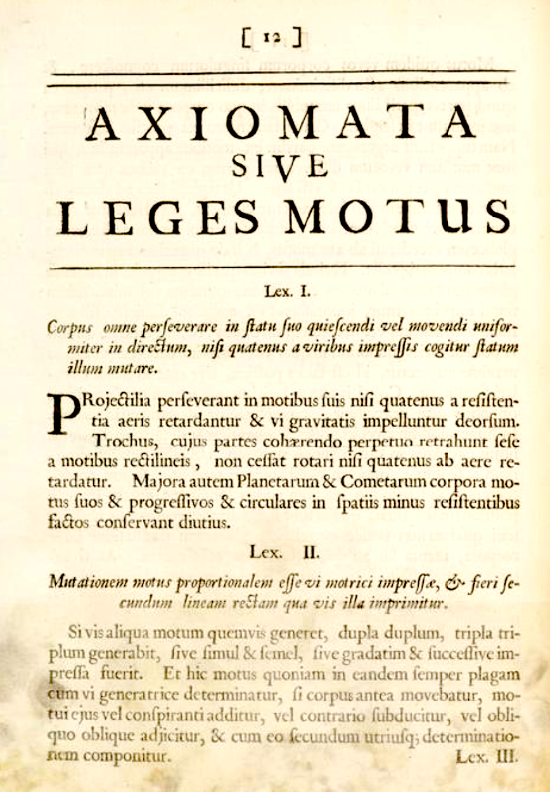

## Removed from Eigen


```{r eigen-trajs, echo=FALSE, fig.cap="The trajectories starting at the eigenvectors."}
traj_plot(y(t) ~ x(t), traj_eigen1, color="magenta", nt=1, domain=domain(t=0:.1)) %>%
  traj_plot(y(t) ~ x(t), traj_eigen2, color="blue", nt=1, domain=domain(t=0:.1)) %>%
  gf_segment(0 + 0.7072 ~ 0 + 0.7071, color="magenta", inherit=FALSE, arrow=arrow(ends="last", type="closed", length=unit(2, "mm"))) %>%
  gf_segment(0 + 0.8944 ~ 0 + -0.4472, color="blue", inherit=FALSE, arrow=arrow(ends="last",type="closed", length=unit(2, "mm"))) %>%
  flow_field(dx ~ x + y, dy ~ 2*x, domain = domain(x=-3:5, y=-4:5), color="gray", npts=15) %>%
  gf_refine(coord_fixed())

```


In Section \@ref(qualitative-stability) we looked at the stability from a qualitative point of view, finding eight generic situations for the two-state variable linear system.

Now we will look at things from a quantitative perspective, at least for saddles, centers, and sources. The key insight comes from looking at the flow field around the fixed point. As an example, we'll look at the system:


whose flow is shown in Figure \@ref(fig:linear-streamlines). The fixed point

```{r linear-streamlines, echo=FALSE, fig.cap="Flow for a linear system. The lines going through the fixed point are the directions in which the flow is directly toward the fixed point or away from the fixed point."}
gf_abline(intercept=~ 0, slope=~1, color="magenta", alpha=0.5, size=2) %>%
  gf_abline(intercept=~ 0, slope=~-2, color="brown", alpha=0.5, size=2) %>%
vectorfield_plot(x + y ~ x + y, 2*x ~ x + y, domain(x=-1:1, y=-1:1), npts=10, transform=function(x) x^0.3) %>%
  gf_refine(coord_fixed())

```
The fixed point in the flow of Figure \@ref(fig:linear-streamlines) is at $(0,0)$. The plot is annotated with two lines. The flow on the $\color{magenta}{\text{magenta}}$ line is directly away from the fixed point, while the flow on the $\color{brown}{\text{brown}}$ line is directly toward the fixed point.

As you'll see, for any saddle, center, or source, there are always two such directions from the fixed point such that a trajectory starting on a point in that direction will continue in a straight line in that direction toward or away from the fixed point. These directions are called ***eigenvectors***. The word "eigen" comes from the German for "own" or "self." In mathematics, it is usually translated as "proper" or "characteristic. That meaning is appropriate because the eigenvectors characterize the entire flow field.

The eigenvectors in Figure \@ref(fig:linear-streamlines) are $$\vec{v_1} = \left[\begin{array}{c}1\\1\end{array}\right]\ \ \ \text{and}\ \ \ \vec{v_2} = \left[\begin{array}{c}-\frac{1}{2}\\\ 1\end{array}\right]\ .$$


Here are two trajectories, one starting from $(x=0.1, y=0.1)$ and the other from $(x=-0.5, y=1)$

```{r two-trajectories, fig.cap="Any trajectory starting on an eigenvector will stay on that eigenvector."}
traj1 <- integrateODE(dx ~ x + y, dy ~ 2*x, x=0.1, y=0.1)
traj2 <- integrateODE(dx ~ x + y, dy ~ 2*x, x = -.5, y=1)
traj_plot(y(t) ~ x(t), traj1, color="magenta") %>%
  traj_plot(y(t) ~ x(t), traj2, color="brown") %>%
  vectorfield_plot(x + y ~ x + y, 2*x ~ x + y,
                   domain(x=-1:1, y=-1:1),
                   npts=10) %>%
  gf_refine(coord_fixed()) %>%
  gf_lims(x=c(-1,1), y=c(-1,1))
```

The idea that a trajectory starting on an eigenvector stays on an eigenvector has an important mathematical consequence for finding the solutions. For instance, the trajectory starting on $\vec{v_2} = \left[\begin{array}{c}-\frac{1}{2}\\1 \end{array}\right]$ will go only through points that have the relationship $y = -2 x$, since on $a \vec{v_2}$ the $y$ coordinate will always be negative 2 times the $x$ coordinate. This allows us to simplify the differential equations and immediately see the solution.
$$\partial_t x = x + y \ \ \implies\ \ \ \partial_t x = x - 2x = -x \ \ \implies\ \ x(t) = A e^{-1t}\\
\partial_t y = 2 x \ \ \implies\ \ \ \partial_t y = -y\ \ \implies \ \ \ y(t) = B e^{-1t}\ .$$ Since the solution will always be such that $y = -2 x$, we know that $B = -2 A$.

Similarly, for a trajectory starting on the other eigenvector, where $x = y$, the differential equations simplify to
$$\partial_t x = x + y \ \ \implies\ \ \ \partial_t x = x +y = 2x \ \ \implies\ \ x(t) = A e^{2t}\\
\partial_t y = 2 x \ \ \implies\ \ \ \partial_t y = 2y\ \ \implies \ \ \ y(t) = B e^{2t}$$ where $B = A$ so that the initial condition is on the eigenvector.

Solutions from an initial condition on an eigenvector are simple exponentials!

## Linear combinations

It's awkward having to write things like $B=A$ or $B = -2A$ to make clear that the initial condition is on an eigenvector.


What about solutions from initial conditions not on an eigenvector. For instance, how about the initial condition $$\left[\begin{array}{c}x_0\\y_0\end{array}\right] = \left[\begin{array}{c}-0.9\\2.1\end{array}\right] = 0.1 \vec{v_1} + 2 \vec{v_2}$$


Even more remarkable is the exponential shape of the solution, which we can see by plotting $y(t)$ vs $t$ on semi-log axes. (See Chapter `r Chaps$magnitudes`)
```{r exp-shape-soln}
traj_plot(y(t) ~ t, traj1, color="magenta") %>%
  traj_plot(y(t) ~ t, traj2, color="brown") %>%
  gf_refine(scale_y_log10(sec.axis = sec_axis( trans=~exp(.), name="y")))

```


Show that starting on an eigenvector stays on an eigenvector. The time series will be either a growing exponential or a decaying exponential, depending on the sign of $\lambda$.

Every $n\times n$ matrix---we are working with $2\times 2$ matrices for simplicity--has associated with it a set of $n$ numbers called *eigenvalues*.  This is a mix of the German word "eigen" meaning "characteristic," and the English work "values." Sometime they are called *characteristic values* just to render them purely in English. But "eigen" has a single, specific meaning in mathematics, so the word "eigenvalue" is more evocative to mathematicians than is "characteristic values."

The letter used to represent eigenvalues is the Greek lambda: $\lambda$. Since our $2\times 2$ matrices have 2 eigenvalues, we often write the pair as $\lambda_1$ and $\lambda_2$ or even as $\lambda_{1,2}$.

For an [ab10] matrix, the formula for the eigenvalues is

$$\lambda_{1,2} = \frac{1}{2} \left[a \pm \sqrt{a^2 + 4b\strut}\right]$$

Note the use of the $\pm$ in the formula. The same formula gives *both* eigenvalues, one from the $+$ branch of the $\pm$, the other from the $-$ branch. Using the $\pm$ rather than two different formulas---one with $-$ and one with $+$---is merely a convenience to make it explicit what the two formulas would have in common.

Writing $\lambda_{1,2}$ is nothing more than saying $\lambda_1$ *and* $\lambda_2$.

## Force-balance equations

Here is a page from the 1686 edition of Isaac Newton's *Philosophiæ naturalis principia mathematica*, one of the most influential texts in the history of science. This is the page where Newton lays out his "Laws of Motion" (*Leges Motus*) and you can see the three laws (*Lex. I*, *Lex. II*, and *Lex. III*) set out in order. 

```{r echo=FALSE, fig.cap="The laws of motion from the *Principia Mathematica* [Source](https://cudl.lib.cam.ac.uk/view/PR-ADV-B-00039-00001/9)"}

```


Since the text is in Latin, it's not so readily accessible to today's student. But even in English, it's not so easy. Legend has it that Newton overhear a Cambridge University student saying, "There goes a man that writ a book that he nor anyone else understands." `r mark(6705)`

The 1792 translation into English of *Lex. II* is:

> **LAW II: The alteration of motion is ever proportional to the motive force impressed; and is made in the direction of the right line in which that force is impressed.**

"Alteration of motion" is what we call "acceleration." Generations of students have learned a much more compact notation $${\mathbf F} = m {\mathbf a}$$
In this notation, ${\mathbf F}$ and ${\mathbf a}$ are vectors, but to keep things simple, we'll consider only movement and forces along a straight line. 

Acceleration, as you know, is the second derivative with respect to time of position. Denoting position by $x$, we can write the second law as a differential equation $$m \ddot{x} = F$$ 

One famous setting for the second law is an oscillating spring-mass system. Robert Hooke (1635-1703) formulated a Law for the force exerted by a spring, $F = -k x$, where $x$ is measured from the position where the spring exerts zero force.  `r mark(6710)`


## RESERVE from second-order.Rmd


Now that you know some calculus, you might think that the word "Law" is a bit pompous, since any continuous function can be approximated locally as $f(x) \approx a_0 + a_1 x$, and if $f(0) = 0$ the approximation is even simpler: $f(x) \approx a_1 x$. To a modern cynic, Hooke's contribution might be described as noticing that the coefficient $a_1 < 0$, which is to say that when you stretch a spring it pulls back and when you compress a spring it pushes back. `r mark(6715)`

Putting Newton's 2nd Law and Hooke's Law together is  like mixing peanut butter and chocolate into a candy: it's found almost everywhere. The system it creates (the two Laws, not the candy) turns out to be a fundamental description of so many physical systems that it's at the heart of dynamics:
$$m \ddot{x} = -\kappa x \ \ \ \ \text{or, more simply,}\ \ \ \ \ddot{x} = bx$$ where $b = -\kappa/m$. Since mass $m$ and the spring elasticity $\kappa$ are positive, $b$ will be negative. 

This is a differential equation, although perhaps as yet unfamiliar since it involves a second derivative with respect to time rather than just a first derivative. We'll call it a "force-balance" format, since $m \ddot{x}$ is in balance with the spring force $-\kappa\, x$. `r mark(6720)`

Looking at the animated picture of the spring-mass system in motion, you can see the sustained oscillations. Of our modeling functions, the sinusoids are the ones that oscillate steadily.

In terms of the differential equation $\ddot{x} = b x$, the solution will be a function $x(t)$ whose second derivative with respect to time is proportional to $x(t)$ but with a minus sign (because $b < 0$). Happily, the sinusoids have exactly this property. `r mark(6725)`

The *ansatz* we'll propose for $\ddot{x} = b\,x$ is $x(t) = \sin(\omega t)$. Plugging in this ansatz to the differential equation gives: $$-\omega^2 \sin(\omega t) = b \sin(\omega t)$$
This will be true so long as $$\omega = \sqrt{\strut -b} = \sqrt{\strut\kappa/m}$$ The motion of the simple spring-mass system is not just *like* a sinusoid, but *is* a sinusoid.

Now on to something that will likely surprise you and probably discomfort you as well. 

It is clear that exponential functions are fundamentally different from sinusoidal functions. Sinusoids oscillate up and down and up and down, whereas exponentials are monotonic. The spring-mass system oscillates up and down, just like the sinusoid. So it will seem pointless even to try an exponential form of *ansatz*. We proceed nevertheless and try $x(t) = e^{kt}$ which gives us $$k^2 e^{kt} = b e^{kt}\ \ \implies\ \ k = \sqrt{\strut b} = \sqrt{\strut -\kappa/m} = i \sqrt{\strut\kappa/m} = i \omega$$ 
where we've used our earlier notation $\omega^2 = \kappa/m$. And, following convention, we've written $\sqrt{-1}$ as $i$.

In other words, $e^{i \omega t}$ is a sinusoid with angular frequency $\omega$.

In your more advanced studies, when you use stability concepts or examine oscillatory functions, you will make considerable use of imaginary numbers. It will likely take you some time to get used to the idea of using something "imaginary," which is a legacy of the unfortunate name given to numbers involving $i$ before it was realized that $i$ is genuinely useful.

-----

$i$ is often called the ***imaginary unit***, which tempts many people to disregard $i$ as something mystical and outside of arithmetic. But in fact, $i$ fits in to a more extensive system of arithmetic called the ***complex numbers***.


It's better to think about $i$ as an accounting device rather than something outside reality.

Here's how the accounting works. A ***complex number*** is a quantity like $3 - 2 i$, which has both a ***real part*** (3) and an ***imaginary part*** (2i). R and other technical systems are designed to do arithmetic and other operations with complex numbers. The starting point is to write complex numbers in a special format, like `3 - 2i`. Notice that there is no multiplication sign between the `2` and the `i`. This is the part of the notation that signals R to carry out complex-number calculations. For example:

```{r}
x <- 3 - 2i
y <- 1 + 3i
2*x
x + y
sqrt(x)
sqrt(x^2 + y^2)
Re(x)
Im(x)
Re(y)
Im(y)
```
Many function can take complex numbers as input. The output may also be a complex number. To draw a graph of such a function, we need to plot the real part of the output separately from the imaginary part. Like this:
```{r}
lambda1 <- -1 + 5i
lambda2 <- -1 - 5i
exp(lambda1)
Re(exp(lambda1))
Im(exp(lambda1))
Re(exp(lambda1*(0:5)))
slice_plot(Re(exp((-1+5i)*t)) ~ t, domain(t=0:3))
slice_plot(Re(exp((lambda1)*t)) ~ t, domain(t=0:3))
```

SOMETHING IS FUNNY WITH `slice_plot()`. Debug it. ANSWER: We need to define the function externally then use the external function in `slice_plot()`. I don't know why this is yet.

-----

## Not just springs!

An engineer's version of Hooke's Law might read: "Strain is proportional to stress." In everyday speech, "stress" and "strain" are synonyms, but engineers use them more precisely: "stress" is a *force* and "strain" is a change in shape, for instance stretching or *extension*. `r mark(6775)`

The frictionless equation $\ddot{x} =  b\, x$ and it's friction-ful cousin $\ddot{x} = a\, \dot{x} + b\, x$ are much more general and apply in situations that were not foreseeable in Hooke's time.  

To see how general is the second-order, linear, single-variable system $\ddot{x} = a \dot{x} + b x$, let's relate it to the first-order, linear, two-dimensional system 
$$ \left[\begin{array}{c}\dot{x}\\\dot{y}\end{array}\right] = 
\left[\begin{array}{cc}a & b\\c & d\end{array}\right] \left[\begin{array}{c}x\\y\end{array}\right]$$


Recall that in the force-balance system, $x$ is position, $\dot{x}$ is velocity, and $\ddot{x}$ is acceleration. We'll start by giving velocity it's own name:
$$\dot{x} \equiv v$$
Next, we notice that acceleration $$\ddot{x} = \dot{v}$$ With this, we can re-write the force balance equation as
$$\dot{v} = a v + b x$$
And remember that $$\dot{x} = v + 0x$$ where the $0x$ puts the equation in the same format as the equation for $\dot{v}$. Altogether, the equations for $\dot{x}$ and $\dot{v}$ give us
$$\begin{array}{cc}\dot{v} & = a v + b x\\\dot{x} & = v + 0x  \end{array}\ \ \ \ \text{or}\ \ \ \ \left[\begin{array}{c}\dot{v}\\\dot{x}\end{array}\right] = 
\left[\begin{array}{cc}a & b\\1 & 0\end{array}\right] \left[\begin{array}{c}v\\x\end{array}\right]$$

This is the [ab10] first-order, linear, two-dimensional differential equation. So, what started historically as an attempt to mathematicize the bobbing of springs and the swinging of pendulums became a general description of all sorts of dynamics near a fixed point. The result is that you see the "damped harmonic oscillator" all throughout science as a representation of any sort of dynamics near equilibrium, that is, near a fixed point. `r mark(6780)`


