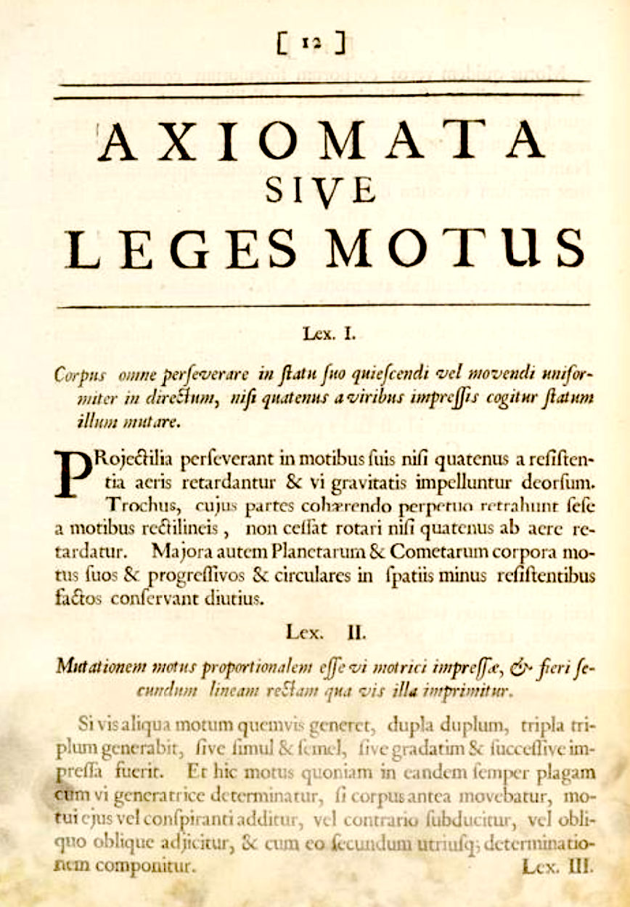

# Force-balance equations {#force-balance}

Here is a page from the 1686 edition of Isaac Newton's *Philosophiæ naturalis principia mathematica*, one of the most influential texts in the history of science. This is the page where Newton lays out his "Laws of Motion" (*Leges Motus*) and you can see the three laws (*Lex. I*, *Lex. II*, and *Lex. III*) set out in order. `r mark(6700)`

```{r echo=FALSE, fig.cap="The laws of motion from the *Principia Mathematica* [Source](https://cudl.lib.cam.ac.uk/view/PR-ADV-B-00039-00001/9)"}

```


Since the text is in Latin, it's not so readily accessible to today's student. But even in English, it's not so easy. Legend has it that Newton overhear a Cambridge University student saying, "There goes a man that writ a book that he nor anyone else understands." `r mark(6705)`

The 1792 translation into English of *Lex. II* is:

> **LAW II: The alteration of motion is ever proportional to the motive force impressed; and is made in the direction of the right line in which that force is impressed.**

"Alteration of motion" is what we call "acceleration." Generations of students have learned a much more compact notation $${\mathbf F} = m {\mathbf a}$$
In this notation, ${\mathbf F}$ and ${\mathbf a}$ are vectors, but to keep things simple, we'll consider only movement and forces along a straight line. 

Acceleration, as you know, is the second derivative with respect to time of position. Denoting position by $x$, we can write the second law as a differential equation $$m \ddot{x} = F$$ 

One famous setting for the second law is an oscillating spring-mass system. Robert Hooke (1635-1703) formulated a Law for the force exerted by a spring, $F = -k x$, where $x$ is measured from the position where the spring exerts zero force.  `r mark(6710)`

```{r echo=FALSE}
knitr::include_graphics("www/Animated-mass-spring.gif")
```

[Source: Svjo](https://commons.wikimedia.org/wiki/File:Animated-mass-spring.gif) [CC BY-SA](https://creativecommons.org/licenses/by-sa/3.0) via Wikimedia Commons

Now that you know some calculus, you might think that the word "Law" is a bit pompous, since any continuous function can be approximated locally as $f(x) \approx a_0 + a_1 x$, and if $f(0) = 0$ the approximation is even simpler: $f(x) \approx a_1 x$. To a modern cynic, Hooke's contribution might be described as noticing that the coefficient $a_1 < 0$, which is to say that when you stretch a spring it pulls back and when you compress a spring it pushes back. `r mark(6715)`

Putting Newton's 2nd Law and Hooke's Law together is  like mixing peanut butter and chocolate into a candy: it's found almost everywhere. The system it creates (the two Laws, not the candy) turns out to be a fundamental description of so many physical systems that it's at the heart of dynamics:
$$m \ddot{x} = -\kappa x \ \ \ \ \text{or, more simply,}\ \ \ \ \ddot{x} = bx$$ where $b = -\kappa/m$. Since mass $m$ and the spring elasticity $\kappa$ are positive, $b$ will be negative. 

This is a differential equation, although perhaps as yet unfamiliar since it involves a second derivative with respect to time rather than just a first derivative. We'll call it a "force-balance" format, since $m \ddot{x}$ is in balance with the spring force $-\kappa\, x$. `r mark(6720)`

Looking at the animated picture of the spring-mass system in motion, you can see the sustained oscillations. Of our modeling functions, the sinusoids are the ones that oscillate steadily.

In terms of the differential equation $\ddot{x} = b x$, the solution will be a function $x(t)$ whose second derivative with respect to time is proportional to $x(t)$ but with a minus sign (because $b < 0$). Happily, the sinusoids have exactly this property. `r mark(6725)`

The *ansatz* we'll propose for $\ddot{x} = b\,x$ is $x(t) = \sin(\omega t)$. Plugging in this ansatz to the differential equation gives: $$-\omega^2 \sin(\omega t) = b \sin(\omega t)$$
This will be true so long as $$\omega = \sqrt{\strut -b} = \sqrt{\strut\kappa/m}$$ The motion of the simple spring-mass system is not just *like* a sinusoid, but *is* a sinusoid.

Now on to something that will likely surprise you and probably discomfort you as well. 

It is clear that exponential functions are fundamentally different from sinusoidal functions. Sinusoids oscillate up and down and up and down, whereas exponentials just keep growing (or decaying---which is growth backwards in time). And we know that the spring-mass system oscillates up and down, just like the sinusoid. So it will seem pointless even to try an exponential form of ansatz. But we procede nevertheless and try $x(t) = e^{kt}$ which gives us $$k^2 e^{kt} = b e^{kt}\ \ \implies\ \ k = \sqrt{\strut b} = \sqrt{\strut -\kappa/m} = i \sqrt{\strut\kappa/m} = i \omega$$ 
where we've used our earlier notation $\omega^2 = \kappa/m$. And, following convention, we've written $\sqrt{-1}$ as $i$.

In other words, $e^{i \omega t}$ is a sinusoid with angular frequency $\omega$.

-----

The previous section deduced an unexpected link between exponentials and sinusoids:

> $e^{i \omega t}$ is a sinusoid with angular frequency $\omega$.

The symbol $i$ is part of a system for working with coordinate pairs of numbers, called *complex numbers* e.g. (3, 2). For historical reasons, the first number in the pair is called the "real part," while the second part in the pair is called the "imaginary part."  Unfortunately, the name "imaginary" suggests to students starting out that the second part of the pair does not exist. That's silly, because in (3, 2) the imaginary part is simply 2---an ordinary number.  `r mark(6730)`

In interpreting the word "imaginary," you should keep in mind a long history in mathematics of assigning insulting names to mathematical objects that, at the time they were first introduced. That's why some numbers are vilified as "negative," and some as "irrational."  `r mark(6735)`

In R as in many other computer languages, complex numbers are written in a special syntax. The pair (3, 2) would be written `3 + 2i`.  For instance:
```{r echo=TRUE}
a <- 3 + 2i
a + a
a - a
a * a
a / a
```

Perhaps it's surprising that `a * a` gives `5 + 12i`. Let's see why:
$$ (3 + 2i) (3 + 2i) = 9 + 6i + 6i + 4i^2 = 9 + 12i -4 = 5 + 12i$$ where we have used the convention that $i^2 = -1$.

There are some R functions that are specifically for working with complex numbers. For us, the most important will be `Re()` and `Im()` which, respectively extract the "real" and "imaginary" parts of the number. `r mark(6740)`

```{r echo=TRUE}
Re(a)
Im(a)
Re(3)
Im(3)
```

The exponential function takes complex numbers as an input and returns a complex number as an output.
```{r echo=TRUE}
exp(a)
```

Let's plot $e^{i\omega t}$ over the domain $0 < t < 10$ using $\omega = 2$. We need to be a little careful, since our plotting functions are not arranged to display complex numbers. But there is an easy workaround: plot the "real" and "imaginary" parts separately. `r mark(6745)`

```{r cn1, exercise=TRUE, exercise.cap="Complex arithmetic", exercise.nline=8, eval=FALSE}
f <- makeFun(exp(1i * omega * t) ~ t, omega = 2)
slice_plot(Re(f(t)) ~ t, 
           domain(t=c(0, 10)), color = "orange3") %>%
  slice_plot(Im(f(t)) ~ t, color="dodgerblue")
```

```{r cn2, echo=FALSE, results="markup"}
askMC(
  "Which part of $e^{i \\omega t}$ is the cosine function?",
  "+The \"real\" part+",
  "The \"imaginary\" part",
  "The negative of the \"imaginary\" part",
  "The negative of the \"real\" part"
)
```

The next sandbox defines a new function, $e^{(k + i\omega) t}$ and plots its real and imaginary parts. 
```{r cn3, exercise=TRUE, exercise.cap="Complex exponential functions", exercise.nline=8, eval=FALSE}
g <- makeFun(exp((k + 1i * omega) * t) ~ t, omega = 2, k=-1)
slice_plot(Re(g(t)) ~ t, 
           domain(t=c(0, 10)), color = "orange3", npts=500) %>%
  slice_plot(Im(g(t)) ~ t, color="dodgerblue", npts=500)
```
```{r cn4, echo=FALSE, results="markup"}
askMC(
  "At what time $t$ does the sine-like function complete one full oscillation?",
  "At about $t=1.6$",
  "+At about $t=3.14$+",
  "At about $t=4.7$",
  "At about $t=6.28$",
  random_answer_order = FALSE
)
```

```{r cn5, echo=FALSE, results="markup"}
askMC(
  "Find a value for $\\omega$ that will produce one full oscillation every two time units. Graph it out to make sure that you have five full oscillations over the $0 < t < 10$ domain. What is that $\\omega$?",
  "$\\omega = 1$",
  "$\\omega = \\pi/2$",
  "+$\\omega = \\pi$+",
  "$\\omega = 2 \\pi$",
  random_answer_order = FALSE
)
```

```{r cn6, echo=FALSE, results="markup"}
askMC(
  "Keeping $\\omega$ at the value that produce five complete cycles over $0 < t < 10$, find a value for $k$ such that the amplitude of the oscillation at $t=10$ will be half that of the amplitude at $t=0$. What is $k$?",
  "$k \\approx -0.70$",
  "+$k \\approx -0.07$+",
  "$k \\approx 0.07$",
  "$k \\approx 0.70$",
  random_answer_order = FALSE
)
```

```{r cn7, echo=FALSE, results="markup"}
askMC(
  "Set $\\omega$ at the value that produces 20 complete cycles over $0 < t < 10$ and $k$ at the value such that the amplitude of the oscillation at $t=10$ will be *twice* that of the amplitude at $t=0$. What are $\\omega$ and $k$?",
  "$\\omega = \\pi,\\ k \\approx 0.35$",
  "$\\omega = 2 \\pi,\\ k \\approx 0.35$",
  "+$\\omega = 4 \\pi,\\ k \\approx 0.070$+",
  "$\\omega = 6 \\pi,\\ k \\approx 0.7$",
  random_answer_order = FALSE
)
```

<div class="explanation-note">
**Code-reading questions**

In the 2nd sandbox, the `slice_plot()` function is called with an argument $npts=500$. Use the following sandbox with the command `help(slice_plot)` to see the documentation for `slice_plot()` and read the explanation of the `npts` argument. `r mark(6750)`

```{r cn-code1, echo=FALSE, results="markup"}
etude2::etudeEssay(
  "In your own words, explain briefly why `npts=500` was used in the 2nd sandbox and why it wasn't needed in the first sandbox. To understand this, you may want to play around with small values for `npts` to understand what it does." `r mark(6755)`
)
```
</div>

## Friction

Friction is an inevitable feature of real-world spring-mass systems. Without friction the force-balance differential equation is $m\partial_{tt} x =  -k\, x$. How can friction fit in?

For a mass moving at velocity $\dot{x}$, the friction force will be in the direction *opposed* to the velocity and, when velocity is zero, friction goes away. Following our general calculus idea of approximating with a simple straight-line function, we get a force $\text{friction} = -r \dot{x}$. Adding in the friction force gives a new force-balance equation which has a famous name in physics: the "damped harmonic oscillator." `r mark(6760)`

$$m \ddot{x} = -r \dot{x} - k x$$
Since we've gotten in the habit of using $a$ and $b$ on the right side of the equation, we'll re-write the force-balance equation as 
$$\ddot{x} = a \dot{x} + b x$$ where $a = -r/m$ and $b = -k/m$.

As the name "damped harmonic oscillator" suggests, we expect that the solution to the force-balance equation will be a "damped" oscillation, that is an oscillation that decreases in amplitude over time as friction draws energy out of the system (and dissipates it as heat). But how fast and in what form will the amplitude decrease? `r mark(6765)`

We've had good luck with exponential ansätze, so let's again try $x(t) = e^{\lambda t}$.  Plugging this into the equation we get
$$\lambda^2 e^{\lambda t} = a \lambda e^{\lambda t} + b e^{\lambda t} \ \ \implies \ \ \lambda^2 - a \lambda - b = 0$$.

Are there values of $\lambda$ that will satisfy this condition?

<div class="explanation-note">
**The quadratic formula**

The famous quadratic formula refers to a quadratic function $$f(x) \equiv a x^2 + b x + c$$ As you know, the values $x^\star$ that are zeros of $f(x)$ are 
$$x^\star = \frac{1}{2a} \left[-b \pm \sqrt{\strut b^2 - 4 a c}\right]$$

Use this information about the quadratic formula to answer the below question.

```{r nos1, echo=FALSE, results="markup"}
askMC(
  "Find the two zeros $\\lambda_1$ and $\\lambda_2$ where $0=\\lambda^2 - a \\lambda - b$. Which of these is right?",
  "$\\lambda_{1,2} = \\frac{1}{2a} \\left[a \\pm \\sqrt{a^2 + 4b} \\right]$",
  "+$\\lambda_{1,2} = \\frac{1}{2} \\left[a \\pm \\sqrt{a^2 + 4b} \\right]$+",
  "$\\lambda_{1,2} = \\frac{1}{2a} \\left[a \\pm \\sqrt{a^2 - 4b} \\right]$",
  "$\\lambda_{1,2} = \\frac{1}{2} \\left[a \\pm \\sqrt{a^2 - 4b} \\right]$",
  random_answer_order=FALSE
)
```

</div>

The answer to the previous question is true no matter what are the quantities $a$ and $b$. But to correspond to friction and a spring force, we require $a < 0$ and $b < 0$. 

```{r fr1-1, echo=FALSE, results="markup"}
askMC(
"Suppose that friction is strong, that is $|a|$ is big. More specifically, suppose $a^2 > 4 |b|$. What will be true about $\\sqrt{\\strut a^2 - 4b}$?",
  "It will be purely \"imaginary\".",
  "+It will be purely \"real\".+",
  "It will be *complex*, that is with a non-zero real part and a non-zero imaginary part.",
  "There's no way to tell for sure.",
  random_answer_order = FALSE
)
```

```{r fr1-2, echo=FALSE, results="markup"}
askMC(
"When $a^2 > 4b$, can either of the eigenvalues be positive?",
  "+No+",
  "Yes, one eigenvalue can be positive.",
  "Both eigenvalues *must* be positive.",
  "Depends on the specific values of $a$ and $b$.",
  random_answer_order = FALSE

)
```

When *friction* dominates (that is, large $|a|$) the eigenvalues are both real and negative. This means there is no oscillation and the motion decays to $x = 0$.

```{r fr1-3, echo=FALSE, results="markup"}
askMC(
"Question: Suppose that friction is weak, that is $a^2 < 4|b|$. What will be true about $\\sqrt{a^2 + 4b}$?",
  "+It will be purely \"imaginary\".+",
  "It will be purely \"real\".",
  "It will be *complex*, that is with a non-zero real part and a non-zero imaginary part.",
 "There's no way to tell for sure.",
 random_answer_order = FALSE 
)
```

Suppose that we define $\omega \equiv \sqrt{\strut 4b - a^2}/2$ and $k = a/2$. (Recall, that for $a$ to describe friction, we must have $a < 0$.) The eigenvalues will be of the form  ${k + i\omega}$ and a solution to the differential equation will be $e^{(k + i\omega)t} = e^{kt} e^{ i \omega t}$. `r mark(6770)`


```{r fric4, echo=FALSE, results="markup"}
askMC(
  "What will $e^{-kt} e^{i \\omega t}$ be?",
  "+An exponentially decaying sinusoid+",
  "An exponentially growing sinusoid" = "Remember that $a > 0$, so $k = a/2 > 0$ and $e^{-kt}$ is a decaying exponential.",
  "An ordinary sinusoid."
)
```

## Not just springs!

An engineer's version of Hooke's Law might read: "Strain is proportional to stress." In everyday speech, "stress" and "strain" are synonyms, but engineers use them more precisely: "stress" is a *force* and "strain" is a change in shape, for instance stretching or *extension*. `r mark(6775)`

The frictionless equation $\ddot{x} =  b\, x$ and it's friction-ful cousin $\ddot{x} = a\, \dot{x} + b\, x$ are much more general and apply in situations that were not foreseeable in Hooke's time.  

To see how general is the second-order, linear, single-variable system $\ddot{x} = a \dot{x} + b x$, let's relate it to the first-order, linear, two-dimensional system 
$$ \left[\begin{array}{c}\dot{x}\\\dot{y}\end{array}\right] = 
\left[\begin{array}{cc}a & b\\c & d\end{array}\right] \left[\begin{array}{c}x\\y\end{array}\right]$$


Recall that in the force-balance system, $x$ is position, $\dot{x}$ is velocity, and $\ddot{x}$ is acceleration. We'll start by giving velocity it's own name:
$$\dot{x} \equiv v$$
Next, we notice that acceleration $$\ddot{x} = \dot{v}$$ With this, we can re-write the force balance equation as
$$\dot{v} = a v + b x$$
And remember that $$\dot{x} = v + 0x$$ where the $0x$ puts the equation in the same format as the equation for $\dot{v}$. Altogether, the equations for $\dot{x}$ and $\dot{v}$ give us
$$\begin{array}{cc}\dot{v} & = a v + b x\\\dot{x} & = v + 0x  \end{array}\ \ \ \ \text{or}\ \ \ \ \left[\begin{array}{c}\dot{v}\\\dot{x}\end{array}\right] = 
\left[\begin{array}{cc}a & b\\1 & 0\end{array}\right] \left[\begin{array}{c}v\\x\end{array}\right]$$

This is the [ab10] first-order, linear, two-dimensional differential equation. So, what started historically as an attempt to mathematicize the bobbing of springs and the swinging of pendulums became a general description of all sorts of dynamics near a fixed point. The result is that you see the "damped harmonic oscillator" all throughout science as a representation of any sort of dynamics near equilibrium, that is, near a fixed point. `r mark(6780)`

**Example: Passive electrical circuits**

One of the [ab10] of particular importance to science and technology is electrical circuits. In a step outside of calculus (meaning: you won't be examined on it) it's worth pointing out the correspondence between concepts of motion (acceleration, velocity, position) and electrical circuits (voltage, current, charge). `r mark(6785)`

There are three classical idealized passive components of circuits:

* capacitor, denoted 
* resistor, denoted 
* inductor, denoted 

In every case, we will be interested in the *voltage* across the two ends of the component. And we'll think about the dynamics of the circuit in terms of electrical *charge* which we'll denote $x$.

* For a capacitor the voltage is proportional to *charge* $x/C$, where $C$ is the "size" of the capacitor. 
* For a resistor the voltage is proportional to the flow of charge, that is, *current* $r \dot{x}$, where $R$ is the amount of resistance, basically the "size" of the resistor.
* For an inductor the voltage is proportional to the change in the flow of charge, that is, $L \ddot{x}$, where $L$ is the inductance.

Only a capacitor is capable of holding a voltage on its own. The other circuit elements can carry a voltage when they are part of a *circuit*.  We're going to explore a simple circuit. 

```{r echo=FALSE, out.width="40%", fig.align="center"}
knitr::include_graphics("www/lrc.png")
```

To prime the circuit, we're going to connect the two dots at the bottom of the circuit with a battery. This will charge up the capacitor in much the same way as we "charge up" a spring by pulling on it. Next remove the battery and get ready to observe the motion. Complete the circuit by closing the switch between the two dots. Doing so establishes the circuit, analogous to setting up the dynamics of the system. The initial condition is the amount of charge $x$ on the capacitor and, at the instant the switch is closed, no flow of current, giving $\dot{x} = 0$. `r mark(6790)`

The "force-balance" is the requirement that the sum of the voltages across the circuit elements be zero.  This amounts to

$$L \ddot{x} = -R\, \dot{x} - \frac{1}{C} x $$ 


Consider a circuit with inductance $L=1$, resistance $R=3$ and capacitance $C = 1$. What will be the eigenvalues of the dynamics? Will the fixed point at $x=0$ be stable or not?

Solution: $\lambda_{1,2} = \frac{1}{2}\left[-3 \pm \sqrt{\strut 9 - 4 }\right] = (-3 \pm \sqrt{5})/2$ so $\lambda_1 \approx -0.382$ and $\lambda_2 \approx -2.618$. Since both eigenvalues are negative, the fixed point is stable. `r mark(6795)`

```{nos2, echo=FALSE, results="markup"}
askMC(
  "Let's decrease the the resistence to $R=2$ and the capacitance to $C = 1/2$. What are the eigenvalues of the dynamics?",
  "+$\\lambda_1 = -1 + 1i$ and $\\lambda_2 = -1 - 1i$+",
  "$\\lambda_1 = -1 + 1i$ and $\\lambda_2 = 1 - 1i$"
  "$\\lambda_1 = 1 + 1i$ and $\\lambda_2 = 1 - 1i$+"
)
```


`r insert_calcZ_exercise("XX.XX", "N9iexG", "Exercises/Dynamics/chicken-say-lamp.Rmd")`

