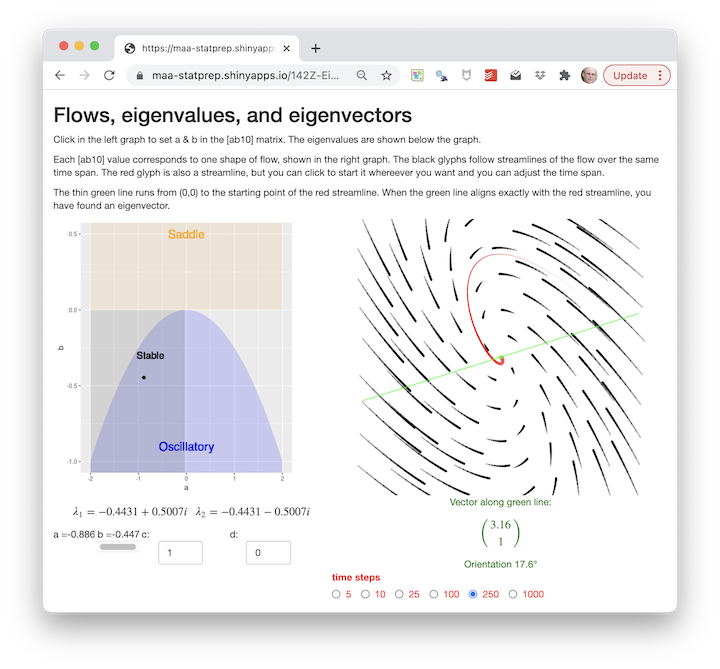

We are studying linear continuous-time dynamics near a fixed point using a simplified matrix:

$$\left[\begin{array}{cc}a & b\\1 & 0\end{array}\right]
\ \ \ \text{instead of the fully parameterized system}\ \ \ 
\left[\begin{array}{cc}a & b\\c & d\end{array}\right]$$
We're doing this because it makes the algebra easier---two parameters rather than four---and because it has a stronger connection to another format for differential equations which we'll study under the name "force-balance equations." But what do we lose by dropping two parameters?

You've seen a small set of generic behavior in flows near a fixed point: saddles, sources, sinks, oscillation. Are there other types of generic behavior that appear in the 4-parameter system but not the 2-parameter one?

To answer this question, we'll return to the app that displays flows:

<a href="https://maa-statprep.shinyapps.io/142Z-Eigenflows/" target="_blank"></a>

You can see in the ab-selector graph on the left annotations for several types of generic behaviour:

- Saddle (unstable along one eigenvector, stable along the other)
- Sources (unstable along both eigenvectors)
- Sinks (stable along both eigenvectors)
- Stable oscillation (spirals toward the fixed point)
- Unstable oscillation (spirals away from the fixed point)

In the ab-selector graph, these are encoded by color and shading. The blue parabola marks the ab-region of oscillation; stability is indicated using dark shading. Saddles are at the top of the ab-graph. Sources and sinks are the gray arches rising up from the edges of the graph. 

The shading is set by calculating the eigenvalues for each (a, b)-pair

Underneath the graph are two numeric-input widgets, one to set the $c$ parameter, the other to set $d$. By default, these are set to display an [ab10] matrix, but you can change them.

Play with the $c$- and $d$-inputs to see how that changes the flow field (right graph) and the shaded regions. Make small changes to $c$ and $d$ at first to get a feeling for what the controls do to the display. Then you can explore large changes.

The question you are to answer is this: Does any new behavior appear when $c$ and $d$ are moved from their [ab10] settings?

```{r ab10-1, echo=FALSE, results="markup"}
etude2::etudeEssay(
  "Describe in a couple of dozen words the results of your explorations in $c$ and $d$."
)
```
