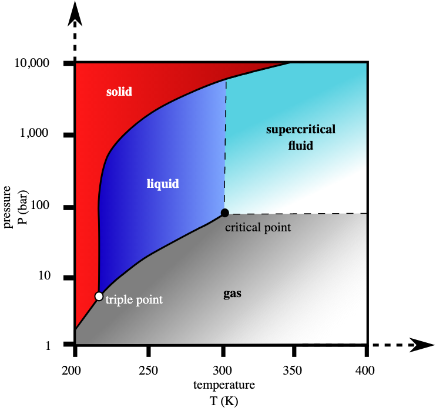

# Displaying relationships

<div style="float:right;">[](https://github.com/ProjectMOSAIC/MOSAIC-Calculus/blob/main/Preliminaries/03-graphs-and-graphics.Rmd)</div>

```{r include=FALSE}
book_file_name <- "preliminaries/03-graphs-and-graphics.html"
```

Before we go much further in exploring the creation and uses of functions, let's remember the general idea of mathematical modeling: the construction of mathematical representations of systems. The word "system" is familiar in everyday speech and is used to describe all manner of things: means of communication, ecology, politics, the workings of the market, etc. A "system" involves a group of related components that operates as a whole. For instance, the digestive system consists of body organs and reflexes that, collectively, transform food into the elementary substances needed for metabolism. In the economic theory of the market, components are prices, demand, and supply. These three components are not independent. Demand is related to price as is supply, both are what economists sometimes call "curves" but which we would call functions.

Key steps in making a mathematical representation---a model---of a system involve identifying the system components and describing quantitatively the relationships among them. In brief, mathematical modeling is about describing the ***relationships*** between things.

::: {.example data-latex=""}
Let's start with a simple system that is so familiar that you likely do not think of it as a system: a triangle.

A triangle consists of three connected line segments: the sides. It has other properties that are related to the sides and each other, for example, the angles between sides, the perimeter, or the area enclosed by the triangle. 

Here's a description of the relationship between the perimeter $p$ and the lengths of the sides, $a$, $b$, $c$, written in the form of a function:
$$p(a,b,c) \equiv a + b + c\ .$$
The mathematical expression of the relationship between area $A$ enclosed by the triangle and the side lengths goes back at least 2000 years to [Heron of Alexandria](https://en.wikipedia.org/wiki/Hero_of_Alexandria) (circa 10–70). As a function, it can be written
$$A(a,b,c) \equiv \frac{1}{4}\sqrt{\strut 4a^2b^2-(a^2+b^2-c^2)^2}\ .$$
:::

::: {.example data-latex=""}
There's considerable interest in ways to remove CO_2 from the atmosphere and store it permanently underground. It's hard to store gasses in the massive quantities needed to mitigate climate change. But CO_2_ storage is part of a system that includes temperature, pressure, and chemical affinity. 

Figure \@ref(fig:CO2-phases) shows the relationship between physical form of pure CO_2_ and the temperature and pressure of the gas. 

```{r CO2-phases, out.width="50%", fig.align="center", echo=FALSE, fig.cap="Phase diagram for CO_2_.[Source](https://commons.wikimedia.org/wiki/File:Carbon_dioxide_pressure-temperature_phase_diagram.svg) Ben Finney, Mark Jacobs, CC0, via Wikimedia Commons"}


```
:::

::: {.intheworld data-latex=""}
Nerve cells communicate via electrical voltages and currents. For long-distance communications (distances longer than about 1 mm) the signaling takes the form of pulses of voltage occuring repetitively at different rates. The formation of these pulses, called "action potentials," was the subject of an extensive research project in the 1950s involving inserting tiny electrodes into relatively large ("giant") nerve cells that mediate the fleeing reaction of squid. A typical experiment involved regulating artificially the voltage across the cell membrane. By these experiments, the scientists--- John Eccles, Alan Hodgkin and Andrew Huxley---were able to describe mathematically the relationship between membrane voltage and the current across the membrane. A calculus model built from the relationships provided a concise description of the biophysics of action potentials. A 1963 Nobel Prize was awarded for this work.


In each individual experimental run, the membrane voltage was fixed at a given level (say, -50 mV) and the current measured. Figure \@ref(fig:FHN-curve) shows what the data might have looked like, each point showing the results of one experimental run.

```{r FHN-curve, echo=FALSE, fig.cap="Data (simulated) from the squid giant axon experiments. A smooth curve is drawn through the data points."}
set.seed(101)
n <- 30
FHN_points <- tibble(
  v = sample(c(-2, -1.5, -1, -.5, 0, .5, 1, 1.5, 2), n, replace=TRUE),
  w = v - v^3/3
) %>% 
  mutate(v=(1.9+v+rnorm(n, 0, 0.01))/36,
         w=w+rnorm(n, 0, 0.1))
gf_point(w ~ I(-v*36*25), data = FHN_points) %>%
  gf_labs(y="Current (mA)", x = "Voltage (mV)") %>%
  slice_plot( -(v/25 + 2) + (v/25 + 2)^3/3 ~ v, 
              domain(v=-105:5)) +
  coord_flip()
```
The data points themselves might be described metaphorically as "clouds" spotting the voltage vs current "sky." Real-world clouds often show patterns such as animal or country shapes. We might say that a given cloud resembles a rabbit. Similarly, the data clouds show a pattern between current and voltage. We might, for instance, describe the current-voltage relationship as S-shaped. Or, rather than using the letter "S" we could draw a curve through the dots to summarize and simplify the relationship.
:::

The smooth curve in Figure \@ref(fig:FHN-curve) describes the relationship between current and voltage quantitatively. For example, if you know that the current is 0, you can use the curve to figure out what the voltage will be around -90 mV or  -50 mV or -10 mV. But when current is 0, the voltage will *not* be, say, -75 or -150.

Graphs such as Figures \@ref(fig:CO2-phases) and \@ref(fig:FHN-curve) are good ways of showing relationships. We can even do calculations simply using such graphs. Place your finger on a point of the S-shaped graph and you can read from the axes an allowed pair of voltage and current values. Place your finger on a point on the vertical axis. Moving it to the curve will reveal what current is associated with that voltage.

Functions are, like graphs, a ways of representing relationships. For all their advantages as a means of communication, graphs have their limits. With a graph it's feasible only to show the relationship between two quantities or among three quantities. Functions, can involve more quantities. For instance, the triangle-area function $$A(a,b,c) \equiv \frac{1}{4}\sqrt{\strut 4a^2b^2-(a^2+b^2-c^2)^2}$$ gives the relationship between four quantities: the area and the lengths of the triangle's three sides.

On the other hand, functions cannot represent all types of relationships. For instance, the curve in Figure \@ref(fig:FHN-curve) shows a relationship between current and voltage in nerve cells. But there is no mathematical function voltage(current) that does justice to the relationship. The reason is that mathematical functions can have ***one and only one*** output for any given input. There are three reasonable values for membrane voltage that are experimentally consistent with a zero current, not just one.

Care needs to be taken in using functions to represent relationships. For the nerve-cell current-voltage relationship, for instance, we can construct a function current(voltage) to represent the relationship. That's because for any given value of voltage there is just one corresponding current. But there is no voltage(current) function, even though knowing the current tells you a lot about the voltage.

## Function graphs

Given a function, it's easy to draw the corresponding relationship as a graphic. This section describes how to do that for functions that have one or two inputs. The opposite---given a relationship, represent it using functions---is not always so easy and will require modeling techniques that we'll develop in Block 1.

Contemporary practice is to draw graphs of functions using a computer. R/mosaic provides several functions that do this, you need only learn how to use them.


-----


Under "domain" talk about the domain of $A(a,b,c)$, since it needs to respect the triangle rule.

Contour plot of Heron's formula for fixed $c$.


## Graphs, mathematically

What's a graph mathematically?

Operations on graphs:
- zero-finding
- argmax and argmin

## Graphics, visually

***Scientific and statistical graphics*** are visual depictions of information and data. For displaying a function with a single input, mathematicians and others favor a particular style of graphics. This favored style is called a ***function graph***, which has a specific technical meaning in mathematics. Notice that we're writing "function graph" rather than "function graphic." A function graph is a particular sort of graphic: there are many other types of graphics some of which we'll use to display data or features of functions. `r mark(700)`


## The graphics frame

Technical graphs are usually drawn in a ***graphics frame*** 
that has several components:

1. The ***frame*** is a region on the piece of paper or computer screen that is marked off by a horizontal and a vertical axis.
2. The horizontal axis stands for one quantity.
3. The vertical axis stands for another quantity.
4. Both the horizontal and vertical axes are drawn with a ***scale*** that enables you to translate between a numerical value and position.

```{r empty-frame, echo=FALSE, fig.cap="An empty graphics frame with scales for both the horizontal and vertical axes."}
gf_blank(mpg ~ wt, data=mtcars) %>%
  gf_labs(y = "Vertical", x = "Horizontal") %>%
  gf_lims(y = c(-20,20), x=c(-5, 5))
```


Drawing graphs with R/mosaic

Some other types of graphs that we'll be using: vector fields, flow fields, contour plots, surface plots.

The tilde expression and the graphics domain specifier are the two mandatory arguments to `slice_plot()`. All of these are correct commands for drawing a graph:

```{r warning=FALSE}
slice_plot(sin(t) ~ t, domain(t=c(-5,5)))
slice_plot(exp(x) ~ x, domain(x=c(-3,2)))
slice_plot(log(z) ~ z, domain(z=c(-0.5, 10)))
slice_plot(t^2 ~ t, domain(t=c(-2, 2)))
```


You can draw graphs of single-input functions using the `slice_plot()` R/mosaic operator. You need to specify two pieces of information to `slice_plot()`:

1. Which function to graph. In R/mosaic, You state this with what's called a ***tilde expression***. A couple of examples will suffice for the moment.
    a. When the function has a name, like `exp()` or `log()` or `sin()`, the tilde expression looks like `exp(x) ~ x`. On the left side of the tilde you put the name of the function you want to graph with the input name in parentheses. You can choose any input name you like: here we are using `x`, but we are not limited to using `x` or any other letter. Sometimes we even use named inputs (e.g. `exp(time)`). On the right side of the tilde, place the input name again. We'll explain why the name appears in two places later.
    b. When the function is being written as a formula, for instance `1/z` or `t^2`, put the formula on the left side of the tilde and the input name on the right side, like `1/z ~ z` or `t^2 ~ t`.
2. The ***graphics domain***. As you know, the ***domain*** of a function is the collection of all possible legitimate inputs. For most of the pattern-book functions, the domain is $-\infty < x < \infty$. As you might expect, it's impractical to have a graphical axis that is infinitely long. So you have to choose some finite interval of the function domain to use. This finite interval is called the "graphics domain." You specify the domain with a statement like `domain(x = -5:5)`, which is setting the graphics domain to $-5 \leq x \leq 5$. Note that the input name used in `domain()` must match the input name you selected in the tilde expression. [[[ Explain to R experts that, inside `domain()`, the expression `-5:5` is interpreted as `c(-5, 5)`. Elsewhere in R `-5:5` refers to a **sequence** of numbers: $-5, -4, -3, -2, -1, 0, 1 2, 3, 4, 5$]]]


## Function graphs

Back in Section \@ref(slice-plot-intro) you saw how to use R to create a graph of a function with a single input. (Review that section now if you've forgotten.) The `slice_plot()` function takes two arguments:

i. A ***tilde expression*** giving the function you want to plot and naming the horizontal axis.
ii. The ***domain*** to use when making the plot.

For example:

```{r results="hide"}
slice_plot(sin(z) ~ z, domain(z=c(-10, 10)))
```

The tilde expression can be more elaborate of course, for instance `sin(z)*z + z^2 ~ z`, but it will always have the name to be used for the horizontal axis on the right-hand side of the tilde character.

::: {.takenote  data-latex=""}
The ***domain*** to be shown in the graph is specified using a special-purpose function, called `domain()`. The argument to `domain` is named: Use the same name as on the right-hand side of the tilde expression then an equal sign, then a collected pair of numbers specifying the lower and upper ends of the domain. The collected pair must always be given as the arguments to a very basic function named `c()`, which simply collects it's arguments. Later, when we graph functions with two inputs, you'll see why `domain()` is set up this way.
:::

## Graphs of functions with two inputs {#surface-plot}

We can draw graphs of functions with two inputs. Now the points need to be marked in a 3-dimensional space: one axis for each of the two inputs and another axis for the output. Like this: `r mark(760)`

```{r fun-1b-1-2, echo=FALSE, fig.cap="A graph of a function of two inputs is a surface."}
f2 <- rfun( ~ input_1 + input_2, seed=932)
if (knitr::is_html_output()) {
interactive_plot(f2(input_1, input_2) ~ input_1 + input_2,
                 domain(input_1=c(-5, 5), input_2 = c(0, 4)))
} else {
  knitr::include_graphics(normalizePath("www/fun-1b-1-2.png"))
}
```

It is very hard to read a graph of a function with two inputs. Think of the graph as a kind of tent suspended over a domain of ground. The graph itself is a surface. To show the graph on a display, some tricks of the trade are used: color to give an additional scale for the output; computer graphics to let us rotate the surface to look at it from various perspectives, added grid lines and marks on the surface to help us read out the numerical value.

## Contour plots


A mathematical graph is just one way to draw a picture of a function with two inputs. There are other ways. One helpful mode of picture is called a ***contour plot***, familiar to many non-mathematicians in the form of topgraphical maps showing landscape elevation as a function of latitude and longitude. Figure \@ref(fig:Fig-1b-2-1) shows a contour plot of the same function shown in Figure \@ref(fig:fun-1b-1-2). `r mark(770)`


```{r Fig-1b-2-1, echo=FALSE, fig.cap=r"(A contour plot displays the surface in the same manner as a topographical map shows the terrain. This contour plot is a topographical map of the mathematical graph in Figure @ref(fig:fun-1b-1-2).)"}
f2 <- rfun( ~ input_1 + input_2, seed=932)
contour_plot(f2(input_1, input_2) ~ input_1 + input_2,
                 domain(input_1=c(-5, 5), input_2 = c(0, 4)),
             skip=0)
```

It may take some practice to learn to read contour plots fluently but it is a skill that's worthwhile to have. Note that the graphics frame is the Cartesian space of the two inputs. The output is presented as ***contour lines***. Each contour line has a label giving the numerical value of the function output. Each of the input value pairs on a given contour line corresponds to an output at the level labeling that contour line. To find the output for an input pair that is *not* on a contour line, you ***interpolate*** between the contours on either side of that point.

For example, the input pair (0, 0)---which is at the bottom of the frame, midway from left to right---falls between the contours labeled "20" and "22." This means that the output corresponding to input (0, 0) is somewhere between 20 and 22. The point is much closer to the contour labeled "20", so it's reasonable to see the output value as 20.5. This is, of course, an approximation, but that's the nature of reading numbers off of graphs.

Often, the specific numerical value at a point is not of primary interest. Instead, we may be interested in how steep the function is at a point, which is indicated by the spacing between contours. When contours are closely spaced, the hillside is steep. Where contours are far apart, the hillside is not steep, perhaps even flat.

Another common task for interpreting contour plots is to locate the input pair that's at a local high point or low point: the top of a hill or the bottom of a hollow. Such points are called ***local argmax*** or ***local argmin*** respectively. The *output* of the function at a local argmax is called the ***local maximum***; similarly for a local argmin, where the output is called a ***local minimum***. (The word "argmax" is a contraction of "argument of the maximum." We will tend to use the word "input" instead of "argument", but it means exactly the same thing to say "the inputs to a function" as to says "the arguments of a function.")

::: {.takenote  data-latex=""}
Here are some additional tasks which you should learn to perform at a glance when reading a contour plot:

1. Start at a given input pair and determine two directions:

    a.  the direction to move which is most steeply uphill, 
    b. the direction to move which will keep the function output the same. 
    
2. Translate a small region of a contour plot into the word for a corresponding geographical feature with that topology: hills, valleys, crests, coves, hollows, and so on.

:::


## Slice plots

As mentioned before, ***mathematical modeling*** is the process of constructing mathematical representations of situations or phenomena of interest. In CalcZ, we are primarily interested in using ***functions*** as such representations. `r mark(780)`

Almost always, when mathematically modeling a real-world situation or phenomenon, we do not try to capture every nuance of every relationship that might exist in the real world. We leave some things out. Such simplifications make modeling problems easier to deal with^[The word "tractable" is used to describe problems that can be productively handled.] and encourage us to identify the most important features of the most important relationships.

On the other hand, it's easy to go wrong and leave out something that's important. To mitigate this risk, many modeling projects involve a ***modeling cycle*** where we propose a candidate model, examine the consequence of that model to see if it corresponds well to the parts of reality that are important to us in our task, and modify the model as needed to produce a new and better candidate. `r mark(790)`

In this spirit, it's useful always to assume that our models are leaving something out and that a more complete model involves a function with more inputs than the present candidate. The present candidate model should be considered as a ***slice*** of a more complete model. Our slice leaves out one or more of the variables in a more complete model.

To illustrate this, suppose that we have a "more complete model" in the form of a function of two inputs, as shown in the contour plot below.

```{r Fig-1c1, echo=FALSE}
f2 <- rfun( ~ input_1 + input_2, seed=96)
contour_plot(f2(input_1, input_2) ~ input_1 + input_2,
                 domain(input_1=c(-5, 5), input_2 = c(0, 4)),
             skip=0)
```

As you become practiced reading contour plots, you might prefer to read this one as a hilltop (shaded yellow) side-by-side with a hollow or bowl (shaded purple), with green, almost level flanks at the left and right edges of the frame.

The most common forms of ***slice*** involve constructing a simpler function that has one input but not the other. For example, our simpler function might ignore input #2. There are different ways of collapsing the function of two inputs into a function of one input. An especially useful way in calculus is to take the two-input function and set one of the inputs to a ***constant value***.

For instance, suppose we set input #2 to the constant value 1.5. This means that we can consider any value of input #1, but input #2 has been replaced by 1.5. In Figure \@ref(fig:Fig-1c2), we've marked in red the points in the contour plot that give the output of the simplified function. `r mark(795)`

```{r Fig-1c2, echo=FALSE, out.width="50%", fig.show="hold", warning=FALSE, fig.cap="Left: A slice through the domain of a contour plot. Right: The value of the function along that slice, presented as a mathematical graph, as generated by `slice_plot()`."}
f2 <- rfun( ~ input_1 + input_2, seed=96)
contour_plot(f2(input_1, input_2) ~ input_1 + input_2,
                 domain(input_1=c(-5, 5), input_2 = c(0, 4)),
             skip=0) %>%
  gf_hline(yintercept=1.5, color="orange3", size=2) %>%
  gf_hline(yintercept=1.5, color="red", size=1) %>%
  gf_labs(title="Contour plot of function of two inputs")
slice_plot(f2(input_1, input_2=1.5) ~ input_1, domain(input_1=c(-5, 5))) %>%
  gf_labs(title="Graph of function output versus input #1")
```

Each point along the red line corresponds to a specific value of input #1. From the contours, we can read the output corresponding to each of those values of input #1. This relationship, output versus input #1 can be drawn as a mathematical graph (to the right of the contour plot). Study that graph until you can see how the rising and falling parts of the graph correspond to the contours being crossed by the red line.

Slices can be taken in any direction or even along a curved path! The blue line below the slice constructed by letting input #2 vary and holding input #1 and the constant value 0.

```{r Fig-1c3, echo=FALSE, out.width="50%", fig.show="hold", warning=FALSE}
contour_plot(f2(input_1, input_2) ~ input_1 + input_2,
                 domain(input_1=c(-5, 5), input_2 = c(0, 4)),
             skip=0) %>%
  gf_vline(xintercept=0, color="dodgerblue", size=2) %>%
  gf_labs(title="Contour plot of function of two inputs")
slice_plot(f2(input_1 = 0 , input_2) ~ input_2, domain(input_2=c(0, 5))) %>%
  gf_labs(title="Graph of function output versus input 2")
```


## Graphics layers

You will often want to compare two functions, or compare a function to data. You can do this using the ordinary graphics functions, e.g. `slice_plot()` or `gf_point()`, arranging things so that both types of graphics are drawn together in the same graphics frame. To create this kind of compound graphic, arrange the individual graphics commands into a ***pipeline***, which is a list of commands connected together by `%>%`.  Your pipeline might include two commands or twenty, depending on how complicated is the graphic you want to draw. As long as you use `%>%` after each command, the next command is taken to build upon the previous command.  The very last command in that pipeline should not be followed by `%>%`.”  `r mark(720)`

::: {.workedexample}
Here is an just-for-demonstration plot composed from three graphs, each displaying one of the pattern-book functions. At the start of the pipeline, the `domain()` must be given explicitly as an argument to `slice_plot()`. You're welcome to specify other domains in the commands further along the pipeline, but if you don't the original `domain()` will be passed down the pipeline.

```{r echo=TRUE}
slice_plot(dnorm(x) ~ x, domain(x=c(-4,4))) %>%
  slice_plot(pnorm(x) ~ x, color="red", size=2) %>%
  slice_plot(sin(x) ~ x, color="green", size=4, alpha = 0.2)
```
Just to show how these things are done, the functions have been drawn in different colors, different widths (e.g., `size=2`) and different levels of transparency (e.g. `alpha=0.2`). You can use such styling arguments in any slice-plot.
:::


## Exercises

